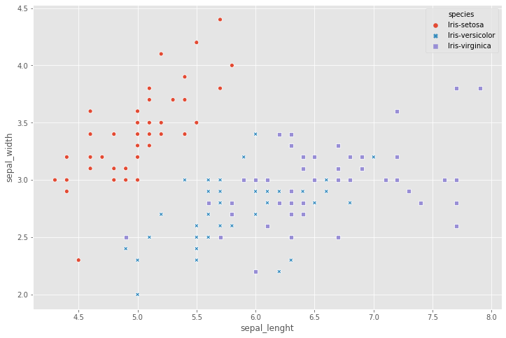
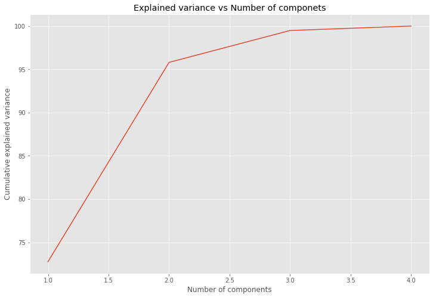
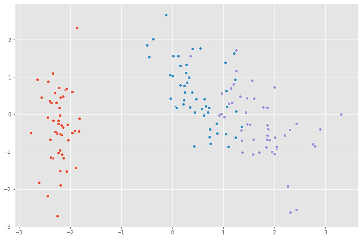

Today I would like cover a  project on Principal Component Analysis with NumPy 

## Task 1: Introduction and Project Overview


PCA is a very popular linear transformation tool that often is used for dimensional reduction for Machine Learning Algorithms. So in many ML problems the data is high dimensional , so if you have images, or highly number of features, so the crucial idea is that  the distribution of those data can be highly concentrated and not   density occupy in all the space so in these such of cases what we can do is concentrate on computational efficient , linear dimensionality reduction techniques where we project  the high dimensionality on low dimensionality vector. There are many ways to achieve this, two very popular methods are known as Principal Component Analysis PCA and Linear Discriminant  Analysis. Both of them are linear transformation methods wich means they will transform the data and projected on to linear subspace. PCA what it gives is the principal components . Returns the principal components that maximize the variance of  the data. So in other words PCA projects the entire dataset on to different subspaces or feature subspace

## Task 2: Load the Data and Import Libraries

- Load the dataset using [pandas](https://pandas.pydata.org/).
- Import essential modules and helper functions from [NumPy](https://numpy.org/) and [Matplotlib](https://matplotlib.org/).
- Explore the pandas dataframe using the head() and info() functions.

```python
%matplotlib inline
import pandas as pd
import matplotlib.pyplot as plt
import numpy as np
import seaborn as sns
```

```python
plt.style.use("ggplot")
plt.rcParams["figure.figsize"] = (12,8)
```

data URL: https://archive.ics.uci.edu/ml/machine-learning-databases/iris/iris.data

```python
# data URL: https://archive.ics.uci.edu/ml/machine-learning-databases/iris/iris.data
```


```python
iris  = pd.read_csv("https://archive.ics.uci.edu/ml/machine-learning-databases/iris/iris.data", header=None) 
```


```python
iris.head()
```


<div>
<style scoped>
    .dataframe tbody tr th:only-of-type {
        vertical-align: middle;
    }


    .dataframe tbody tr th {
        vertical-align: top;
    }
    
    .dataframe thead th {
        text-align: right;
    }

</style>

<table border="1" class="dataframe">
  <thead>
    <tr style="text-align: right;">
      <th></th>
      <th>0</th>
      <th>1</th>
      <th>2</th>
      <th>3</th>
      <th>4</th>
    </tr>
  </thead>
  <tbody>
    <tr>
      <th>0</th>
      <td>5.1</td>
      <td>3.5</td>
      <td>1.4</td>
      <td>0.2</td>
      <td>Iris-setosa</td>
    </tr>
    <tr>
      <th>1</th>
      <td>4.9</td>
      <td>3.0</td>
      <td>1.4</td>
      <td>0.2</td>
      <td>Iris-setosa</td>
    </tr>
    <tr>
      <th>2</th>
      <td>4.7</td>
      <td>3.2</td>
      <td>1.3</td>
      <td>0.2</td>
      <td>Iris-setosa</td>
    </tr>
    <tr>
      <th>3</th>
      <td>4.6</td>
      <td>3.1</td>
      <td>1.5</td>
      <td>0.2</td>
      <td>Iris-setosa</td>
    </tr>
    <tr>
      <th>4</th>
      <td>5.0</td>
      <td>3.6</td>
      <td>1.4</td>
      <td>0.2</td>
      <td>Iris-setosa</td>
    </tr>
  </tbody>
</table>

</div>


```python
iris.columns = ["sepal_lenght", "sepal_width","petal_lenght", "petal_width","species"]
iris.dropna(how='all',inplace=True)
iris.head()
```


<div>
<style scoped>
    .dataframe tbody tr th:only-of-type {
        vertical-align: middle;
    }


    .dataframe tbody tr th {
        vertical-align: top;
    }
    
    .dataframe thead th {
        text-align: right;
    }

</style>

<table border="1" class="dataframe">
  <thead>
    <tr style="text-align: right;">
      <th></th>
      <th>sepal_lenght</th>
      <th>sepal_width</th>
      <th>petal_lenght</th>
      <th>petal_width</th>
      <th>species</th>
    </tr>
  </thead>
  <tbody>
    <tr>
      <th>0</th>
      <td>5.1</td>
      <td>3.5</td>
      <td>1.4</td>
      <td>0.2</td>
      <td>Iris-setosa</td>
    </tr>
    <tr>
      <th>1</th>
      <td>4.9</td>
      <td>3.0</td>
      <td>1.4</td>
      <td>0.2</td>
      <td>Iris-setosa</td>
    </tr>
    <tr>
      <th>2</th>
      <td>4.7</td>
      <td>3.2</td>
      <td>1.3</td>
      <td>0.2</td>
      <td>Iris-setosa</td>
    </tr>
    <tr>
      <th>3</th>
      <td>4.6</td>
      <td>3.1</td>
      <td>1.5</td>
      <td>0.2</td>
      <td>Iris-setosa</td>
    </tr>
    <tr>
      <th>4</th>
      <td>5.0</td>
      <td>3.6</td>
      <td>1.4</td>
      <td>0.2</td>
      <td>Iris-setosa</td>
    </tr>
  </tbody>
</table>

</div>


```python
 iris.info()
```

    <class 'pandas.core.frame.DataFrame'>
    Int64Index: 150 entries, 0 to 149
    Data columns (total 5 columns):
    sepal_lenght    150 non-null float64
    sepal_width     150 non-null float64
    petal_lenght    150 non-null float64
    petal_width     150 non-null float64
    species         150 non-null object
    dtypes: float64(4), object(1)
    memory usage: 7.0+ KB


## Task 3: Visualize the Data

- Before starting on any task, it is often useful to understand the data by visualizing it.
- For this dataset, we can use a scatter plot using [Seaborn](https://seaborn.pydata.org/) to visualize the data.


```python
sns.scatterplot( x = iris.sepal_lenght, y=iris.sepal_width,
                 hue = iris.species, style = iris.species )
```


    <matplotlib.axes._subplots.AxesSubplot at 0x29211aff710>




### 

## Task 4: Data Standardization

- With great power to reduce dimensionality, comes great responsibility.
- One must take care to preprocess the input data appropriately.
- Make sure to zero-out the mean from each feature (subtract the mean of each feature from the training set), and normalize the values if your features have differing units.
- PCA is best used when the data is linear, because it is projecting it onto a linear subspace spanned by the eigenvectors.
- This is an important step in many machine learning algorithms, and especially so in the case of PCA. We want the PCA algorithm to give equal weight to each of the features while making the projection.
- If one or more features are in a different scale than the rest, those non-standardized features will dominate the eigenvalues and give you an incorrect result This is a direct consequence of how PCA works. It is going to project our data into directions that maximize the variance along the axes. 


```python
x = iris.iloc[:,0:4].values
y = iris.species.values
```

To standarize the data I will use sklearn  helper function to standarize  the feauture matrix, what will do is remplace each feature values by the feature minus  the mean divied by the standard deviation, what this ensure that all the features has zero mean and unit variance, this is useful not only in PCA but also in other machine learning algorithms.
In PCA algorithm we want to give equal way to each of the features while making the projections so if  one or more  features in your dataset have different scale and highly to the rest those non statandrized features dominates the eigenvalues giving incorrect results , this is a direct consequence to use PCA.
is gonna project the data into directions that maximize the variance along those axis 


```python
from sklearn.preprocessing import StandardScaler

x = StandardScaler().fit_transform(x)
```


## Task 5: Compute the Eigenvectors and Eigenvalues

- There are two general ways to perform PCA. The more computationally effective way is to do something called Singular Value Decomposition or SVD.
- It decomposes a matrix into the product of two unitary matrices (U, V*) and a rectangular diagonal matrix of singular values (S).
- The mathematics of computing the SVD is a little complicated and out of the scope of this project. If you’re familiar with linear algebra, I highly encourage you to read about it on your own time.
- Luckily for us, there is a numpy function that performs SVD on the input matrix, so we don’t really need to worry about the math for now.
- We’re going to cover SVD in the next task.
- Recall that PCA aims to find linearly uncorrelated orthogonal axes, which are also known as principal components (PCs) in the m dimensional space to project the data points onto those PCs. The first PC captures the largest variance in the data.
- The PCs can be determined via eigen decomposition of the covariance matrix Σ. After all, the geometrical meaning of eigen decomposition is to find a new coordinate system of the eigenvectors for Σ through rotations.

The pca aims to find linear uncorrelated orthogonal axis which is also knows as principal component analysis, in this n-dimensional space project the data points on these principal components where the first principal components captures the largest variance in the data along that axis and the principal components can be determined via this method called eigen descomposition, first we create the covariance matrix and then decopose them into eigenvectos and eigenvalues, remember that the geometric meaning of the eigendescomposition is to find a new coordinate system,in terms  eigevalues and eigenvectors, in other words is   factorization of a matrix into a canonical form, whereby the matrix is represented in terms of its eigenvalues and eigenvectors

Say the covariance matrix is Σ. The eigenvectors {w1,...wn} and eigenvalues {λ1,...,λn} are the set of vectors/values such that Σwi=λiwi.

Covariance: 


Coviance matrix:


```python
covariance_matrix = np.cov(x.T)
print("Covariance matrix:\n"),covariance_matrix
```

    Covariance matrix:


    (None, array([[ 1.00671141, -0.11010327,  0.87760486,  0.82344326],
            [-0.11010327,  1.00671141, -0.42333835, -0.358937  ],
            [ 0.87760486, -0.42333835,  1.00671141,  0.96921855],
            [ 0.82344326, -0.358937  ,  0.96921855,  1.00671141]]))


 For numerical computations, these values can be found using an eigensolver np.linalg.eig , which is included as a standard function in Numpy. 

The eigendecomposition is a way of expressing a matrix in terms of its eigenvectors and eigenvalues. Let W be a matrix containing the eigenvectors of Σ along its columns. Let Λ be a matrix containing the corresponding eigenvalues along the diagonal, and zeros elsewhere. The eigendecomposition of Σ is:


We can prove this by looking at the covariance matrix. It has the property that it is symmetric. We also constrain the each of the columns (eigenvectors) such that the values sum to one. Thus, they are orthonormal to each other.


```python
eigen_values, eigen_vectors = np.linalg.eig(covariance_matrix)
print("Eigenvectors :\n",eigen_vectors,"\n")
print("Eigenvalues :\n",eigen_values,"\n")
```

    Eigenvectors :
     [[ 0.52237162 -0.37231836 -0.72101681  0.26199559]
     [-0.26335492 -0.92555649  0.24203288 -0.12413481]
     [ 0.58125401 -0.02109478  0.14089226 -0.80115427]
     [ 0.56561105 -0.06541577  0.6338014   0.52354627]] 
    
    Eigenvalues :
     [2.93035378 0.92740362 0.14834223 0.02074601] 


## Task 6: Singular Value Decomposition (SVD)

- Singular Value Decomposition or SVD is a computationally efficient method to perform PCA.

- It decomposes a matrix into the product of two unitary matrices (U, V*) and a rectangular diagonal matrix of singular values (S). The mathematics of computing the SVD is a little complicated and out of the scope of this project.

  


  ```python
  eigen_vec_svd, s, v = np.linalg.svd(x.T)
  eigen_vec_svd
  ```

  


      array([[-0.52237162, -0.37231836,  0.72101681,  0.26199559],
             [ 0.26335492, -0.92555649, -0.24203288, -0.12413481],
             [-0.58125401, -0.02109478, -0.14089226, -0.80115427],
             [-0.56561105, -0.06541577, -0.6338014 ,  0.52354627]])

  


  ```python
  
  ```

  

## Task 7: Selecting Principal Components Using the Explained Variance

- The use of PCA means that the projected data can be analyzed along axes of principal variation.
- Plot the cumulative explained variance against the number of principal components.
- Rank components according to the explained variance each component contributes to the model.

How pick up the principal components, the number of principal
components is less than tne number of features of your original
dataset, we have seen that the eigendescompostion return us
4 eigenvectors and 4 corresponding eigenvalues so how we choose the
principal components ?

Depends of the way how we sort the eigen values, in this case
in descent order and then pick the top key using the explained variance


```python
for val in eigen_values:
    print(val)
```

    2.9303537755893165
    0.9274036215173417
    0.1483422264816399
    0.02074601399559571


```python
and now we can see how much of the variance in our data is explained by
each of those components and also look at the variance play cummulativaly
this is a context application, what you are looking for
```

We can exclude the components with low variance


```python
variance_explained = [(i/sum(eigen_values))*100 for i in eigen_values]
variance_explained
```


    [72.77045209380134, 23.030523267680643, 3.683831957627389, 0.5151926808906266]


this means that the 72% of the data is explained by the first principal 
component with eigenvalue 2.93 and the second component 0.92 is explaned by the 23.03% fo the variance and the third ad fourth has low percentage explain the data. What we can do is select the first two features


```python
cumulative_variance_explained = np.cumsum(variance_explained)
cumulative_variance_explained
```


    array([ 72.77045209,  95.80097536,  99.48480732, 100.        ])


This means, that using only the first feature alone, explain the
the 72% of the variance of the data,
by using the first two features ,we are able to capture the 95% of the variance
and by using the first three features explain the 99% and of course
by using all the features we cover the 100% of the variance.

By convention is enough use 95% of the variance.


```python
sns.lineplot(x = [1,2,3,4],y = cumulative_variance_explained);
plt.xlabel("Number of components")
plt.ylabel("Cumulative explained variance")
plt.title("Explained variance vs Number of componets")
plt.show()
```





### 

## Task 8: Project Data Onto Lower-Dimensional Linear Subspace

- Utilize principal component analysis to decompose high dimensional data into two or three dimensions so that each instance can be plotted in a scatter plot.


```python
eigen_vectors

```


    array([[ 0.52237162, -0.37231836, -0.72101681,  0.26199559],
           [-0.26335492, -0.92555649,  0.24203288, -0.12413481],
           [ 0.58125401, -0.02109478,  0.14089226, -0.80115427],
           [ 0.56561105, -0.06541577,  0.6338014 ,  0.52354627]])


```python
projection_matrix = (eigen_vectors.T[:][:])[:2].T
print("Projection matrix : \n", projection_matrix)
```

    Projection matrix : 
     [[ 0.52237162 -0.37231836]
     [-0.26335492 -0.92555649]
     [ 0.58125401 -0.02109478]
     [ 0.56561105 -0.06541577]]


```python
X_pca = x.dot(projection_matrix)
```


```python
for species in ('Iris-setosa','Iris-versicolor','Iris-virginica'):
    sns.scatterplot(X_pca[y==species,0],
                   X_pca[y==species,1])
```




**Congratulations!** you have applied  Principal Component Analysis technique to reduce the dimensions of the number of features for the dataset.