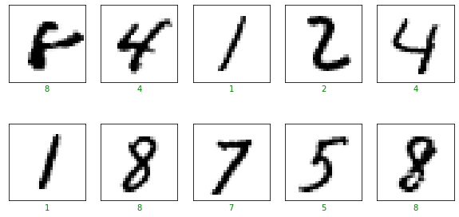
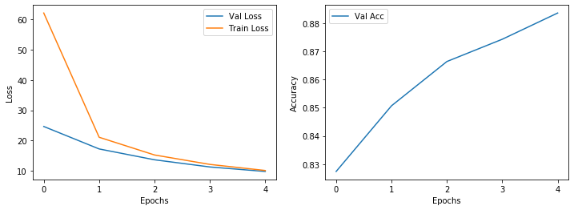

Hello, today I would like classify images by using  **Neural Network  in TensorFlow without Keras** ,   

We are going to classify Images by using Tensorflow.


## Introduction and Importing Libraries

This notebook works the tensorflow version >= 2.1.0

First we Importing relevant libraries and helper functions.

```python
import tensorflow as tf
import numpy as np
import matplotlib.pyplot as plt
import nn_utils
%matplotlib inline

print('TensorFlow Version:', tf.__version__)
```

    TensorFlow Version: 2.3.0


```python
def load_data():
    (x_train, y_train), (x_test, y_test) = tf.keras.datasets.mnist.load_data()
    x_train = np.reshape(x_train, (x_train.shape[0], 784))/255.
    x_test = np.reshape(x_test, (x_test.shape[0], 784))/255.
    y_train = tf.keras.utils.to_categorical(y_train)
    y_test = tf.keras.utils.to_categorical(y_test)
    return (x_train, y_train), (x_test, y_test)

def plot_random_examples(x, y, p=None):
    indices = np.random.choice(range(0, x.shape[0]), 10)
    y = np.argmax(y, axis=1)
    if p is None:
        p = y
    plt.figure(figsize=(10, 5))
    for i, index in enumerate(indices):
        plt.subplot(2, 5, i+1)
        plt.imshow(x[index].reshape((28, 28)), cmap='binary')
        plt.xticks([])
        plt.yticks([])
        if y[index] == p[index]:
            col = 'g'
        else:
            col = 'r'
        plt.xlabel(str(p[index]), color=col)
    return plt

def plot_results(history):
    plt.figure(figsize=(12, 4))
    epochs = len(history['val_loss'])
    plt.subplot(1, 2, 1)
    plt.plot(range(epochs), history['val_loss'], label='Val Loss')
    plt.plot(range(epochs), history['train_loss'], label='Train Loss')
    plt.xticks(list(range(epochs)))
    plt.xlabel('Epochs')
    plt.ylabel('Loss')
    plt.legend()
    plt.subplot(1, 2, 2)
    plt.plot(range(epochs), history['val_acc'], label='Val Acc')
    plt.xticks(list(range(epochs)))
    plt.xlabel('Epochs')
    plt.ylabel('Accuracy')
    plt.legend()
    return plt
```


## Initializing Neural Network

We have to creating the Neural Network class, understanding the init function and setting up initial parameter values.


```python
#net = NeuralNewtwork(10,100,11)
#10 features for each example
#11 classes for each example
#100 unit in the hidden layer

class NeuralNetwork:
    def __init__(self, layers):
        self.layers = layers
        self.L = len(layers)
        self.num_features = layers[0]
        self.num_classes = layers[-1]
        
        self.W = {}
        self.b = {}
        
        self.dW = {}
        self.db = {}
        
        self.setup()
        
    def setup(self):
        # Your code here
        for i in range(1, self.L):
            self.W[i] = tf.Variable(tf.random.normal(shape=(self.layers[i],self.layers[i-1])))
            self.b[i] = tf.Variable(tf.random.normal(shape=(self.layers[i],1)))
            
```


## Forward Pass

- Creating a forward pass function.


```python
class NeuralNetwork(NeuralNetwork):
    def forward_pass(self, X):

        A = tf.convert_to_tensor(X, dtype=tf.float32)
        for i in range(1, self.L):
            Z = tf.matmul(A,tf.transpose(self.W[i])) + tf.transpose(self.b[i])
            if i != self.L-1:
                A = tf.nn.relu(Z)
            else:
                A = Z
        return A
```


## Computing Loss and Updating Parameters

- Using the cross entropy loss with logits.
- Updating parameters for all the layers.


```python
class NeuralNetwork(NeuralNetwork):

    def compute_loss(self, A, Y):
        loss = tf.nn.softmax_cross_entropy_with_logits(Y,A)
        return tf.reduce_mean(loss)
    
    
    def update_params(self, lr):
        for i in range(1,self.L):
            self.W[i].assign_sub(lr * self.dW[i])
            self.b[i].assign_sub(lr * self.db[i])
            
```


## Predict and Info Functions

- First we have to unnderstandand the pre-written info function.
- Therefore we create a predict function with the help of the forward pass


```python
class NeuralNetwork(NeuralNetwork):
    def predict(self, X):

        A = self.forward_pass(X)
        return tf.argmax(tf.nn.softmax(A), axis=1)
    
    def info(self):
        num_params = 0
        for i in range(1, self.L):
            num_params += self.W[i].shape[0] * self.W[i].shape[1]
            num_params += self.b[i].shape[0]
        print('Input Features:', self.num_features)
        print('Number of Classes:', self.num_classes)
        print('Hidden Layers:')
        print('--------------')
        for i in range(1, self.L-1):
            print('Layer {}, Units {}'.format(i, self.layers[i]))
        print('--------------')
        print('Number of parameters:', num_params)
```


##  Training on Batch

- We create the main training mechanism.

- Annd we implement the gradient descent with automatic differentiation.

  


  ```python
  class NeuralNetwork(NeuralNetwork):
      def train_on_batch(self, X, Y, lr):
          # Your code here
          X = tf.convert_to_tensor(X, dtype=tf.float32)
          Y = tf.convert_to_tensor(Y, dtype=tf.float32)
          
          with tf.GradientTape(persistent=True) as tape:
              A = self.forward_pass(X)
              loss = self.compute_loss(A, Y)
          for i in range(1, self.L):
              self.dW[i] = tape.gradient(loss, self.W[i])
              self.db[i] = tape.gradient(loss, self.b[i])
          del tape
          self.update_params(lr)
          return loss.numpy()
          
  ```

  

## Training on Complete Set

- We break down data-set in batches.
- And again we break down the training process in epochs and steps.


```python
class NeuralNetwork(NeuralNetwork):
    def train(self, x_train, y_train, x_test, y_test, epochs, steps_per_epoch, batch_size, lr):

        history = {
            'val_loss':[],
            'train_loss':[],
            'val_acc':[]
        }
        
        for e in range(0, epochs):
            epoch_train_loss = 0.
            print('Epoch{}'.format(e), end='.')
            for i in range(0, steps_per_epoch):
                x_batch = x_train[i*batch_size:(i+1)*batch_size]
                y_batch = y_train[i*batch_size:(i+1)*batch_size]
                
                batch_loss = self.train_on_batch(x_batch, y_batch,lr)
                epoch_train_loss += batch_loss
                
                if i%int(steps_per_epoch/10) == 0:
                    print(end='.')
                    
            history['train_loss'].append(epoch_train_loss/steps_per_epoch)
            val_A = self.forward_pass(x_test)
            val_loss = self.compute_loss(val_A, y_test).numpy()
            history['val_loss'].append(val_loss)
            val_preds = self.predict(x_test)
            val_acc =    np.mean(np.argmax(y_test, axis=1) == val_preds.numpy())
            history['val_acc'].append(val_acc)
            print('Val acc:',val_acc)
        return history
            
```


##  Application

- We apply the neural network model to solve a multi-class classification problem.
- We create model instance and setting up hyperparameters.
- And we we create  the model.


```python
(x_train, y_train), (x_test, y_test) = nn_utils.load_data()
nn_utils.plot_random_examples(x_train, y_train).show()
```





in MNIST dataset there are 784 fetures
it has 20 row and 20 columns for each example
we will use two hidden layers with 128 units
and we have 10 classes


```python
net = NeuralNetwork([784,128,128,10])
net.info()
```

    Input Features: 784
    Number of Classes: 10
    Hidden Layers:
    --------------
    Layer 1, Units 128
    Layer 2, Units 128
    --------------
    Number of parameters: 118282


```python
batch_size = 120
epochs = 5
steps_per_epoch = int(x_train.shape[0]/batch_size)
lr = 3e-3
print('Steps per epoch', steps_per_epoch)
```

    Steps per epoch 500


```python
history = net.train(
    x_train,y_train,
    x_test, y_test,
    epochs, steps_per_epoch,
    batch_size, lr)
```

    Epoch0...........Val acc: 0.8274
    Epoch1...........Val acc: 0.8507
    Epoch2...........Val acc: 0.8664
    Epoch3...........Val acc: 0.8743
    Epoch4...........Val acc: 0.8836


## Results

- We plot the training results.
- A look at predictions on the test set.


```python
nn_utils.plot_results(history).show()
```





```python
preds = net.predict(x_test)
```


```python
nn_utils.plot_random_examples(x_test,y_test,preds.numpy()).show()
```


**Congratulations!**  We have applied  Neural Networks in Tensorflow to classify hand script images 

