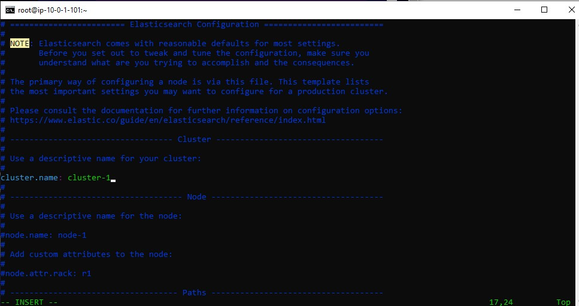
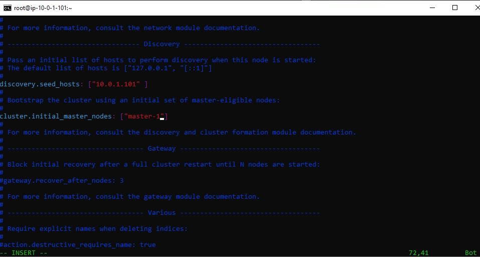
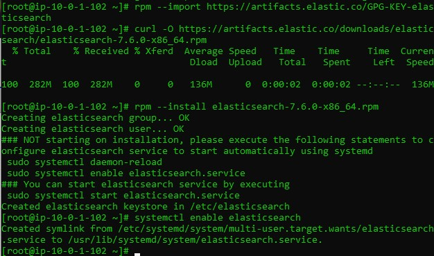
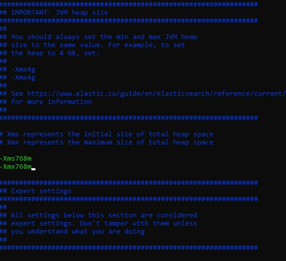
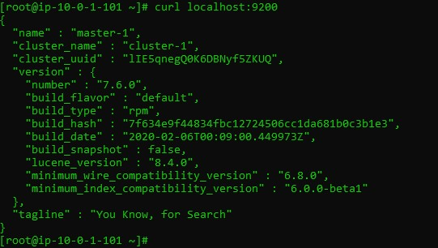

#  Deploy  Elasticsearch in a Cluster


We are going to create a cluster with 3 nodes, 1 master node and 2  data nodes by using CentOS Linux 7 


### Master Node Setup

The first computer that we will connect will be the master computer.

Using the Secure Shell (SSH), log in  via the public IP address.

First we enter like a  `root` user with:

```
sudo su -
```

Import the Elastic GPG key:

```
rpm --import https://artifacts.elastic.co/GPG-KEY-elasticsearch
```

Download the Elasticsearch 7.6 RPM:

```
curl -O https://artifacts.elastic.co/downloads/elasticsearch/elasticsearch-7.6.0-x86_64.rpm
```

Install Elasticsearch:

```
rpm --install elasticsearch-7.6.0-x86_64.rpm
```

Configure Elasticsearch to start on system boot:

```
systemctl enable elasticsearch
```


Configure the elasticsearch.yml per instructions.


Open the `elasticsearch.yml` file:

```
vim /etc/elasticsearch/elasticsearch.yml
```

Change the following line:

```
#cluster.name: my-application
```

to

```
cluster.name: cluster-1
```

Press the letter i on your keyboard to enter INSERT mode in vim.




Change the following line on master-1:

```
#node.name: node-1
```

to

```
node.name: master-1
```

Change

```
#network.host: 192.168.0.1
```

to

```
network.host: [_local_,_site_]
```


change

```
#discovery.seed_hosts: ["host1", "host2"]
```


to

```
discovery.seed_hosts: ["10.0.1.101"]
```


and change

```
#cluster.initial_master_nodes: ["node-1", "node-2"]
```

to

```
cluster.initial_master_nodes: ["master-1"]
```




we add the following lines

```
node.master: truenode.data: falsenode.ingest: falsenode.ml: false
```


Then save and quit.

To save the file and exit the editor simultaneously, press `Esc` to switch to normal mode, type `:wq` and hit `Enter`.


###  Node 1  Setup

We conect now the the node 1 again by using the Secure Shell (SSH), log in  via the public IP address.

and we repeate the same steps

Become the `root` user with:

```
sudo su -
```

Import the Elastic GPG key:

```
rpm --import https://artifacts.elastic.co/GPG-KEY-elasticsearch
```

Download the Elasticsearch 7.6 RPM:

```
curl -O https://artifacts.elastic.co/downloads/elasticsearch/elasticsearch-7.6.0-x86_64.rpm
```

Install Elasticsearch:

```
rpm --install elasticsearch-7.6.0-x86_64.rpm
```

Configure Elasticsearch to start on system boot:

```
systemctl enable elasticsearch
```




we configure  the  node's elasticsearch.yml per instructions.

Open the `elasticsearch.yml` file:

```
vim /etc/elasticsearch/elasticsearch.yml
```

Change the following line:

```
#cluster.name: my-application
```

to

```
cluster.name: cluster-1
```


Change the following line on data-1:

```
#node.name: node-1
```

to

```
node.name: data-1
```


Change the following line on data-1:

```
#node.attr.rack: r1
```

to

```
node.attr.temp: hot
```


```
node.name: master-1
```

Change

```
#network.host: 192.168.0.1
```

to

```
network.host: [_local_,_site_]
```


change

```
#discovery.seed_hosts: ["host1", "host2"]
```


to

```
discovery.seed_hosts: ["10.0.1.101"]
```


and change

```
#cluster.initial_master_nodes: ["node-1", "node-2"]
```

to

```
cluster.initial_master_nodes: ["master-1"]
```

Add the following lines on data-1:

```
node.master: falsenode.data: truenode.ingest: truenode.ml: false
```


###  Node 2  Setup

We conect now the the node 2 again by using the Secure Shell (SSH), log in  via the public IP address.

and we repeat the same steps

```
sudo su -
```

Import the Elastic GPG key:

```
rpm --import https://artifacts.elastic.co/GPG-KEY-elasticsearch
```

Download the Elasticsearch 7.6 RPM:

```
curl -O https://artifacts.elastic.co/downloads/elasticsearch/elasticsearch-7.6.0-x86_64.rpm
```

Install Elasticsearch:

```
rpm --install elasticsearch-7.6.0-x86_64.rpm
```

Configure Elasticsearch to start on system boot:

```
systemctl enable elasticsearch
```


Configure  elasticsearch.yml per instructions.


Log in to each node and become the `root` user:

```
sudo su -
```

Open the `elasticsearch.yml` file:

```
vim /etc/elasticsearch/elasticsearch.yml
```


Change the following line:

```
#cluster.name: my-application
```

to

```
cluster.name: cluster-1
```


Change the following line on data-2:

```
#node.name: node-1
```

to

```
node.name: data-2
```

Change the following line on data-2:

```
#node.attr.rack: r1
```

to

```
node.attr.temp: warm
```


Change

```
#network.host: 192.168.0.1
```

to

```
network.host: [_local_,_site_]
```


change

```
#discovery.seed_hosts: ["host1", "host2"]
```


to

```
discovery.seed_hosts: ["10.0.1.101"]
```


and change

```
#cluster.initial_master_nodes: ["node-1", "node-2"]
```

to

```
cluster.initial_master_nodes: ["master-1"]
```

Add the following lines on data-2:

```
node.master: falsenode.data: truenode.ingest: truenode.ml: false
```


Configure the heap for each node per instructions.

Log in to the master node 

```
sudo su -
```

Open the `jvm.options` file:

```
vim /etc/elasticsearch/jvm.options
```

Change the following lines:

```
-Xms1g-Xmx1g
```

to

```
-Xms768m-Xmx768m
```





Log in to each data node and become the `root` user:

```
sudo su -
```

Open the `jvm.options` file:

```
vim /etc/elasticsearch/jvm.options
```

Change the following lines:

```
-Xms1g-Xmx1g
```

to

```
-Xms2g-Xmx2g
```


Start Elasticsearch on each node.

```
systemctl start elasticsearch
```

Check the startup process:

```
less /var/log/elasticsearch/cluster-1.log
```


from there we can see

```
[master-1] started
```

and

```
 [master-1] added node-1
```

```
 [master-1] added node-2
```


Check the node configuration:

```
curl localhost:9200
```



```
curl localhost:9200/_cat/nodes?v
```


to get more information about your cluster  you can use cat to know 


# Configure Kibana for an Elasticsearch Cluster


Install Kibana on the master-1 node.

Using the Secure Shell (SSH), log in to the `master-1` node as `cloud_user` via the public IP address.

Become the `root` user with:

```
sudo su -
```

Download the Kibana 7.6 RPM:

```
curl -O https://artifacts.elastic.co/downloads/kibana/kibana-7.6.0-x86_64.rpm
```

Install Kibana:

```
rpm --install kibana-7.6.0-x86_64.rpm
```

Configure Kibana to start on system boot:

```
systemctl enable kibana
```


Log in to the `master-1` node and become the `root` user with:

```
sudo su -
```

Open the `/etc/kibana/kibana.yml` file:

```
vim /etc/kibana/kibana.yml
```

Change the following line:

```
#server.port: 5601
```

to

```
server.port: 8080
```

Change the following line:

```
#server.host: "localhost"
```

to

```
server.host: "10.0.1.101"
```


Start Kibana:

```
systemctl start kibana
```


After Kibana has finished starting up, which may take a few minutes navigate to `http://PUBLIC_IP_ADDRESS_OF_MASTER-1:8080` in your web browser 


click `Explore on my own`


and navigate to **Dev Tools** > **Console**.

Check the node status of the cluster via the console tool with:

```
GET _cat/nodes?v
```


**Congratulations!** We have installed Elasticsearch and Kibana in a Cluster

