We are interested to  to determine the most common users, grouped by their gender and age from a **S3** bucket that contains  on hundreds/thousands of files containing **CSV** data about the users who interact with the application of one company.  To accomplish this, you will first need to create an **EMR cluster** and copy user data into **HDFS**.


We  will run a **PySpark Apache Spark** script to count the number of users, grouping them by their age and gender and finally load the results into S3 for further analysis.


## Creating an EMR Cluster

 We will create an EMR cluster and ensure it has Spark and Hadoop installed on it.

1. Log in to the AWS console  [https://aws.amazon.com/it/console/](https://aws.amazon.com/it/console/).

2. Please make sure you are in the `us-east-1` (N. Virginia) region when in the AWS console.

   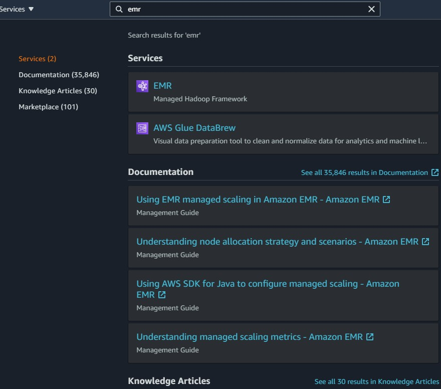

3. Select create cluster


4. Navigate into the EMR console and create an EMR cluster.

5. Go to advanced options

   

6. Check **Spark**

   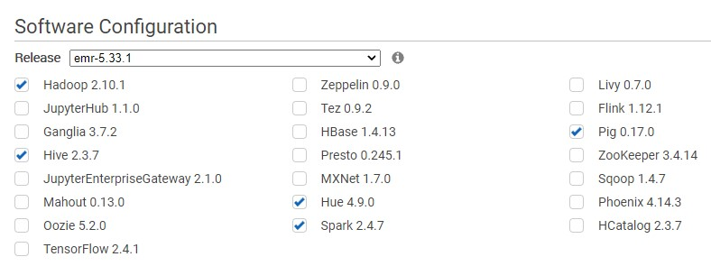

7. Scroll down click **next.**

8. For hardware configuration.  The changes we have to made involve our cluster nodes and instance types.  The **Cluster Composition** we  leave all **default**.

   

9.  In **Cluster Nodes and Instances** we change the instance type for our **Master** and our **Core**. The instance types should both be `m4.large`. 

   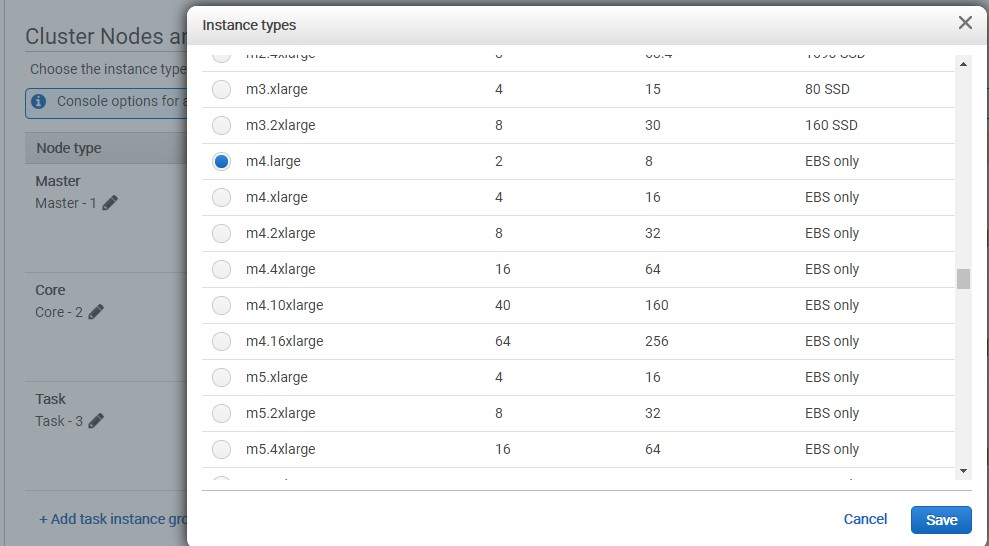

10. We change the number of instances for our core node to **1**

    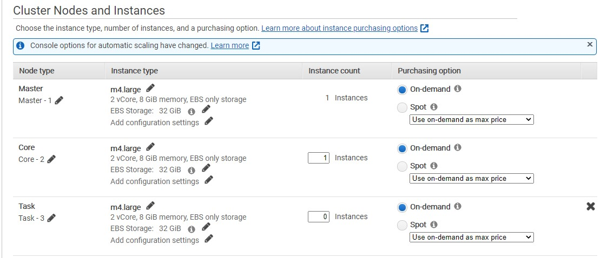

    The type of  data analytics that we're running only needs one core node. But we can of course add more if we wanted to speed up the process to a certain activities. We scroll down we press **Next.**

    

11. In **General Options** we add the  **Cluster name** : age-and-gender-analytics

    Because that-s what this cluster is going to be doing to be do it. Running some analytics on somer user data that we have. We will go ahead and click **Next.**

    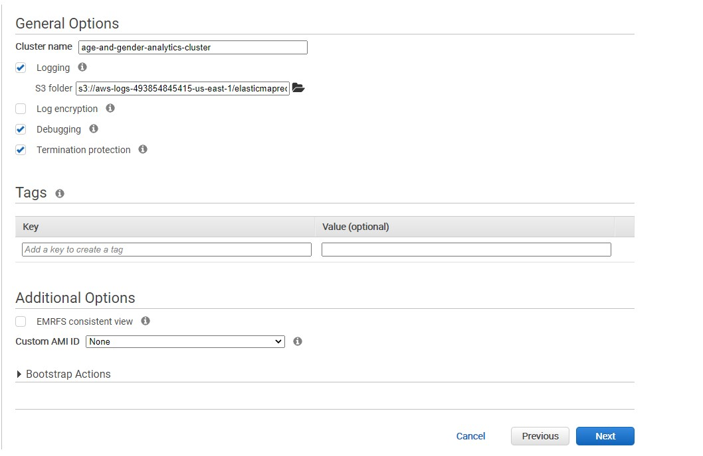

12. For this project we skip the EC2 key pair. We do not need connect it with SSH. So go ahead and click **Create cluster**. It will takes time 5 to 10 minutes. 

    

    

13. the EMR cluster has Spark and Hadoop installed on it.

14. We select the **Application User Interfaces'** and we copy the port  value 50070.

    

15. We will need to open up this port on the security that is associated with our master node. So if we navigate back into **Summary**, we can select the **security group** for the **master node** and open this in a new tab.

16. 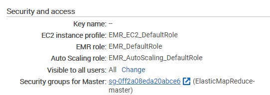

    

17.  We will navigate inside the security group and we select **ElasticMapReduce-maste**r security group name

    

18. We will go ahead and select this **Edit Inboud Rules**

19. We scroll down and we add a new role, we leave custom TCP and we paste the port number which is 50070 and we will go ahead and select our 0.0.0.0/0. and select **Save rules**

    ## Copy Data from S3 to HDFS Using s3-dist-cp

    

    We will create a step and use the `s3-dist-cp` command to copy user data from a public S3 bucket to HDFS. This public bucket also contains the PySpark script that we will use to run data analytics on the copied user data.

20. Let's go back to EMR,  navigate into **Application User Interfaces** and open copy the **HDFS Name Node**

    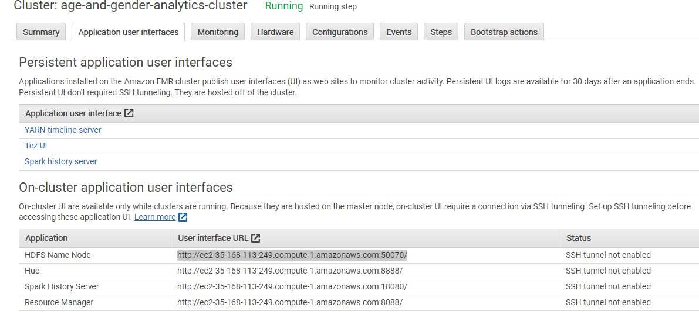

21. Got to this web address and you will got the following

    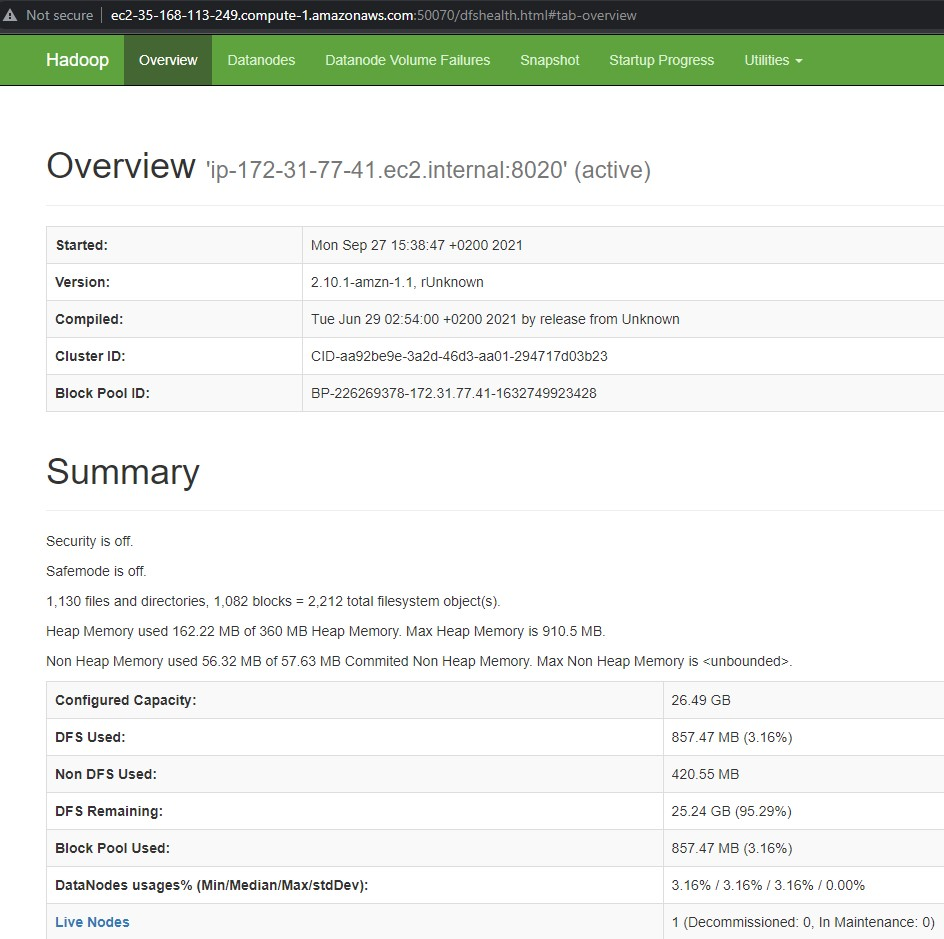

    The previous website give us an overview of our HDFS cluster and files, and all of the capacity information , how much is used and all the information about our Hadoop cluster.

22. Now hit utililities dropdown, and click **Browse the file system**

    

23. We have few folders set up and we are going to load some data onto the HDFS cluster and monitor through this web interface

    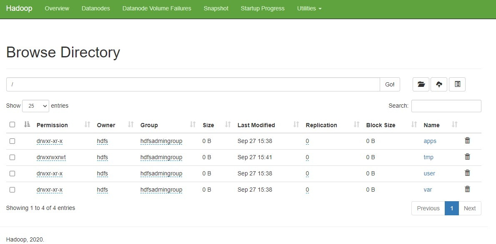

    ## Run a PySpark Script Using spark-submit

    Using the `spark-submit` command, execute the PySpark script to group the user data by the `dob.age` and `gender` attributes. Count all the records, ensure they are in ascending order, and report the results in CSV format back to HDFS.

24. Navigate back to our EMR cluster tab and select the **Steps** tab

    

25. We are going to create a few steps that are going to run on our  EMR cluster. **Add step**

26. The first step we are going to create is getting data from S3 and loading that data onto our Hadoop cluster. What we are going to do is use a Custom Jar.

27. For the name we write : `Copy data and script to HDFS`

28. For the Jar location: `command-runner.jar`

29. Arguments: `s3-dist-cp --src=s3://das-c01-data-analytics-specialty/Data_Analytics_With_Spark_and_EMR/ --dest=hdfs:///`

30. Then **Add **the step

    

    

    Apache **DistCp** is an open-source tool you can use to copy large amounts of data. *S3DistCp* is similar to DistCp, but optimized to work with AWS, particularly Amazon S3. 

    

    The command for S3DistCp in Amazon EMR version 4.0 and later is `s3-dist-cp`, which you add as a step in a cluster or at the command line.

    

     Using S3DistCp, you can efficiently copy large amounts of data from Amazon S3 into HDFS where it can be processed by subsequent steps in your Amazon EMR cluster.

    

     You can also use S3DistCp to copy data between Amazon S3 buckets or from HDFS to Amazon S3. 

    

31. Now its going to copy the data from our public  S3.  This step can takes more than 5 minutes. After that we will able to see our files and our folders on HDFS.

    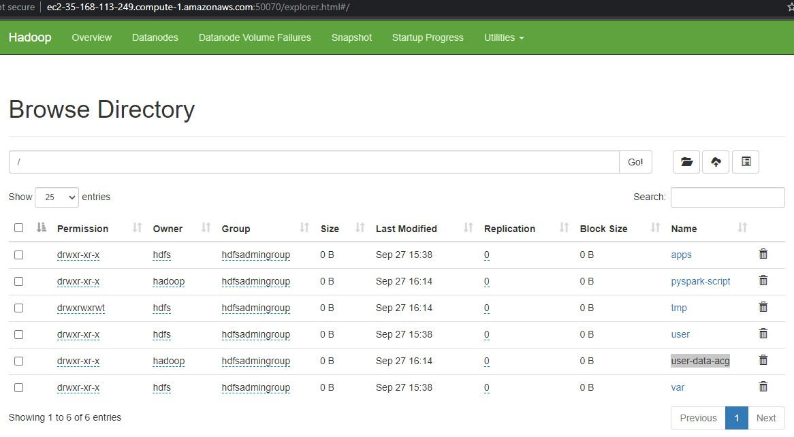

    

32. Inside the user data we have CSV files that contains information about users

    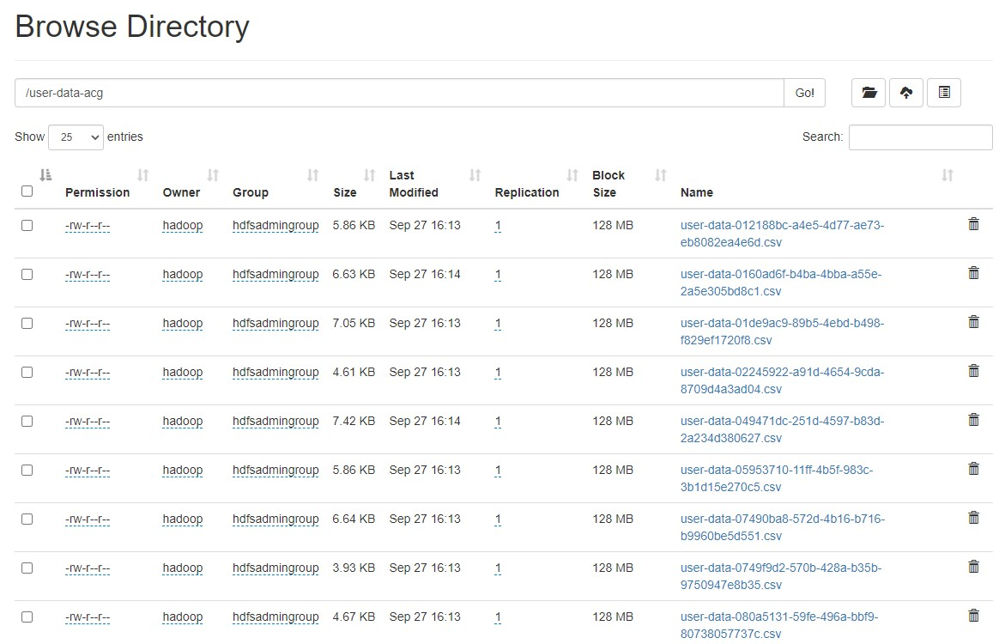

    

33. Lets navigate back to EMR and add a new step.

34. For the name we write : `Run Pyspark Script`

35. For the Jar location: `command-runner.jar`

36. Arguments: `spark-submit hdfs:///pyspark-script/emr-pyspark-code.py`

37. We add this step and we wait.

    

38. 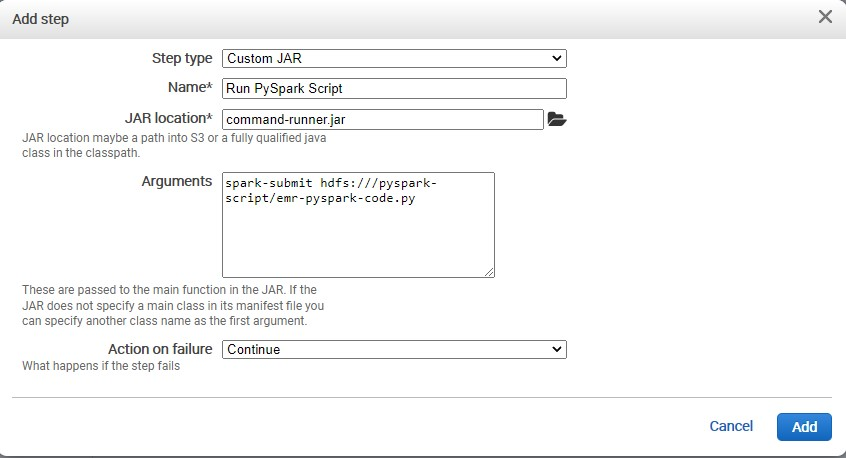

    The previous step contains a python script

    

    ```python
    #emr-pyspark-code.py
    from pyspark import SparkConf, SparkContext
    from pyspark.sql import SparkSession
    
    spark = SparkSession.builder.master("local")
            .config(conf=SparkConf()).getOrCreate()
    
    df = spark.read.format("csv")
            .option("header", "true")
            .load("hdfs:///user-data-acg/user-data-*.csv")
    
    results = df.groupBy("`dob.age`","`gender`")
                .count()
                .orderBy("count", ascending=False)
    
    results.show()
    
    results.coalesce(1).write.csv("hdfs:///results", sep=",", header="true")
    ```

    

39. We wait for the step is finish.

    

    and we can click stdout and see the results from our Python  script.

    

40. We go back to our browser and we see the results folder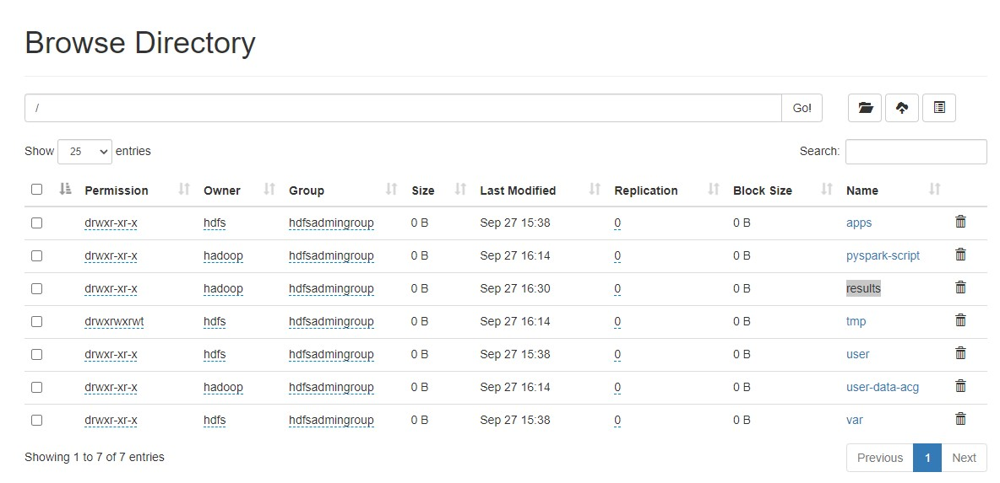

    

    ### Copy Data From HDFS to S3 Using s3-dist-cp

     We will create a third step to use the `s3-dist-cp` command to copy our results from HDFS to S3. These results can be used later to create marketing campaigns for your users. We are going to add a final step that is going to load the results  from our HDFS cluster into S3

41. We create new bucket. For example `gender-age-analytics-bucket`

    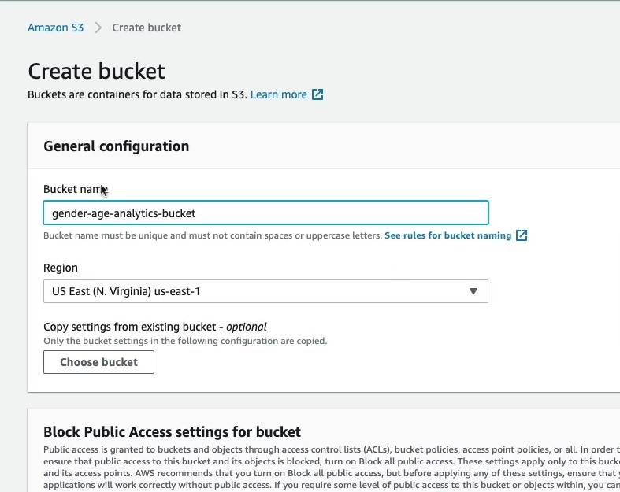

42. Lets navigate back to EMR and add a new step.

43. For the name we write : `Load results to S3`

44. For the Jar location: `command-runner.jar`

45. Arguments: `s3-dist-cp --src=hdfs:///results --dest=s3://gender-age-analytics-bucket`

46. We add this step and we wait.

47. 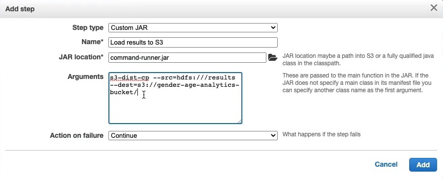

48. We can go our s3 bucket and download the file 

    

49. We open the file and we see that is showing all of the results of all users with age and gender  aggregated together.

    

50. After you finished this project please **stop** the **cluster** and delete the bucket that you have created to avoid costs of aws services.

    

### Additonal Documentation

[Using `s3-dist-cp` on EMR](https://docs.aws.amazon.com/emr/latest/ReleaseGuide/UsingEMR_s3distcp.html)

[How do I use `s3-dist-cp`?](https://www.youtube.com/watch?v=JnAOdAeC4lU)

**Congratulations!** We have created  a EMR cluster and executed a Pyspark script to analyze the data from S3.


