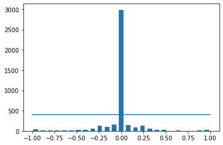
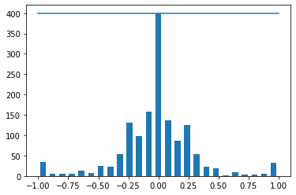
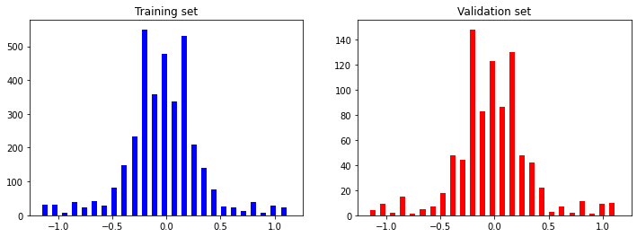
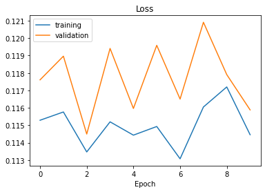

Hello, today I would like emulate a self driving car by using  **Neural Network  in TensorFlow** ,   

In this blog post, we’ll see how to write a program  to simulate a self driving car by using an open source 

emulator of driving car by using Neural Networks. If you want to run this python code , you should first  enable the python environment where you want to deploy this project.

I have provided two notebooks to generate the neural network model, one that can be deployed in colab and another in your local computer.


First you should download the zip file, extract it and run the executable file.

Version 2, 2/07/17

[Linux](https://s3-us-west-1.amazonaws.com/udacity-selfdrivingcar/Term1-Sim/term1-simulator-linux.zip) [Mac](https://s3-us-west-1.amazonaws.com/udacity-selfdrivingcar/Term1-Sim/term1-simulator-mac.zip) [Windows](https://s3-us-west-1.amazonaws.com/udacity-selfdrivingcar/Term1-Sim/term1-simulator-windows.zip)

Version 1, 12/09/16

[Linux](https://d17h27t6h515a5.cloudfront.net/topher/2016/November/5831f0f7_simulator-linux/simulator-linux.zip) [Mac](https://d17h27t6h515a5.cloudfront.net/topher/2016/November/5831f290_simulator-macos/simulator-macos.zip) [Windows 32](https://d17h27t6h515a5.cloudfront.net/topher/2016/November/5831f4b6_simulator-windows-32/simulator-windows-32.zip) [Windows 64](https://d17h27t6h515a5.cloudfront.net/topher/2016/November/5831f3a4_simulator-windows-64/simulator-windows-64.zip)


### Unity Simulator User Instructions

1. Clone the repository to your local directory, please make sure to use [Git LFS](https://git-lfs.github.com/) to properly pull over large texture and model assets.
2. Install the free game making engine [Unity](https://unity3d.com/), if you dont already have it. Unity is necessary to load all the assets.When you open the application 


You select the training mode to generate your own data

and select the folder that you want to save your data.


Otherwise you can use my saved data in GitHub called track1 


After you created your data files  you should create your python environment

and install all the repositories needed

```
pip install eventlet
```


```
pip install python-engineio==3.13.2
```

```
pip install python-socketio==4.6.1
```

```
conda install -c conda-forge tensorflow

....
```


Create  your  Jupiter notebook with the following codes:


```python
import os
import numpy as np
import matplotlib.pyplot as plt
import matplotlib.image as mpimg
import keras
from keras.models import Sequential
from keras.optimizers import Adam
from keras.layers import Convolution2D, MaxPooling2D, Dropout, Flatten, Dense
from sklearn.utils import shuffle
from sklearn.model_selection import train_test_split
from imgaug import augmenters as iaa
import cv2
import pandas as pd
import ntpath
import random
```


```python
datadir = 'track1'
columns = ['center', 'left', 'right', 'steering', 'throttle', 'reverse', 'speed']
data = pd.read_csv(os.path.join(datadir, 'driving_log.csv'), names = columns)
pd.set_option('display.max_colwidth', -1)
data.head()
```

    <ipython-input-6-7e0eb016f220>:4: FutureWarning: Passing a negative integer is deprecated in version 1.0 and will not be supported in future version. Instead, use None to not limit the column width.
      pd.set_option('display.max_colwidth', -1)


<div>
<style scoped>
    .dataframe tbody tr th:only-of-type {
        vertical-align: middle;
    }


    .dataframe tbody tr th {
        vertical-align: top;
    }
    
    .dataframe thead th {
        text-align: right;
    }

</style>

<table border="1" class="dataframe">
  <thead>
    <tr style="text-align: right;">
      <th></th>
      <th>center</th>
      <th>left</th>
      <th>right</th>
      <th>steering</th>
      <th>throttle</th>
      <th>reverse</th>
      <th>speed</th>
    </tr>
  </thead>
  <tbody>
    <tr>
      <th>0</th>
      <td>C:\Users\ruslanmv\Desktop\new_track\IMG\center_2018_07_16_17_11_43_382.jpg</td>
      <td>C:\Users\ruslanmv\Desktop\new_track\IMG\left_2018_07_16_17_11_43_382.jpg</td>
      <td>C:\Users\ruslanmv\Desktop\new_track\IMG\right_2018_07_16_17_11_43_382.jpg</td>
      <td>0.0</td>
      <td>0.0</td>
      <td>0.0</td>
      <td>0.649786</td>
    </tr>
    <tr>
      <th>1</th>
      <td>C:\Users\ruslanmv\Desktop\new_track\IMG\center_2018_07_16_17_11_43_670.jpg</td>
      <td>C:\Users\ruslanmv\Desktop\new_track\IMG\left_2018_07_16_17_11_43_670.jpg</td>
      <td>C:\Users\ruslanmv\Desktop\new_track\IMG\right_2018_07_16_17_11_43_670.jpg</td>
      <td>0.0</td>
      <td>0.0</td>
      <td>0.0</td>
      <td>0.627942</td>
    </tr>
    <tr>
      <th>2</th>
      <td>C:\Users\ruslanmv\Desktop\new_track\IMG\center_2018_07_16_17_11_43_724.jpg</td>
      <td>C:\Users\ruslanmv\Desktop\new_track\IMG\left_2018_07_16_17_11_43_724.jpg</td>
      <td>C:\Users\ruslanmv\Desktop\new_track\IMG\right_2018_07_16_17_11_43_724.jpg</td>
      <td>0.0</td>
      <td>0.0</td>
      <td>0.0</td>
      <td>0.622910</td>
    </tr>
    <tr>
      <th>3</th>
      <td>C:\Users\ruslanmv\Desktop\new_track\IMG\center_2018_07_16_17_11_43_792.jpg</td>
      <td>C:\Users\ruslanmv\Desktop\new_track\IMG\left_2018_07_16_17_11_43_792.jpg</td>
      <td>C:\Users\ruslanmv\Desktop\new_track\IMG\right_2018_07_16_17_11_43_792.jpg</td>
      <td>0.0</td>
      <td>0.0</td>
      <td>0.0</td>
      <td>0.619162</td>
    </tr>
    <tr>
      <th>4</th>
      <td>C:\Users\ruslanmv\Desktop\new_track\IMG\center_2018_07_16_17_11_43_860.jpg</td>
      <td>C:\Users\ruslanmv\Desktop\new_track\IMG\left_2018_07_16_17_11_43_860.jpg</td>
      <td>C:\Users\ruslanmv\Desktop\new_track\IMG\right_2018_07_16_17_11_43_860.jpg</td>
      <td>0.0</td>
      <td>0.0</td>
      <td>0.0</td>
      <td>0.615438</td>
    </tr>
  </tbody>
</table>

</div>


```python
def path_leaf(path):          head, tail = ntpath.split(path)          return tail
```


```python
data['center'] = data['center'].apply(path_leaf)data['left'] = data['left'].apply(path_leaf)data['right'] = data['right'].apply(path_leaf)data.head()
```


<div>
<style scoped>
    .dataframe tbody tr th:only-of-type {
        vertical-align: middle;
    }


    .dataframe tbody tr th {    vertical-align: top;}.dataframe thead th {    text-align: right;}

</style>

<table border="1" class="dataframe">
  <thead>
    <tr style="text-align: right;">
      <th></th>
      <th>center</th>
      <th>left</th>
      <th>right</th>
      <th>steering</th>
      <th>throttle</th>
      <th>reverse</th>
      <th>speed</th>
    </tr>
  </thead>
  <tbody>
    <tr>
      <th>0</th>
      <td>center_2018_07_16_17_11_43_382.jpg</td>
      <td>left_2018_07_16_17_11_43_382.jpg</td>
      <td>right_2018_07_16_17_11_43_382.jpg</td>
      <td>0.0</td>
      <td>0.0</td>
      <td>0.0</td>
      <td>0.649786</td>
    </tr>
    <tr>
      <th>1</th>
      <td>center_2018_07_16_17_11_43_670.jpg</td>
      <td>left_2018_07_16_17_11_43_670.jpg</td>
      <td>right_2018_07_16_17_11_43_670.jpg</td>
      <td>0.0</td>
      <td>0.0</td>
      <td>0.0</td>
      <td>0.627942</td>
    </tr>
    <tr>
      <th>2</th>
      <td>center_2018_07_16_17_11_43_724.jpg</td>
      <td>left_2018_07_16_17_11_43_724.jpg</td>
      <td>right_2018_07_16_17_11_43_724.jpg</td>
      <td>0.0</td>
      <td>0.0</td>
      <td>0.0</td>
      <td>0.622910</td>
    </tr>
    <tr>
      <th>3</th>
      <td>center_2018_07_16_17_11_43_792.jpg</td>
      <td>left_2018_07_16_17_11_43_792.jpg</td>
      <td>right_2018_07_16_17_11_43_792.jpg</td>
      <td>0.0</td>
      <td>0.0</td>
      <td>0.0</td>
      <td>0.619162</td>
    </tr>
    <tr>
      <th>4</th>
      <td>center_2018_07_16_17_11_43_860.jpg</td>
      <td>left_2018_07_16_17_11_43_860.jpg</td>
      <td>right_2018_07_16_17_11_43_860.jpg</td>
      <td>0.0</td>
      <td>0.0</td>
      <td>0.0</td>
      <td>0.615438</td>
    </tr>
  </tbody>
</table>

</div>


```python
def path_leaf(path):          head, tail = ntpath.split(path)          return tail
```


```python
data['center'] = data['center'].apply(path_leaf)data['left'] = data['left'].apply(path_leaf)data['right'] = data['right'].apply(path_leaf)data.head()
```


<div>
<style scoped>
    .dataframe tbody tr th:only-of-type {
        vertical-align: middle;
    }


    .dataframe tbody tr th {    vertical-align: top;}.dataframe thead th {    text-align: right;}

</style>

<table border="1" class="dataframe">
  <thead>
    <tr style="text-align: right;">
      <th></th>
      <th>center</th>
      <th>left</th>
      <th>right</th>
      <th>steering</th>
      <th>throttle</th>
      <th>reverse</th>
      <th>speed</th>
    </tr>
  </thead>
  <tbody>
    <tr>
      <th>0</th>
      <td>center_2018_07_16_17_11_43_382.jpg</td>
      <td>left_2018_07_16_17_11_43_382.jpg</td>
      <td>right_2018_07_16_17_11_43_382.jpg</td>
      <td>0.0</td>
      <td>0.0</td>
      <td>0.0</td>
      <td>0.649786</td>
    </tr>
    <tr>
      <th>1</th>
      <td>center_2018_07_16_17_11_43_670.jpg</td>
      <td>left_2018_07_16_17_11_43_670.jpg</td>
      <td>right_2018_07_16_17_11_43_670.jpg</td>
      <td>0.0</td>
      <td>0.0</td>
      <td>0.0</td>
      <td>0.627942</td>
    </tr>
    <tr>
      <th>2</th>
      <td>center_2018_07_16_17_11_43_724.jpg</td>
      <td>left_2018_07_16_17_11_43_724.jpg</td>
      <td>right_2018_07_16_17_11_43_724.jpg</td>
      <td>0.0</td>
      <td>0.0</td>
      <td>0.0</td>
      <td>0.622910</td>
    </tr>
    <tr>
      <th>3</th>
      <td>center_2018_07_16_17_11_43_792.jpg</td>
      <td>left_2018_07_16_17_11_43_792.jpg</td>
      <td>right_2018_07_16_17_11_43_792.jpg</td>
      <td>0.0</td>
      <td>0.0</td>
      <td>0.0</td>
      <td>0.619162</td>
    </tr>
    <tr>
      <th>4</th>
      <td>center_2018_07_16_17_11_43_860.jpg</td>
      <td>left_2018_07_16_17_11_43_860.jpg</td>
      <td>right_2018_07_16_17_11_43_860.jpg</td>
      <td>0.0</td>
      <td>0.0</td>
      <td>0.0</td>
      <td>0.615438</td>
    </tr>
  </tbody>
</table>

</div>


```python
num_bins = 25samples_per_bin = 400hist, bins = np.histogram(data['steering'], num_bins)center = (bins[:-1]+ bins[1:]) * 0.5
```


```python
plt.bar(center, hist, width=0.05)plt.plot((np.min(data['steering']), np.max(data['steering'])), (samples_per_bin, samples_per_bin))print('total data:', len(data))
```

    total data: 4053



    


```python
remove_list = []for j in range(num_bins):  list_ = []  for i in range(len(data['steering'])):    if data['steering'][i] >= bins[j] and data['steering'][i] <= bins[j+1]:      list_.append(i)  list_ = shuffle(list_)  list_ = list_[samples_per_bin:]  remove_list.extend(list_)
```


```python
print('removed:', len(remove_list))data.drop(data.index[remove_list], inplace=True)print('remaining:', len(data))
```

    removed: 2590remaining: 1463


```python
hist, _ = np.histogram(data['steering'], (num_bins))plt.bar(center, hist, width=0.05)plt.plot((np.min(data['steering']), np.max(data['steering'])), (samples_per_bin, samples_per_bin))
```


    [<matplotlib.lines.Line2D at 0x7faba185fed0>]


​    

​    


```python
print(data.iloc[1])
```

    center      center_2018_07_16_17_11_43_670.jpgleft        left_2018_07_16_17_11_43_670.jpg  right       right_2018_07_16_17_11_43_670.jpg steering    0                                 throttle    0                                 reverse     0                                 speed       0.627942                          Name: 1, dtype: object


```python
def load_img_steering(datadir, df):  image_path = []  steering = []  for i in range(len(data)):    indexed_data = data.iloc[i]    center, left, right = indexed_data[0], indexed_data[1], indexed_data[2]    image_path.append(os.path.join(datadir, center.strip()))    steering.append(float(indexed_data[3]))    # left image append    image_path.append(os.path.join(datadir,left.strip()))    steering.append(float(indexed_data[3])+0.15)    # right image append    image_path.append(os.path.join(datadir,right.strip()))    steering.append(float(indexed_data[3])-0.15)  image_paths = np.asarray(image_path)  steerings = np.asarray(steering)  return image_paths, steerings
```


```python
image_paths, steerings = load_img_steering(datadir + '/IMG', data)X_train, X_valid, y_train, y_valid = train_test_split(image_paths, steerings, test_size=0.2, random_state=6)print('Training Samples: {}\nValid Samples: {}'.format(len(X_train), len(X_valid)))
```

    Training Samples: 3511Valid Samples: 878


```python
fig, axes = plt.subplots(1, 2, figsize=(12, 4))axes[0].hist(y_train, bins=num_bins, width=0.05, color='blue')axes[0].set_title('Training set')axes[1].hist(y_valid, bins=num_bins, width=0.05, color='red')axes[1].set_title('Validation set')
```


    Text(0.5, 1.0, 'Validation set')


​    

​    


```python
def zoom(image):  zoom = iaa.Affine(scale=(1, 1.3))  image = zoom.augment_image(image)  return imageimage = image_paths[random.randint(0, 1000)]original_image = mpimg.imread(image)zoomed_image = zoom(original_image)
```


```python
fig, axs = plt.subplots(1, 2, figsize=(15, 10))fig.tight_layout() axs[0].imshow(original_image)axs[0].set_title('Original Image')axs[1].imshow(zoomed_image)axs[1].set_title('Zoomed Image')
```


    Text(0.5, 1.0, 'Zoomed Image')


​    

​    


```python
def pan(image):  pan = iaa.Affine(translate_percent= {"x" : (-0.1, 0.1), "y": (-0.1, 0.1)})  image = pan.augment_image(image)  return imageimage = image_paths[random.randint(0, 1000)]original_image = mpimg.imread(image)panned_image = pan(original_image)
```


```python
def pan(image):  pan = iaa.Affine(translate_percent= {"x" : (-0.1, 0.1), "y": (-0.1, 0.1)})  image = pan.augment_image(image)  return image
```


```python
image = image_paths[random.randint(0, 1000)]original_image = mpimg.imread(image)panned_image = pan(original_image)
```


```python
fig, axs = plt.subplots(1, 2, figsize=(15, 10))fig.tight_layout() axs[0].imshow(original_image)axs[0].set_title('Original Image') axs[1].imshow(panned_image)axs[1].set_title('Panned Image')
```


    Text(0.5, 1.0, 'Panned Image')


​    

​    


```python
def img_random_brightness(image):    brightness = iaa.Multiply((0.2, 1.2))    image = brightness.augment_image(image)    return image
```


```python
image = image_paths[random.randint(0, 1000)]original_image = mpimg.imread(image)brightness_altered_image = img_random_brightness(original_image)
```


```python
fig, axs = plt.subplots(1, 2, figsize=(15, 10))fig.tight_layout() axs[0].imshow(original_image)axs[0].set_title('Original Image') axs[1].imshow(brightness_altered_image)axs[1].set_title('Brightness altered image ')
```


    Text(0.5, 1.0, 'Brightness altered image ')


​    

​    


```python
def img_random_flip(image, steering_angle):    image = cv2.flip(image,1)    steering_angle = -steering_angle    return image, steering_anglerandom_index = random.randint(0, 1000)image = image_paths[random_index]steering_angle = steerings[random_index]
```


```python
original_image = mpimg.imread(image)flipped_image, flipped_steering_angle = img_random_flip(original_image, steering_angle)
```


```python
fig, axs = plt.subplots(1, 2, figsize=(15, 10))fig.tight_layout() axs[0].imshow(original_image)axs[0].set_title('Original Image - ' + 'Steering Angle:' + str(steering_angle)) axs[1].imshow(flipped_image)axs[1].set_title('Flipped Image - ' + 'Steering Angle:' + str(flipped_steering_angle))
```


    Text(0.5, 1.0, 'Flipped Image - Steering Angle:0.15')


​    

​    


```python
def random_augment(image, steering_angle):    image = mpimg.imread(image)    if np.random.rand() < 0.5:      image = pan(image)    if np.random.rand() < 0.5:      image = zoom(image)    if np.random.rand() < 0.5:      image = img_random_brightness(image)    if np.random.rand() < 0.5:      image, steering_angle = img_random_flip(image, steering_angle)        return image, steering_angle
```


```python
ncol = 2nrow = 10 fig, axs = plt.subplots(nrow, ncol, figsize=(15, 50))fig.tight_layout()for i in range(10):  randnum = random.randint(0, len(image_paths) - 1)  random_image = image_paths[randnum]  random_steering = steerings[randnum]      original_image = mpimg.imread(random_image)  augmented_image, steering = random_augment(random_image, random_steering)      axs[i][0].imshow(original_image)  axs[i][0].set_title("Original Image")    axs[i][1].imshow(augmented_image)  axs[i][1].set_title("Augmented Image")
```


​    

​    


```python
def img_preprocess(img):    img = img[60:135,:,:]    img = cv2.cvtColor(img, cv2.COLOR_RGB2YUV)    img = cv2.GaussianBlur(img,  (3, 3), 0)    img = cv2.resize(img, (200, 66))    img = img/255    return img
```


```python
image = image_paths[100]original_image = mpimg.imread(image)preprocessed_image = img_preprocess(original_image)
```


```python
fig, axs = plt.subplots(1, 2, figsize=(15, 10))fig.tight_layout()axs[0].imshow(original_image)axs[0].set_title('Original Image')axs[1].imshow(preprocessed_image)axs[1].set_title('Preprocessed Image')
```


    Text(0.5, 1.0, 'Preprocessed Image')


​    

​    


```python
def batch_generator(image_paths, steering_ang, batch_size, istraining):    while True:    batch_img = []    batch_steering = []        for i in range(batch_size):      random_index = random.randint(0, len(image_paths) - 1)            if istraining:        im, steering = random_augment(image_paths[random_index], steering_ang[random_index])           else:        im = mpimg.imread(image_paths[random_index])        steering = steering_ang[random_index]            im = img_preprocess(im)      batch_img.append(im)      batch_steering.append(steering)    yield (np.asarray(batch_img), np.asarray(batch_steering))  
```


```python
x_train_gen, y_train_gen = next(batch_generator(X_train, y_train, 1, 1))x_valid_gen, y_valid_gen = next(batch_generator(X_valid, y_valid, 1, 0))
```


```python
fig, axs = plt.subplots(1, 2, figsize=(15, 10))fig.tight_layout() axs[0].imshow(x_train_gen[0])axs[0].set_title('Training Image') axs[1].imshow(x_valid_gen[0])axs[1].set_title('Validation Image')
```


    Text(0.5, 1.0, 'Validation Image')


​    

​    


```python
def nvidia_model2():  model = Sequential()  model.add(Convolution2D(24, 5, 5, subsample=(2, 2), input_shape=(66, 200, 3), activation='elu'))  model.add(Convolution2D(36, 5, 5, subsample=(2, 2), activation='elu'))  model.add(Convolution2D(48, 5, 5, subsample=(2, 2), activation='elu'))  model.add(Convolution2D(64, 3, 3, activation='elu'))  model.add(Convolution2D(64, 3, 3, activation='elu'))#   model.add(Dropout(0.5))      model.add(Flatten())    model.add(Dense(100, activation = 'elu'))#   model.add(Dropout(0.5))    model.add(Dense(50, activation = 'elu'))#   model.add(Dropout(0.5))    model.add(Dense(10, activation = 'elu'))#   model.add(Dropout(0.5))   model.add(Dense(1))    optimizer = Adam(lr=1e-3)  model.compile(loss='mse', optimizer=optimizer)  return model
```


```python
#If you're using Keras via the Tensorflow 2.0 API, #then note that subsample  has been changed to stridesdef nvidia_model():     model = Sequential()    model.add(Conv2D(24, kernel_size=(5,5), strides=(2,2), input_shape=(66,200,3),activation='relu'))    model.add(Conv2D(36, kernel_size=(5,5), strides=(2,2), activation='relu'))    model.add(Conv2D(48, kernel_size=(5,5), strides=(2,2), activation='relu'))    model.add(Conv2D(64, kernel_size=(3,3), activation='relu'))    model.add(Conv2D(64, kernel_size=(3,3), activation='relu'))    model.add(Dropout(0.5))            model.add(Flatten())    model.add(Dense(100, activation='relu'))    model.add(Dropout(0.5))            model.add(Dense(50, activation='relu'))    model.add(Dense(10, activation ='relu'))    model.add(Dense(1))            optimizer= Adam(learning_rate=1e-3)    model.compile(loss='mse', optimizer=optimizer)        return model
```


```python
#from tensorflow.keras.layers import Conv2D
```


```python
from keras.layers import Conv2D
```


```python
model = nvidia_model()
```


```python
model.build( input_shape=(None,66, 200, 3)) # `input_shape` is the shape of the input data                         # e.g. input_shape = (None, 32, 32, 3)model.summary()
```

    Model: "sequential_5"_________________________________________________________________Layer (type)                 Output Shape              Param #   =================================================================conv2d (Conv2D)              (None, 31, 98, 24)        1824      _________________________________________________________________conv2d_1 (Conv2D)            (None, 14, 47, 36)        21636     _________________________________________________________________conv2d_2 (Conv2D)            (None, 5, 22, 48)         43248     _________________________________________________________________conv2d_3 (Conv2D)            (None, 3, 20, 64)         27712     _________________________________________________________________conv2d_4 (Conv2D)            (None, 1, 18, 64)         36928     _________________________________________________________________dropout_6 (Dropout)          (None, 1, 18, 64)         0         _________________________________________________________________flatten_3 (Flatten)          (None, 1152)              0         _________________________________________________________________dense_12 (Dense)             (None, 100)               115300    _________________________________________________________________dropout_7 (Dropout)          (None, 100)               0         _________________________________________________________________dense_13 (Dense)             (None, 50)                5050      _________________________________________________________________dense_14 (Dense)             (None, 10)                510       _________________________________________________________________dense_15 (Dense)             (None, 1)                 11        =================================================================Total params: 252,219Trainable params: 252,219Non-trainable params: 0_________________________________________________________________


```python

```


```python
history = model.fit_generator(batch_generator(X_train, y_train, 100, 1),                                  steps_per_epoch=300,                                   epochs=10,                                  validation_data=batch_generator(X_valid, y_valid, 100, 0),                                  validation_steps=200,                                  verbose=1,                                  shuffle = 1)
```

    /usr/local/lib/python3.7/dist-packages/keras/engine/training.py:1915: UserWarning: `Model.fit_generator` is deprecated and will be removed in a future version. Please use `Model.fit`, which supports generators.  warnings.warn('`Model.fit_generator` is deprecated and '


    Epoch 1/10300/300 [==============================] - 398s 1s/step - loss: 0.1175 - val_loss: 0.1176Epoch 2/10300/300 [==============================] - 372s 1s/step - loss: 0.1151 - val_loss: 0.1190Epoch 3/10300/300 [==============================] - 381s 1s/step - loss: 0.1152 - val_loss: 0.1145Epoch 4/10300/300 [==============================] - 384s 1s/step - loss: 0.1127 - val_loss: 0.1194Epoch 5/10300/300 [==============================] - 382s 1s/step - loss: 0.1149 - val_loss: 0.1160Epoch 6/10300/300 [==============================] - 381s 1s/step - loss: 0.1104 - val_loss: 0.1196Epoch 7/10300/300 [==============================] - 376s 1s/step - loss: 0.1124 - val_loss: 0.1165Epoch 8/10300/300 [==============================] - 377s 1s/step - loss: 0.1142 - val_loss: 0.1209Epoch 9/10300/300 [==============================] - 377s 1s/step - loss: 0.1171 - val_loss: 0.1179Epoch 10/10300/300 [==============================] - 380s 1s/step - loss: 0.1131 - val_loss: 0.1159


```python
plt.plot(history.history['loss'])plt.plot(history.history['val_loss'])plt.legend(['training', 'validation'])plt.title('Loss')plt.xlabel('Epoch')model.save('model.h5')
```



    

We create our model called mode.h5

In order to communicate with our emulator we use Flask


Flask Code


```
import socketioimport eventletimport numpy as npfrom flask import Flaskfrom keras.models import load_modelimport base64from io import BytesIOfrom PIL import Imageimport cv2sio = socketio.Server()app = Flask(__name__) #'__main__'speed_limit = 10def img_preprocess(img):    img = img[60:135,:,:]    img = cv2.cvtColor(img, cv2.COLOR_RGB2YUV)    img = cv2.GaussianBlur(img,  (3, 3), 0)    img = cv2.resize(img, (200, 66))    img = img/255    return img@sio.on('telemetry')def telemetry(sid, data):    speed = float(data['speed'])    image = Image.open(BytesIO(base64.b64decode(data['image'])))    image = np.asarray(image)    image = img_preprocess(image)    image = np.array([image])    steering_angle = float(model.predict(image))    throttle = 1.0 - speed/speed_limit    print('{} {} {}'.format(steering_angle, throttle, speed))    send_control(steering_angle, throttle)@sio.on('connect')def connect(sid, environ):    print('Connected')    send_control(0, 0)def send_control(steering_angle, throttle):    sio.emit('steer', data = {        'steering_angle': steering_angle.__str__(),        'throttle': throttle.__str__()    })if __name__ == '__main__':    model = load_model('model.h5')    app = socketio.Middleware(sio, app)    eventlet.wsgi.server(eventlet.listen(('', 4567)), app)
```

First open  your terminal with your enviroment

later go to your folder where is your code called drive.py

type

python drive.py


open your drive emulator and choose autonomous mode


and then you will check your how is running your code.


```none
[](https://youtu.be/GuamaNgul5w)
```


**Congratulations!**  We have applied  Neural Networks in Tensorflow to emulate a self driver car.

