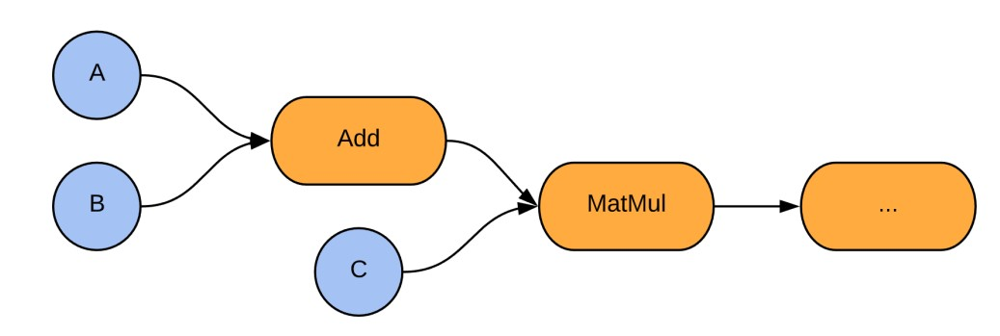
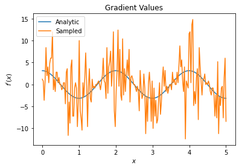
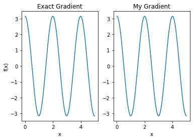
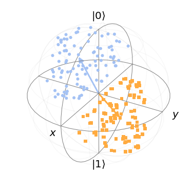

Hello today I will post some concepts about **Quantum TensorFlow** that is really interesting. I will consider only two examples from the original source of Tensorflow Quantum Machine.  I will take the original reference and summarize.

## **What is TensorFlow ?**


**TensorFlow** is a language for describing computations as stateful dataflow graphs 

 Describing machine learning models as dataflow graphs is advantageous for performance during training. First, it is easy to obtain gradients of dataflow graphs using backpropagation  allowing efficient parameter updates. Second, independent nodes of the computational graph may be distributed across independent machines, including GPUs and TPUs, and run in parallel. These computational advantages established TensorFlow as a powerful tool for machine learning and deep learning. TensorFlow constructs this dataflow graph using tensors for the directed edges and operations (ops) for the nodes. For our purposes, a rank n tensor is simply an ndimensional array. 

## **What is TensorFlow Quantum ?**


**TensorFlow Quantum (TFQ) i**s a [quantum machine learning](https://www.tensorflow.org/quantum/concepts) library for rapid prototyping of hybrid quantum-classical ML models. Research in quantum algorithms and applications can leverage Google’s quantum computing frameworks, all from within TensorFlow.

TensorFlow Quantum focuses on *quantum data* and building *hybrid quantum-classical models*. It integrates quantum computing algorithms and logic designed in [Cirq](https://github.com/quantumlib/Cirq), and provides quantum computing primitives compatible with existing TensorFlow APIs, along with high-performance quantum circuit simulators.

 TensorFlow Quantum (TFQ), an open source library for the rapid prototyping of hybrid quantum-classical models for classical or quantum data. This framework offers high-level abstractions for the design and training of both discriminative and generative quantum models under TensorFlow and supports high-performance quantum circuit simulatorsbb

Before perform some examples of **quantum computing ** first let us install Tensorflow Quantum


## Install TensorFlow Quantum


There are a few ways to set up your environment to use TensorFlow Quantum (TFQ):

- The easiest way to learn and use TFQ requires no installation—run the [TensorFlow Quantum tutorials](https://www.tensorflow.org/quantum/tutorials/hello_many_worlds) directly in your browser using [Google Colab](https://colab.research.google.com/github/tensorflow/quantum/blob/master/docs/tutorials/hello_many_worlds.ipynb).
- To use TensorFlow Quantum on a local machine, install the TFQ package using Python's pip package manager.
- Or build TensorFlow Quantum from source.

TensorFlow Quantum is supported on Python 3.6, 3.7, and 3.8 and depends directly on [Cirq](https://github.com/quantumlib/Cirq).


### Requirements

- pip 19.0 or later (requires `manylinux2010` support)
- [TensorFlow == 2.4.1](https://www.tensorflow.org/install/pip)

See the [TensorFlow install guide](https://www.tensorflow.org/install/pip) to set up your Python development environment and an (optional) virtual environment.

Upgrade `pip` and install TensorFlow

```
  pip3 install --upgrade pip
  pip3 install tensorflow==2.4.1
```

### Install the package

Install the latest stable release of TensorFlow Quantum:

```
  pip3 install -U tensorflow-quantum
```

**Success:** TensorFlow Quantum is now installed.

Install the latest nightly version of TensorFlow Quantum:

```
  pip3 install -U tfq-nightly
```

## Build from source

The following steps are tested for Ubuntu-like systems.

### 1. Set up a Python 3 development environment

First we need the Python 3.8 development tools.

```
  sudo apt update
  sudo apt-get install pkg-config zip g++ zlib1g-dev unzip python3.8
  sudo apt install python3.8 python3.8-dev python3.8-venv python3-pip
  python3.8 -m pip install --upgrade pip
```


### 2. Create a virtual environment

Go to your workspace directory and make a virtual environment for TFQ development.

```
  python3.8 -m venv quantum_env
  source quantum_env/bin/activate
```


### 3. Install Bazel

As noted in the TensorFlow [build from source](https://www.tensorflow.org/install/source#install_bazel) guide, the [Bazel](https://bazel.build/) build system will be required.

Our latest source builds use TensorFlow 2.4.1. To ensure compatibility we use `bazel` version 3.1.0. To remove any existing version of Bazel:

```
  sudo apt-get remove bazel
```

Download and install `bazel` version 3.1.0:

```
  wget https://github.com/bazelbuild/bazel/releases/download/3.1.0/bazel_3.1.0-linux-x86_64.deb

  sudo dpkg -i bazel_3.1.0-linux-x86_64.deb
```

To prevent automatic updating of `bazel` to an incompatible version, run the following:

```
  sudo apt-mark hold bazel
```

Finally, confirm installation of the correct `bazel` version:

```
  bazel --version
```

### 4. Build TensorFlow from source

Here we adapt instructions from the TensorFlow [build from source](https://www.tensorflow.org/install/source) guide, see the link for further details. TensorFlow Quantum is compatible with TensorFlow version 2.4.

Download the [TensorFlow source code](https://github.com/tensorflow/tensorflow):

```
  git clone https://github.com/tensorflow/tensorflow.git
  cd tensorflow
  git checkout v2.4.1
```

Be sure the virtual environment you created in step 2 is activated. Then, install the TensorFlow dependencies:

```
  pip install -U pip six numpy wheel setuptools mock 'future>=0.17.1'
  pip install -U keras_applications --no-deps
  pip install -U keras_preprocessing --no-deps
  pip install numpy==1.19.5
```

Configure the TensorFlow build. When asked for the Python interpreter and library locations, be sure to specify locations inside your virtual environment folder. The remaining options can be left at default values.

```
  ./configure
```

Build the TensorFlow package:

```
  bazel build -c opt --cxxopt="-O3" --cxxopt="-march=native" --cxxopt="-D_GLIBCXX_USE_CXX11_ABI=0" //tensorflow/tools/pip_package:build_pip_package
```

**Note:** It may take over an hour to build the package.

After the build is complete, install the package and leave the TensorFlow directory:

```
  ./bazel-bin/tensorflow/tools/pip_package/build_pip_package /tmp/tensorflow_pkg
  pip install /tmp/tensorflow_pkg/name_of_generated_wheel.whl
  cd ..
```

### 5. Download TensorFlow Quantum

We use the standard [fork and pull request workflow](https://guides.github.com/activities/forking/) for contributions. After forking from the [TensorFlow Quantum](https://github.com/tensorflow/quantum) GitHub page, download the source of your fork and install the requirements:

```
  git clone https://github.com/username/quantum.git
  cd quantum
  pip install -r requirements.txt
```

### 6. Build the TensorFlow Quantum pip package

Build the TensorFlow Quantum pip package and install:

```
  ./configure.sh
  bazel build -c opt --cxxopt="-O3" --cxxopt="-march=native" --cxxopt="-D_GLIBCXX_USE_CXX11_ABI=0" release:build_pip_package
  bazel-bin/release/build_pip_package /tmp/tfquantum/
  python3 -m pip install /tmp/tfquantum/name_of_generated_wheel.whl
```

To confirm that TensorFlow Quantum has successfully been installed, you can run the tests:

```
  ./scripts/test_all.sh
```


## TensorFlow in Quantum Computing


In TensorFlow, tensors are additionally associated with a data type, such as integer or string. Tensors are a convenient way of thinking about data; in machine learning, the first index is often reserved for iteration over the members of a dataset. Additional indices can indicate the application of several filters, e.g., in convolutional neural networks with several feature maps. In general, an op is a function mapping input tensors to output tensors. Ops may act on zero or more input tensors, always producing at least one tensor as output. For example, the addition op ingests two tensors and outputs one tensor representing the elementwise sum of the inputs, while a constant op ingests no tensors, taking the role of a root node in the dataflow graph. The combination of ops and tensors gives the backend of TensorFlow the structure of a directed acyclic graph. 

A visualization of the backend structure corresponding to a simple computation in TensorFlow is given in Fig. 1. Figure 1. A simple example of the TensorFlow computational model. Two tensor inputs A and B are added and then multiplied against a third tensor input C, before flowing on to further nodes in the graph. Blue nodes are tensor injections (ops), arrows are tensors flowing through the computational graph, and orange nodes are tensor transformations (ops). 




​																						**Figure 1**

Tensor injections are ops in the sense that they are functions which take in zero tensors and output one tensor. It is worth noting that this tensorial data format is not to be confused with Tensor Networks  which are a mathematical tool used in condensed matter physics and quantum information science to efficiently represent many-body quantum states and operations. Recently, libraries for building such Tensor Networks in TensorFlow have become available , we refer the reader to the corresponding blog post for better understanding of the difference between TensorFlow tensors and the tensor objects in Tensor Networks.


# Calculate gradients

We explores gradient calculation algorithms for the expectation values of quantum circuits.

Calculating the gradient of the expectation value of a certain observable in a quantum circuit is an involved process. Expectation values of observables do not have the luxury of having analytic gradient formulas that are always easy to write down—unlike traditional machine learning transformations such as matrix multiplication or vector addition that have analytic gradient formulas which are easy to write down. As a result, there are different quantum gradient calculation methods that come in handy for different scenarios. This tutorial compares and contrasts two different differentiation schemes.

## Setup


```python
!pip install -q tensorflow==2.4.1
```

Install TensorFlow Quantum:


```python
!pip install -q tensorflow-quantum
```


Now import TensorFlow and the module dependencies:


```python
import tensorflow as tf
import tensorflow_quantum as tfq

import cirq
import sympy
import numpy as np

# visualization tools
%matplotlib inline
import matplotlib.pyplot as plt
from cirq.contrib.svg import SVGCircuit
```

## 1. Preliminary

Let's make the notion of gradient calculation for quantum circuits a little more concrete. Suppose you have a `parameterized` circuit like this one:


```python
qubit = cirq.GridQubit(0, 0)
my_circuit = cirq.Circuit(cirq.Y(qubit)**sympy.Symbol('alpha'))
SVGCircuit(my_circuit)
```

Along with an observable:


```python
pauli_x = cirq.X(qubit)
pauli_x
```


    cirq.X(cirq.GridQubit(0, 0))

Looking at this operator you know that 

 $$⟨Y(\alpha)| X | Y(\alpha)⟩ = \sin(\pi \alpha)$$

```python
def my_expectation(op, alpha):
    """Compute ⟨Y(alpha)| `op` | Y(alpha)⟩"""
    params = {'alpha': alpha}
    sim = cirq.Simulator()
    final_state_vector = sim.simulate(my_circuit, params).final_state_vector
    return op.expectation_from_state_vector(final_state_vector, {qubit: 0}).real


my_alpha = 0.3
print("Expectation=", my_expectation(pauli_x, my_alpha))
print("Sin Formula=", np.sin(np.pi * my_alpha))
```

    Expectation= 0.80901700258255
    Sin Formula= 0.8090169943749475


 and if you define

 $$f_{1}(\alpha) = ⟨Y(\alpha)| X | Y(\alpha)⟩$$ 

then

 $$f_{1}^{'}(\alpha) = \pi \cos(\pi \alpha)$$. 

Let's check this:


```python
def my_grad(obs, alpha, eps=0.01):
    grad = 0
    f_x = my_expectation(obs, alpha)
    f_x_prime = my_expectation(obs, alpha + eps)
    return ((f_x_prime - f_x) / eps).real


print('Finite difference:', my_grad(pauli_x, my_alpha))
print('Cosine formula:   ', np.pi * np.cos(np.pi * my_alpha))
```

    Finite difference: 1.8063604831695557
    Cosine formula:    1.8465818304904567


## 2. The need for a differentiator

With larger circuits, you won't always be so lucky to have a formula that precisely calculates the gradients of a given quantum circuit. In the event that a simple formula isn't enough to calculate the gradient, the `tfq.differentiators.Differentiator` class allows you to define algorithms for computing the gradients of your circuits. For instance you can recreate the above example in TensorFlow Quantum (TFQ) with:


```python
expectation_calculation = tfq.layers.Expectation(
    differentiator=tfq.differentiators.ForwardDifference(grid_spacing=0.01))

expectation_calculation(my_circuit,
                        operators=pauli_x,
                        symbol_names=['alpha'],
                        symbol_values=[[my_alpha]])
```


    <tf.Tensor: shape=(1, 1), dtype=float32, numpy=array([[0.80901706]], dtype=float32)>


However, if you switch to estimating expectation based on sampling (what would happen on a true device) the values can change a little bit. This means you now have an imperfect estimate:


```python
sampled_expectation_calculation = tfq.layers.SampledExpectation(
    differentiator=tfq.differentiators.ForwardDifference(grid_spacing=0.01))

sampled_expectation_calculation(my_circuit,
                                operators=pauli_x,
                                repetitions=500,
                                symbol_names=['alpha'],
                                symbol_values=[[my_alpha]])
```


    <tf.Tensor: shape=(1, 1), dtype=float32, numpy=array([[0.836]], dtype=float32)>


This can quickly compound into a serious accuracy problem when it comes to gradients:


```python
# Make input_points = [batch_size, 1] array.
input_points = np.linspace(0, 5, 200)[:, np.newaxis].astype(np.float32)
exact_outputs = expectation_calculation(my_circuit,
                                        operators=pauli_x,
                                        symbol_names=['alpha'],
                                        symbol_values=input_points)
imperfect_outputs = sampled_expectation_calculation(my_circuit,
                                                    operators=pauli_x,
                                                    repetitions=500,
                                                    symbol_names=['alpha'],
                                                    symbol_values=input_points)
plt.title('Forward Pass Values')
plt.xlabel('$x$')
plt.ylabel('$f(x)$')
plt.plot(input_points, exact_outputs, label='Analytic')
plt.plot(input_points, imperfect_outputs, label='Sampled')
plt.legend()
```


    <matplotlib.legend.Legend at 0x7fdbdcfa5210>


    


```python
# Gradients are a much different story.
values_tensor = tf.convert_to_tensor(input_points)

with tf.GradientTape() as g:
    g.watch(values_tensor)
    exact_outputs = expectation_calculation(my_circuit,
                                            operators=pauli_x,
                                            symbol_names=['alpha'],
                                            symbol_values=values_tensor)
analytic_finite_diff_gradients = g.gradient(exact_outputs, values_tensor)

with tf.GradientTape() as g:
    g.watch(values_tensor)
    imperfect_outputs = sampled_expectation_calculation(
        my_circuit,
        operators=pauli_x,
        repetitions=500,
        symbol_names=['alpha'],
        symbol_values=values_tensor)
sampled_finite_diff_gradients = g.gradient(imperfect_outputs, values_tensor)

plt.title('Gradient Values')
plt.xlabel('$x$')
plt.ylabel('$f^{\'}(x)$')
plt.plot(input_points, analytic_finite_diff_gradients, label='Analytic')
plt.plot(input_points, sampled_finite_diff_gradients, label='Sampled')
plt.legend()
```


    <matplotlib.legend.Legend at 0x7fdb21fdded0>


​    

​    


Here you can see that although the finite difference formula is fast to compute the gradients themselves in the analytical case, when it came to the sampling based methods it was far too noisy. More careful techniques must be used to ensure a good gradient can be calculated. Next you will look at a much slower technique that wouldn't be as well suited for analytical expectation gradient calculations, but does perform much better in the real-world sample based case:


```python
# A smarter differentiation scheme.
gradient_safe_sampled_expectation = tfq.layers.SampledExpectation(
    differentiator=tfq.differentiators.ParameterShift())

with tf.GradientTape() as g:
    g.watch(values_tensor)
    imperfect_outputs = gradient_safe_sampled_expectation(
        my_circuit,
        operators=pauli_x,
        repetitions=500,
        symbol_names=['alpha'],
        symbol_values=values_tensor)

sampled_param_shift_gradients = g.gradient(imperfect_outputs, values_tensor)

plt.title('Gradient Values')
plt.xlabel('$x$')
plt.ylabel('$f^{\'}(x)$')
plt.plot(input_points, analytic_finite_diff_gradients, label='Analytic')
plt.plot(input_points, sampled_param_shift_gradients, label='Sampled')
plt.legend()
```


    <matplotlib.legend.Legend at 0x7fda600ef1d0>


​    

​    


From the above you can see that certain differentiators are best used for particular research scenarios. In general, the slower sample-based methods that are robust to device noise, etc., are great differentiators when testing or implementing algorithms in a more "real world" setting. Faster methods like finite difference are great for analytical calculations and you want higher throughput, but aren't yet concerned with the device viability of your algorithm.

## 3. Multiple observables

Let's introduce a second observable and see how TensorFlow Quantum supports multiple observables for a single circuit.


```python
pauli_z = cirq.Z(qubit)pauli_z
```


    cirq.Z(cirq.GridQubit(0, 0))

If this observable is used with the same circuit as before, then you have 

$$f_{2}(\alpha) = ⟨Y(\alpha)| Z | Y(\alpha)⟩ = \cos(\pi \alpha)$$ 

and 

$$f_{2}^{'}(\alpha) = -\pi \sin(\pi \alpha)$$.

 Perform a quick check:


```python
test_value = 0.

print('Finite difference:', my_grad(pauli_z, test_value))
print('Sin formula:      ', -np.pi * np.sin(np.pi * test_value))
```

    Finite difference: -0.04934072494506836
    Sin formula:       -0.0


It's a match (close enough).


Now if you define 

$$g(\alpha) = f_{1}(\alpha) + f_{2}(\alpha)$$

 then 

$$g'(\alpha) = f_{1}^{'}(\alpha) + f^{'}_{2}(\alpha)$$

. Defining more than one observable in TensorFlow Quantum to use along with a circuit is equivalent to adding on more terms to

 $$g$$.

This means that the gradient of a particular symbol in a circuit is equal to the sum of the gradients with regards to each observable for that symbol applied to that circuit. This is compatible with TensorFlow gradient taking and backpropagation (where you give the sum of the gradients over all observables as the gradient for a particular symbol).


```python
sum_of_outputs = tfq.layers.Expectation(
    differentiator=tfq.differentiators.ForwardDifference(grid_spacing=0.01))

sum_of_outputs(my_circuit,
               operators=[pauli_x, pauli_z],
               symbol_names=['alpha'],
               symbol_values=[[test_value]])
```


    <tf.Tensor: shape=(1, 2), dtype=float32, numpy=array([[1.9106855e-15, 1.0000000e+00]], dtype=float32)>


Here you see the first entry is the expectation w.r.t Pauli X, and the second is the expectation w.r.t Pauli Z. Now when you take the gradient:


```python
test_value_tensor = tf.convert_to_tensor([[test_value]])

with tf.GradientTape() as g:
    g.watch(test_value_tensor)
    outputs = sum_of_outputs(my_circuit,
                             operators=[pauli_x, pauli_z],
                             symbol_names=['alpha'],
                             symbol_values=test_value_tensor)

sum_of_gradients = g.gradient(outputs, test_value_tensor)

print(my_grad(pauli_x, test_value) + my_grad(pauli_z, test_value))
print(sum_of_gradients.numpy())
```

    3.0917350202798843[[3.0917213]]


Here you have verified that the sum of the gradients for each observable is indeed the gradient of $\alpha$. This behavior is supported by all TensorFlow Quantum differentiators and plays a crucial role in the compatibility with the rest of TensorFlow.

## 4. Advanced usage

All differentiators that exist inside of TensorFlow Quantum subclass `tfq.differentiators.Differentiator`. To implement a differentiator, a user must implement one of two interfaces.  The standard is to implement `get_gradient_circuits`, which tells the base class which circuits to measure to obtain an estimate of the gradient.  Alternatively, you can overload `differentiate_analytic` and `differentiate_sampled`; the class `tfq.differentiators.Adjoint` takes this route.

The following uses TensorFlow Quantum to implement the gradient of a circuit.  You will use a small example of parameter shifting.

Recall the circuit you defined above, 

$$|\alpha⟩ = Y^{\alpha}|0⟩$$

As before, you can define a function as the expectation value of this circuit against the X observable, 

$$f(\alpha) = ⟨\alpha|X|\alpha⟩$$

 Using [parameter shift rules](https://pennylane.ai/qml/glossary/parameter_shift.html), for this circuit, you can find that the derivative is


$$\frac{\partial}{\partial \alpha} f(\alpha) = \frac{\pi}{2} f\left(\alpha + \frac{1}{2}\right) -  \frac{ \pi}{2} f\left(\alpha - \frac{1}{2}\right)$$


The `get_gradient_circuits` function returns the components of this derivative.
The `get_gradient_circuits` function returns the components of this derivative.


```python
class MyDifferentiator(tfq.differentiators.Differentiator):
    """A Toy differentiator for <Y^alpha | X |Y^alpha>."""

    def __init__(self):
        pass

    def get_gradient_circuits(self, programs, symbol_names, symbol_values):
        """Return circuits to compute gradients for given forward pass circuits.
        
        Every gradient on a quantum computer can be computed via measurements
        of transformed quantum circuits.  Here, you implement a custom gradient
        for a specific circuit.  For a real differentiator, you will need to
        implement this function in a more general way.  See the differentiator
        implementations in the TFQ library for examples.
        """

        # The two terms in the derivative are the same circuit...
        batch_programs = tf.stack([programs, programs], axis=1)

        # ... with shifted parameter values.
        shift = tf.constant(1/2)
        forward = symbol_values + shift
        backward = symbol_values - shift
        batch_symbol_values = tf.stack([forward, backward], axis=1)
  
        # Weights are the coefficients of the terms in the derivative.
        num_program_copies = tf.shape(batch_programs)[0]
        batch_weights = tf.tile(tf.constant([[[np.pi/2, -np.pi/2]]]),
                                [num_program_copies, 1, 1])

        # The index map simply says which weights go with which circuits.
        batch_mapper = tf.tile(
            tf.constant([[[0, 1]]]), [num_program_copies, 1, 1])

        return (batch_programs, symbol_names, batch_symbol_values,
                batch_weights, batch_mapper)
```

The `Differentiator` base class uses the components returned from `get_gradient_circuits` to calculate the derivative, as in the parameter shift formula you saw above.  This new differentiator can now be used with existing `tfq.layer` objects:


```python
custom_dif = MyDifferentiator()
custom_grad_expectation = tfq.layers.Expectation(differentiator=custom_dif)

# Now let's get the gradients with finite diff.
with tf.GradientTape() as g:
    g.watch(values_tensor)
    exact_outputs = expectation_calculation(my_circuit,
                                            operators=[pauli_x],
                                            symbol_names=['alpha'],
                                            symbol_values=values_tensor)

analytic_finite_diff_gradients = g.gradient(exact_outputs, values_tensor)

# Now let's get the gradients with custom diff.
with tf.GradientTape() as g:
    g.watch(values_tensor)
    my_outputs = custom_grad_expectation(my_circuit,
                                         operators=[pauli_x],
                                         symbol_names=['alpha'],
                                         symbol_values=values_tensor)

my_gradients = g.gradient(my_outputs, values_tensor)

plt.subplot(1, 2, 1)
plt.title('Exact Gradient')
plt.plot(input_points, analytic_finite_diff_gradients.numpy())
plt.xlabel('x')
plt.ylabel('f(x)')
plt.subplot(1, 2, 2)
plt.title('My Gradient')
plt.plot(input_points, my_gradients.numpy())
plt.xlabel('x')
```


    Text(0.5, 0, 'x')


​    

​    


This new differentiator can now be used to generate differentiable ops.

Key Point: A differentiator that has been previously attached to an op must be refreshed before attaching to a new op, because a differentiator may only be attached to one op at a time.


```python
# Create a noisy sample based expectation op.
expectation_sampled = tfq.get_sampled_expectation_op(
    cirq.DensityMatrixSimulator(noise=cirq.depolarize(0.01)))

# Make it differentiable with your differentiator:
# Remember to refresh the differentiator before attaching the new op
custom_dif.refresh()
differentiable_op = custom_dif.generate_differentiable_op(
    sampled_op=expectation_sampled)

# Prep op inputs.
circuit_tensor = tfq.convert_to_tensor([my_circuit])
op_tensor = tfq.convert_to_tensor([[pauli_x]])
single_value = tf.convert_to_tensor([[my_alpha]])
num_samples_tensor = tf.convert_to_tensor([[5000]])

with tf.GradientTape() as g:
    g.watch(single_value)
    forward_output = differentiable_op(circuit_tensor, ['alpha'], single_value,
                                       op_tensor, num_samples_tensor)

my_gradients = g.gradient(forward_output, single_value)

print('---TFQ---')
print('Foward:  ', forward_output.numpy())
print('Gradient:', my_gradients.numpy())
print('---Original---')
print('Forward: ', my_expectation(pauli_x, my_alpha))
print('Gradient:', my_grad(pauli_x, my_alpha))
```

    ---TFQ---Foward:   [[0.7836]]Gradient: [[1.8045309]]---Original---Forward:  0.80901700258255Gradient: 1.8063604831695557


Success: Now you can use all the differentiators that TensorFlow Quantum has to offer  and define your own.


<table class="tfo-notebook-buttons" align="left">
  <td>
    <a target="_blank" href="https://www.tensorflow.org/quantum/tutorials/gradients">View on TensorFlow.org</a>
  </td>
  <td>
    <a target="_blank" href="https://colab.research.google.com/github/tensorflow/quantum/blob/master/docs/tutorials/gradients.ipynb">Run in Google Colab</a>
  </td>
  <td>
    <a target="_blank" href="https://github.com/tensorflow/quantum/blob/master/docs/tutorials/gradients.ipynb">View source on GitHub</a>
  </td>
  <td>
    <a href="https://storage.googleapis.com/tensorflow_docs/quantum/docs/tutorials/gradients.ipynb">Download notebook</a>
  </td>
</table>


# Binary classification of quantum states

An elementary learning task is [binary classification](https://en.wikipedia.org/wiki/Binary_classification), a supervised task in which the learner is to distinguish which of two classes a given datapoint has been drawn from.  Here, using ideas from the paper [Universal discriminative quantum neural networks](https://arxiv.org/abs/1805.08654) in the one-qubit setting, we train a hybrid quantum-classical neural network to distinguish between quantum data sources.

## Import dependencies


```
!pip install --upgrade tensorflow==2.4.1
!pip install qutip
```


```
!pip install tensorflow-quantum
```


```
import cirq
import numpy as np
import qutip
import random
import sympy
import tensorflow as tf
import tensorflow_quantum as tfq

# visualization tools
%matplotlib inline
import matplotlib.pyplot as plt
from cirq.contrib.svg import SVGCircuit
```

## Quantum dataset

For our quantum dataset, you will generate two blobs on the surface of the Bloch sphere.  The task will be to learn a model to distinguish members of these blobs.  To do this, you first select two axes in the X-Z plane of the block sphere, then select random points uniformly distributed around them:


```python
def generate_dataset(qubit, theta_a, theta_b, num_samples):
  """Generate a dataset of points on `qubit` near the two given angles; labels
  for the two clusters use a one-hot encoding.
  """
  q_data = []
  bloch = {"a": [[], [], []], "b": [[], [], []]}
  labels = []
  blob_size = abs(theta_a - theta_b) / 5
  for _ in range(num_samples):
    coin = random.random()
    spread_x = np.random.uniform(-blob_size, blob_size)
    spread_y = np.random.uniform(-blob_size, blob_size)
    if coin < 0.5:
      label = [1, 0]
      angle = theta_a + spread_y
      source = "a"
    else:
      label = [0, 1]
      angle = theta_b + spread_y
      source = "b"
    labels.append(label)
    q_data.append(cirq.Circuit(cirq.ry(-angle)(qubit), cirq.rx(-spread_x)(qubit)))
    bloch[source][0].append(np.cos(angle))
    bloch[source][1].append(np.sin(angle)*np.sin(spread_x))
    bloch[source][2].append(np.sin(angle)*np.cos(spread_x))
  return tfq.convert_to_tensor(q_data), np.array(labels), bloch
```

Generate the dataset:


```
qubit = cirq.GridQubit(0, 0)
theta_a = 1
theta_b = 4
num_samples = 200
q_data, labels, bloch_p = generate_dataset(qubit, theta_a, theta_b, num_samples)
```

View the data set on the Bloch sphere:


```python
bloch = qutip.Bloch()
bloch.sphere_alpha = 0.0
bloch.frame_alpha = 0.05
bloch.vector_color[0] = bloch.point_color[0] = "#a4c2f4ff"
bloch.vector_color[1] = bloch.point_color[1] = "#ffab40ff"
bloch.add_points(bloch_p["a"])
bloch.add_points(bloch_p["b"])
vec = [[np.cos(theta_a),0,np.sin(theta_a)]]
bloch.add_vectors(vec)
vec = [[np.cos(theta_b),0,np.sin(theta_b)]]
bloch.add_vectors(vec)
bloch.show()
```



​    


## Model

We will use a parameterized rotation about the Y axis followed by a Z-axis measurement as the quantum portion of our model.  For the classical portion, we will use a two-unit SoftMax which should learn to distinguish the measurement statistics of the two datasources.  Finally, we compile the model with [standard optimizer settings](https://www.tensorflow.org/tutorials/keras/classification) for classification.  Note that the classical NN outputs represent the network's predicted probability that the given datapoint is a member of each category.


```
# Build the quantum model layer
theta = sympy.Symbol('theta')
q_model = cirq.Circuit(cirq.ry(theta)(qubit))
q_data_input = tf.keras.Input(
    shape=(), dtype=tf.dtypes.string)
expectation = tfq.layers.PQC(q_model, cirq.Z(qubit))
expectation_output = expectation(q_data_input)

# Attach the classical SoftMax classifier
classifier = tf.keras.layers.Dense(2, activation=tf.keras.activations.softmax)
classifier_output = classifier(expectation_output)
model = tf.keras.Model(inputs=q_data_input, outputs=classifier_output)

# Standard compilation for classification
model.compile(optimizer=tf.keras.optimizers.Adam(learning_rate=0.1),
              loss=tf.keras.losses.CategoricalCrossentropy())
tf.keras.utils.plot_model(model, show_shapes=True, dpi=70)
```

## Training

The model is trained on our quantum data and label inputs:


```
history = model.fit(x=q_data, y=labels, epochs=50, verbose=0)
```

We can view the loss history to see that the model has been correctly trained:


```
plt.plot(history.history['loss'])
plt.title("Learning to classify quantum data")
plt.xlabel("Iterations")
plt.ylabel("Error in classification")
plt.show()
print("Final loss value:")
print(history.history["loss"][-1])
```

Now we test how well our model performs on a sample.  Notice that the network has high probability for predicting the correct state, even though the variation in the data was significant.

[](https://colab.research.google.com/github/tensorflow/quantum/blob/research/binary_classifier/binary_classifier.ipynb)

**Congratulations:**  We have run some TensorFlow Quantum examples

