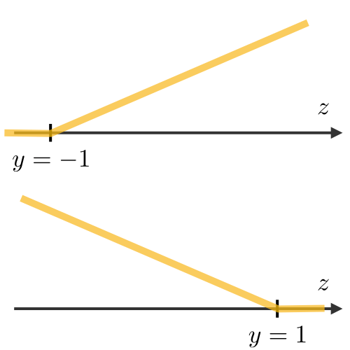
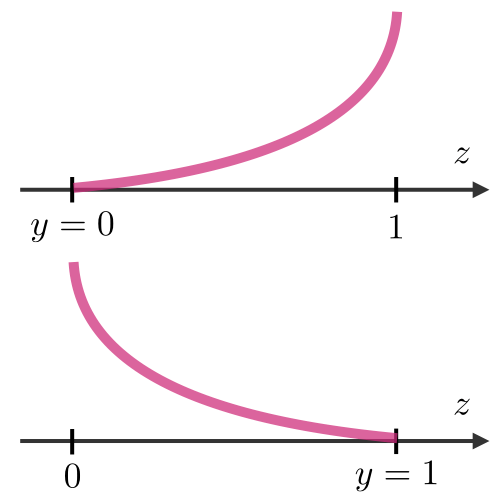
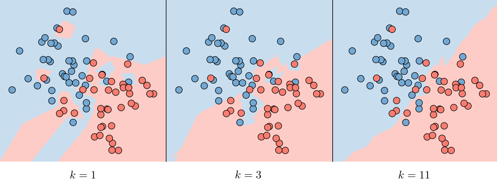
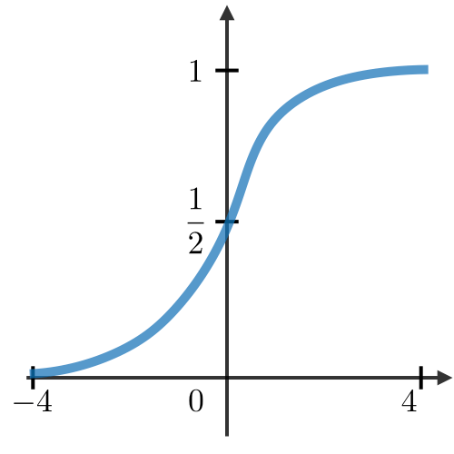
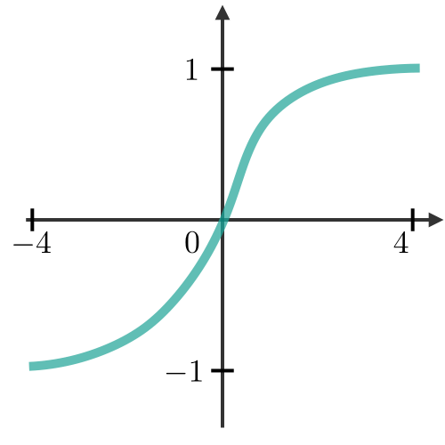
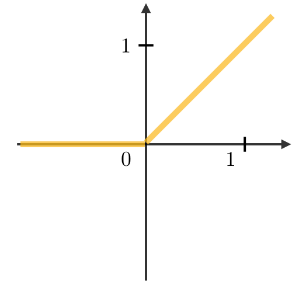
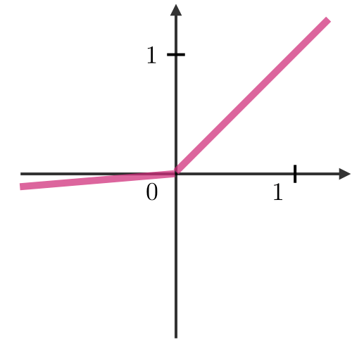

Hello I have wrote some questions about important concepts that every **Data Scientist** working in **Deep Learning** should know.

### What type of predictive model correspond to the continuous regression outcome?
The linear regression is the regression needed.
### What type of predictive model correspond to the class outcome?
Logistic regression, SVM, Naive Bayes
### What types of Discriminative models correspond to the the table below:

|                    | **Discriminative model**                                     |
| :----------------- | ------------------------------------------------------------ |
| **Goal**           | Directly estimate P(y\|x)                                    |
| **What's learned** | Decision boundary                                            |
| **Illustration**   | The Discriminative models  needed are : Regressions, SVMs |

### What type of Generative model correspond to the the table below:

|                    | **Generative model**                                         |
| ------------------ | ------------------------------------------------------------ |
| **Goal**           | Estimate $$P(x\|y)$$ to then deduce $$P(y\|x)$$              |
| **What's learned** | Probability distributions of the data                        |
| **Illustration**   |   The Generative model are : GDA, Naive Bayes |

### What is Loss function?
A loss function is a function 
$$L:(z,y)\in\mathbb{R}\times Y\longmapsto L(z,y)\in\mathbb{R} $$
that takes as inputs the predicted value z corresponding to the real data value y and outputs how different they are. 
### What are the most common  loss functions ?
The common loss functions are summed up in the table below:

| **Least squared error**                                      | **Logistic loss**                                            | **Hinge loss**                                               | **Cross-entropy**                                            |
| ------------------------------------------------------------ | ------------------------------------------------------------ | ------------------------------------------------------------ | ------------------------------------------------------------ |
| $$\displaystyle\frac{1}{2}(y-z)^2$$                          | $$\displaystyle\log(1+\exp(-yz))$$                           | $$\displaystyle\max(0,1-yz)$$                                | $$\displaystyle-\Big[y\log(z)+(1-y)\log(1-z)]$$              |
|  |  |  |  |
| Linear regression                                            | Logistic regression                                          | SVM                                                          | Neural Network                                               |

### What is a Cost function?

The cost function is commonly used to assess the performance of a model, and is defined with the loss function as follows:

$$J(\theta)=\sum_{i=1}^mL(h_\theta(x^{(i)}), y^{(i)})$$

where  $$h_\theta$$  is  the hypothesis and is the model that we choose. For a given input data $$x^{(i)}$$
 the model prediction output is $$h_\theta(x^{(i)})$$

### What is Gradient Descent?

Gradient descent By noting $$\alpha\in\mathbb{R}$$ the learning rate, the update rule for gradient descent 
is expressed with the learning rate and the cost function $J$ as follows:

$$\theta\longleftarrow \theta - \alpha \nabla  J(\theta)$$

  

### What is Stochastic gradient?

Stochastic gradient descent (SGD) is updating the parameter based on each training example, 
and batch gradient descent is on a batch of training examples.

###  What is The likelihood of a model?

The likelihood of a model $$L(\theta)$$ given parameters $$\theta$$ is used to find the optimal parameters
 $$\theta$$ through likelihood maximization. We have:

$$\theta^{\textrm{opt}}=\underset{\theta}{\textrm{arg max }}L(\theta)$$

Remark: in practice, we use the log-likelihood $$\ell(\theta)=\log(L(\theta))$$ which is easier to optimize.

###  What is Newton's algorithm Newton's algorithm ?

Newton's algorithm Newton's algorithm is a numerical method that finds $$\theta$$ such that $$\ell'(\theta)=0$$. 
Its update rule is as follows:

$$\theta\leftarrow\theta-\frac{\ell'(\theta)}{\ell''(\theta)}$$

Remark: the multidimensional generalization, also known as the Newton-Raphson method, has the following update rule:

$$\theta\leftarrow\theta-\left(\nabla_\theta^2\ell(\theta)\right)^{-1}\nabla_\theta\ell(\theta)$$

### What is the  Least Mean Squares (LMS) algorithm ?

LMS algorithm By noting $\alpha$ the learning rate, the update rule of the Least Mean Squares (LMS) algorithm
 for a training set of $m$ data points, which is also known as the Widrow-Hoff learning rule, is as follows:

$$\displaystyle \forall j \quad \theta_j \leftarrow \theta_j+\alpha\sum_{i=1}^m[y^{(i)}-h_\theta(x^{(i)})]x_j^{(i)}$$

### What is Sigmoid function in classification ?

Sigmoid function The sigmoid function $g$, also known as the logistic function, is defined as follows:

$$\forall z\in\mathbb{R},\quad g(z)=\frac{1}{1+e^{-z}} \in [0,1]$$

### What is Logistic regresion?

We assume here that x   $\theta\sim\textrm{Bernoulli}(\phi)$$.

 We have the following form:

$$\phi=p(y=1|x;\theta)=\frac{1}{1+\exp(-\theta^Tx)}=g(\theta^Tx)$$

Remark: logistic regressions do not have closed form solutions.

### What is Softmax regression?

A softmax regression, also called a multiclass logistic regression, is used to generalize logistic regression 
when there are more than 2 outcome classes. By convention, we set $$\theta_K=0$$, which makes the Bernoulli 
parameter $$\phi_i$$ of each class $$i$$ be such that:

$$\displaystyle\phi_i=\frac{\exp(\theta_i^Tx)}{\displaystyle\sum_{j=1}^K\exp(\theta_j^Tx)}$$

Remark: the update rule is a particular case of the gradient ascent.

### What is Support Vector Machines?

The goal of support vector machines is to find the line that maximizes the minimum distance to the line.

**Optimal margin classifier**The optimal margin classifier h is such that:

$$\boxed{h(x)=\textrm{sign}(w^Tx-b)}$$

where $$(w, b)\in\mathbb{R}^n\times\mathbb{R}$$ is the solution of the following optimization problem:

$$\boxed{\min\frac{1}{2}||w||^2}\quad\quad\textrm{such that }\quad \boxed{y^{(i)}(w^Tx^{(i)}-b)\geqslant1}$$

*Remark: the decision boundary is defined as $$\boxed{w^Tx-b=0}$$

### What is Hinge loss?

The hinge loss is used in the setting of SVMs and is defined as follows:

$$\boxed{L(z,y)=[1-yz]_+=\max(0,1-yz)}$$

What is Kernel  in  Support Vector?

Given a feature mapping $$\phi$$, we define the kernel K as follows:

$$\boxed{K(x,z)=\phi(x)^T\phi(z)}$$

In practice, the kernel K defined by 

$$K(x,z)=\exp\left(-\frac{||x-z||^2}{2\sigma^2}\right$$

is called the Gaussian kernel and is commonly used.

*Remark: we say that we use the "kernel trick" to compute the cost function using 
the kernel because we actually don't need to know the explicit mapping $$\phi$$, 
which is often very complicated. Instead, only the values $$K(x,z)$$ are needed.*

### What is **Lagrangian**?

We define the Lagrangian $$\mathcal{L}(w,b)$$ as follows:

$$\boxed{\mathcal{L}(w,b)=f(w)+\sum_{i=1}^l\beta_ih_i(w)}$$

*Remark: the coefficients $$\beta_i$$ are called the Lagrange multipliers.*

## What is Generative Learning

A generative model first tries to learn how the data is generated by estimating $$P(x|y)$$,
 which we can then use to estimate $$P(y|x))$$ by using Bayes' rule.

### What is Gaussian Discriminant Analysis?

The following table sums up the estimates that we find when maximizing the likelihood:

| $$\widehat{\phi}$$                                        | $$\widehat{\mu_j}\quad{\small(j=0,1)}$$                      | $$\widehat{\Sigma}$$                                         |
| --------------------------------------------------------- | ------------------------------------------------------------ | ------------------------------------------------------------ |
| $$\displaystyle\frac{1}{m}\sum_{i=1}^m1_{\{y^{(i)}=1\}}$$ | $$\displaystyle\frac{\sum_{i=1}^m1_{\{y^{(i)}=j\}}x^{(i)}}{\sum_{i=1}^m1_{\{y^{(i)}=j\}}}$$ | $$\displaystyle\frac{1}{m}\sum_{i=1}^m(x^{(i)}-\mu_{y^{(i)}})(x^{(i)}-\mu_{y^{(i)}})^T*m*1*i*=1$$ |

### What is Naive Bayes?

The Naive Bayes model supposes that the features of each data point are all independent:

$$\boxed{P(x|y)=P(x_1,x_2,...|y)=P(x_1|y)P(x_2|y)...=\prod_{i=1}^nP(x_i|y)}$$

*Remark: Naive Bayes is widely used for text classification and spam detection.*

### What is decision trees?

Classification and Regression Trees (CART), commonly known as decision trees, 
can be represented as binary trees. They have the advantage to be very interpretable.

### What is **Random forest**?

It is a tree-based technique that uses a high number of decision trees built out of randomly 
selected sets of features. Contrary to the simple decision tree, it is highly uninterpretable
 but its generally good performance makes it a popular algorithm.

*Remark: random forests are a type of ensemble methods.*

### What are the boosting methods ?

The idea of boosting methods is to combine several weak learners to form a stronger one. The main ones are summed up in the table below:

| **Adaptive boosting**                                        | **Gradient boosting**                                        |
| ------------------------------------------------------------ | ------------------------------------------------------------ |
| • High weights are put on errors to improve at the next boosting step.  Known as Adaboost | • Weak learners are trained on residuals. Examples include XGBoost |

### What is the k-nearest neighbors**?

The k-nearest neighbors algorithm, commonly known as k-NN, is a non-parametric approach where
 the response of a data point is determined by the nature of its k neighbors from the training set.
 It can be used in both classification and regression settings.
*Remark: the higher the parameter k the higher the bias, and the lower the parameter k, the higher the variance.*

### What is the goal of Unsupervised Learning?

The goal of unsupervised learning is to find hidden patterns in unlabeled data $$\{x^{(1)},...,x^{(m)}\}$$

### What is  Latent variables in Clustering?

Latent variables are hidden/unobserved variables that make estimation problems difficult, and are often denoted z. 
Here are the most common settings where there are latent variables:

| **Setting**            | **Latent variable z            | $$x\|z$$                             | **Comments**             |
| ---------------------- | ------------------------------ | ------------------------------------ | ------------------------ |
| Mixture of k Gaussians | $$\textrm{Multinomial}(\phi)$$ | $$ \mathcal{N}(\mu_j,\Sigma_j))$$    | $$\mu_j\in\mathbb{R}^n$$ |
| Factor analysis        | $$\mathcal{N}(0,I)$$           | $$ \mathcal{N}(\mu+\Lambda z,\psi)$$ |                          |

The Expectation-Maximization (EM) algorithm gives an efficient method at estimating the parameter $$\theta$$ through
 maximum likelihood estimation by repeatedly constructing a lower-bound on the likelihood (E-step) and optimizing that lower bound (M-step) 

### What is k-means clustering?
We note $$c^{(i)}$$ the cluster of data point i and $$\mu_j$$ the center of cluster j
After randomly initializing the cluster centroids $$\mu_1,\mu_2,...,\mu_k\in\mathbb{R}$$
the k-means algorithm repeats the following step until convergence:

**What is Distortion function?**
In order to see if the algorithm converges, we look at the distortion function defined as follows:

$$J(c,\mu)=\sum_{i=1}^m\| x^{(i)}-\mu_{c^{(i)}} \|^2$$

### What is Hierarchical clustering?

It is a clustering algorithm with an agglomerative hierarchical approach that build nested clusters in a successive manner.
There are different sorts of hierarchical clustering algorithms that aims at optimizing different objective functions, 
which is summed up in the table below:

|         **Ward linkage**         |               **Average linkage**               |                **Complete linkage**                |
| :------------------------------: | :---------------------------------------------: | :------------------------------------------------: |
| Minimize within cluster distance | Minimize average distance between cluster pairs | Minimize maximum distance of between cluster pairs |

In an unsupervised learning setting, it is often hard to assess the performance of a model since we don't have 
the ground truth labels as was the case in the supervised learning setting.

### What is Silhouette coefficient?

By noting a and b the mean distance between a sample and all other points in the same class, and between a sample
 and all other points in the next nearest cluster, the silhouette coefficient s for a single sample is defined as follows:
$$s=\frac{b-a}{\max(a,b)}$$

### What is Principal component analysis?
It is a dimension reduction technique that finds the variance maximizing directions onto which to project the data.
### What is **Eigenvalue, eigenvector**?
Given a matrix $$A\in\mathbb{R}^{n\times n}$$, $$\lambda$$ is said to be an eigenvalue of A
 if there exists a vector $$z\in\mathbb{R}^n\backslash\{0\}$$, called eigenvector, such that we have:
$$\boxed{Az=\lambda z}$$

### What is the The Principal Component Analysis (PCA) algorithm?

The Principal Component Analysis (PCA) procedure is a dimension reduction technique that projects the data on k*k* dimensions by maximizing the variance of the data as follows:

This procedure maximizes the variance among all k*k*-dimensional spaces.

###  What is the difference between Machine Learning and Deep Learning?

**Machine Learning** forms a subset of Artificial Intelligence, where we use statistics and algorithms to train machines with data, thereby helping them improve with experience.

Deep Learning is a part of Machine Learning, which involves mimicking the human brain in terms of structures called neurons, thereby forming neural networks.

###  What is a perceptron?

A perceptron is similar to the actual neuron in the human brain. It receives inputs from various entities and applies functions to these inputs, which transform them to be the output.

A perceptron is mainly used to perform binary classification where it sees an input, computes functions based on the weights of the input, and outputs the required transformation.

### **How is Deep Learning better than Machine Learning?**

Machine Learning is powerful in a way that it is sufficient to solve most of the problems. However,[**Deep Learning** gets an upper hand when it comes to working with data that has a large number of dimensions. With data that is large in size, a Deep Learning model can easily work with it as it is built to handle this.

### **What are some of the most used applications of Deep Learning?**

Deep Learning is used in a variety of fields today. The most used ones are as follows:

- Sentiment Analysis
- Computer Vision
- Automatic Text Generation
- Object Detection
- Natural Language Processing
- Image Recognition

### What is the meaning of overfitting?

Overfitting is a very common issue when working with Deep Learning. It is a scenario where the Deep Learning algorithm vigorously hunts through the data to obtain some valid information. This makes the Deep Learning model pick up noise rather than useful data, causing very high variance and low bias. This makes the model less accurate, and this is an undesirable effect that can be prevented.

### **What are activation functions?**

Activation functions are entities in Deep Learning that are used to translate inputs into a usable output parameter. It is a function that decides if a neuron needs activation or not by calculating the weighted sum on it with the bias.

Using an activation function makes the model output to be non-linear. There are many types of activation functions:

- ReLU
- Softmax
- Sigmoid
- Linear
- Tanh

### Why is Fourier transform used in Deep Learning?

Fourier transform is an effective package used for analyzing and managing large amounts of data present in a database. It can take in real-time array data and process it quickly. This ensures that high efficiency is maintained and also makes the model more open to processing a variety of signals.

### **What are the steps involved in training a perception in Deep Learning?**

There are five main steps that determine the learning of a perceptron:

1. Initialize thresholds and weights
2. Provide inputs
3. Calculate outputs
4. Update weights in each step
5. Repeat steps 2 to 4

###  What is the use of the loss function?

The loss function is used as a measure of accuracy to see if a neural network has learned accurately from the training data or not. This is done by comparing the training dataset to the testing dataset. The loss function is a primary measure of the performance of the neural network. In Deep Learning, a good performing network will have a low loss function at all times when training.

### What are some of the Deep Learning frameworks or tools that you have used?

This question is quite common in a Deep Learning interview. Make sure to answer based on the experience you have with the tools.

However, some of the top Deep Learning frameworks out there today are:

- TensorFlow
- Keras
- PyTorch
- Caffe2
- CNTK
- MXNet
- Theano

### **What is the use of the swish function?**

The swish function is a self-gated activation function developed by Google. It is now a popular activation function used by many as Google claims that it outperforms all of the other activation functions in terms of computational efficiency.

### What are autoencoders?

Autoencoders are artificial neural networks that learn without any supervision. Here, these networks have the ability to automatically learn by mapping the inputs to the corresponding outputs.

Autoencoders, as the name suggests, consist of two entities:

- Encoder: Used to fit the input into an internal computation state
- Decoder: Used to convert the computational state back into the output

### **What are the steps to be followed to use the gradient descent algorithm?**

There are five main steps that are used to initialize and use the gradient descent algorithm:

- Initialize biases and weights for the network
- Send input data through the network (the input layer)
- Calculate the difference (the error) between expected and predicted values
- Change values in neurons to minimize the loss function
- Multiple iterations to determine the best weights for efficient working

###  Differentiate between a single-layer perceptron and a multi-layer perceptron.

| **Single-layer Perceptron**             | **Multi-layer Perceptron**           |
| --------------------------------------- | ------------------------------------ |
| Cannot classify non-linear data points  | Can classify non-linear data         |
| Takes in a limited amount of parameters | Withstands a lot of parameters       |
| Less efficient with large data          | Highly efficient with large datasets |

### **What is data normalization in Deep Learning?**

Data normalization is a preprocessing step that is used to refit the data into a specific range. This ensures that the network can learn effectively as it has better convergence when performing backpropagation.

###  What is forward propagation?

Forward propagation is the scenario where inputs are passed to the hidden layer with weights. In every single hidden layer, the output of the activation function is calculated until the next layer can be processed. It is called forward propagation as the process begins from the input layer and moves toward the final output layer.

### **What is backpropagation?**

Backprobation is used to minimize the cost function by first seeing how the value changes when weights and biases are tweaked in the neural network. This change is easily calculated by understanding the gradient at every hidden layer. It is called backpropagation as the process begins from the output layer, moving backward to the input layers.

### What are hyperparameters in Deep Learning?

Hyperparameters are variables used to determine the structure of a neural network. They are also used to understand parameters, such as the learning rate and the number of hidden layers and more, present in the neural network.

### How can hyperparameters be trained in neural networks?

Hyperparameters can be trained using four components as shown below:

- Batch size: This is used to denote the size of the input chunk. Batch sizes can be varied and cut into sub-batches based on the requirement.
- Epochs: An epoch denotes the number of times the training data is visible to the neural network so that it can train. Since the process is iterative, the number of epochs will vary based on the data.
- Momentum: Momentum is used to understand the next consecutive steps that occur with the current data being executed at hand. It is used to avoid oscillations when training.
- Learning rate: Learning rate is used as a parameter to denote the time required for the network to update the parameters and learn.

Next up on this top Deep Learning interview questions and answers blog, let us take a look at the intermediate questions.

### **What is the meaning of dropout in Deep Learning?**

Dropout is a technique that is used to avoid overfitting a model in Deep Learning. If the dropout value is too low, then it will have minimal effect on learning. If it is too high, then the model can under-learn, thereby causing lower efficiency.

### **What are tensors?**

Tensors are multidimensional arrays in Deep Learning that are used to represent data. They represent the data with higher dimensions. Due to the high-level nature of the programming languages, the syntax of tensors are easily understood and broadly used.

### What is the meaning of model capacity in Deep Learning?

In Deep Learning, model capacity refers to the capacity of the model to take in a variety of mapping functions. Higher model capacity means a large amount of information can be stored in the network.

We will check out neural network interview questions alongside as it is also a vital part of Deep Learning.

### **What is a Boltzmann machine?**

A Boltzmann machine is a type of recurrent neural network that uses binary decisions, alongside biases, to function. These neural networks can be hooked up together to create deep belief networks, which are very sophisticated and used to solve the most complex problems out there.

###  What are some of the advantages of using TensorFlow?

TensorFlow has numerous advantages, and some of them are as follows:

- High amount of flexibility and platform independence
- Trains using CPU and GPU
- Supports auto differentiation and its features
- Handles threads and asynchronous computation easily
- Open-source
- Has a large community

### **What is a computational graph in Deep Learning?**

A computation graph is a series of operations that are performed to take in inputs and arrange them as nodes in a graph structure. It can be considered as a way of implementing mathematical calculations into a graph. This helps in parallel processing and provides high performance in terms of computational capability.

### **What is a CNN?**

CNNs are convolutional neural networks that are used to perform analysis on images and visuals. These classes of neural networks can input a multi-channel image and work on it easily.

These Deep Learning questions must be answered in a concise way. So make sure to understand them and revisit them if necessary.

### **What are the various layers present in a CNN?**

There are four main layers that form a convolutional neural network:

- Convolution: These are layers consisting of entities called filters that are used as parameters to train the network.
- ReLu: It is used as the activation function and used always with the convolution layer.
- Pooling: Pooling is the concept of shrinking the complex data entities that form after convolution and is primarily used to maintain the size of an image after shrinkage.
- Connectedness: This is used to ensure that all of the layers in the neural network are fully connected and activation can be computed using the bias easily.

### **What is an RNN in Deep Learning?**

RNNs stand for recurrent neural networks, which form to be a popular type of artificial neural network. They are used to process sequences of data, text, genomes, handwriting, and more. RNNs make use of backpropagation for the training requirements.

### **What is a vanishing gradient when using RNNs?**

Vanishing gradient is a scenario that occurs when we use RNNs. Since RNNs make use of backpropagation, gradients at every step of the way will tend to get smaller as the network traverses through backward iterations. This equates to the model learning very slowly, thereby causing efficiency problems in the network.

### What is exploding gradient descent in Deep Learning?

Exploding gradients are an issue causing a scenario that clumps up the gradients. This creates a large number of updates of the weights in the model when training.

The working of gradient descent is based on the condition that the updates are small and controlled. Controlling the updates will directly affect the efficiency of the model.

### **What is the use of LSTM?**

LSTM stands for long short-term memory. It is a type of RNN that is used to sequence a string of data. It consists of feedback chains that give it the ability to perform like a general-purpose computational entity.

### **Where are autoencoders used?**

Autoencoders have a wide variety of usage in the real world. The following are some of the popular ones:

- Adding color to black–white images
- Removing noise from images
- Dimensionality reduction
- Feature removal and variation

### What are the types of autoencoders?

There are four main types of autoencoders:

- Deep autoencoders
- Convolutional autoencoders
- Sparse autoencoders
- Contractive autoencoders

### **What is a Restricted Boltzmann Machine?**

A Restricted Boltzmann Machine, or RBM for short, is an undirected graphical model that is popularly used in Deep Learning today. It is an algorithm that is used to perform:

- Dimensionality reduction
- Regression
- Classification
- Collaborative filtering
- Topic modeling

Next up on this top Deep Learning interview questions and answers blog, let us take a look at the advanced questions.

###  What are some of the limitations of Deep Learning?

There are a few disadvantages of Deep Learning as mentioned below:

- Networks in Deep Learning require a huge amount of data to train well.
- Deep Learning concepts can be complex to implement sometimes.
- Achieving a high amount of model efficiency is difficult in many cases.

These are some of the vital advanced deep learning interview questions that you have to know about!

### What are the variants of gradient descent?

There are three variants of gradient descent as shown below:

- Stochastic gradient descent: A single training example is used for the calculation of gradient and for updating parameters.
- Batch gradient descent: Gradient is calculated for the entire dataset, and parameters are updated at every iteration.
- Mini-batch gradient descent: Samples are broken down into smaller-sized batches and then worked on as in the case of stochastic gradient descent.

### **Why is mini-batch gradient descent so popular?**

Mini-batch gradient descent is popular as:

- It is more efficient when compared to stochastic gradient descent.
- Generalization is done by finding the flat minima.
- It helps avoid the local minima by allowing the approximation of the gradient for the entire dataset.

### **What are deep autoencoders?**

Deep autoencoders are an extension of the regular autoencoders. Here, the first layer is responsible for the first-order function execution of the input. The second layer will take care of the second-order functions, and it goes on.

Usually, a deep autoencoder is a combination of two or more symmetrical deep-belief networks where:

- The first five shallow layers consist of the encoding part
- The other layers take care of the decoding part

On the next set of Deep Learning questions, let us look further into the topic.

###  Why is the Leaky ReLU function used in Deep Learning?

Leaky ReLU, also called LReL, is used to manage a function to allow the passing of small-sized negative values if the input value to the network is less than zero.

###  What are some of the examples of supervised learning algorithms in Deep Learning?

There are three main supervised learning algorithms in Deep Learning:

- Artificial neural networks
- Convolutional neural networks
- Recurrent neural networks

### What are some of the examples of unsupervised learning algorithms in Deep Learning?**

There are three main unsupervised learning algorithms in Deep Learning:

- Autoencoders
- Boltzmann machines
- Self-organizing maps

Next up, let us look at more neural network interview questions that will help you ace the interviews.

### Can we initialize the weights of a network to start from zero?

Yes, it is possible to begin with zero initialization. However, it is not recommended to use because setting up the weights to zero initially will cause all of the neurons to produce the same output and the same gradients when performing backpropagation. This means that the network will not have the ability to learn at all due to the absence of asymmetry between each of the neurons.

### **What is the meaning of valid padding and same padding in CNN?**

- Valid padding: It is used when there is no requirement for padding. The output matrix will have the dimensions (n – f + 1) X (n – f + 1) after convolution.
- Same padding: Here, padding elements are added all around the output matrix. It will have the same dimensions as the input matrix.

###  What are some of the applications of transfer learning in Deep Learning?

Transfer learning is a scenario where a large model is trained on a dataset with a large amount of data and this model is used on simpler datasets, thereby resulting in extremely efficient and accurate neural networks.

The popular examples of transfer learning are in the case of:

- BERT
- ResNet
- GPT-2
- VGG-16

### How is the transformer architecture better than RNNs in Deep Learning?

With the use of sequential processing, programmers were up against:

- The usage of high processing power
- The difficulty of parallel execution

This caused the rise of the transformer architecture. Here, there is a mechanism called attention mechanism, which is used to map all of the dependencies between sentences, thereby making huge progress in the case of NLP models.

### What are the steps involved in the working of an LSTM network?

There are three main steps involved in the working of an LSTM network:

- The network picks up the information that it has to remember and identifies what to forget.
- Cell state values are updated based on Step 1.
- The network calculates and analyzes which part of the current state should make it to the output.

### **What are the elements in TensorFlow that are programmable?**

In TensorFlow, users can program three elements:

- Constants
- Variables
- Placeholders

### What is the meaning of bagging and boosting in Deep Learning?

Bagging is the concept of splitting a dataset and randomly placing it into bags for training the model.

Boosting is the scenario where incorrect data points are used to force the model to produce the wrong output. This is used to retrain the model and increase accuracy.

### **What are generative adversarial networks (GANs)?**

Generative adversarial networks are used to achieve generative modeling in Deep Learning. It is an unsupervised task that involves the discovery of patterns in the input data to generate the output.

The generator is used to generate new examples, while the discriminator is used to classify the examples generated by the generator.

###  Why are generative adversarial networks (GANs) so popular?

Generative adversarial networks are used for a variety of purposes. In the case of working with images, they have a high amount of traction and efficient working.

- Creation of art: GANs are used to create artistic images, sketches, and paintings.
- Image enhancement: They are used to greatly enhance the resolution of the input images.
- Image translation: They are also used to change certain aspects, such as day to night and summer to winter, in images easily.

### What is Neural Networks?

Neural networks are a class of models that are built with layers. Commonly used types 
of neural networks include convolutional and recurrent neural networks.
The vocabulary around neural networks architectures is described in the figure below:

By noting i the$$ i^{th}$$ layer of the network and j the $$ j^{th}$$ hidden unit of the layer, we have:

$$\boxed{z_j^{[i]}={w_j^{[i]}}^Tx+b_j^{[i]}}$$
where we note w, b, z the weight, bias and output respectively.

### What is Activation function?

Activation functions are used at the end of a hidden unit to introduce non-linear complexities to the model. Here are the most common ones:

| **Sigmoid**                                                  | **Tanh**                                                     | **ReLU**                                                     | **Leaky ReLU**                                               |
| ------------------------------------------------------------ | ------------------------------------------------------------ | ------------------------------------------------------------ | ------------------------------------------------------------ |
| $$g(z)=\displaystyle\frac{1}{1+e^{-z}}$$                     | $$g(z)=\displaystyle\frac{e^{z}-e^{-z}}{e^{z}+e^{-z}}$$      | $$g(z)=\textrm{max}(0,z)$$                                   | $$g(z)=\textrm{max}(\epsilon z,z)$$                          |
|  |  |  |  |

### What is Cross-entropy loss ?
In the context of neural networks, the cross-entropy loss $$L(z,y)$$ is commonly used and is defined as follows:
$$\boxed{L(z,y)=-\Big[y\log(z)+(1-y)\log(1-z)\Big]}$$

### What is Learning rate?

The learning rate, often noted $$\alpha$$ or sometimes $$\eta$$,
 indicates at which pace the weights get updated. 
 This can be fixed or adaptively changed.
 The current most popular method is called Adam,
 which is a method that adapts the learning rate.

### What is Backpropagation?

Backpropagation is a method to update the weights in the neural 
network by taking into account the actual output and the desired output.
The derivative with respect to weight w is computed using chain rule and is of the following form:

$$\boxed{\frac{\partial L(z,y)}{\partial w}=\frac{\partial L(z,y)}{\partial a}\times\frac{\partial a}{\partial z}\times\frac{\partial z}{\partial w}}$$

As a result, the weight is updated as follows:

$$\boxed{w\longleftarrow w-\alpha\frac{\partial L(z,y)}{\partial w}}$$

### What is Updating weights In a neural network?
In a neural network, weights are updated as follows:

- Step 1: Take a batch of training data.
- Step 2: Perform forward propagation to obtain the corresponding loss.
- Step 3: Backpropagate the loss to get the gradients.
- Step 4: Use the gradients to update the weights of the network.

### What is Dropout?

Dropout is a technique meant to prevent overfitting the training data by dropping out units in a neural network. 
In practice, neurons are either dropped with probability p or kept with probability $$1-p$$.

### What is Convolutional layer requirement?

By noting W the input volume size, F the size of the convolutional layer neurons, P the amount of zero padding,  then the number of neurons N that fit in a given volume is such that:

$$\boxed{N=\frac{W-F+2P}{S}+1}$$

### What is Batch normalization?

It is a step of hyperparameter $$\gamma, \beta$$ that normalizes the batch $$x_i$$. It is usually done after a fully connected/convolutional layer and before a 
non-linearity layer and aims at allowing higher learning rates and reducing the strong dependence on initialization.

### What is a Types of gates in Recurrent Neural Networks?

Here are the different types of gates that we encounter in a typical recurrent neural network:

| **Input gate**        | **Forget gate**      | **Gate**                   | **Output gate**          |
| --------------------- | -------------------- | -------------------------- | ------------------------ |
| Write to cell or not? | Erase a cell or not? | How much to write to cell? | How much to reveal cell? |

### What is LSTM?

A long short-term memory (LSTM) network is a type of RNN model that avoids the vanishing gradient problem by adding 'forget' gates.
###What is the goal of Reinforcement Learning ?

The goal of reinforcement learning is for an agent to learn how to evolve in an environment.
### What is Markov decision processes?

A Markov decision process (MDP) is a 5-tuple $$(\mathcal{S},\mathcal{A},\{P_{sa}\},\gamma,R)$$ where:

- $$\mathcal{S}$$is the set of states
- $$\mathcal{A}$$is the set of actions
- $$\{P_{sa}\}$$are the state transition probabilities for s\in\mathcal{S}and a\in\mathcal{A}
- $$\gamma\in[0,1]$$ is the discount factor
- $$R:\mathcal{S}\times\mathcal{A}\longrightarrow\mathbb{R}$$or $$R:\mathcal{S}\longrightarrow\mathbb{R}$$
is the reward function that the algorithm wants to maximize
##What is Policy in  Reinforcement Learning?

A policy $$\pi$$ is a function $$\pi:\mathcal{S}\longrightarrow\mathcal{A}$$ that maps states to actions.

Remark: we say that we execute a given policy \pi if given a state s we take the action $$a=\pi(s)$$

### What is Value function in a policy?

For a given policy \pi and a given state s, we define the value function $$V^{\pi}$$ as follows:

$$\boxed{V^\pi(s)=E\Big[R(s_0)+\gamma R(s_1)+\gamma^2 R(s_2)+...|s_0=s,\pi\Big]}$$

### What is the Bellman equation?

The optimal Bellman equations characterizes the value function $$V^{\pi^*}$$ of the optimal policy $$\pi$$:

$$\boxed{V^{\pi^*}(s)=R(s)+\max_{a\in\mathcal{A}}\gamma\sum_{s'\in S}P_{sa}(s')V^{\pi^*}(s')}$$

Remark: we note that the optimal policy $$\pi$$ for a given state s is such that:

$$\boxed{\pi^*(s)=\underset{a\in\mathcal{A}}{\textrm{argmax}}\sum_{s'\in\mathcal{S}}P_{sa}(s')V^*(s')}$$

### Value iteration algorithm?

The value iteration algorithm is in two steps:

1) We initialize the value:

$$\boxed{V_0(s)=0}$$

2) We iterate the value based on the values before:

$$\boxed{V_{i+1}(s)=R(s)+\max_{a\in\mathcal{A}}\left[\sum_{s'\in\mathcal{S}}\gamma P_{sa}(s')V_i(s')\right]}$$

### What is Q-learning?

**Q-learning** is a model-free estimation of Q, which is done as follows:

$$\boxed{Q(s,a)\leftarrow Q(s,a)+\alpha\Big[R(s,a,s')+\gamma\max_{a'}Q(s',a')-Q(s,a)\Big]}$$

**Congratulations y**ou have some of the concepts that any Data Scientist about Deep Learning should know . For sure there are a lot of more concepts that are missing  here but I wanted only to summarize some of basic elements that are needed to begin to work in this area.

