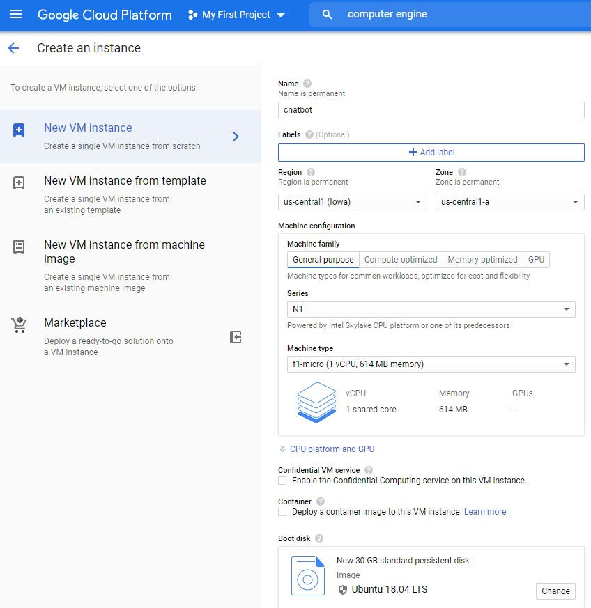
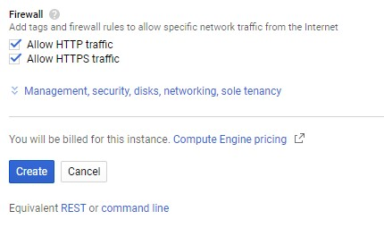
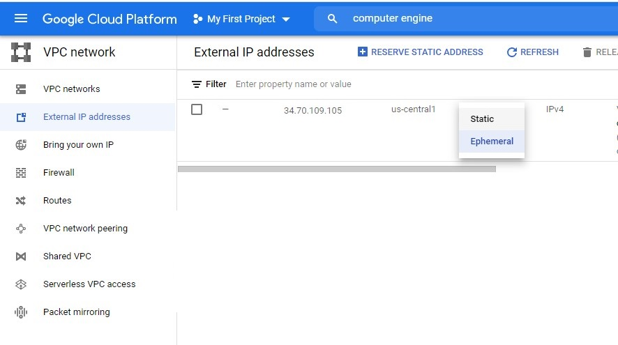
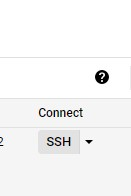
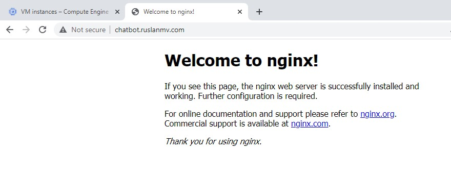
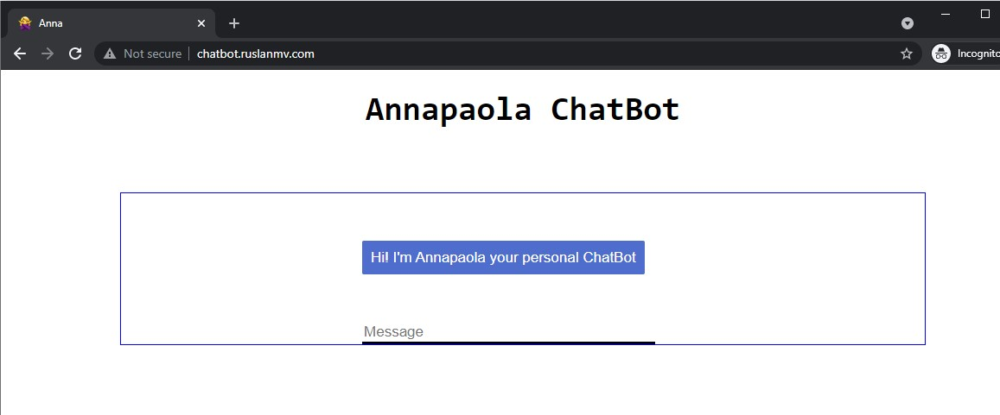

In this tutorial, you will learn how to get free Chatbot for lifetime that run 24 hours. This is a ubuntu server with Deploy your Chatbot with Flask  Gunicorn , Nginx in GCP with custom domain . 


# Requirements

- Google Cloud Account
- CloudFlare account
- Domain
- Nginx
- Gunicorn
- Flask

## Create Virtual Machine on Google Cloud 

First sing up, google cloud platform using your Gmail account. They ask to enter card details but it is only for verification. Don’t worry, it is totally free you wouldn’t charge any fees for this. We use GCP free tier. if you want, you able to choose powerful machine but it is not free, you have to pay.

[Sing Up for GCP Free Tier](https://cloud.google.com/free)

After the log in, click “menu” icon at the left upper conner. Under “compute engine”, select “VM instances” then wait for few moments. Click “create” button then a form popup then names the instance. GPC free tier offer f1 micro virtual machine for some regions. These are the regions that are cover by free tier. Select a region and zone according to that. Select N1 series and machine type should be f1 micro. After that click change button under boot disk, in here we can select a operating system (OS) and disk size.

Select OS as “Ubuntu 18.04 LTS. GCP free tier gives 30GB disk space, above that, they will charge.

and Standard Storage. 





Under firewall, tick mark both “allow HTTP and HTTPS traffic” then click “create” button. It will take some time.





In the menu, select “external IP address” under VPC network. Change the VM IP type to “Static”. Static IP doesn’t change during refresh the VPS.



Then click “firewall” at the left menu. You have to allow turbo VNC viewer port 5000 to connect Flask remotely and 80 . Click “create firewall rule” and name it whatever you want. Under target select “all instance in the network”. then put IP range as this and under protocols and ports select “allow all”. Now, click create button. this firewall rule allows all port and all IP ranges to connect the VM instance.

### Deploy your Chatbot with Flask  Gunicorn , Nginx in GCP with custom domain

Enter to your terminal of the GCP via ssh




### Update and Refresh Repository Lists

Open a terminal window, and enter the following:

```
sudo apt update
sudo apt install software-properties-common
```


add the deadsnakes PPA to your sources list:

```
sudo add-apt-repository ppa:deadsnakes/ppa
```

When prompted press `Enter` to continue:

nce the repository is enabled, install Python 3.7 with:

```
sudo apt install python3.7
```

At this point, Python 3.7 is installed on your Ubuntu system and ready to be used. You can verify it by typing:

```
python3.7 --version
```

 Alternative update python 3 to point to python3.7 `/usr/bin/python3` is just a `symlink`. Delete it and make a new `symlink` to
`python3.7`:

```
$ sudo rm /usr/bin/python3
$ sudo ln -s python3.7 /usr/bin/python3
```

```
sudo apt install python3-pip
```

python3  --version

```
sudo pip3 install pipenv
```

Check that pipenv installed correctly by checking the version.

```
$ pipenv --version
pipenv, version 2021.5.29
```

```
sudo mkdir /var/www/
```

```
cd /var/www/
```

```
sudo git clone https://github.com/ruslanmv/chatbot
```

The default permissions for the directory are set to root.

```
 ls -ld /var/www/chatbot
```

Change the permissions for the user and group to your username and the group www-data.

```
sudo chown -R $USER:www-data /var/www/chatbot
```

```
cd /var/www/chatbot
```

Create a .env file to hold the environmental variables.

```
nano  .env
```

```
FLASK_APP=wsgi.py
FLASK_ENV=production
```

Start the virtual environment. Pipenv will load the variables in the .env file automatically.

```
$ pipenv shell
```

Use pipenv to install the dependencies.

```
pip install  -r requirements.txt  --no-cache-dir
```

```
pipenv install  gunicorn
```

```
python -m spacy download en
```


nano application.py

```
#import files
from flask import Flask, render_template, request
from chatterbot import ChatBot
from chatterbot.trainers import ListTrainer
from chatterbot.trainers import ChatterBotCorpusTrainer
from chatterbot.response_selection import get_first_response
app = Flask(__name__)
# Create object of ChatBot class with Storage Adapter
bot = ChatBot(
    'Annapaola', 
    logic_adapters=['chatterbot.logic.MathematicalEvaluation',
                    'chatterbot.logic.BestMatch'
],
    response_selection_method = get_first_response,
)
# Inport ListTrainer
from chatterbot.trainers import ListTrainer
trainer = ListTrainer(bot)
trainer.train([
'annapaola',
'That is my name',
'ruslan',
'visit ruslanmv.com'
])
# Create a new trainer for the chatbot
# First, lets train our bot with some data
trainer = ChatterBotCorpusTrainer(bot)
# Train the chatbot based on the english corpus
trainer.train("chatterbot.corpus.english")
# Now we can export the data to a file
#trainer.export_for_training('./my_export.json')
@app.route("/")
def home():  
    return render_template("home.html")
@app.route("/get")
def get_bot_response():
    userText = request.args.get('msg') 
    response = bot.get_response(userText)
    return str(response)
```


```
nano wsgi.py
```

```
from application import app

if __name__ == '__main__':
    app.run(debug=False)
```

```
pip install python-dotenv
```

```
flask run --host '0.0.0.0'
```

Now you can access the application from another computer using a browser, navigate to the server's IP address on port 5000. Make sure port 5000 is not blocked by a firewall so that you will be able to access the Flask application.

Press `CTRL+C` to stop the Flask development server.


If you want only test the deployment 

use this application.py

```
from flask import Flask

app = Flask(__name__)


@app.route('/')
def index():
    '''Index page route'''

    return '<h1>Application Deployed!</h1>
```

and repeat

```
flask run --host '0.0.0.0'
```


It is time to set up Gunicorn!


If you were able to run the Flask development server successfully use this command to test run the application using Gunicorn.

```
$ gunicorn --workers 1 --bind 0.0.0.0:5000 wsgi:app
```

```
[2021-07-12 19:50:49 +0000] [6813] [INFO] Starting gunicorn 20.1.0
[2021-07-12 19:50:49 +0000] [6813] [INFO] Listening at: http://0.0.0.0:5000 (6813)
[2021-07-12 19:50:49 +0000] [6813] [INFO] Using worker: sync
[2021-07-12 19:50:49 +0000] [6816] [INFO] Booting worker with pid: 6816
[2021-07-12 19:50:49 +0000] [6817] [INFO] Booting worker with pid: 6817
[2021-07-12 19:50:49 +0000] [6818] [INFO] Booting worker with pid: 6818
[2021-07-12 19:50:49 +0000] [6819] [INFO] Booting worker with pid: 6819
```

Press `CTRL+C` to stop the Gunicorn server.

Install Nginx.

```
$ sudo apt install nginx
$ sudo systemctl enable nginx
$ sudo systemctl start nginx
```

Check to see if Nginx is running by running this command.

```
$ sudo systemctl status nginx
```


ow we create the systemd file that runs Gunicorn as a service. Add the following code but change all paths and user names so that they correspond to your set up.


here we have to add the address of your gunicorn bin

```
whereis  gunicorn
```

we copy this address, in my case was

```
/home/username/.local/share/virtualenvs/chatbot-EUI373oW/bin/gunicorn
```

We substitute `username` with your username of your terminal

```
whoami
```

sudo nano /etc/systemd/system/chatbot.service

```
[Unit]
Description=chatbot.service - A Flask application run with Gunicorn.
After=network.target
[Service]
User=username
Group=www-data
WorkingDirectory=/var/www/chatbot/
ExecStart=/home/username/.local/share/virtualenvs/chatbot-EUI373oW/bin/gunicorn --workers 1 --bind unix:/var/www/chatbot/chatbot.sock wsgi:app
[Install]
WantedBy=multi-user.target
```


Next we need to create the server block/virtual host in Nginx.

```
sudo nano  /etc/nginx/sites-available/chatbot.ruslanmv.com
```


 Add the following content. .

```
server {
        listen 80;
        server_name chatbot.ruslanmv www.chatbot.ruslanmv;
        access_log /var/log/nginx/chatbot.access.log;
        error_log /var/log/nginx/chatbot.error.log;
        location / {
                include proxy_params;
                proxy_pass http://unix:/var/www/chatbot/chatbot.sock;
        }
}

```


Enable the website by creating a link to the sites-enabled directory.

```
sudo ln -s /etc/nginx/sites-available/chatbot.ruslanmv.com /etc/nginx/sites-enabled/
```

Make sure the link has been created in sites-enabled directory.

```
ls -l /etc/nginx/sites-enabled/ | grep chatbot.ruslanmv.com

lrwxrwxrwx 1 root root 39 Jul 12 20:09 chatbot.conf -> /etc/nginx/sites-available/chatbot.conf
```


## Subdomain Setup in  Cloudflare


insert your address


Then return back to your terminal and check the nginx configuration for errors then restart the service.


```
$ sudo nginx -t
```

in your inter to your webrowser as example my case



Disable the default virtual host, that is pre-configured when Nginx is istalled via Ubuntu’s packet manager apt:

```
cd /etc/nginx/sites-enabled/
```

```
unlink /etc/nginx/sites-enabled/default
```

we verify that  `/etc/nginx/sites-available`  there i a `reverse proxy` configuration file.

```
chatbot.ruslanmv.com
```

then 

```
sudo systemctl restart nginx
sudo systemctl status nginx
```


Now w start the chatbot service

```
sudo systemctl status chatbot.service
```

and then we check

```
sudo systemctl status chatbot.service
```


```
● chatbot.service - chatbot.service - A Flask application run with Gunicorn.
     Loaded: loaded (/etc/systemd/system/chatbot.service; disabled; vendor preset: enabled)
     Active: active (running) since Wed 2021-07-14 10:25:49 UTC; 15s ago
   Main PID: 9338 (gunicorn)
      Tasks: 2 (limit: 682)
     Memory: 155.6M
     CGroup: /system.slice/chatbot.service

```

Now I can access the Flask application with a browser via the name.

[http://chatbot.ruslanmv.com](http://chatbot.ruslanmv.com)





### Troubleshooting

```
curl -I http://chatbot.ruslanmv.com
```

```
sudo systemctl status chatbot.service
```

```
sudo journalctl -xe
```

```
sudo systemctl restart nginx
```

```
sudo systemctl stop chatbot.service
```

```
sudo systemctl restart chatbot.service
sudo systemctl daemon-reload
```

**Congratulations** we have created our Chatbot with Flask on Google cloud with our subdomain.


