PyCaret is a workflow automation tool for supervised and unsupervised machine learning. All modules in PyCaret support data preparation 


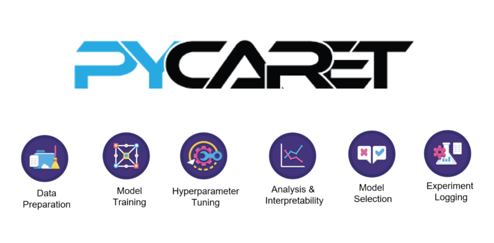

##  Natural Language Processing 

Natural language processing (NLP) is a subfield of computer science and artificial intelligence that deals with analyzing human language.

 Some of the common use cases for NLP in machine learning are:

- **Theme discovery and modeling:** Capture meaning and themes in text collections and apply advanced modeling techniques like Theme Modeling to group similar documents.
- **Sentiment analysis:** Identify mood or subjective opinions within large amounts of text, including average sentiment and opinion mining.
- **Summary of documents:** Automatic generation of synopses of large bodies of text.
- **Conversion of speech to text and text to speech:** Transformation of voice commands into written text and vice versa.
- **Automatic translation:** Automatic translation of text or voice from one language to another.

###  What is Topic Modeling?

Topic Modeling is a type of statistical model that is included in unsupervised machine learning and is used to discover abstract topics in text data. The goal of topic modeling is to automatically find topics in a set of documents.

Some common use cases for theme modeling are:

- **Summarize** large text data by classifying documents into topics ( the idea is quite similar to clustering ).
- **Exploratory data analysis**  to understand texts
- **Function engineering**  that creates functions for supervised machine learning experiments, such as classification or regression


Various **algorithms** are used for theme modeling. Some of the most common are latent Dirichlet assignment (**LDA** ), latent semantic analysis (**LSA** ), and non-negative matrix factorization ( **NMF** ).

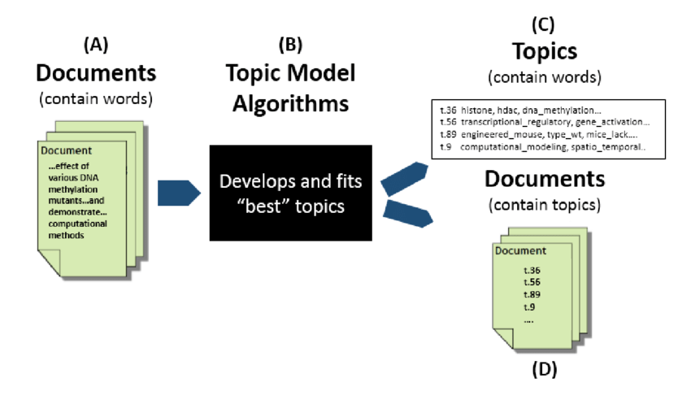

###  Text pre-processing for theme modeling 

To get meaningful results from topic modeling, the text data must be **processed before ** it is fed into the algorithm. This is common with almost all NLP tasks. Text preprocessing is different from the classic preprocessing techniques that are often used in machine learning.

PyCaret automatically preprocesses text data by applying more than 15 techniques, such as **elimination of stopwords and stopwords, tokenization, stemming, bi-gram / tri-gram extraction**  etc.

###   Common Techniques used in NLP 

- **Tokenize**: separate words from the text into entities called **tokens**,
- **Tagging Part of Speech** (PoS ): Classify sentences in verb, noun, adjective, preposition, etc.
- **Steeming**: get the root of the words
- **Bag of word**s : it is a way of representing the vocabulary that we will use in our model and consists of creating a matrix in which each column is a token and the number of times that token appears will be counted

## NLP module in PyCaret

PyCaret's NLP module (`pycaret.nlp`) is an unsupervised machine learning module that can be used to analyze text data by creating a topic model to find hidden semantic structure in documents.

 PyCaret's NLP module comes integrated with a wide range of text preprocessing techniques, which is the fundamental step in any NLP problem. Transform raw text into a format that machine learning algorithms can learn from.

In machine learning and natural language processing, a topic model is a type of statistical model for discovering the abstract "topics" that occur in a collection of documents. 

Theme modeling is a frequently used text extraction tool for discovering hidden semantic structures in a body of text.

A theme model is created using the `create_model ()` function which takes a required parameter, that is, the model name as a string.  This function returns a trained model object. 

## Environment configuration in PyCaret

The `setup ()` function initializes the environment in pycaret and performs various text preprocessing steps that are imperative for working with NLP problems. setup must be called before executing any other functions in pycaret. 

Two parameters are needed: the pandas data frame and the name of the text column passed as the `target` parameter. You can also pass a `list` containing text, in which case it is not necessary to pass the` target` parameter. 

When the setup runs, the following preprocessing steps are applied automatically:

- **Removal of numeric characters:** All numeric characters are removed from the text. They are replaced with blanks. 
- **Removal of special characters:** All non-alphanumeric special characters are removed from the text. They are also replaced with blanks.
- **Word Tokenization:** Word Tokenization is the process of breaking a large sample of text into words. This is the fundamental requirement in natural language processing tasks, where each word must be captured separately for further analysis.
- **Stop Word Removal:** An empty word (or non-existent word) is a word that is often removed from the text because it is common and provides little value for information retrieval, although it may be linguistically significant. Examples of such words in English are: "the", "a", "an", "in", etc.
- **Bigram extraction:** A bigram is a sequence of two adjacent elements of a chain of tokens, which are usually letters, syllables or words. For example: the word New York is captured as two different words "New" and "York" when tokenizing, but if repeated enough times, Bigram Extraction will render the word as one, ie "New_York" 

- **Trigram extraction:** Similar to bigram extraction, the trigram is a sequence of three adjacent elements of a chain of tokens. 
- **Stemming:** Stemming is the process of grouping the inflected forms of a word together so that they can be parsed as a single word, identified by the word's motto or dictionary form. In the English language, the word appears in various inflected forms. For example, the verb "walk" can appear as "walk", "walk", "walk", "walk". The basic form, 'walk', that one might look up in a dictionary, is called the word motto 
- **Custom noise words:** Many times the text contains words that are not noise words according to the language rule, but that add little or no information. For example, in this tutorial we are using the loan dataset. As such, words like "loan", "bank", "money", "business" are too obvious and do not add value. Most of the time, they also add a lot of noise in the theme model. You can remove those words from the corpus using the `custom_stopwords` parameter.


# Setting up the Environment

Before we start using PyCaret’s machine learning capabilities in Power BI we have to create a virtual environment and install pycaret. 

### Create an anaconda environment

Open **Anaconda Prompt** from start menu and run the following code:

```
conda create --name pycaret python=3.8
```

### Install PyCaret

Run the following code in Anaconda Prompt:

```
conda activate pycaret
pip install pycaret
```

Some functionality in `pycaret.nlp` requires an English language model. The language model is not downloaded automatically when you install pycaret. You will need to download this Python command line interface, like Anaconda Prompt.

 To download the model, type the following on your command line:

```
python -m spacy download en_core_web_sm
python -m textblob.download_corpora
```

### Install kernel

then in your terminal type the following commands:

```
conda install ipykernel
```

```
python -m ipykernel install --user --name pycaret --display-name "Python (Pycaret)"
```

Wee need to find our Anaconda Python interpreter path

## Windows

The location of a Python interpreter for a conda environment other than the root conda environment, run 

```
where python
```

for example in my case I have:

```
C:\Anaconda3\envs\pycaret\python.exe
```

## macOS and Linux

 The location of a Python interpreter for a conda environment other than the root conda environment, run

```
which python
```

You copy this path because we will requiere in the next step

## Power BI setup

The virtual environment created must be linked with Power BI. 


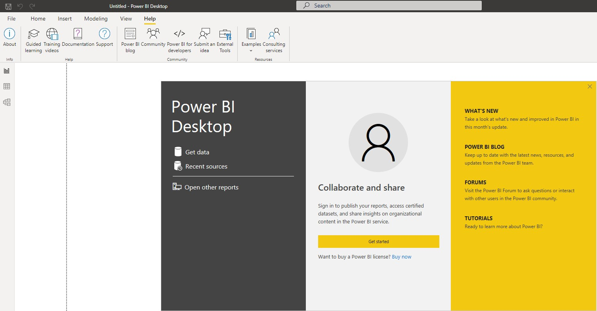

and we go to **File → Options** 


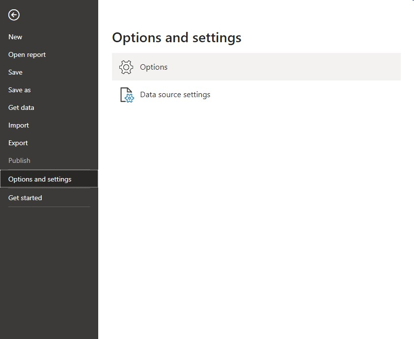


## Set Python Directory in Power BI

And we go to the  **Global → Python scripting** and then under `Detected Python home directories` we choose **other**

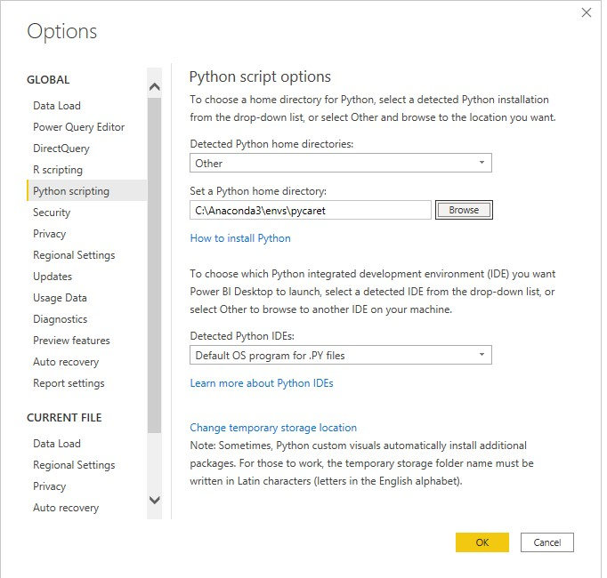

 and we select the Anaconda Environment path that we have such in my case is 

```
C:\Anaconda3\envs\pycaret\
```

## Dataset

Kiva Microfunds is a non-profit organization that enables people to lend money to low-income entrepreneurs and students around the world.

We will use the text provided in the personal story to gain insight into the dataset and understand the semantic structure hidden in the text.

The data set contains 6818 samples. 

Below is a brief description of the features:

- **country:** country of the borrower
- **in:** Personal history of the borrower when he applied for the loan
- **gender:** gender (M = male, F = female)
- **loan_amount:** Loan amount approved and disbursed
- **Default:** Lender type (Lender = personal user registered on Kiva website, Partner = microfinance institution that works with Kiva to find and finance loans)
- **sector:** sector of the borrower
- **status:** loan status (1-default, 0-repaid)

In this tutorial we will use **kiva.csv** file that is available on PyCaret’s [github repository](https://github.com/pycaret/pycaret/raw/master/datasets/kiva.csv)

we  can load the data using a web connector

**Power BI Desktop → Get Data → From Web**


and then we copy the following address 

```
 https://github.com/pycaret/pycaret/raw/master/datasets/kiva.csv
```

and we **connect** 

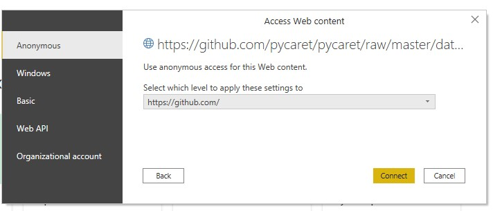

and the **load** 

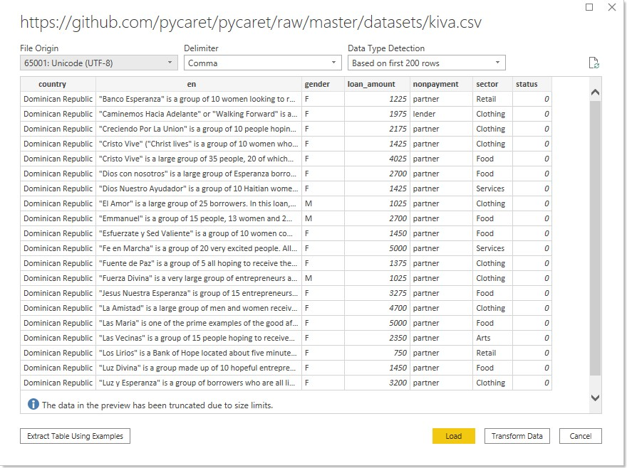

we can see that now the dataset is loaded

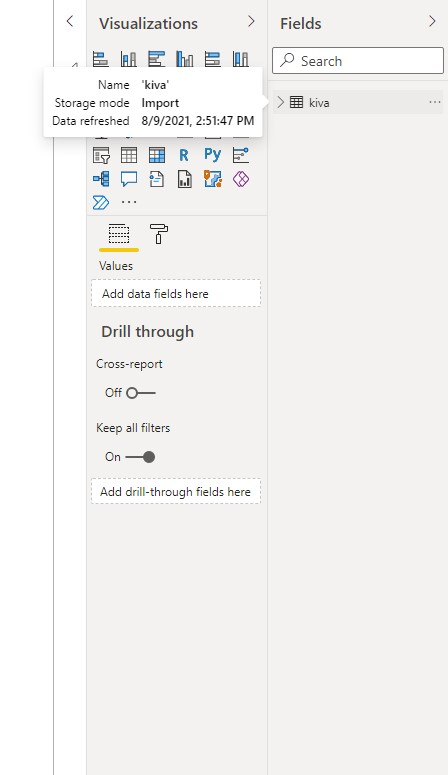


## Python Script with Power Bi

First we go to the **Home** and then **Transform Data** and it will be open a new window called   **Power Query Editor**


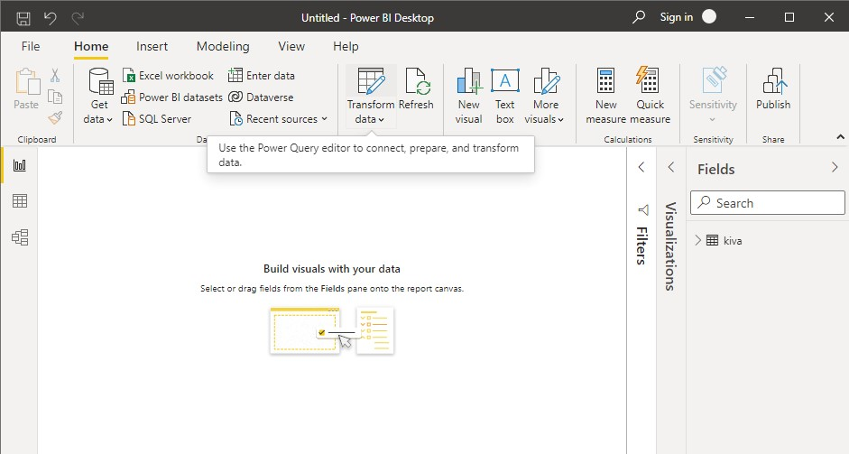


Then in **Power Query Editor** → **Transform**

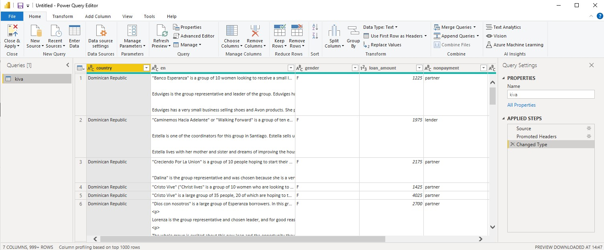

We need to check that all the columns corresponds to the correct type of data

For columns that are **text,** the type should be text and integers to **whole numbers** and so on.

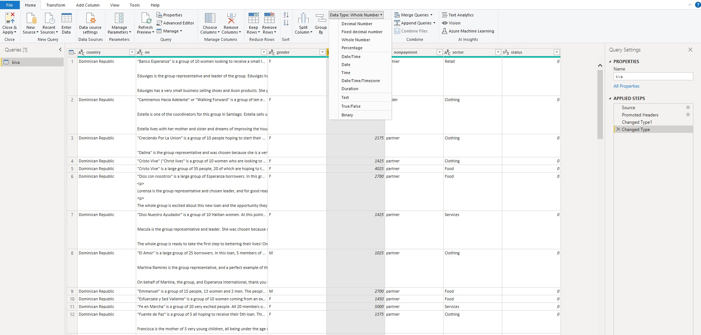

To execute Python script in Power Query Editor

we do **Transform → Run python script**

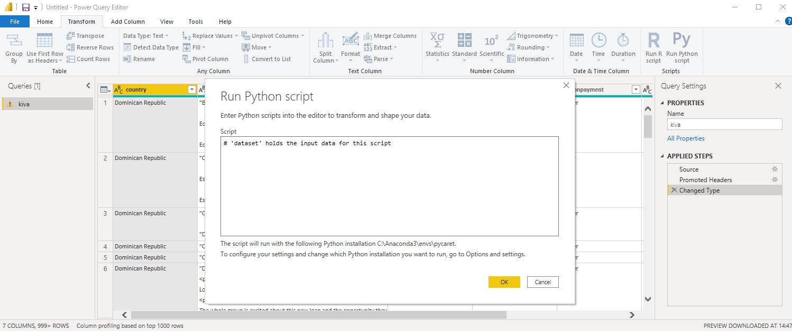

then we insert the following python script

```
from pycaret.nlp import *
dataset = get_topics(data = dataset, text='en')
```

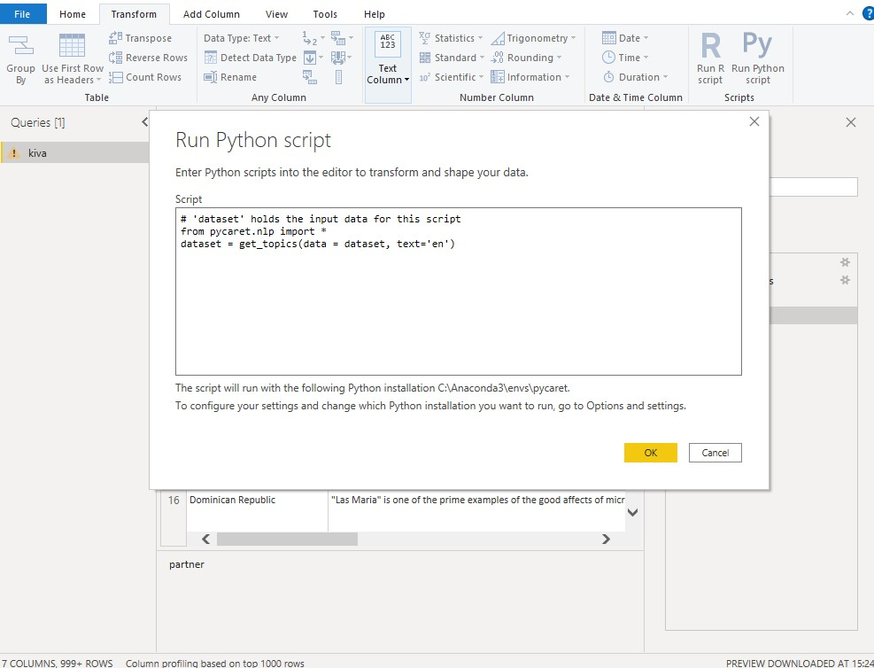

we wait like one minute and we get the following

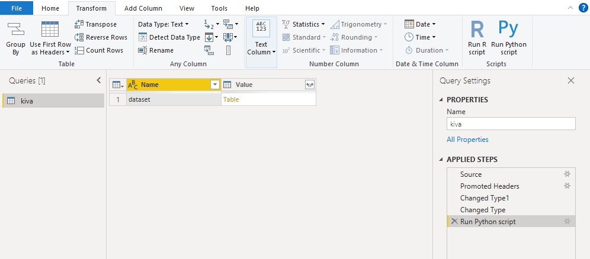

we click on table, and we obtain a 

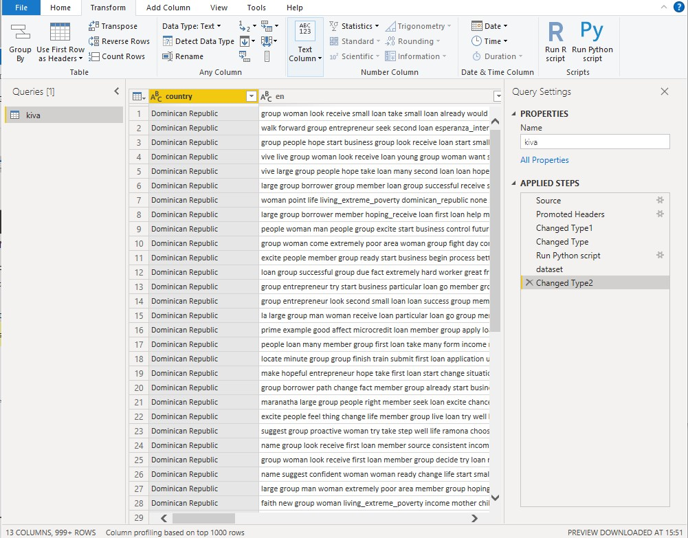

now this new table has new columns, that are

Topic_1, Topic_2, Topic_3,  and Dominant_Topic,  Perc_Dominant_Topic 

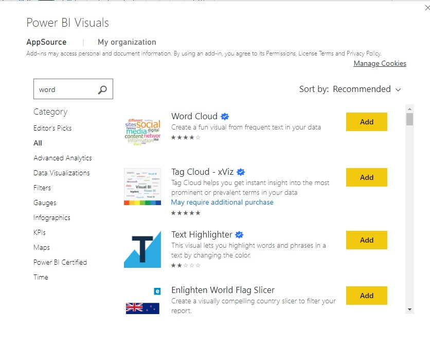

Then we select the type of visualization Word Cloud and we  select the column **en**

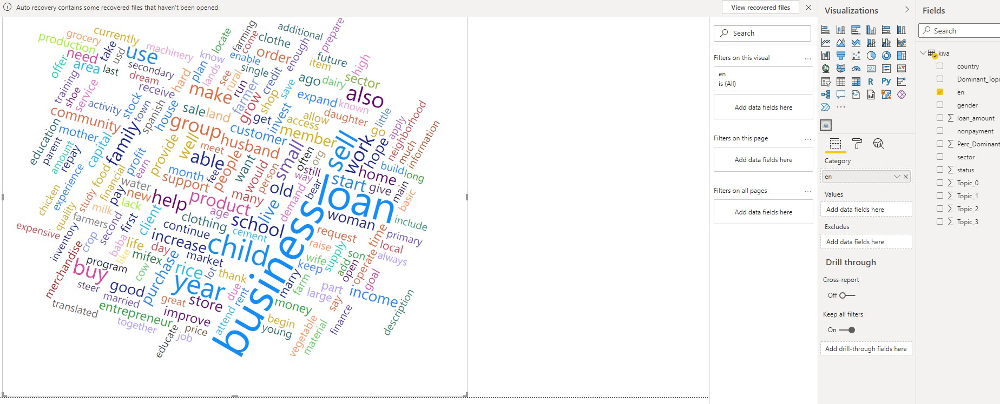

then we select the pie chart and we select the topic 1 topic 2 topic 3

and also we select the filled map with the countries and dominant topic and finally you get

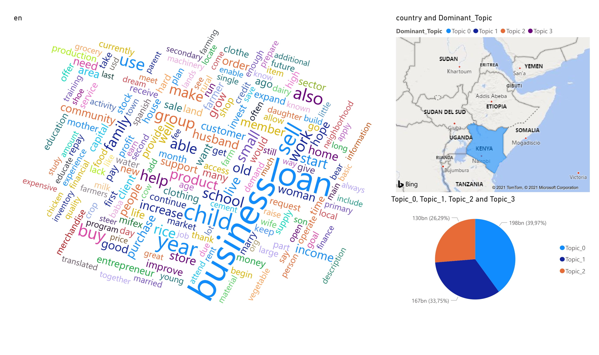

## Pycaret with Jupyter Notebook

In the terminal we return back with our environment

```
conda activate pycaret
jupyter notebook&
```

In the jupyter notebook we write

##  Load Dataset


```python
from pycaret.datasets import get_data
data = get_data('kiva')
```


<table border="1" class="dataframe">
  <thead>
    <tr style="text-align: right;">
      <th></th>
      <th>country</th>
      <th>en</th>
      <th>gender</th>
      <th>loan_amount</th>
      <th>nonpayment</th>
      <th>sector</th>
      <th>status</th>
    </tr>
  </thead>
  <tbody>
    <tr>
      <th>0</th>
      <td>Dominican Republic</td>
      <td>"Banco Esperanza" is a group of 10 women looki...</td>
      <td>F</td>
      <td>1225</td>
      <td>partner</td>
      <td>Retail</td>
      <td>0</td>
    </tr>
    <tr>
      <th>1</th>
      <td>Dominican Republic</td>
      <td>"Caminemos Hacia Adelante" or "Walking Forward...</td>
      <td>F</td>
      <td>1975</td>
      <td>lender</td>
      <td>Clothing</td>
      <td>0</td>
    </tr>
    <tr>
      <th>2</th>
      <td>Dominican Republic</td>
      <td>"Creciendo Por La Union" is a group of 10 peop...</td>
      <td>F</td>
      <td>2175</td>
      <td>partner</td>
      <td>Clothing</td>
      <td>0</td>
    </tr>
    <tr>
      <th>3</th>
      <td>Dominican Republic</td>
      <td>"Cristo Vive" ("Christ lives" is a group of 10...</td>
      <td>F</td>
      <td>1425</td>
      <td>partner</td>
      <td>Clothing</td>
      <td>0</td>
    </tr>
    <tr>
      <th>4</th>
      <td>Dominican Republic</td>
      <td>"Cristo Vive" is a large group of 35 people, 2...</td>
      <td>F</td>
      <td>4025</td>
      <td>partner</td>
      <td>Food</td>
      <td>0</td>
    </tr>
  </tbody>
</table>


```python
#check the shape of data
data.shape
```


    (6818, 7)


```python
# sampling the data to select only 1000 documents
data = data.sample(1000, random_state=786).reset_index(drop=True)
data.shape
```


    (1000, 7)

## Initialization of the environment


```python
from pycaret.nlp import *
exp_nlp101 = setup(data = data, target = 'en', session_id = 123)
```


<style type="text/css">
</style>
<table id="T_84b05_">
  <thead>
    <tr>
      <th class="col_heading level0 col0" >Description</th>
      <th class="col_heading level0 col1" >Value</th>
    </tr>
  </thead>
  <tbody>
    <tr>
      <td id="T_84b05_row0_col0" class="data row0 col0" >session_id</td>
      <td id="T_84b05_row0_col1" class="data row0 col1" >123</td>
    </tr>
    <tr>
      <td id="T_84b05_row1_col0" class="data row1 col0" >Documents</td>
      <td id="T_84b05_row1_col1" class="data row1 col1" >1000</td>
    </tr>
    <tr>
      <td id="T_84b05_row2_col0" class="data row2 col0" >Vocab Size</td>
      <td id="T_84b05_row2_col1" class="data row2 col1" >5302</td>
    </tr>
    <tr>
      <td id="T_84b05_row3_col0" class="data row3 col0" >Custom Stopwords</td>
      <td id="T_84b05_row3_col1" class="data row3 col1" >False</td>
    </tr>
  </tbody>
</table>


## Creation of the Model


```python
models()
```

<table border="1" class="dataframe">
  <thead>
    <tr style="text-align: right;">
      <th></th>
      <th>Name</th>
      <th>Reference</th>
    </tr>
    <tr>
      <th>ID</th>
      <th></th>
      <th></th>
    </tr>
  </thead>
  <tbody>
    <tr>
      <th>lda</th>
      <td>Latent Dirichlet Allocation</td>
      <td>gensim/models/ldamodel</td>
    </tr>
    <tr>
      <th>lsi</th>
      <td>Latent Semantic Indexing</td>
      <td>gensim/models/lsimodel</td>
    </tr>
    <tr>
      <th>hdp</th>
      <td>Hierarchical Dirichlet Process</td>
      <td>gensim/models/hdpmodel</td>
    </tr>
    <tr>
      <th>rp</th>
      <td>Random Projections</td>
      <td>gensim/models/rpmodel</td>
    </tr>
    <tr>
      <th>nmf</th>
      <td>Non-Negative Matrix Factorization</td>
      <td>sklearn.decomposition.NMF</td>
    </tr>
  </tbody>
</table>


where we have the following information

- **session_id:** A pseduo-random number distributed as a seed in all functions for later reproducibility. If no `session_id` is passed, a random number is automatically generated and distributed to all functions. In this experiment, session_id is set to `123` for later reproducibility. 
- **Documents:** Number of documents (or samples in the dataset if the data frame is passed). 
- **Vocabulary size:** Vocabulary size in the corpus after applying all the preprocessing of the text, such as stopword removal, extraction of bigrams / trigrams, stemming, etc. 

Note that all text preprocessing steps are done automatically when you run `setup ()`. These steps are essential to perform any NLP experiment. 

The `setup ()` function prepares the ready-to-use corpus and dictionary for theme models that you can create using the `create_model ()` function. Another way to pass the text is as a list, in which case the `target` parameter is not needed.


```python
lda = create_model('lda')
```


```python
print(lda)
```

    LdaModel(num_terms=5302, num_topics=4, decay=0.5, chunksize=100)

We have created the Latent Dirichlet Assignment (LDA) model with a single word, that is, `create_model ()`. Notice that the `num_topics` parameter is set to` 4`, which is a default value taken when you do not pass the `num_topics` parameter in` create_model () `. 

In the following example, we will create an LDA model with 6 themes and also set the `multi_core` parameter to` True`. When `multi_core` is set to` True`, Latent Dirichlet Allocation (LDA) uses all CPU cores to parallelize and speed up model training.


```python
lda2 = create_model('lda', num_topics = 6, multi_core = True)
```


```python
print(lda2)
```

    LdaModel(num_terms=5302, num_topics=6, decay=0.5, chunksize=100)


##  Model assignation

Now that we have created a theme model, we would like to assign the theme proportions to our dataset (6818 documents / samples) to analyze the results. We will achieve this using the ʻassign_model () `function. See an example below:


```python
lda_results = assign_model(lda)
lda_results.head()
```


<table border="1" class="dataframe">
  <thead>
    <tr style="text-align: right;">
      <th></th>
      <th>country</th>
      <th>en</th>
      <th>gender</th>
      <th>loan_amount</th>
      <th>nonpayment</th>
      <th>sector</th>
      <th>status</th>
      <th>Topic_0</th>
      <th>Topic_1</th>
      <th>Topic_2</th>
      <th>Topic_3</th>
      <th>Dominant_Topic</th>
      <th>Perc_Dominant_Topic</th>
    </tr>
  </thead>
  <tbody>
    <tr>
      <th>0</th>
      <td>Kenya</td>
      <td>praxide marry child primary school train tailo...</td>
      <td>F</td>
      <td>75</td>
      <td>partner</td>
      <td>Services</td>
      <td>0</td>
      <td>0.871802</td>
      <td>0.000354</td>
      <td>0.001464</td>
      <td>0.126379</td>
      <td>Topic 0</td>
      <td>0.87</td>
    </tr>
    <tr>
      <th>1</th>
      <td>Kenya</td>
      <td>gynaecology practitioner run reproductive year...</td>
      <td>M</td>
      <td>1200</td>
      <td>partner</td>
      <td>Health</td>
      <td>0</td>
      <td>0.984097</td>
      <td>0.000325</td>
      <td>0.001341</td>
      <td>0.014237</td>
      <td>Topic 0</td>
      <td>0.98</td>
    </tr>
    <tr>
      <th>2</th>
      <td>Dominican Republic</td>
      <td>live san_cristobal child boy girl range year o...</td>
      <td>F</td>
      <td>150</td>
      <td>partner</td>
      <td>Clothing</td>
      <td>0</td>
      <td>0.070113</td>
      <td>0.000361</td>
      <td>0.001493</td>
      <td>0.928032</td>
      <td>Topic 3</td>
      <td>0.93</td>
    </tr>
    <tr>
      <th>3</th>
      <td>Kenya</td>
      <td>phanice marry child daughter secondary school ...</td>
      <td>F</td>
      <td>150</td>
      <td>lender</td>
      <td>Services</td>
      <td>1</td>
      <td>0.727180</td>
      <td>0.000391</td>
      <td>0.001616</td>
      <td>0.270813</td>
      <td>Topic 0</td>
      <td>0.73</td>
    </tr>
    <tr>
      <th>4</th>
      <td>Kenya</td>
      <td>fredrice nzioka kilonzo year old hotel operate...</td>
      <td>F</td>
      <td>300</td>
      <td>lender</td>
      <td>Food</td>
      <td>1</td>
      <td>0.463812</td>
      <td>0.000355</td>
      <td>0.208921</td>
      <td>0.326911</td>
      <td>Topic 0</td>
      <td>0.46</td>
    </tr>
  </tbody>
</table>

Notice how 6 additional columns are now added to the data frame. ʻEn` is the text after all the preprocessing. `Topic_0 ... Topic_3` are the proportions of the topics and represent the distribution of topics for each document. `Dominant_Topic` is the topic number with the highest proportion and` Perc_Dominant_Topic` is the percentage of dominant topic over 1 (only shown when the models are stochastic, that is, the sum of all the proportions is equal to 1).

##  Visualization of the Model

The `plot_model ()` function can be used to parse the general corpus or just specific topics extracted through the topic model. So the `plot_model ()` function can also work without passing any trained model objects. See examples below:

###  Frequency Distribution of Entire Corpus


```python
plot_model()
```

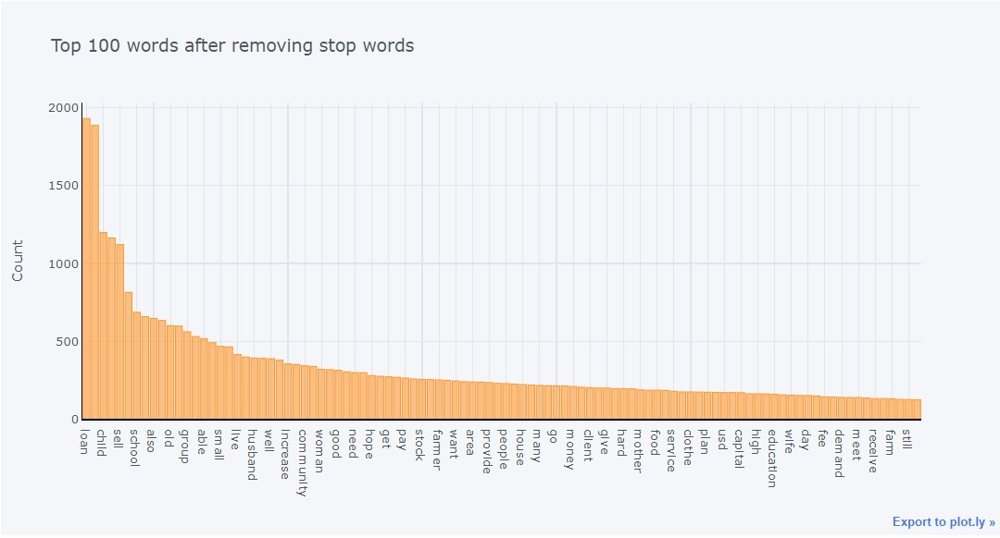


###  Top 100 Bigrams on Entire Corpus


```python
plot_model(plot = 'bigram')
```

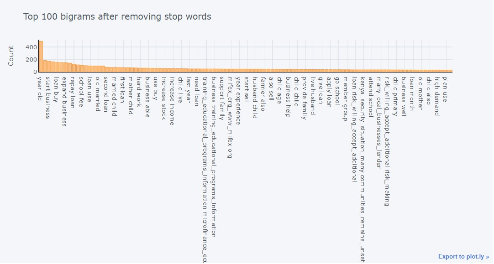


###  Frequency Distribution of Topic 1

`plot_model ()` can also be used to parse the same plots for specific topics. To generate topic-level plots, the function requires the trained model object to be passed inside `plot_model ()`. In the following example, we will generate a frequency distribution on `Topic 1` only as defined in the` topic_num` parameter.


```python
plot_model(lda, plot = 'frequency', topic_num = 'Topic 1')
```

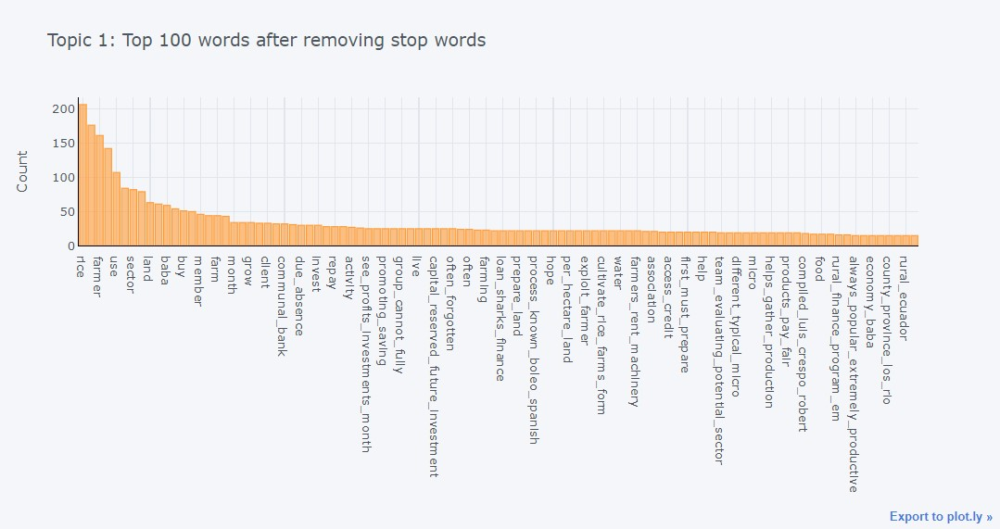


###  Topic Distribution


```python
plot_model(lda, plot = 'topic_distribution')
```

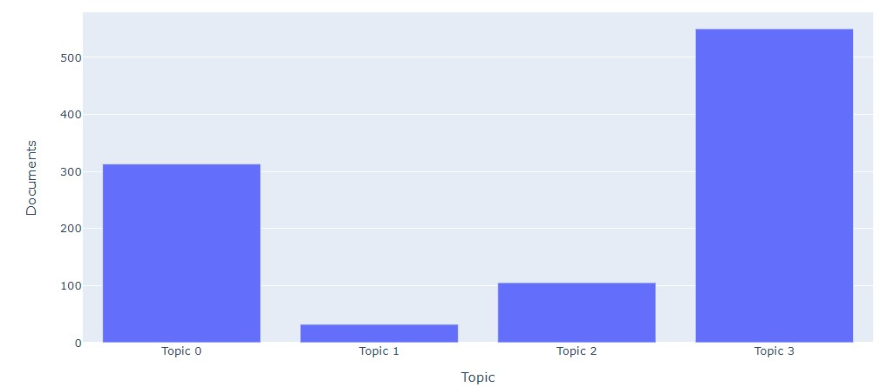

Each document is a distribution of topics and not a single topic.

 Although, if the task is to categorize the document into specific topics, it would not be wrong to use the ratio of topics with the highest value to categorize the document into **one topic**. In the chart above, each document is ranked on a topic using the highest proportion of topic weights. We can see that most of the documents are in "Topic 3" and only a few are in "Topic 1". If you hover your mouse over these bars, you will get a basic idea of ​​the topics in this topic by looking at the keywords.

For example, if you evaluate "Topic 2", you will see keywords like "farmer", "rice", "land", which probably means that loan applicants in this category belong to agricultural loans. However, if you hover over `Topic 0` and` Topic 3`, you will notice that many repetitions and keywords overlap in all topics, such as the word "loan" and "business" that appear in both the ` Topic 0` as in `Topic 3`

###  T-distributed Stochastic Neighbor Embedding (t-SNE)


```python
plot_model(lda, plot = 'tsne')
```

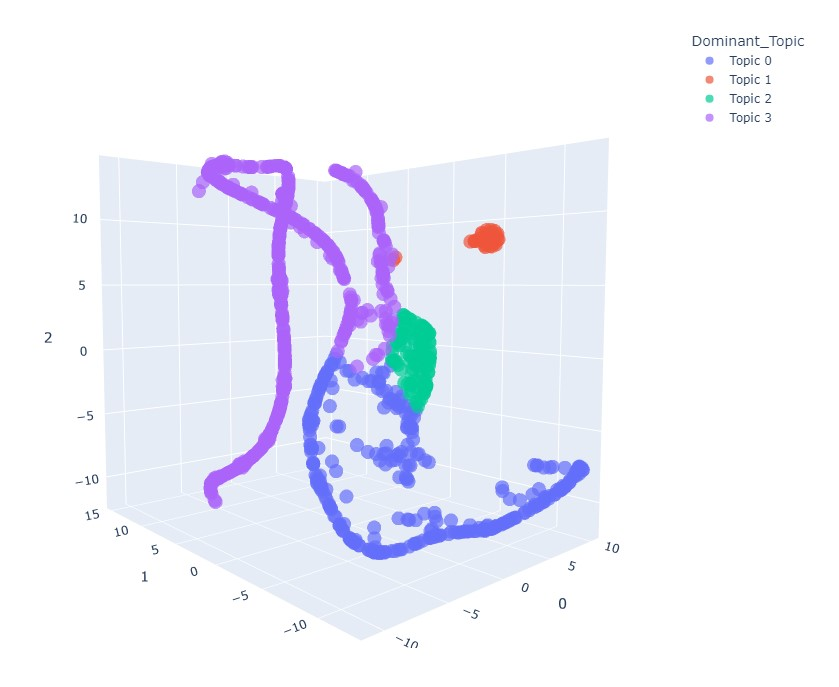


T-distributed stochastic neighbor embedding (t-SNE) is a nonlinear dimensionality reduction technique well suited for embedding high-dimensional data for display in two- or three-dimensional low-dimensional space.

### Uniform Manifold Approximation and Projection Plot


```python
plot_model(lda, plot = 'umap')
```


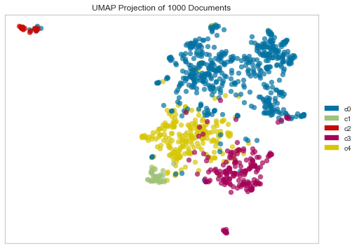
    


UMAP (Uniform Manifold Approximation and Projection) is a novel multi-learning technique for dimensionality reduction. It is similar to tSNE and PCA in purpose, as they are all dimensionality reduction techniques for 2d / 3d projections. UMAP is built from a theoretical framework based on Riemannian geometry and algebraic topology.

##  Evaluation of the Model

Another way to analyze model performance is to use the ʻevaluate_model () function which displays a user interface for all available graphics for a given model. It uses the `plot_model ()` function internally. See the example below where we have generated a sentiment polarity plot for `Topic 3` using the LDA model stored in the variable` lda`.


```python
evaluate_model(lda)
```


    interactive(children=(ToggleButtons(description='Plot Type:', icons=('',), options=(('Frequency Plot', 'freque…


##  Save  model

As you delve deeper into natural language processing, you will learn that topic model training time increases exponentially as the size of the corpus increases. As such, if you want to continue your experiment or analysis at a later time, you do not need to repeat the entire experiment and retrain your model. PyCaret's built-in `save_model ()` function allows you to save the model for later use.


```python
save_model(lda,'Final LDA Model')
```

    Model Succesfully Saved


##  Load model

To load a model saved at a future date in the same environment or in a different one, we would use PyCaret's `load_model ()` function.


```python
saved_lda = load_model('Final LDA Model')
```

    Model Sucessfully Loaded

```python
print(saved_lda)
```

You can download the notebook [here](https://github.com/ruslanmv/Natural-Language-Processing-with-Pycaret-and-Power-BI/raw/main/NLP-with-Pycaret.ipynb)

**Congratulations!** We have practiced **Pycaret** with **Power BI**

