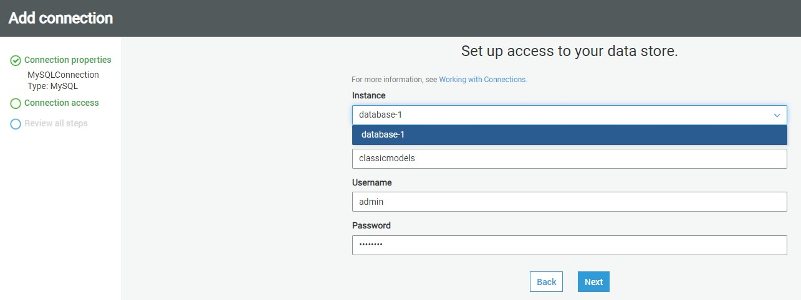
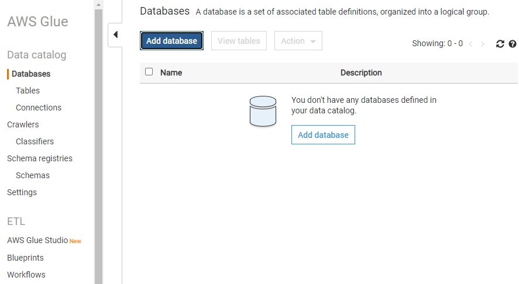
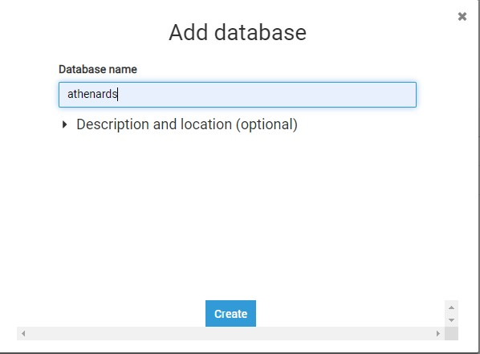
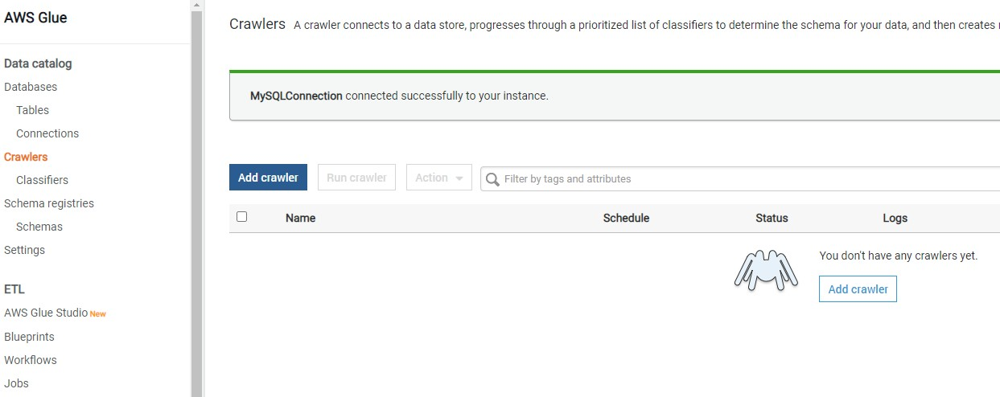
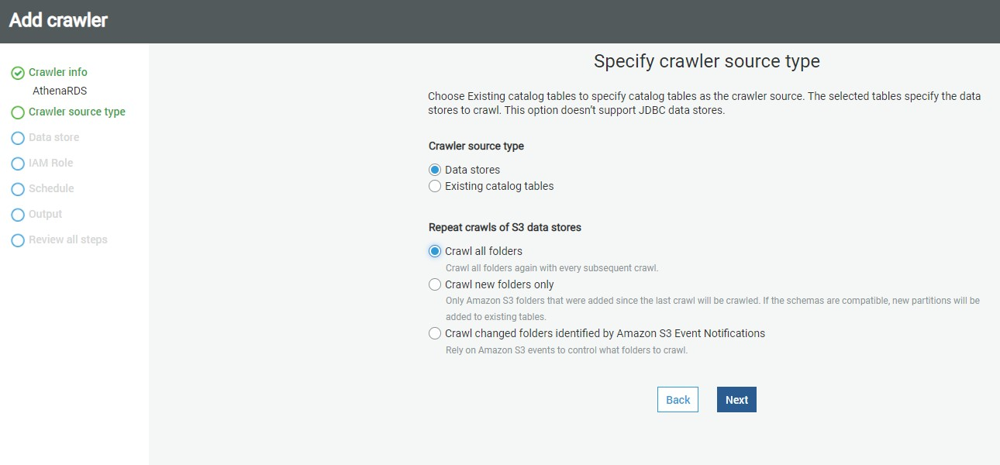
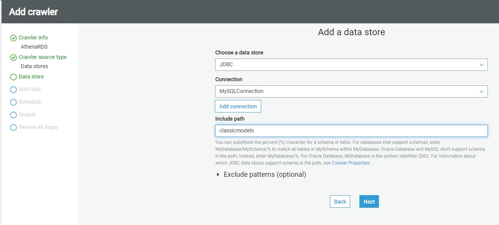
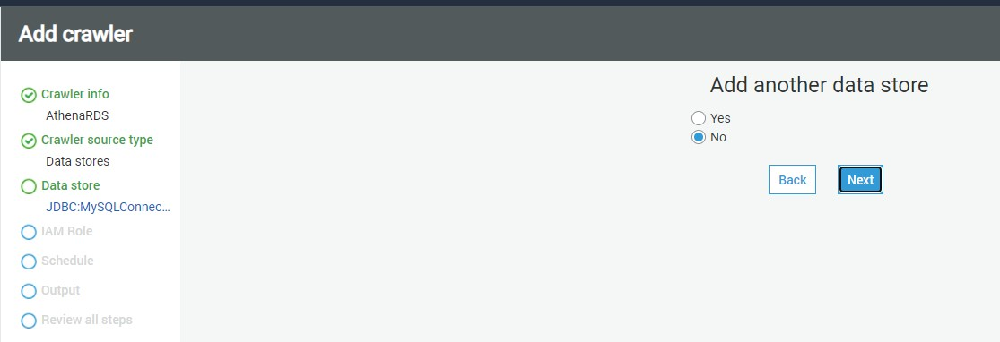
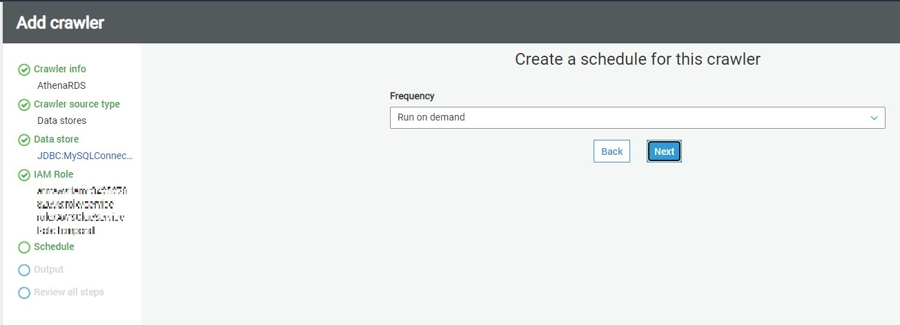
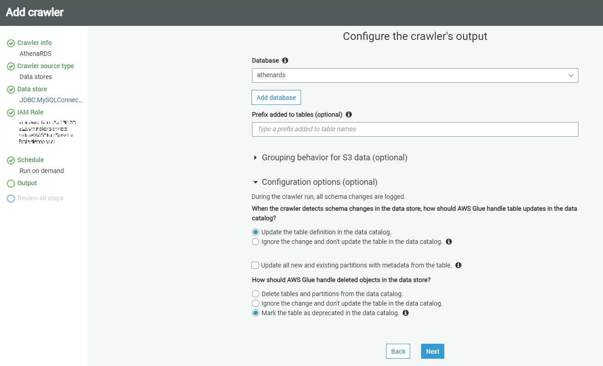
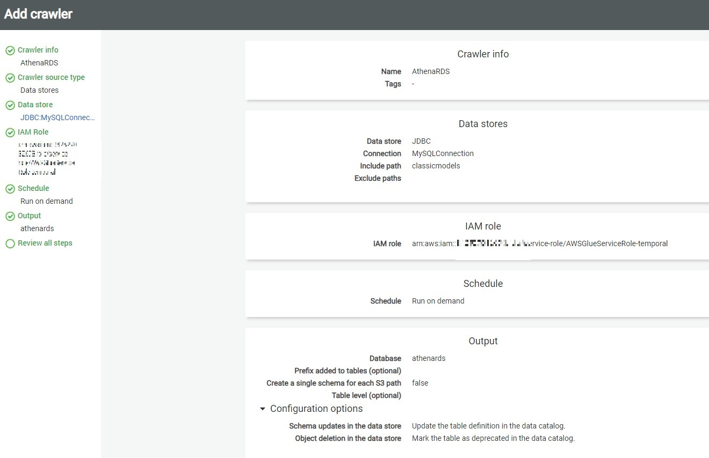

AWS Cloud offers a variety of data repositories like AWS RDS, AWS DynamoDB, AWS Redshift and many others. AWS RDS supports six different types of databases namely Aurora, MariaDB, SQL Server, Postgres, MySQL and Oracle. With a variety of data repositories on the cloud, there is often a need to hold inventory of all the data repositories and database objects held in those repositories in a central location. 

This central inventory is also known as the data catalog. AWS Glue is a serverless managed service that supports metadata cataloging and ETL (Extract Transform Load) on the AWS cloud. To perform these operations on AWS RDS for SQL Server, one needs to integrate AWS Glue with AWS RDS for SQL Server instance. 

The following workflow diagram shows how AWS Glue crawlers interact with data stores and other elements to populate the Data Catalog.


In this project we will consider that we have already a running **RDS MySQL server** with a loaded database.   You can follow the previous tutorial [here](https://ruslanmv.com/blog/Creation-of-MySQL-Relational-Database-with-RDS).

## Introduction to AWS Glue

AWS Glue is a serverless service offering from AWS for metadata crawling, metadata cataloging, ETL, data workflows and other related operations. AWS Glue can be used to connect to different types of data repositories, crawl the database objects to create a metadata catalog, which can be used as a source and targets for transporting and transforming data from one point to another. AWS Glue supports workflows to enable complex data load operations. Usually, the first step for any operation is connecting to the data source of interest by creating a new connection. 


The left pane contains different options which are categorized majorly into Data catalog, ETL and Security. Once you are on the home page of AWS Glue service, click on the Connection tab on the left pane and you would be presented with a screen as shown below.


#### Creation of a new connection to our AWS RDS SQL Server instance.

Click on the Add connection button to start creating a new connection.  A new wizard screen would appear which will have multiple steps to collect details regarding the data source to which we intend to create a connection.  The first step is to provide a **Connection name.** 

`MySQLConnection`

Next, we must select the type of connection. In the **Connection type** dropdown, you can find the options as shown below. Of all the supported options, we need to **select Amazon RDS** as it’s the service that holds our MySQL Server instance.

Once you select it, the next option of **Database engine** type would appear, as AWS RDS supports six different types of database mentioned above. Of all the supported databases, we need to select MySQL. and then click on Next.


After selecting the instance name `database-1,` and database connection credentials and database name for this project `classicmodels` and username as `admin` and  password you created to access to the Amazon RDS for MySQL Server instance click Next.



The next step just requires reviewing the details that we have provided in these two steps and confirm the creating of a new connection. Review the details and create a new connection. Once the connection is created, it would appear in the connections list as shown below.


Now that the connection is created, it’s time to test the connection. But before to that we need to crete an s3 VPC gateway edpoint. You can read more about these configuration requirements from [here](https://docs.aws.amazon.com/glue/latest/dg/start-connecting.html).

**Setting up an S3 VPC gateway endpoint**

To set up an S3 VPC gateway endpoint, do the following:

1. Open the Amazon VPC console.
2. In the navigation pane, choose Endpoints.
3. Choose Create Endpoint.
4. For Service Name, select **com.amazonaws.us-east-1.s3.** Be sure that the Type column indicates Gateway. Note: Be sure to replace us-east-1 with the AWS Region of your choice.
5. For VPC, select the VPC where you want to create the endpoint.
6. For Configure route tables, a route to the S3 VPC endpoint is automatically added.
7. For Policy, you can leave the default option Full Access.
8. Choose Create Endpoint.

### Testing connection

Return back to connections and there  Click on the Test Connection button and it would start opening an active connection to the AWS RDS SQL Server instance. 


Assuming the correct network configuration is in place, when you test the connection, it would succeed as shown below.


Once the connection is created and tested, you can click on the **Actions** menu to edit the connection, delete the connection, or view the details of the connection. 

Consider reading this [article](https://docs.aws.amazon.com/glue/latest/dg/connection-defining.html) to understand more details regarding AWS Glue connection properties.

[](https://www.sqlshack.com/wp-content/uploads/2020/07/aws-rds-instance-connection-usage-in-aws-glue-etl.png)

Once the connection is in place, the same can be used in ETL Jobs and Workflows


## Crawling AWS RDS SQL Server with AWS Glue

 Once the connection is in place,  choose **Add Database**. 




Provide a database **name** `athenards` and choose create.




Once the database name is created  click on the **Crawlers** in the left pane and you would see an interface as shown below.



Click on the **Add crawler** button to start creating a new crawler. The first step of defining a crawler is shown below. Provide a relevant name for the crawler. 


, click **Next**.

In this step, we need to specify the source data repository for the crawlers. We can select either data repositories or already cataloged objects. In our case, as we are going to point the crawler to AWS RDS SQL Server instance, we will choose the **Data stores** option. After selecting this option, click **Next**.



AWS Glue supports three types of data stores or repositories based on the mode of access. Data files hosted on S3 files, databases that support JDBC connectivity, and AWS DynamoDB database are the three types of data repositories that are supported. We would be using JDBC connectivity to connect to the AWS RDS MySQL Server database instance, so select the JDBC option.


As mentioned earlier, we need to have a connection to our AWS RDS SQL Server instance to select from the connection list. If you do not have any instance available, click on **Add connection** and create a new connection to the SQL Server instance. The “Include path” section expects the path to database objects. It supports wild-card patterns as well as exact object paths. The format that is generally followed is mydatabase/myschema/myobjects. It’s interesting to understand the effect of providing an incorrect path. So, for now, let’s just mention the master database, and our connection also points to the master database. Alternatively, if you intend to catalog many objects, and ignore only a few objects like system objects, then you can use exclude patterns and just mention objects that should not be crawled and cataloged. After updating the details, click **Next**.



In this step, if we intend to add data from multiple stores using the same crawler, you can select Yes to add another data store details. In our case we select No

click **Next**.



In this step, we need to select the **IAM Role** that would have access to the AWS RDS SQL Server instance. You can use the built-in AWS Glue Service Role that can access AWS RDS or you can create a custom role that has the required privileges. Once the role is selected, click **Next**.


In this step, we need to specify how frequently we intend to execute the crawler. In our case, we can select Run on-demand, so that the crawler will get executed only when we explicitly execute it. If you intend to schedule it, you can select other options as required.



In this step, we need to specify that when the database objects are crawled, where the crawler should create the metadata definition of the crawled objects. The database mentioned here is the AWS Glue database which will hold the metadata definition of the crawled objects. You can use the default database or create a new one by clicking on the **Add database**. In our case, we will use 

`athenards`

 The rest of the options can be configured to adding prefixes to cataloged objects, configuring grouping options when AWS S3 based data, and cataloging behavior when changed to already cataloged objects are detected.





The default behavior of the crawler is to update the object definition if a change of definition is detected in the source for already cataloged objects and marked the table as deprecated if an already cataloged object is not found in the source. In our case, we can use the default values and click on **Next**.




 This will take us on the Review page, where we can review the details and click on **Finish** to create the crawler.


## Executing crawlers with AWS Glue

Once the crawler is created, it would appear in the list as shown below. It will ask whether we want to execute the crawler. You can execute the crawler by clicking on **Run it now** link or selecting the crawler and clicking on the Run crawler button.


Once the crawler is executed, it will initiate a connection to AWS RDS SQL Server instance, read the definition of the objects that we mentioned in the include path, and create metadata objects in the catalog. Once the crawler completes execution you would find the details whether any new tables were created or updated. In our case, you would find that no tables got updated or created, though the crawler completed successful execution. The reason is the incorrect format of the path we mentioned in the include path setting.


#### AWS Glue Metadata Catalog Tables

Navigate to the **Tables** option under databases on the left-hand pane, there you would find the table 

Once this table is available in the metadata catalog, you can start using it as the source or target of AWS Glue ETL jobs as shown below.


In this way, we can crawl an Amazon RDS SQL Server database instance and catalog objects in the AWS Glue metadata catalog.

## How to visualize your Database from Python

In addition you can use Boto3

```python
import boto3
client = boto3.client('glue',region_name='us-east-1')
responseGetDatabases = client.get_databases()
databaseList = responseGetDatabases['DatabaseList']
for databaseDict in databaseList:
    databaseName = databaseDict['Name']
    print('databaseName: '+str(databaseName))

    responseGetTables = client.get_tables( DatabaseName = databaseName )
    tableList = responseGetTables['TableList']
    for tableDict in tableList:
         tableName = tableDict['Name']
         print('tableName:'+str(tableName))
```

you will have an output like

```bash
databaseName: athenards
tableName:classicmodels_customers
tableName:classicmodels_employees
tableName:classicmodels_offices
tableName:classicmodels_orderdetails
tableName:classicmodels_orders
tableName:classicmodels_payments
tableName:classicmodels_productlines
tableName:classicmodels_products
databaseName: default
```

**Congratulations !** We have created a **Data Catalog**  with **AWS Glue** from you **MySQL Database.**

