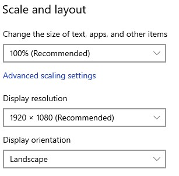
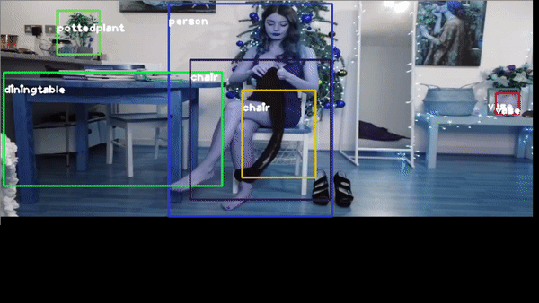
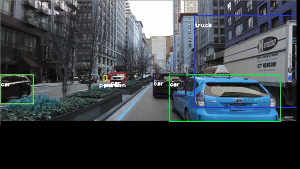

Hello, today I would like to detect objects using **Neural Network in TensorFlow** by using the pretrained neural network **Yolo3**

In this post, I will explain how to build a simply program to detect objects from you desktop computer.

We will see how using OpenCV and Python, we can detect objects by applying the most popular YOLO(You Look Only Once) algorithm.

OpenCV is the computer vision library/ framework that we we will be using to support our YOLOv3 algorithm

Darknet Architecture is pre-trained model for classifying 80 different classes. Our goal now is that we will use Darknet(YOLOv3) in OpenCV to classify objects using Python language.

For this project we will consider an standard resolution 1920 x 1080 , in windows 10 in **Display Setting** , select the resolution **1920 x 1080**



Then  you need to install Anaconda at this [link](https://www.anaconda.com/products/individual)


After you install it , check that your terminal , recognize **conda**

```
C:\conda --version
conda 4.10.3
```

The environments supported that I will consider is **Python 3.7**, **Keras 2.4.3** and **TensorFlow 2.4.0**, let us create the environment, go to you command promt terminal and type the following:

```
conda create -n detector python==3.7.10
conda activate detector
```

then in your terminal type the following commands:

```
conda install ipykernel
Proceed ([y]/n)? y
```

```
python -m ipykernel install --user --name detector --display-name "Python (Object Detector)"
```

Then we install the correct versions of the the **Tensorflow**, and **Numpy** and **Keras**

we create a file called **requirements.txt**

if your are in Windows

```
notepad requirements.txt
```

or Linux

```
nano  requirements.txt
```

and you paste the following lines

```
Keras==2.4.3
keras-resnet==0.2.0
numpy==1.19.3
opencv-python==3.4.2.17
tensorflow==2.4.0
tensorflow-estimator==2.4.0
tensorflow-gpu==2.4.0
Pillow==9.0.0
```

and then we return back to the terminal and install them

```
pip install -r requirements.txt
```

then open the **Jupyter notebook** with the command

```
jupyter notebook&
```

then you click create new notebook `Python (Object Detector)` and then you can test if you can import the the following libraries

```
import numpy as np
from PIL import ImageGrab
import cv2
import time
import win32gui, win32ui, win32con, win32api
```


The next step is is define a function that enable record you screen

```python
def grab_screen(region=None):
    hwin = win32gui.GetDesktopWindow()
    if region:
            left,top,x2,y2 = region
            width = x2 - left + 1
            height = y2 - top + 1
    else:
        width = win32api.GetSystemMetrics(win32con.SM_CXVIRTUALSCREEN)
        height = win32api.GetSystemMetrics(win32con.SM_CYVIRTUALSCREEN)
        left = win32api.GetSystemMetrics(win32con.SM_XVIRTUALSCREEN)
        top = win32api.GetSystemMetrics(win32con.SM_YVIRTUALSCREEN)
    hwindc = win32gui.GetWindowDC(hwin)
    srcdc = win32ui.CreateDCFromHandle(hwindc)
    memdc = srcdc.CreateCompatibleDC()
    bmp = win32ui.CreateBitmap()
    bmp.CreateCompatibleBitmap(srcdc, width, height)
    memdc.SelectObject(bmp)
    memdc.BitBlt((0, 0), (width, height), srcdc, (left, top), win32con.SRCCOPY)
    signedIntsArray = bmp.GetBitmapBits(True)
    img = np.fromstring(signedIntsArray, dtype='uint8')
    img.shape = (height,width,4)
    srcdc.DeleteDC()
    memdc.DeleteDC()
    win32gui.ReleaseDC(hwin, hwindc)
    win32gui.DeleteObject(bmp.GetHandle())
    return cv2.cvtColor(img, cv2.COLOR_BGRA2RGB)
```

then you define a new function called main() which will record your screen 


```python
def main():
    last_time = time.time()
    while True:
        # 1920 windowed mode
        screen = grab_screen(region=(0,40,1920,1120))
        img = cv2.resize(screen,None,fx=0.4,fy=0.3)
        height,width,channels = img.shape
        #detecting objects
        blob = cv2.dnn.blobFromImage(img,0.00392,(416,416),(0,0,0),True,crop=False)
        net.setInput(blob)
        outs = net.forward(outputlayers)
        #Showing info on screen/ get confidence score of algorithm in detecting an object in blob
        class_ids=[]
        confidences=[]
        boxes=[]
        for out in outs:
            for detection in out:
                scores = detection[5:]
                class_id = np.argmax(scores)
                confidence = scores[class_id]
                if confidence > 0.5:
                    #onject detected
                    center_x= int(detection[0]*width)
                    center_y= int(detection[1]*height)
                    w = int(detection[2]*width)
                    h = int(detection[3]*height)
                    #rectangle co-ordinaters
                    x=int(center_x - w/2)
                    y=int(center_y - h/2)
                    boxes.append([x,y,w,h]) #put all rectangle areas
                    confidences.append(float(confidence)) #how confidence was that object detected and show that percentage
                    class_ids.append(class_id) #name of the object tha was detected
        indexes = cv2.dnn.NMSBoxes(boxes,confidences,0.4,0.6)
        font = cv2.FONT_HERSHEY_PLAIN
        for i in range(len(boxes)):
            if i in indexes:
                x,y,w,h = boxes[i]
                label = str(classes[class_ids[i]])
                color = colors[i]
                cv2.rectangle(img,(x,y),(x+w,y+h),color,2)
                cv2.putText(img,label,(x,y+30),font,1,(255,255,255),2)
        #print('Frame took {} seconds'.format(time.time()-last_time))
        last_time = time.time()
        cv2.imshow('window', img)
        if cv2.waitKey(25) & 0xFF == ord('q'):
            cv2.destroyAllWindows()
            break
```


and finally we download the following files

1. yolo.cfg (Download from [here](https://github.com/pjreddie/darknet/blob/master/cfg/yolov3.cfg)) — Configuration file
2. yolo.weights (Download from [here](https://pjreddie.com/media/files/yolov3.weights)) — pre-trained weights
3. coco.names (Download from [here](https://github.com/pjreddie/darknet/blob/master/data/coco.names))- 80 classes names

then you add the following code

```python
net = cv2.dnn.readNetFromDarknet('yolov3.cfg', 'yolov3.weights')
classes = []
with open("coco.names","r") as f:
    classes = [line.strip() for line in f.readlines()]
    
layer_names = net.getLayerNames()
outputlayers = [layer_names[i[0] - 1] for i in net.getUnconnectedOutLayers()]
colors= np.random.uniform(0,255,size=(len(classes),3))
```

and finally you just run it with the simple code

```
main()
```

you can stop with simple press q

for example you want to identify a YouTube video, of one beautiful girl


or this video [https://youtu.be/QW-qWS3StZg?t=170](https://youtu.be/QW-qWS3StZg?t=170)



or the classic traffic recognition [https://youtu.be/7HaJArMDKgI](https://youtu.be/7HaJArMDKgI)




**Congratulations!** We have applied Neural Networks with Yolo3 in **Tensorflow** to detect objects in **real time**.

