Hello everyone, today I will explain how to connect your **Google Colab** to your local computer.  

When you are working on Google Colab sometimes you have  limitations such as memory time, resources, etc. And if you don't want to pay for the resources upgrade then I will explain  how to use your pc as a host in Google Colab.

## Introduction

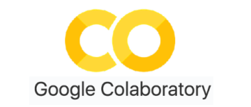

**Colaboratory**, or **Colab,** is a hosted **Jupyter notebook** service requiring zero setup and providing free access to compute resources. It is a convenient and powerful way to share research.

Colab allows you to create, run, and share Jupyter notebooks without having to download or install anything. Integration with GitHub means that you can work entirely in the cloud.

There are two methods that you can connect  Google Colab with you computer:

- a) With **Windows** 
- b) With **Ubuntu** or **Windows with Ubuntu** 


# a)  Windows method


## Step 1: Install Anaconda

First you need to install anaconda at this [link](https://www.anaconda.com/products/individual) 


## Step 2: Install environment

After you have installed Anaconda go to your terminal and let us create an environment called **colab**, but you can put the name that you like.

```
conda create -n colab python==3.10
```

```
conda activate colab 
```

then we need to install Jupyter server extension for using a WebSocket to proxy HTTP traffic

```
conda install -c conda-forge jupyter_http_over_ws
```

```
jupyter serverextension enable --py jupyter_http_over_ws
```

If you want to control you environment on Anaconda you can install the kernel (optionally)

```
conda install ipykernel
```

```
python -m ipykernel install --user --name colab --display-name "Python (Colab)"
```

## Step 3: Start a local Jupyter server

then you can start a local Jupyter server

```
jupyter notebook --NotebookApp.allow_origin='https://colab.research.google.com' \ --port=9090 --no-browser
```

Once the server has started,  You’ll need a copy   initial backend URL used for authentication.


in my case I copy 

```
http://localhost:9090/?token=107b5b6de7b8fe5ada010e2ed066c9f6dafc1e567439263c
```

## Step 4: Open Google Colab

You open a new web browser and go to the following link

[https://colab.research.google.com/](https://colab.research.google.com/)

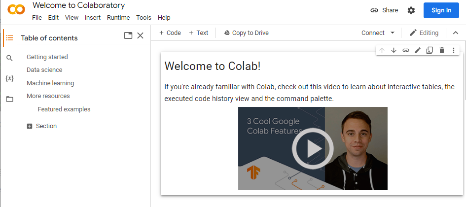


## Step 5: Connect to your local runtime

In Colab, click the “Connect” button and select “Connect to local runtime”. 


Enter the URL you just copied and click “Connect”:


That’s it! You now have the Colab research environment running on your local Jupyter server.


and finally you can type 

```
!dir 
```

to explorer your computer and work with your local files.

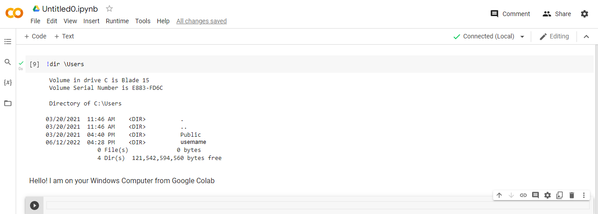


## Reconnect to local runtime

Next time you want to connect to a local runtime, you only need to run steps 3 and 5 above.

Also you can automatize the method by creation a .bat file in notepad with the following code

```
echo Google Colab is startig!!
cmd "/c start chrome https://colab.research.google.com"
cmd "/c conda activate colab && jupyter serverextension enable --py jupyter_http_over_ws && jupyter notebook --NotebookApp.allow_origin='https://colab.research.google.com' \ --port=9090 --no-browser"
cmd /k
```

then you can just save as **colab_local.bat**

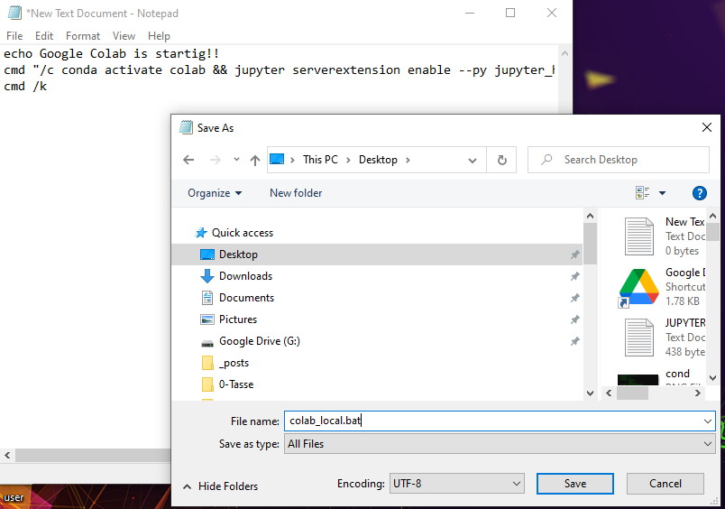


then you have your executable bat

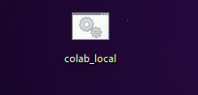


when you click, will be open two windows, one is the google colab an the other the screen where you have to copy the localhost address.


and copy the last values in red and paste in your google colab .

**Uninstall**

If you dont need the enviroment you can delete by typing

```
conda remove -n colab --all
cd Desktop
rm colab_local.bat
```


# b)  Ubuntu method

If you want to have a fully features of **Google Colab,** you may require the Unix support,  then I suggest install Ubuntu or use **Windows with ubuntu.**

### Step 1: Open Ubuntu or Windows Subsystem for Linux 

The first thing is have a Unix operative system like ubuntu or a Windows Subsystem for Linux 

 You can follow this tutorial [here](https://ruslanmv.com/blog/Python3-in-Windows-with-Ubuntu).

### Step 2: Open the bash terminal

Once you have ubuntu, you can go to your terminal and type 

```
bash
```

you will get something like

```
Microsoft Windows [Version 10.0.19044.1766]
(c) Microsoft Corporation. All rights reserved.

C:\Users\ruslanmv>bash
ruslanmv@pc:/mnt/c/Users/ruslanmv$

```

### Step 2: Update Local Package Manager

Start by updating the local package manager. Open a terminal window and enter the following:

```
sudo apt-get update
```

If your system doesn’t have **wget**, install it by entering:

```
sudo apt install wget
```

### Step 3: Download the Latest Version of Anaconda

At the time this article was written, the latest version of Anaconda is 2022.05. Check the [developer’s download page](https://www.anaconda.com/distribution/) to view the newest version.


Note the URL and use it to download the correct version.

Use **curl** to download the installer using your command terminal:

```
wget  https://repo.anaconda.com/archive/Anaconda3-2022.05-Linux-x86_64.sh
```

you will get something like

```
Saving to: ‘Anaconda3-2022.05-Linux-x86_64.sh’
Anaconda3-2022.05-Linux-x86_64.sh    100%[===================================================================>] 658.85M  12.1MB/s    in 48s
2022-06-26 23:03:36 (13.8 MB/s) - ‘Anaconda3-2022.05-Linux-x86_64.sh’ saved [690850711/690850711]
ruslanmv@pc:/mnt/c/Users/ruslanmv$
```


### Step 4: Run Anaconda Installation Script

The Anaconda installer is a **bash script**. To run the installation script, use the command:

```
bash Anaconda3-2022.05-Linux-x86_64.sh
```

A license agreement will appear. Use the **Enter** key to review the agreement.


At the bottom, type **yes** to agree to the terms.

The installer will prompt you to accept the default location, or install to a different location. Use the default path unless you have a specific need to change it. (You may cancel the installation here if needed.)

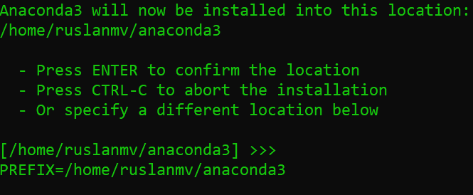

The installation will finish. After sucessful installation, the following will appear:

```
installation finished.
Do you wish the installer to initialize Anaconda3
by running conda init? [yes|no]
```

This determines if you want to use the **conda** command without changing the directory. Type **yes** and hit **enter**, unless you have a specific need to do otherwise.  t

In ordering to use conda from the terminal you should update the enviroment variables of your terminal by doing

```
nano ~/.bashrc
```

 then  add this path to your .bashrc file at the end, by using `CTRL+W`  and `CTRL+V`   and  paste the following line

```
export PATH=~/anaconda3/bin:$PATH
```

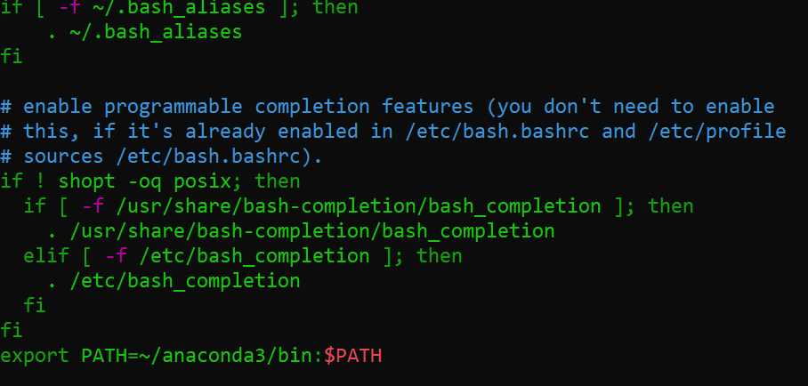

and then save the file

using `CTRL+S`  to save and `CTRL+X` to exit 

additionally if you are in the **WSL** **Windows** you should do  instead

```
nano ~/.bash_profile
```

you should add this path:

```
export PATH=~/anaconda3/bin:$PATH
```

then test

```
conda --version
```

```
ruslanmv@Blade:/mnt/c/Users/ruslanmv$ conda --version
conda 4.12.0
```

Wee need to initialize  the shell with

```
conda init bash
```

Once finished, activate the installation, that will automatically edit your `.bashrc`. (Reload)

```
source ~/.bashrc
```

Then we  need to close and restart your shell.

### Step 5:  Test Installation

Use the **conda** command to test the installation:

```
conda info
```

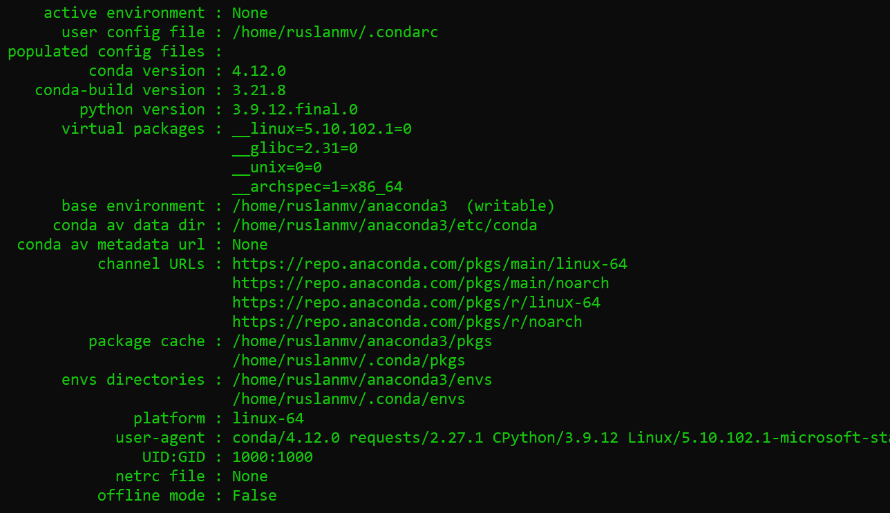


## Step 6. Create and Activate Anaconda Environments

Create a Python 3 Colab enviroment named **colab** by entering the following:

```
conda create -n colab python==3.7
```

Activate this environment:

```
conda activate colab
```

In order to use **Drive files** in Colab, you'll need to **mount your Google Drive** on the Colab,

```
conda install google-colab
```

then we need toiInstall Jupyter server extension for using a WebSocket to proxy HTTP traffic

```
conda install -c conda-forge jupyter_http_over_ws
```

```
jupyter serverextension enable --py jupyter_http_over_ws
```


## Step 7: Start a local Jupyter server

then you can start a local Jupyter server

```
jupyter notebook --NotebookApp.allow_origin='https://colab.research.google.com'  --port=9090 --no-browser
```

Once the server has started,  You’ll need a copy   initial backend URL used for authentication.


in my case I copy 

```
http://localhost:9090/?token=b697dfb9809868c037d491dd5c4f72f5815977fd7d0057eb
```

## Step 8: Open Google Colab

You open a new web browser and go to the following link

[https://colab.research.google.com/](https://colab.research.google.com/)

if you want you use your cloud drive in Google Drive, you select **Google drive** and then click on **New Notebook**


### Step 9: Connect to your local runtime

In Colab, click the “Connect” button and select “Connect to local runtime”. 


Enter the URL you just copied and click “Connect”:


That’s it! You now have the Colab research environment running on your local Jupyter server.


Let us check if we are on our  Windows Linux System from Google Colab.

The command “**uname -r**” shows the version of the Linux kernel that you're currently using. You'll now see which Linux kernel you're using

we  add new cell

```
!uname-r
```

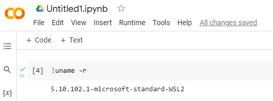

Good we are in our **Windows system with Linux**. 


#  Mount your Google Drive on the local Colab

Now let us try to connect to our Google Drive.

There are different methods to  import data from local Colab , among them:

- Mount Google Drive to your Local PC 

- Get files from Google Drive using gdown

- Mound Google Drive using Jupyter Lab ([more ](https://github.com/jupyterlab/jupyterlab-google-drive))

- Mound Google Drive using APIs in GCP
  
  You can mount the drive but it cost by using the API.

I will use the simplest free methods 


## Mount Google Drive to your Local PC


Go to the [Google Drive downloads page](https://www.google.com/drive/download/) and click **Download Drive for desktop**.


Click Download Drive for desktop and  Once the program is done downloading, click on it to begin installing and follow the onscreen instructions.

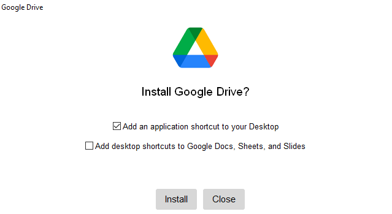


When the app has finished installing, click Close.   Look for a window called **Sign in to Google Drive** and click on **Sign in with browser**. 

I click **Sign In**.


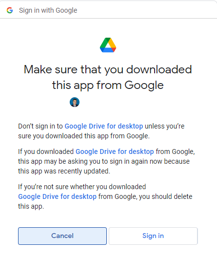

Type in your Gmail address, click **Next**, then type in your Gmail password, and then click **Next**. In the new page that appears confirming you downloaded the application from Google,


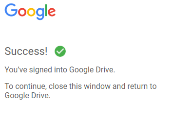

Then you can execute the icon of **Google Drive** from your Desktop,

```
"C:\Program Files\Google\Drive File Stream\launch.bat"
```

And then you have your google drive


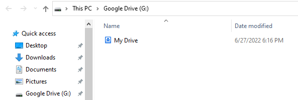


Now if you are in Windows, you can go to your terminal

and type the letter of your Google Drive unit, in my case is G

```
g:
```


```
Microsoft Windows [Version 10.0.19044.1766]
(c) Microsoft Corporation. All rights reserved.

C:\Users\ruslanmv>G:

G:\>
```

then you can enter to your Colab Diretory

```
cd  "My Drive\Colab Notebooks"
```


```
conda activate colab
```


then you can start a local Jupyter server

```
jupyter notebook --NotebookApp.allow_origin='https://colab.research.google.com' \ --port=9090 --no-browser
```

Once the server has started


You open a new web browser and go to the following link

https://colab.research.google.com/), you select **Google drive** and then click on **New Notebook**


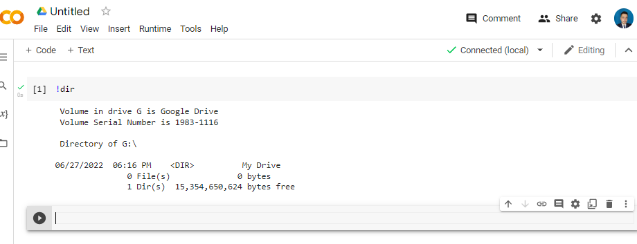

## Get files from Google Drive using gdown 

First, extract the ID of your desire file from google drive:

In your browser, navigate to drive.google.com.

[drive.google.com](drive.google.com)

Right-click on the file, and click "Get a shareable link"

[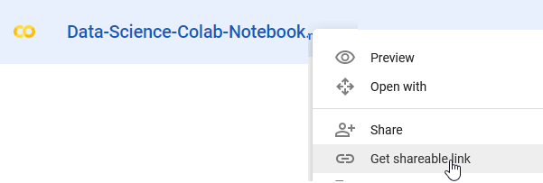]()

Then extract the ID of file from URL:

[]()

Next, install `gdown` PyPI module using `conda`:

`! conda install -y gdown`

Finally, download the file using `gdown` and the intended ID:

`!gdown --id <put-the-ID>`

For example:

```
!gdown --id 1-1wAx7b-USG0eQwIBVwVDUl3K1_1ReCt
```


**Congratulations!** We have learned how to connect **Google Colab** with our local computer.