Hello everyone, today  I want to show you how to use Google Data Studio to create an Interesting BI dashboard by using BigQuery. What I want to discuss is how to use **BigQuery** to create a BI Dashboard by using **Google Data Studio**.

Let us assume that you are working in a company where you have to to **track, analyze** and **report** one dataset that is daily updated on key performance indicators that your company requested to you. You can perform this by using  **business intelligence dashboard**.

A **BI dashboards** typically visualize data in charts, graphs and maps which helps stakeholders understand, share and collaborate on the information.

For this project we wil use **Google Cloud Platform** as a cloud solution. This problem also can be solved by using **Amazon Web Services** or **Microsoft Azure** which will be a subject of another blog post.


## Introduction


**BigQuery** is a serverless, cost-effective and multicloud data warehouse designed to help you turn big data into valuable business insights. BigQuery is a fully-managed, serverless data warehouse that enables scalable analysis over petabytes of data. It is a Platform as a Service that supports querying using ANSI SQL. It also has built-in machine learning capabilities.

**Google Data Studio** is an online tool for converting data into customizable informative reports and dashboards introduced by Google on March 15, 2016 as part of the enterprise Google Analytics 360 suite.

## Step 1 Uploading queryable data

First we login into our console of  Google Cloud Platform (GCP) account 

[https://cloud.google.com](https://cloud.google.com)


Then we need to pull in some public data so you can practice running SQL commands in BigQuery.

### Open BigQuery Console

In the Google Cloud Console, select **Navigation menu** > **BigQuery**:


The **Welcome to BigQuery in the Cloud Console** message box opens. This message box provides a link to the quickstart guide and the release notes.

Click **Done**.


Click on the **+ ADD DATA** link, then select **Explore public datasets**:

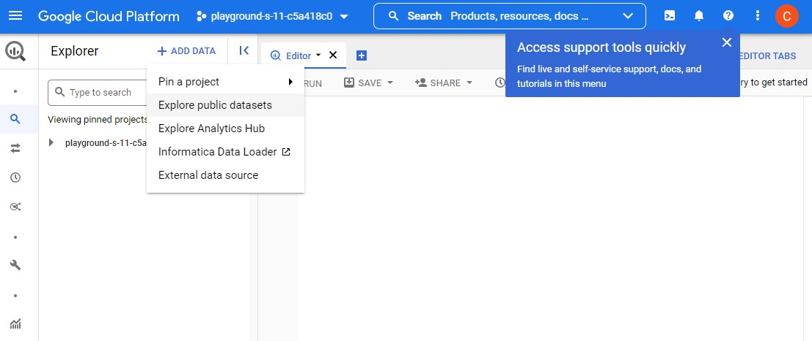

Search for "trees" and press **Enter**.

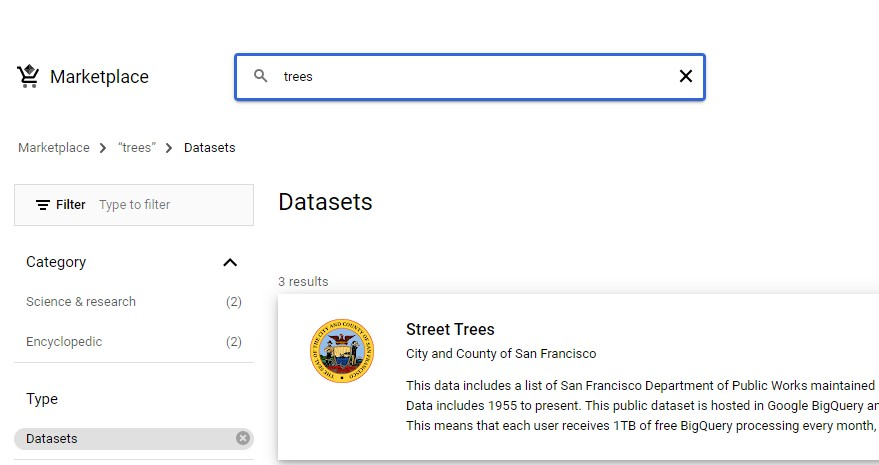

Click on the **Street Trees** tile, then click **View Dataset**.

A new tab opens

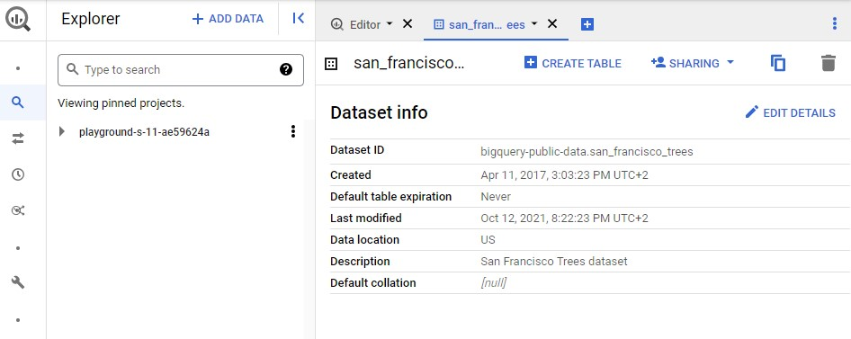


 then click on **+ ADD DATA** -> **Pin a project** -> **Enter project name** (bigquery-public-data) and **Pin**.

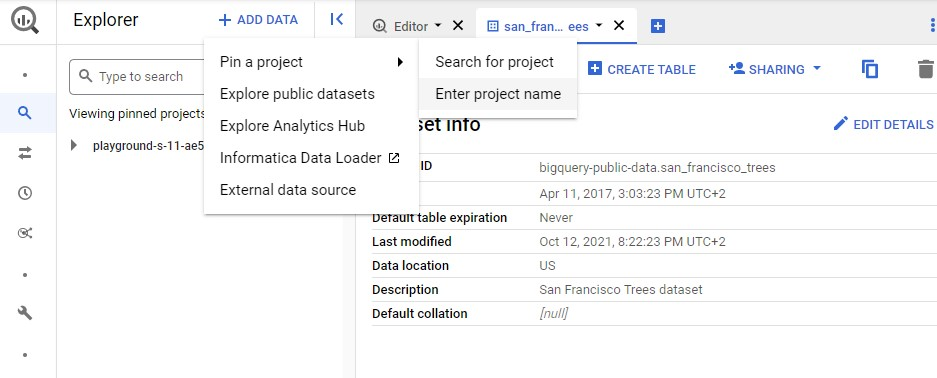


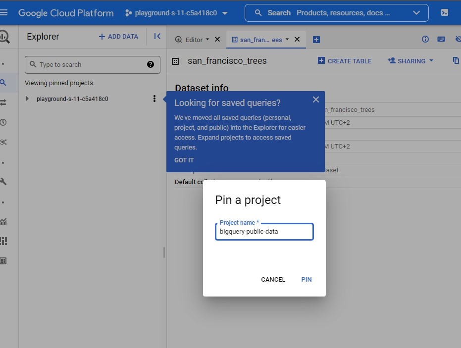

## Step 2  Create a reports dataset in BigQuery

Typically, a dashboard shows an aggregated view of usage . To reduce query costs, we will first aggregate your needed logs into another dataset called "Reports" then create a table of aggregated data. 

We need to create a new dataset called Reports in your project. A separate dataset has a couple of benefits: it reduces the amount of data queried by the dashboard, and it removes unnecessary access to your source datasets by users who are only interested in aggregated data.

Select your own projec,


hen Click on **Create dataset** and call it "Reports".


## Step 3 Query the dashboard data

We se select the new dataset created  and we compose a **new query**

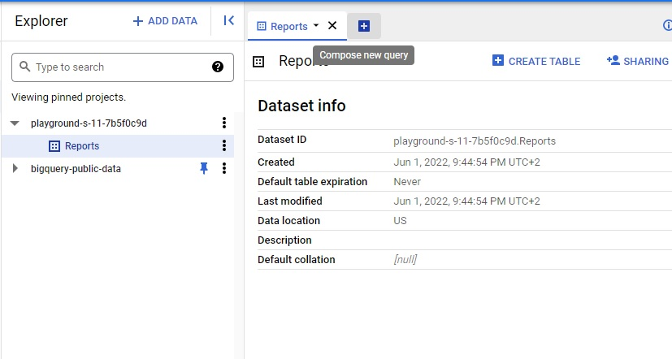


 The query string and destination table can be parameterized, allowing you to organize query results by date and time.

Now you add a query that checks each day for new data. When new trees are planted, you'll get the additional stats updated directly into the `reports.trees` table.

Click **Compose New Query** and run the following query to pull incremental data into the reports.trees table on a daily basis using the scheduled query feature:

```sql
SELECT
 TIMESTAMP_TRUNC(plant_date, MONTH) as plant_month,
  COUNT(tree_id) AS total_trees,
  species,
  care_taker,
  address,
  site_info
FROM
  `bigquery-public-data.san_francisco_trees.street_trees`
WHERE
  address IS NOT NULL
  AND plant_date >= TIMESTAMP_SUB(CURRENT_TIMESTAMP(), INTERVAL 365 DAY)
  AND plant_date < TIMESTAMP_TRUNC(CURRENT_TIMESTAMP(), DAY)
GROUP BY
  plant_month,
  species,
  care_taker,
  address,
  site_info
```

this is a one-time query to pull the data for the last year, summarizing:

- The number of trees planted each month
- Which species of trees were planted
- Who the caretaker of the trees is
- Address of the planted trees
- Tree site information


Click the **More** button, and select **Query settings** from the dropdown menu.


Click the **More** button, and select **Query settings** from the dropdown menu.

- Select **Set a destination table for query results**.
- For Dataset name, type `Reports`.
- Create a name for the table, like "Trees".
- For **Destination table write preference**, select **Write if empty**.


Because you specified a **Table name** and selected the **Write if empty** preference, the query creates a table if the table does not already exist.

Accept the other default settings and click **Save**.

Click **Run** to run the query.


## Step 4 Scheduling queries in BigQuery

We will query the table from the Data Studio dashboard. This way, when the  dashboard is refreshed, the reporting dataset queries process  less data. Since usage logs from the past never change,  we will only refresh new usage data into the Reports dataset.

To keep your dashboard up-to-date, you can schedule queries to run on a recurring basis. Scheduled queries must be written in [standard SQL](https://cloud.google.com/bigquery/docs/reference/standard-sql/query-syntax), which can include [Data Definition Language (DDL)](https://cloud.google.com/bigquery/docs/data-definition-language) and [Data Manipulation Language (DML)](https://cloud.google.com/bigquery/docs/reference/standard-sql/data-manipulation-language) statements.

Click on the **Schedule** button, then  **Enable Scheduled Queries**


and **enable  API**


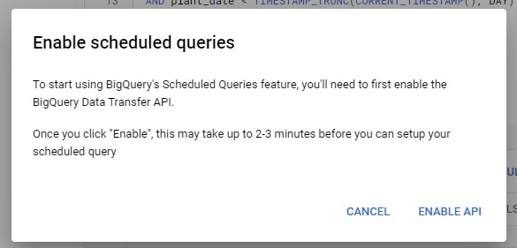

Click on the **Schedule** button, then  **Create new scheduled query**:

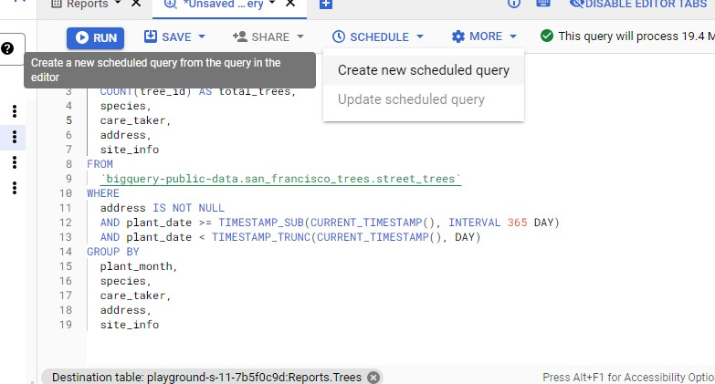

On the new Scheduled query page, set the following:

- Name: **Update_trees_daily**

  

Schedule options:

- Repeats: **daily**, choose date and time in the future

In the **Destination for query results** sections, check the box for **Set a destination table for query results** and specify dataset name as `Reports`.

- Table name: type in "Trees" and select **Append to table** so it doesn't overwrite existing data.


Click **Save**.

You may have a popup blocker enabled, click **Allow** and then give your lab credentials permission, then agree to replace your query.


## Step 5 Create new data sources in Data Studio

Now you'll build your dashboard using the tree data you've just aggregated with Data Studio.

Open a new tab in your browser and go to Data Studio with this link: [https://datastudio.google.com](https://datastudio.google.com/).


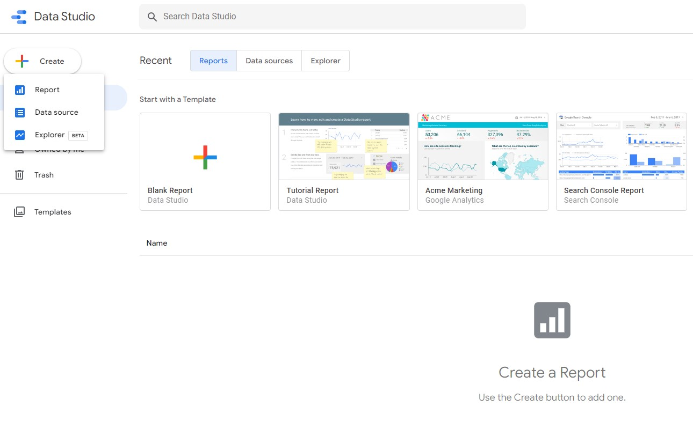


Click **Create** in the top left, and then click **Report**.

Enter the country and check the terms and conditions. Click **Continue**.

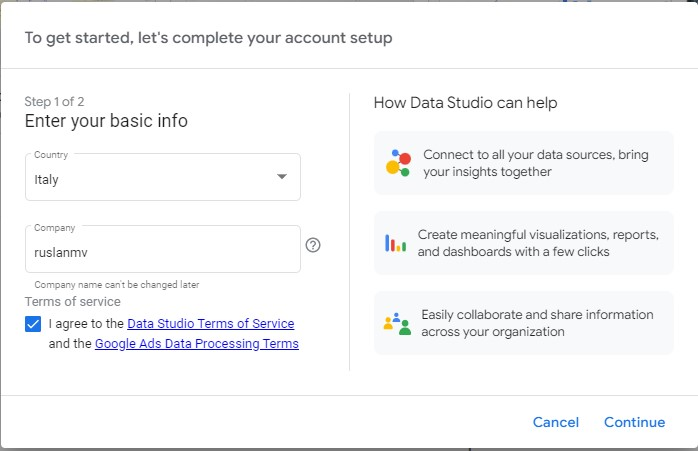

- Select **No** for all email offers, and then click **Continue**.

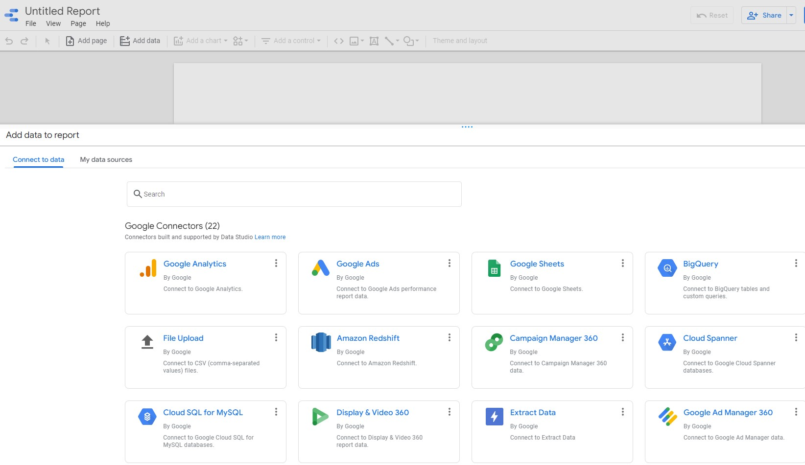

## Create a new report in Data Studio

Click on the **BigQuery**, then click **Authorize**.


Now you'll use the BigQuery connector to connect to the `reports.trees` table.

Start by selecting your **our project**, then the **Reports** dataset, then the **Trees** table, as shown below:

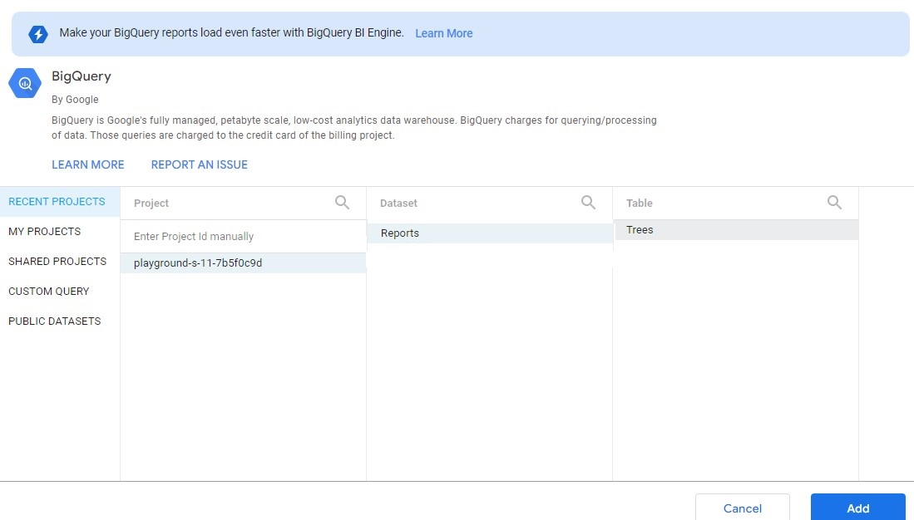

then we add to the report


Now you can create charts using the data in this table.

Click on **Add a chart** dropdown and select the type you want.

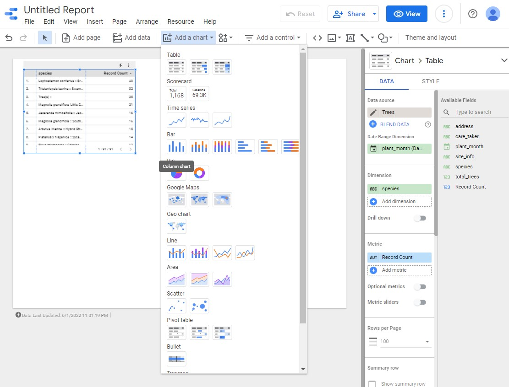

 In this example, you can see the following types of charts:

1. For example for Stacked column bar graph showing the number of trees by species by record count


1. Stacked column bar graph showing the number of trees planted each month and the name of the caretaker who planted them.

   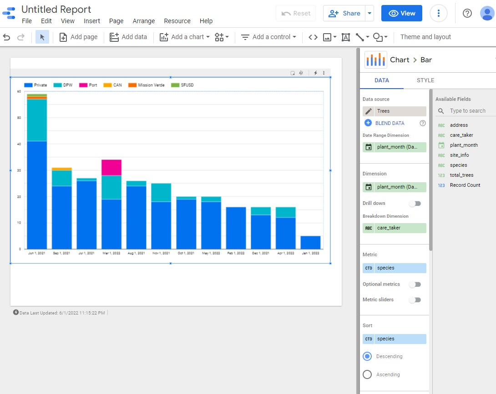

   

   

2. A pie chart showing the percent distribution of trees planted by their species.

   

3. A table chart along with a bar graph representing the number of trees planted by site.


Here are some hints:

- Titles are created using the text tool. In the example, titles were created for each chart and the dashboard itself.
- When a chart is selected, you can edit the colors and font sizes when you click on the **Style** tab on the right-hand side.
- Click on a chart to modify its size and drag it to a new location.

## Congratulations!

You've learned how to build a BI dashboard for visualizing patterns in your business data