Hello everyone, today in this blog post I will discuss how to develop a  Detector of damaged car parts. I want to to train a model to classify images of damaged car parts. For the labeling issue we  won’t need to label images because a labeled dataset in a CSV will be provided. For this project, our model will learn to classify five different damaged car parts: **bumper**, **engine compartment**, **hood**, **lateral**, and **windshield**.

## Introduction.


**Vertex AI** brings together the Google Cloud services for building ML under one, unified UI and API. In Vertex AI, you can now easily train and compare models using [AutoML](https://cloud.google.com/vertex-ai/docs/beginner/beginners-guide/) or custom code training and all your models are stored in one central model repository. These models can now be deployed to the same endpoints on Vertex AI.

**AutoML Vision** helps anyone with limited Machine Learning (ML) expertise train high quality image classification models. In this hands-on lab, you will learn how to produce a custom ML model that automatically recognizes damaged car parts.

Once you’ve produced your ML model, it’ll be immediately available for use. You can use the UI or the REST API to start generating predictions directly from the Google Cloud Console.


## Step 1 - Activate Cloud Shell

First we login into our console of  Google Cloud Platform (GCP) account 

[https://cloud.google.com](https://cloud.google.com)


Then after you login to your Cloud Console  in the top right toolbar, click the **Activate Cloud Shell** button.


Click **Continue**.


It takes a few moments to provision and connect to the environment. When you are connected, you are already authenticated, and the project is set to your *PROJECT_ID*. For example:


`gcloud` is the command-line tool for Google Cloud. It comes pre-installed on Cloud Shell and supports tab-completion.

You can list the active account name with this command:

```
gcloud auth list
```

then you should **authorize**


you will have something like

```
ACTIVE: *
ACCOUNT: username-xxxxxxxxxxxx@yourmail.com
To set the active account, run:
    $ gcloud config set account `ACCOUNT`
```

You can list the project ID with this command:

```
gcloud config list project
```

for example the output may be similar like

```
[core]
project = <project_ID>
```

## Setup your project

```
gcloud projects list
```

you will get something like

```
PROJECT_ID: project-303412
NAME: My First Project
PROJECT_NUMBER: 703241759401

PROJECT_ID: project-303412-295722
NAME: My Second Project
PROJECT_NUMBER: 60365340689287

PROJECT_ID: ruslanmv
NAME: ruslanmv
PROJECT_NUMBER: 471334703161
.
.
.
```

Switch to intended project:

```
gcloud config set project `PROJECT ID`
```

for example, I have created a project called ruslanmv, so I can use this project by typing

```
gcloud config set project ruslanmv
```

```
Updated property [core/project].
```

```
gcloud config list project
```

```
[core]
project = <project_ID>
```

```
ruslanmv@cloudshell:~ (ruslanmv)$ gcloud config list project
[core]
project = ruslanmv

Your active configuration is: [cloudshell-8157]
```

## Upload training images to Cloud Storage

In this task you will upload the training images you want to use to Cloud Storage. 

### Create a Cloud Storage bucket

1. To start, open a new Cloud Shell window and execute the following commands to set some environment variables:

```
export PROJECT_ID=$DEVSHELL_PROJECT_ID
export BUCKET=$PROJECT_ID
```

Next, to create a Cloud Storage bucket, execute the following command:

```
gsutil mb -p $PROJECT_ID \
    -c standard    \
    -l us-central1 \
    gs://${BUCKET}
```

### Upload car images to your Storage Bucket

The training images are publicly available in a Cloud Storage bucket. 

To copy images into your Cloud Storage bucket, execute the following command:

```
gsutil -m cp -r gs://car_damage_lab_images/* gs://${BUCKET}
```

1. In the navigation pane, click **Cloud Storage** > **Browser**.
2. Click the **Refresh** button at the top of the Cloud Storage browser.
3. Click on your bucket name. You should see five folders of photos for each of the five different damaged car parts to be classified:

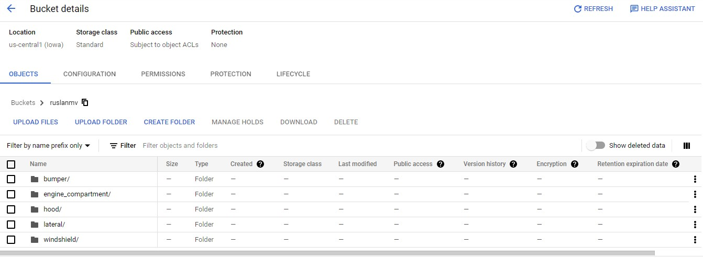

Great! Your car images are now organized ready to for training.

## Create a dataset

In this part we create a new dataset and connect your dataset to your training images to allow Vertex AI to access them.

Normally, you would create a CSV file where each row contains a URL to a training image and the associated label for that image. In this case, the CSV file has been created for you; you just need to update it with your bucket name and upload the CSV file to your Cloud Storage bucket.

### Update the CSV file

Copy and paste the script templates below into Cloud Shell and press enter to update, and upload the CSV file.

To create a copy of the file, execute the following command:

```
gsutil cp gs://car_damage_lab_metadata/data.csv .
```

To update the CSV with the path to your storage, execute the following command:

```
sed -i -e "s/car_damage_lab_images/${BUCKET}/g" ./data.csv
```

Verify your bucket name was inserted into the CSV properly:

```
cat ./data.csv
```

To upload the CSV file to your Cloud Storage bucket, execute the following command:

```
gsutil cp ./data.csv gs://${BUCKET}
```

Once the command completes, click the **Refresh** button at the top of the Cloud Storage browser and open your bucket.

Confirm that the `data.csv` file is listed in your bucket.


### Create a managed dataset

In the Google Cloud Console, on the **Navigation menu** (≡) click **Vertex AI** > **Dashboard**.

Click **Enable Vertex AI API**.


From the Vertex AI navigation menu on the left, click **Datasets**.

At the top of the console, click **+ Create**.

1. For Dataset name, type `damaged_car_parts`.
2. Select **Image classification (Single label)**. (Note: in your own projects, you may want to check the "Multi-label Classification" box if you're doing [multi-class classification](https://cloud.google.com/vision/automl/docs/datasets)).

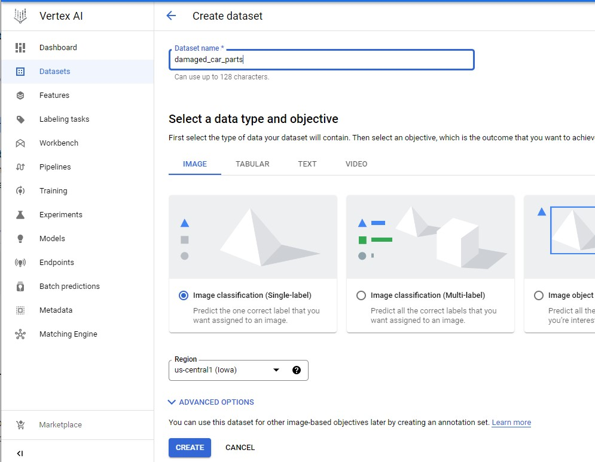

1. Click **Create**.

### Connect your dataset to your training images

In this section, you will choose the location of your training images that you uploaded in the previous step.

1. In the **Select an import method** section, click **Select import files from Cloud Storage**.

1. In the **Select import files from Cloud Storage** section, click **Browse**.
2. Follow the prompts to navigate to your storage bucket and click your `data.csv` file. Click **Select**.


1. Once you've properly selected your file, a green checkbox appears to the left of the file path. Click **Continue** to proceed.

**Note:** It will take around 9 to 12 minutes for your images to import and be aligned with their categories. You’ll need to wait for this step to complete before checking your progress.

Once the import has completed, prepare for the next section by clicking the **Browse** tab. *(Hint: You may need to refresh the page to confirm.)*

## Inspect images

In this task, you examine the images to ensure there are no errors in your dataset.


### Check image labels

1. If your browser page has refreshed, click **Datasets** , select your image name, and then click **Browse**.
2. Under **Filter labels**, click any one of the labels to view the specific training images. *(Example: engine_compartment.)*


**Note:** If you were building a production model, you'd want *at least* 100 images per label to ensure high accuracy. This is just a demo so only 20 images of each type were used so the model could train quickly.

1. If an image is labeled incorrectly, you can click on it to select the correct label or delete the image from your training set:

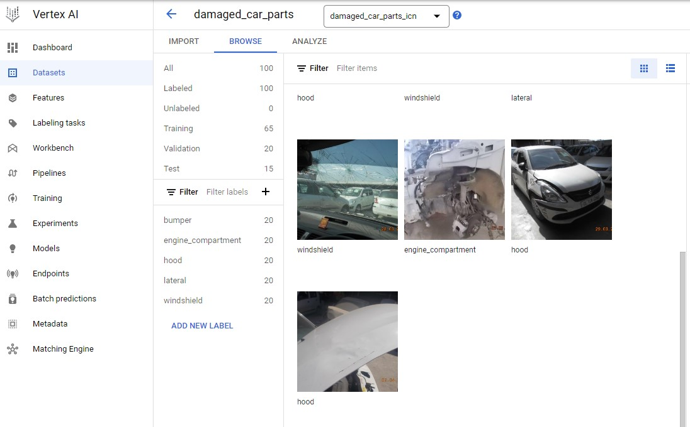

1. Next, click on the **Analyze** tab to view the number of images per label. The **Label Stats** window appears on the right side of your browser.


**Note:** If you need help labeling your dataset, [Vertex AI Labeling Services](https://cloud.google.com/vertex-ai/docs/datasets/data-labeling-job) lets you work with human labelers to generate highly accurate labels.

## Train your model

You're ready to start training your model! Vertex AI handles this for you automatically, without requiring you to write any of the model code.

1. From the right-hand side, click **Train New Model**.

   

1. From the **Training method** window, leave the default configurations and select **AutoML** as the training method. Click **Continue**.


1. From the **Model details** window, enter a name for your model, use: `damaged_car_parts_model`.
2. From the **Explainability** window, click **continue** and for **Compute and pricing** window, set your budget to **8** maximum node hours.


1. Click **Start Training**.

**Note:** Model training will take roughly 30 minutes to complete.


## Evaluate your model

In this task, you evaluate your model. This will vary based on the metrics you chose for your model. Ideally, you’ll work with a data scientist at this point to verify the accuracy of your model.

1. Navigate to your newly trained model. Click on the **Evaluate** tab. This tab displays information about Precision and Recall of the model. It should resemble the following:

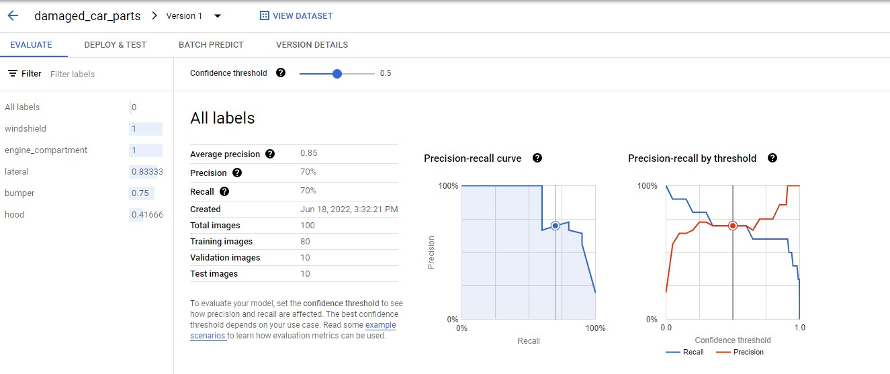

1. You can also adjust the **Confidence threshold** slider to see its impact.
2. Scroll down to view the **Confusion matrix**.

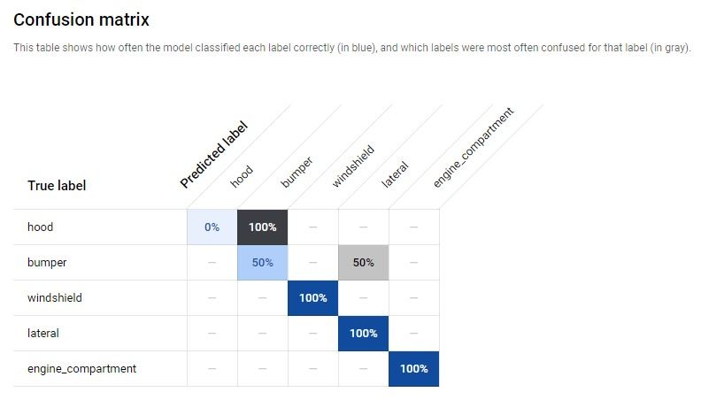

This section provides some common machine learning metrics to help you evaluate your model’s accuracy and identify areas for improvement in your training data.


## Deploy to endpoint

1. From the Vertex AI navigation menu on the left, select **Models**.

2. Click the model you just created (`damaged-car-part-model`) and then click on **Version ID**.

3. Click on **DEPLOY & TEST** tab, click **Deploy to Endpoint**.

4. 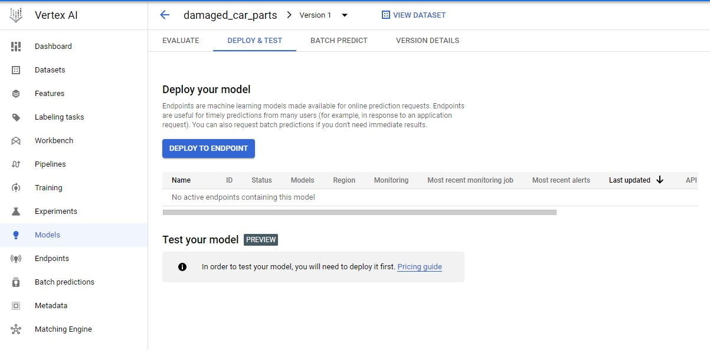

5. For the name, use `damaged-car-part-model-endpoint`. Click **Continue**.

   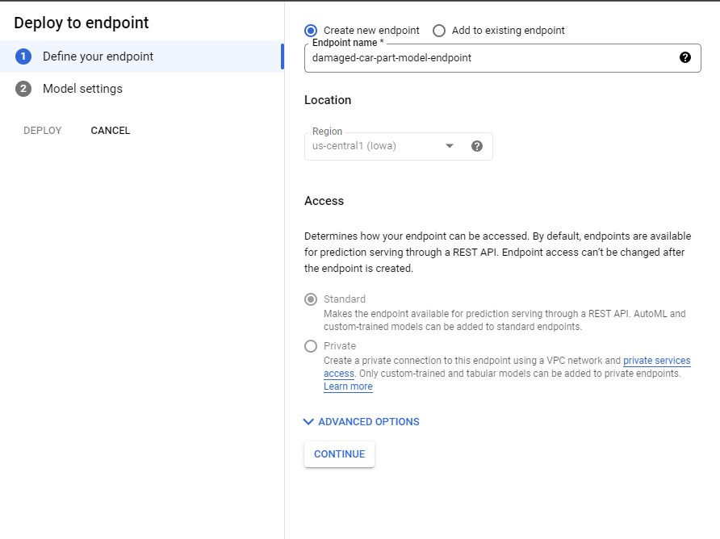

6. Keep the Traffic Split and Logging as default and set the **Number of compute nodes** to **1**.

   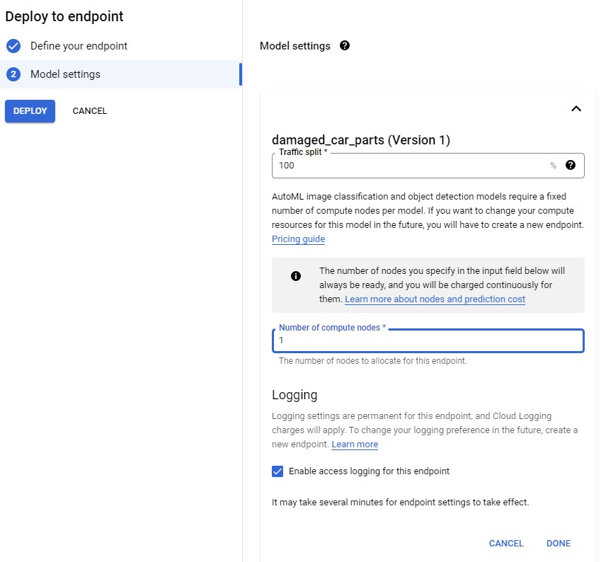

7. Click **Done**. Then click **Deploy**.

   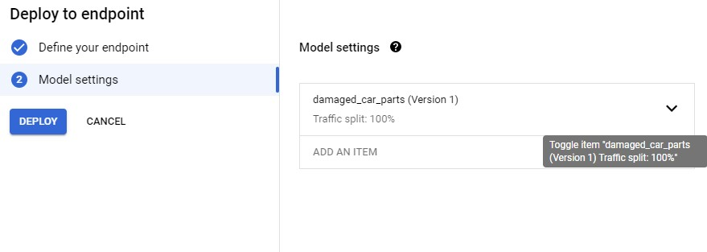

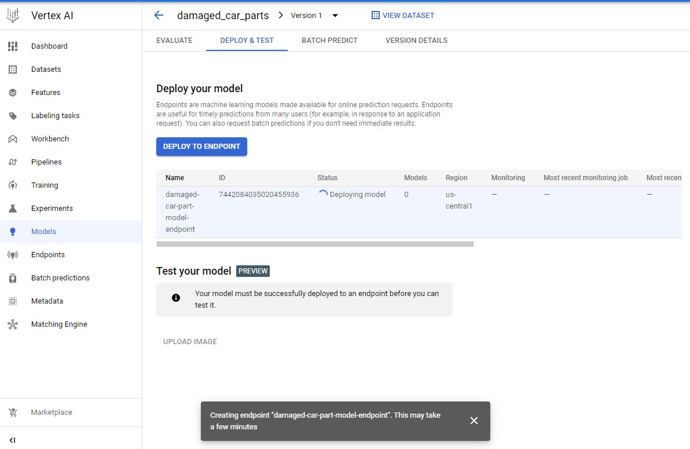

This can take up to 10 minutes to deploy.

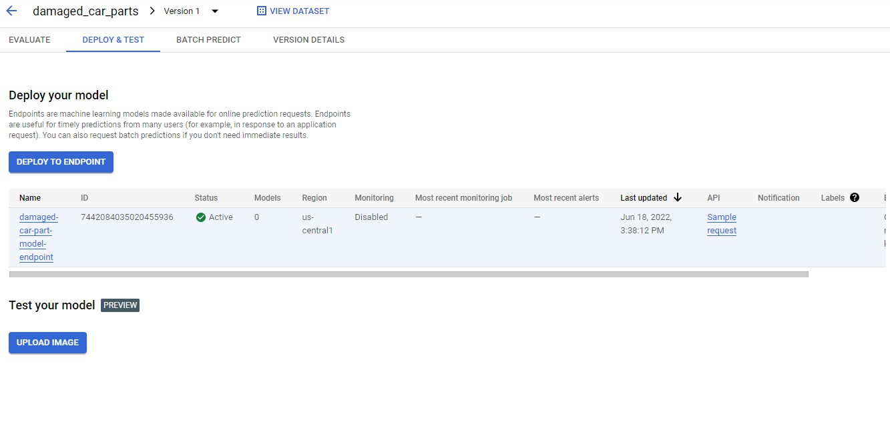

## Generate predictions

Now it's time for the most important part: generating predictions on your trained model using data it hasn't seen before.

There are a few ways to generate predictions. In this lab you'll use the UI to upload new images and see how your model classifies the following images:

- Damaged bumper
- Damaged engine compartment
- Damage to the hood and the bumper. (Note: This last image is a good candidate for a multi-label classification problem)

Download these images to your local machine and then upload them to the model:

1. Right-click on each image below, then select **Save image As…**
2. Follow the prompts to save each image with a unique name.


1. In the Cloud console, navigate to the **Deploy & Test** tab in the Vertex AI UI.
2. Under your newly deployed endpoint, click the **Upload Image** button under **Test your model**.

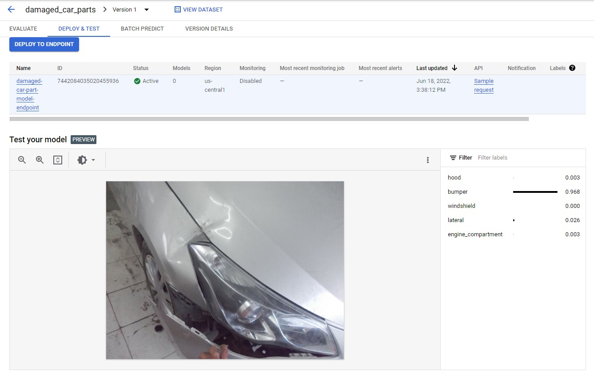

1. Follow the prompts to select and upload the sample images you just saved to your local disk. When the prediction requests complete you should see something like the following:


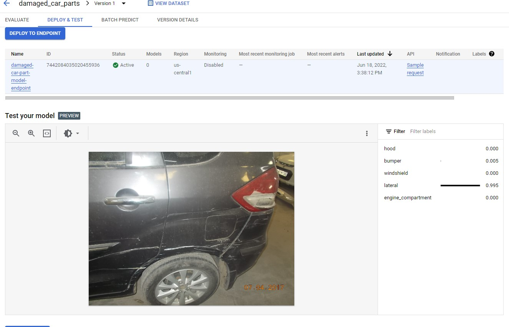

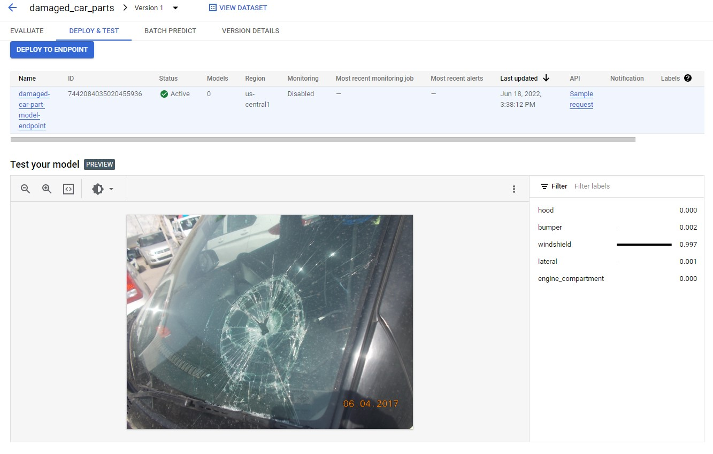

**Attention.** After have been used the endpoints, please shutdown all the endpoints and models and disable the vertex AI to avoid extra charges.


**Congratulations!** We have learned how to train a custom machine learning model and generate predictions on it through the web UI.  We have uploaded a training images to Cloud Storage and used a CSV file for Vertex AI to find these images.  We have  inspected the labeled images for any discrepancies before finally evaluating a trained model. 