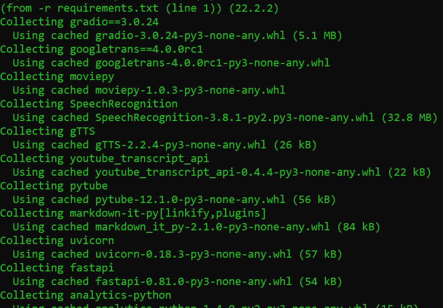

Hello everyone, today we are going to build an interesting application in **Python** that translates the audio language from **YouTube**  into another **language**.

This interesting tool may be useful, for example if you want to see any video from **YouTube**  that you cannot understand and you can translate the video into your favorite language. Moreover can be helpful to people who has visual problems and but can listen as well.

For example if you have this video in **English**, 

<iframe src="https://player.vimeo.com/video/746346327?h=e96b96f665&amp;badge=0&amp;autopause=0&amp;player_id=0&amp;app_id=58479" width="500" height="281" frameborder="0" allow="autoplay; fullscreen; picture-in-picture" allowfullscreen title="Youtube Video Translator - English ( Original)"></iframe>

and you want to translate for example to **Spanish** 

<iframe src="https://player.vimeo.com/video/746366015?h=6b97c6c27c&amp;badge=0&amp;autopause=0&amp;player_id=0&amp;app_id=58479" width="500" height="281" frameborder="0" allow="autoplay; fullscreen; picture-in-picture" allowfullscreen title="Youtube Video Translator - Video translated into Spanish (MX)"></iframe>

or even to **Japanese**.

<iframe src="https://player.vimeo.com/video/746346369?h=392d2d8750&amp;title=0&amp;byline=0&amp;portrait=0&amp;speed=0&amp;badge=0&amp;autopause=0&amp;player_id=0&amp;app_id=58479" width="500" height="281" frameborder="0" allow="autoplay; fullscreen; picture-in-picture" allowfullscreen title="Youtube Video Translator -  Video translated to Japanse"></iframe>


# Introduction 

I have developed this program by taking the **subscripts** of **YouTube** and **translating** them, if they do not exist, then the audio is extracted, and is applied the technique of **speech recognition** and then applied the technique of **text to speech** then it is replaced the audio-video with the translated audio.

Notice that this program is **not designed** to translate **musical videos** or **videos larger than 10 minutes**. Because there are limits to the **APIs** used in this program. Moreover, the quality of the audio should be good.

Well, it is time to explain how to use this program, first of all, we need to create our environment.

## Step 1. Creation of the environment

### Installation of Conda

First you need to install anaconda at this [link](https://www.anaconda.com/products/individual)


additionally we need **Git** , you can download [here](https://git-scm.com/downloads).

You can create an environment called **youtube-translator**, but you can put the name that you like.

```
conda create -n youtube-translator python==3.8
```

If you are running anaconda for first time, you should init conda with the shell that you want to work, in this case I choose the cmd.exe

```
conda init cmd.exe
```

and then close and open the terminal

```
conda activate youtube-translator
```

if you want to use the notebook to run this app  type the following commands:

```
conda install ipykernel
python -m ipykernel install --user --name youtube-translator --display-name "Python (Youtube)"
```

For this project, we need to install the following repository

```
git clone https://github.com/ruslanmv/Youtube-Video-Translator.git
```

then we enter the directory

```
cd Youtube-Video-Translator.git
```

then you enter the folder that has been created

```
cd Youtube-Video-Translator
```

and for today, we  are going to run a simple WebApp so go to the folder gradio

```
cd gradio
```

and then we install all the requirements by typing

```
pip install -r requirements.txt
```

once was installed  then you are ready to execute the app.



## Step 2.  Run the app


To execute the app just type

```
python app.py
```

and then  you will see


then copy the **local URL** and open your favorite **web browser**and paste it,  

or just click  [http://127.0.0.1:7860/](http://127.0.0.1:7860/) and it will open something like


Then just for example click over **the first example** and **click submit** , you wait like a minute


and then play.

You can choose the **initial language** that is the source **originally** and the **final language** is the language that you want.

The previous **English** video also can be translated into **German**


<iframe src="https://player.vimeo.com/video/746346337?h=757bf0bf74&amp;badge=0&amp;autopause=0&amp;player_id=0&amp;app_id=58479" width="500" height="281" frameborder="0" allow="autoplay; fullscreen; picture-in-picture" allowfullscreen title="Youtube Video Translator -  Video translated to German"></iframe>

and **Italian**

<iframe src="https://player.vimeo.com/video/746346357?h=7966a7a290&amp;title=0&amp;byline=0&amp;portrait=0&amp;speed=0&amp;badge=0&amp;autopause=0&amp;player_id=0&amp;app_id=58479" width="500" height="281" frameborder="0" allow="autoplay; fullscreen; picture-in-picture" allowfullscreen title="Youtube Video Translator -  Video translated to Italian"></iframe>


For more videos, you can visit **live version** of this program here :

[https://huggingface.co/spaces/ruslanmv/Youtube-Video-Translator](https://huggingface.co/spaces/ruslanmv/Youtube-Video-Translator)

**Congratulations!**   You have played with me in creating amazing videos from **YouTube** with **Python**.