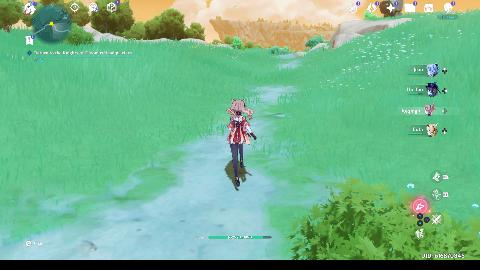
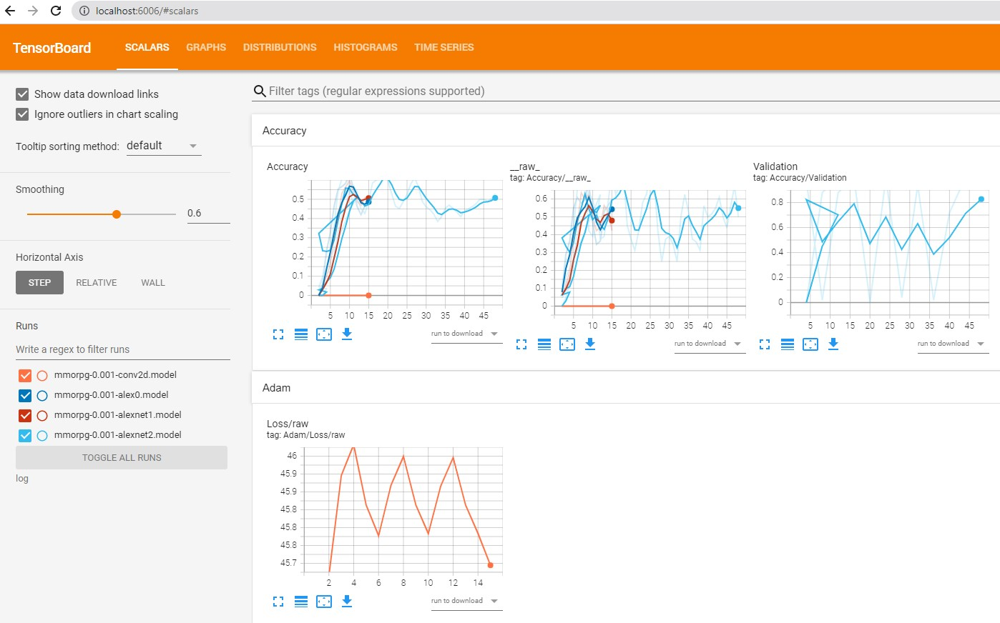
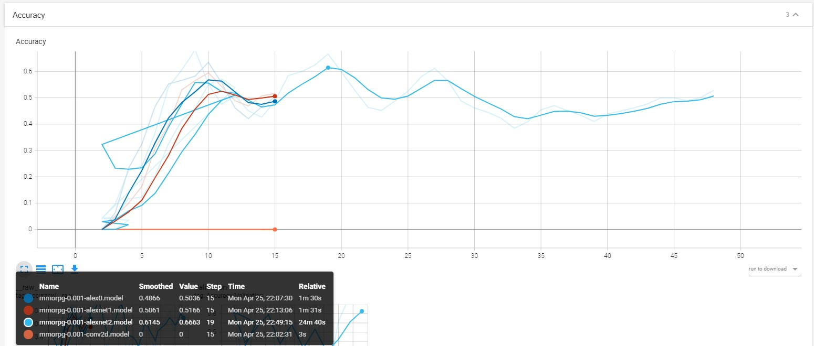
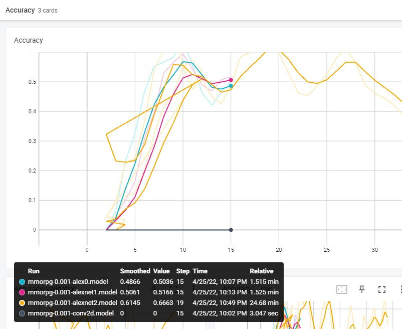

Hello everyone today we are going to create a Neural Network by using **Tensorflow** and we will analyze it with **TensorBoard.** The interesting thing of this post is that I will deal a custom dataset that I don't know a priory which is neural network to use. So I will start writing the program from scratch.


What I want to predict are the keys of a gamepad of a gameplay of one videogame


# Introduction

First you have to install Tensorflow

1. Download and install [Anaconda](https://www.anaconda.com/download/) 

2. On Windows open the Start menu and open an Anaconda Command Prompt. On macOS or Linux open a terminal window. Use the default bash shell on macOS or Linux.

3. Choose a name for your TensorFlow environment, such as “tf”.

4. To install the current release of CPU-only TensorFlow, recommended for beginners:

   ```
   conda create -n tf tensorflow
   conda activate tf
   ```

   Or, to install the current release of GPU TensorFlow on Linux or Windows:

   ```
   conda create -n tf-gpu tensorflow-gpu
   conda activate tf-gpu
   ```

**TensorFlow** is now installed and ready to use


```
pip install pandas sklear tensorboard jupyter-tensorboard matplotlib PIL
```

then you can create new notebook. and proceed as follows:

# Importing Libraries


```python
import pandas as pd
from sklearn.model_selection import train_test_split
import numpy as np
import io
from IPython.display import clear_output, Image, display
import PIL.Image
from matplotlib import pyplot as plt
import logging, sys
logging.disable(sys.maxsize)
```


```python
# We define the size of the pictures
WIDTH = 480
HEIGHT = 270
```

# Getting the data
The data that I will use I have created from the MMORPG Project [here](https://github.com/purplnecropanda/BOT-MMORPG-AI).  The RPG Game used here is Genshin Impact.

Genshin Impact is an action role-playing game developed by Chinese company miHoYo, and first published in 2020. The game features an anime-style open-world environment and an action-based battle system using elemental magic and character-switching.

First you should download the data for this project. The data were obtained from the MMORPG Project [here](https://github.com/purplnecropanda/BOT-MMORPG-AI). I will take an small dataset , just for didactical purposes.


```python
#We load the images of the gameplay
x_training_data=pd.read_pickle('data/dfx-0.pkl')  
#We load the inputs of the of the gameplay
y_training_data=pd.read_pickle('data/dfy-0.pkl')  
```


```python
x_training_data.shape
```


    (250, 270)

There are 250 pictures with resolutionn WIDTH = 480 and HEIGHT = 270 with 3 colors rgb

We define some helper functions


```python
def df_to_numpy_image(df_image_clean,index):
    #select the row with index label 'index'
    image_clean=df_image_clean.loc[[index]].T.to_numpy()
    lists =image_clean.tolist()
    # Nested List Comprehension to flatten a given 2-D matrix
    # 2-D List
    matrix = lists
    flatten_matrix = [val.tolist() for sublist in matrix for val in sublist]
    # converting list to array
    arr = np.array(flatten_matrix)
    return arr
```


```python
def df_to_numpy_input(df_input,index): 
    # flattening a 2d numpy array
    # into 1d array
    # and remove dtype at the end of numpy array
    lista=df_input.loc[[index]].values.tolist()
    arr=np.array(lista).ravel()
    return arr
```


```python
def showarray(a, fmt='jpeg'):
    a_n = np.uint8(np.clip(a, 0, 255))
    try :
        f = io.BytesIO()
        PIL.Image.fromarray(a_n).save(f, fmt)
        display(Image(data=f.getvalue()))
    except:
        #a = a[:, :, ::-1] # convert image from RGB (skimage) to BGR (opencv)
        # display image   
        plt.imshow(a)
        plt.show()  
```


```python
def show_actions(X,Y,index_to_select):
    dato=[Y[index_to_select]]
    columna=['W', 'S', 'A', 'D', 'WA', 'WD', 'SA', 'SD','NOKEY','LT', 'RT', 'Lx', 'Ly', 'Rx', 'Ry', 'UP', 'DOWN', 'LEFT', 'RIGHT',
           'START', 'SELECT', 'L3', 'R3', 'LB', 'RB', 'A', 'B', 'X', 'Y']
    df_pred = pd.DataFrame(dato,columns=columna)
    df_pred_transposed = df_pred.T 
    print(df_pred_transposed) 
    showarray(X[index_to_select])
```

# Creation of train and test split


```python
X_train, X_valid, y_train, y_valid = train_test_split(x_training_data, y_training_data, test_size=0.2, random_state=6)
```

Now, the training data and testing data are both labeled datasets. The training data is what we'll fit the neural network with, and the test data is what we're going to use to validate the results. The test data will be "out of sample," meaning the testing data will only be used to test the accuracy of the network, not to train it.

Next, we're going to create our data arrays.

Due to we cannot feed value of shape **(64, 270, 480, 3)** for Tensor input/X:0, which has shape **(?, 480, 270, 3)** we need to use **reshape(-1,WIDTH,HEIGHT,3)**

**For the train part**


```python
# Train Image part ( 4 Dimensional)
X_image = np.array([df_to_numpy_image(X_train,i) for i in X_train.index])
X=X_image.reshape(-1,WIDTH,HEIGHT,3)

#Train Input part ( 1 Dimensional )
Y = [df_to_numpy_input(y_train,i) for i in y_train.index]
```

**For the test part**


```python
# Test Image part ( 4 Dimensional)
test_image = np.array([df_to_numpy_image(X_valid,i) for i in X_valid.index])
test_x=test_image.reshape(-1,WIDTH,HEIGHT,3)

## Test Input part( 1 Dimensional )
test_y = [df_to_numpy_input(y_valid,i) for i in y_valid.index]
```


```python
print( 'You have ' + str(len(X)) +  " pictures to train and " +str(len(test_x))+ " pictures to test" )
```

    You have 200 pictures to train and 50 pictures to test


Le tus print some outpus that we want to predict:


```python
show_actions(X_image,Y,0)
```

            0
    W       0
    S       0
    A       0
    D       0
    WA      0
    WD      0
    SA      0
    SD      0
    NOKEY   1
    LT      0
    RT      0
    Lx      0
    Ly      1
    Rx      0
    Ry      0
    UP      0
    DOWN    0
    LEFT    0
    RIGHT   0
    START   0
    SELECT  0
    L3      0
    R3      0
    LB      0
    RB      0
    A       0
    B       0
    X       0
    Y       0



    


# Neural Network creation

In ordering to create a Neural Network, we have to foccus mainly into two values that give us an estimation of the quality of our model, is the **accuracy** and the **loss**.

## Accuracy
Accuracy is more straightforward. It measures how well our model predicts by comparing the model predictions with the true values in terms of percentage.

## Loss
Loss is a value that represents the summation of errors in our model. It measures how well (or bad) our model is doing. If the errors are high, the loss will be high, which means that the model does not do a good job. Otherwise, the lower it is, the better our model works.

The validation loss is greater than the training loss. This usually indicates that the model is overfitting, and cannot generalize on new data.


Let us try to find a Neural network with **High accuracy** and **Low Loss**, it is not easy task!.

Next, we're ready to define our neural network:

# Convolution Network

Let us star with something simple.


```python
import tflearn
from tflearn.layers.conv import conv_2d, max_pool_2d,avg_pool_2d, conv_3d, max_pool_3d, avg_pool_3d
from tflearn.layers.core import input_data, dropout, fully_connected
from tflearn.layers.estimator import regression
from tflearn.layers.normalization import local_response_normalization
from tflearn.layers.merge_ops import merge
```


```python
def conv2d(width, height, lr, output=29):
    convnet = input_data(shape=[None, WIDTH, HEIGHT, 3], name='input')
    convnet = conv_2d(convnet, 32, 5, activation='relu')
    convnet = max_pool_2d(convnet, 5)

    convnet = fully_connected(convnet, 1024, activation='relu')
    convnet = dropout(convnet, 0.8)

    convnet = fully_connected(convnet, 29, activation='softmax')
    convnet = regression(convnet, optimizer='adam', learning_rate=LR, loss='categorical_crossentropy', name='targets')
    model = tflearn.DNN(convnet, tensorboard_dir='log')
    return model
```

What we have here is a nice, 29 layered convolutional neural network, with a fully connected layer, and then the output layer.


```python
LR = 1e-3
MODEL_NAME = 'mmorpg-{}-{}.model'.format(LR, 'conv2d') 
MODEL_NAME
```


    'mmorpg-0.001-conv2d.model'


```python
model = conv2d(WIDTH, HEIGHT,  LR, output=29)
```

Possible Issues if you get RESOURCE_EXHAUSTED.
There are multiple things you can do:

- Decrease batch size
- Decrease model input size
- Decrease other model properties such as filter size
- Get better hardware

You can use numba library to release all the gpu memory

```
pip install numba 
from numba import cuda 
device = cuda.get_current_device()
device.reset()
```


```python
model.fit(X, Y, n_epoch=5, validation_set=0.1, shuffle=True,
          show_metric=True, batch_size=64, snapshot_step=200,
          snapshot_epoch=False, run_id=MODEL_NAME)
```

    Training Step: 15  | total loss: [1m[32m45.78939[0m[0m | time: 0.667s
    | Adam | epoch: 005 | loss: 45.78939 - acc: 0.0000 -- iter: 180/180


By analizing this network is overfitting, te loss is huge! so we need create a good network

# Alexnet Network


```python
import tflearn
from tflearn.layers.core import input_data, dropout, fully_connected
from tflearn.layers.conv import conv_2d, max_pool_2d
from tflearn.layers.normalization import local_response_normalization
from tflearn.layers.estimator import regression
```


```python
LR = 1e-3
MODEL_NAME = 'mmorpg-{}-{}.model'.format(LR, 'alex0') 
MODEL_NAME
```


    'mmorpg-0.001-alex0.model'


```python
def alexnet(width, height, lr, output=29):
    # Building 'AlexNet'
    network = input_data(shape=[None, width, height, 3])
    network = conv_2d(network, 96, 11, strides=4, activation='relu')
    network = max_pool_2d(network, 3, strides=2)
    network = local_response_normalization(network)
    network = conv_2d(network, 256, 5, activation='relu')
    network = max_pool_2d(network, 3, strides=2)
    network = local_response_normalization(network)
    network = conv_2d(network, 384, 3, activation='relu')
    network = conv_2d(network, 384, 3, activation='relu')
    network = conv_2d(network, 256, 3, activation='relu')
    network = max_pool_2d(network, 3, strides=2)
    network = local_response_normalization(network)
    network = fully_connected(network, 4096, activation='tanh')
    network = dropout(network, 0.5)
    network = fully_connected(network, 4096, activation='tanh')
    network = dropout(network, 0.5)
    network = fully_connected(network, 29, activation='softmax')
    network = regression(network, optimizer='momentum',
                         loss='categorical_crossentropy',
                         learning_rate=0.001)

    # Training
    model = tflearn.DNN(network, checkpoint_path='model_alexnet',
                        max_checkpoints=1, tensorboard_verbose=2, tensorboard_dir='log')

    return model
```

from numba import cuda 
device = cuda.get_current_device()
device.reset()


```python
model = alexnet(WIDTH, HEIGHT, LR, output=29)
```


```python
model.fit(X, Y, n_epoch=5, validation_set=0.1, shuffle=True,
          show_metric=True, batch_size=64, snapshot_step=200,
          snapshot_epoch=False, run_id=MODEL_NAME)
```

    Training Step: 15  | total loss: [1m[32m1.90749[0m[0m | time: 20.594s
    | Momentum | epoch: 005 | loss: 1.90749 - acc: 0.5036 -- iter: 180/180

```python
print('SAVING MODEL!')
model.save(MODEL_NAME)   
```

    SAVING MODEL!


# Full code 1


```python
import pandas as pd
from sklearn.model_selection import train_test_split
import numpy as np
import io
from IPython.display import clear_output, Image, display
import PIL.Image
from matplotlib import pyplot as plt
import logging, sys
logging.disable(sys.maxsize)
import tflearn
from tflearn.layers.core import input_data, dropout, fully_connected
from tflearn.layers.conv import conv_2d, max_pool_2d
from tflearn.layers.normalization import local_response_normalization
from tflearn.layers.estimator import regression
import os
# We define the size of the pictures
WIDTH = 480
HEIGHT = 270

LR = 1e-3
MODEL_NAME = 'mmorpg-{}-{}.model'.format(LR, 'alexnet1') 

if os.path.exists('{}.meta'.format(MODEL_NAME)):
    model.load(MODEL_NAME)
    print('model loaded!')

#We load the images of the gameplay
x_training_data=pd.read_pickle('data/dfx-0.pkl')  
#We load the inputs of the of the gameplay
y_training_data=pd.read_pickle('data/dfy-0.pkl')  

def df_to_numpy_image(df_image_clean,index):
    #select the row with index label 'index'
    image_clean=df_image_clean.loc[[index]].T.to_numpy()
    lists =image_clean.tolist()
    # Nested List Comprehension to flatten a given 2-D matrix
    # 2-D List
    matrix = lists
    flatten_matrix = [val.tolist() for sublist in matrix for val in sublist]
    # converting list to array
    arr = np.array(flatten_matrix)
    return arr

def df_to_numpy_input(df_input,index): 
    # flattening a 2d numpy array
    # into 1d array
    # and remove dtype at the end of numpy array
    lista=df_input.loc[[index]].values.tolist()
    arr=np.array(lista).ravel()
    return arr
def alexnet(width, height, lr, output=29):
    # Building 'AlexNet'
    network = input_data(shape=[None, width, height, 3])
    network = conv_2d(network, 96, 11, strides=4, activation='relu')
    network = max_pool_2d(network, 3, strides=2)
    network = local_response_normalization(network)
    network = conv_2d(network, 256, 5, activation='relu')
    network = max_pool_2d(network, 3, strides=2)
    network = local_response_normalization(network)
    network = conv_2d(network, 384, 3, activation='relu')
    network = conv_2d(network, 384, 3, activation='relu')
    network = conv_2d(network, 256, 3, activation='relu')
    network = max_pool_2d(network, 3, strides=2)
    network = local_response_normalization(network)
    network = fully_connected(network, 4096, activation='tanh')
    network = dropout(network, 0.5)
    network = fully_connected(network, 4096, activation='tanh')
    network = dropout(network, 0.5)
    network = fully_connected(network, 29, activation='softmax')
    network = regression(network, optimizer='momentum',
                         loss='categorical_crossentropy',
                         learning_rate=0.001)

    # Training
    model = tflearn.DNN(network, checkpoint_path='model_alexnet',
                        max_checkpoints=1, tensorboard_verbose=2, tensorboard_dir='log')

    return model

X_train, X_valid, y_train, y_valid = train_test_split(x_training_data, y_training_data, test_size=0.2, random_state=6)

# Train Image part ( 4 Dimensional)
X_image = np.array([df_to_numpy_image(X_train,i) for i in X_train.index])
X=X_image.reshape(-1,WIDTH,HEIGHT,3)

#Train Input part ( 1 Dimensional )
Y = [df_to_numpy_input(y_train,i) for i in y_train.index]


# Test Image part ( 4 Dimensional)
test_image = np.array([df_to_numpy_image(X_valid,i) for i in X_valid.index])
test_x=test_image.reshape(-1,WIDTH,HEIGHT,3)

## Test Input part( 1 Dimensional )
test_y = [df_to_numpy_input(y_valid,i) for i in y_valid.index]


model = alexnet(WIDTH, HEIGHT, LR, output=29)


model.fit(X, Y, n_epoch=5, validation_set=0.1, shuffle=True,
          show_metric=True, batch_size=64, snapshot_step=200,
          snapshot_epoch=False, run_id=MODEL_NAME)
print('SAVING MODEL!')
model.save(MODEL_NAME)   
```

    Training Step: 15  | total loss: [1m[32m1.95906[0m[0m | time: 21.006s
    | Momentum | epoch: 005 | loss: 1.95906 - acc: 0.5166 -- iter: 180/180
    SAVING MODEL!


Let us build a more complete program with more data

# Full code 2


```python
import pandas as pd
from sklearn.model_selection import train_test_split
import numpy as np
import io
from IPython.display import clear_output, Image, display
import PIL.Image
from matplotlib import pyplot as plt
import logging, sys
logging.disable(sys.maxsize)
import tflearn
from tflearn.layers.core import input_data, dropout, fully_connected
from tflearn.layers.conv import conv_2d, max_pool_2d
from tflearn.layers.normalization import local_response_normalization
from tflearn.layers.estimator import regression

# We define the size of the pictures
WIDTH = 480
HEIGHT = 270
LR = 1e-3
MODEL_NAME = 'mmorpg-{}-{}.model'.format(LR, 'alexnet2') 
PREV_MODEL = ''
LOAD_MODEL = False
FILE_I_END=4
EPOCHS=3

#We load the images of the gameplay
x_training_data=pd.read_pickle('data/dfx-0.pkl')  
#We load the inputs of the of the gameplay
y_training_data=pd.read_pickle('data/dfy-0.pkl')  

def df_to_numpy_image(df_image_clean,index):
    #select the row with index label 'index'
    image_clean=df_image_clean.loc[[index]].T.to_numpy()
    lists =image_clean.tolist()
    # Nested List Comprehension to flatten a given 2-D matrix
    # 2-D List
    matrix = lists
    flatten_matrix = [val.tolist() for sublist in matrix for val in sublist]
    # converting list to array
    arr = np.array(flatten_matrix)
    return arr

def df_to_numpy_input(df_input,index): 
    # flattening a 2d numpy array
    # into 1d array
    # and remove dtype at the end of numpy array
    lista=df_input.loc[[index]].values.tolist()
    arr=np.array(lista).ravel()
    return arr
def alexnet(width, height, lr, output=29):
    # Building 'AlexNet'
    network = input_data(shape=[None, width, height, 3])
    network = conv_2d(network, 96, 11, strides=4, activation='relu')
    network = max_pool_2d(network, 3, strides=2)
    network = local_response_normalization(network)
    network = conv_2d(network, 256, 5, activation='relu')
    network = max_pool_2d(network, 3, strides=2)
    network = local_response_normalization(network)
    network = conv_2d(network, 384, 3, activation='relu')
    network = conv_2d(network, 384, 3, activation='relu')
    network = conv_2d(network, 256, 3, activation='relu')
    network = max_pool_2d(network, 3, strides=2)
    network = local_response_normalization(network)
    network = fully_connected(network, 4096, activation='tanh')
    network = dropout(network, 0.5)
    network = fully_connected(network, 4096, activation='tanh')
    network = dropout(network, 0.5)
    network = fully_connected(network, 29, activation='softmax')
    network = regression(network, optimizer='momentum',
                         loss='categorical_crossentropy',
                         learning_rate=0.001)

    # Training
    model = tflearn.DNN(network, checkpoint_path='model_alexnet',
                        max_checkpoints=1, tensorboard_verbose=2, tensorboard_dir='log')

    return model

model = alexnet(WIDTH, HEIGHT, LR, output=29)

if LOAD_MODEL:
    model.load(PREV_MODEL)
    print('We have loaded a previous model!!!!')
    
# iterates through the training files
for e in range(EPOCHS):
    data_order = [i for i in range(0,FILE_I_END)]
    #shuffle(data_order)
    for count,i in enumerate(data_order):
        try:
            #processed image rgb color - no image filters
            file_name_x = 'data/dfx-{}.pkl'.format(i)
            file_name_y = 'data/dfy-{}.pkl'.format(i)           
            print(file_name_x)
            #We load the images of the gameplay
            x_training_data=pd.read_pickle(file_name_x)  
            #We load the inputs of the of the gameplay
            y_training_data=pd.read_pickle(file_name_y)  
            X_train, X_valid, y_train, y_valid = train_test_split(x_training_data, y_training_data, test_size=0.2, random_state=6)
            # Train Image part ( 4 Dimensional)
            X_image = np.array([df_to_numpy_image(X_train,i) for i in X_train.index])
            X=X_image.reshape(-1,WIDTH,HEIGHT,3)

            #Train Input part ( 1 Dimensional )
            Y = [df_to_numpy_input(y_train,i) for i in y_train.index]


            # Test Image part ( 4 Dimensional)
            test_image = np.array([df_to_numpy_image(X_valid,i) for i in X_valid.index])
            test_x=test_image.reshape(-1,WIDTH,HEIGHT,3)

            ## Test Input part( 1 Dimensional )
            test_y = [df_to_numpy_input(y_valid,i) for i in y_valid.index]

                     
            model.fit( X, Y, n_epoch=1, 
                      validation_set=(test_x,test_y), 
                      snapshot_step=200, 
                      show_metric=True, 
                      run_id=MODEL_NAME)
            if count%4 == 0:
                print('SAVING MODEL!')
                model.save(MODEL_NAME)                  
        except Exception as e:
            print(str(e))
```

# Tensorboard

TensorBoard is a suite of web applications for inspecting and understanding your TensorFlow runs and graphs.

First you have to go into your terminal where you have created you notebook and there you type


```python
tensorboard --logdir log
```

like my case

```
Microsoft Windows [Version 10.0.19044.1645]
(c) Microsoft Corporation. All rights reserved.

C:\Users\rusla>conda activate tf-gpu

(tf-gpu) C:\Users\ruslanmv>cd C:\Projects\Neural-Networks-from-Scratch

(tf-gpu) C:\Users\Projects\Neural-Networks-from-Scratch>tensorboard --logdir log

TensorBoard 2.8.0 at http://localhost:6006/ (Press CTRL+C to quit)
```

then you enter to

[http://localhost:6006/](http://localhost:6006/)



otherwise in Jupiter notebook you can type


```python
%load_ext tensorboard
%tensorboard --logdir log
```

We have tested the following models:

- mmorpg-0.001-conv2d.model

- mmorpg-0.001-alex0.model

- mmorpg-0.001-alexnet1.model

- mmorpg-0.001-alexnet2.model


You can identify that the  best model that have tested is **mmorpg-0.001-alexnet2.model**






What we have to do is try to find different neural networks from here [http://tflearn.org/examples/](http://tflearn.org/examples/) and try to identify which is the best Neural Network adapted to your problem.

In addition try to improve the quality of the input dataset and also define different strategies to apply the neural network. For example for this video game we can improve by creating larger dataset and also performing more processing  images to focalize into the details of the images such was explained in this blog [here](https://ruslanmv.com/blog/How-to-use-OpenCV-with-Games) . You can download the notebook [here](https://github.com/ruslanmv/Neural-Networks-from-Scratch).


**Cogratulations!** You have learned how to create Neural Networks from Scratch from one Unknown dataset with Tensorflow.