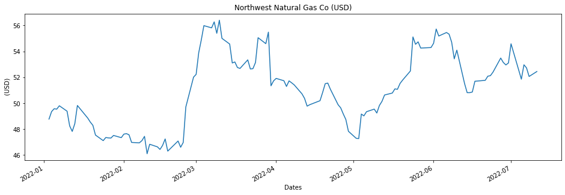
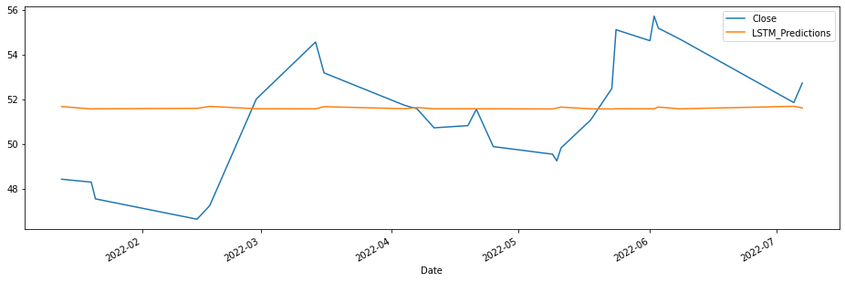
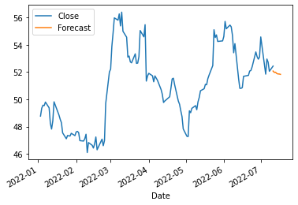
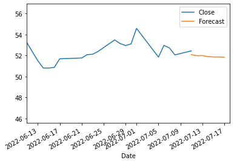
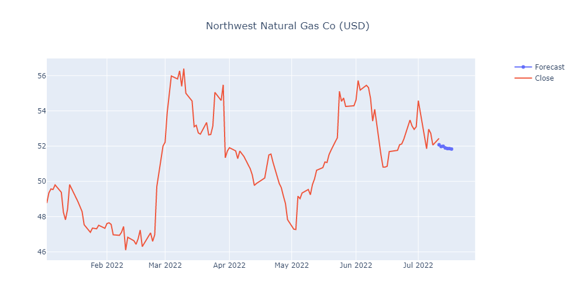

Hello everyone today I am going to **predict** the **Natural Gas Price** using Time Series with Long short-term memory (LSTM) Neural Networks. This project can be used to predict any times series data. In this blog we are going to give you a **Real Prediction** of the **Gas Price** of the **next week.**

The **financial data** that we will use is  **investpy**  that is one of the most complete Python packages when it comes to financial data extraction to stop relying on public/private APIs since investpy is **free** and has **no limitations**.  Is one good of  financial data retrieval.

## Step 1. Creation of the environment

### Installation of Conda

First you need to install anaconda at this [link](https://www.anaconda.com/products/individual)


I will create an environment called **forecast**, but you can put the name that you like.

```
conda create -n forecast python==3.7
```

If you are running anaconda for first time, you should init conda with the shell that you want to work, in this case I choose the cmd.exe

```
conda init cmd.exe
```

and then close and open the terminal

```
conda activate forecast
```

then in your terminal type the following commands:

```
conda install ipykernel
```

```
python -m ipykernel install --user --name forecast --display-name "Python (Forecast)"
```

Then we install **Tensorflow**

```
pip install tensorflow==2.9.0
```

and **Keras**

```
pip install keras==2.9.0
```

If you will work with Forecasting projects I suggest install additional libraries:

```
pip install  statsmodels pandas matplotlib  sklearn  plotly  nbformat seaborn 
```

We need to install investpy which allows the user to download both recent and historical data from all the financial products indexed at Investing.com. 

we type

```
pip install investpy 
```

## Step 2   Download the Recent/Historical Data Retrieval

The following notebook details the process of training a neural network with LSTM models.


```python
import numpy as np
import pandas as pd
from statsmodels.tsa.statespace.sarimax import SARIMAX
from statsmodels.graphics.tsaplots import plot_acf,plot_pacf 
from statsmodels.tsa.seasonal import seasonal_decompose 
import matplotlib.pyplot as plt                       
from sklearn.metrics import mean_squared_error
from statsmodels.tools.eval_measures import rmse
import warnings
warnings.filterwarnings("ignore")
import time
```


```python
from datetime import date
from datetime import datetime
today = date.today()
print("Today's date:", today)
to_today = datetime.strptime(str(today), '%Y-%m-%d').strftime('%d/%m/%Y')
to_date = datetime.strptime(str(today), '%Y-%m-%d').strftime('%Y-%m-%d')
```

    Today's date: 2022-07-11

```python
def addonDays(a, x):
   ret = time.strftime("%Y-%m-%d",time.localtime(time.mktime(time.strptime(a,"%Y-%m-%d"))+x*3600*24+3600))      
   return ret
```


```python
week_ago=addonDays(to_date, -7)
week_ago
```


    '2022-07-04'

## Searching the Financial  Data

The search function allows the user to tune the parameters to adjust the search results to their needs, where both product types and countries from where the products are, can be specified.

For this project we are looking for the price of **Natural Gas** but also can be used to predict prices of  **Crude Oil, Gold, Silver, Copper**, etc.

In the text we write what we want to predict, in this project we use `Natural Gas`.


```python
import investpy

gas_result = investpy.search_quotes(text='Natural Gas', products=['stocks'],
                                       countries=['united states'], n_results=1)
```


```python
print(gas_result)
```

    {"id_": 20413, "name": "Northwest Natural Gas Co", "symbol": "NWN", "country": "united states", "tag": "/equities/northwest-natural-gas-comp", "pair_type": "stocks", "exchange": "NYSE"}


Retrieved search results will be a list. those search results let the user retrieve both recent and historical data,


```python
recent_data = gas_result.retrieve_recent_data()
print(recent_data.head())
```

                 Open   High    Low  Close   Volume  Change Pct
    Date                                                       
    2022-06-13  53.31  53.56  51.28  51.51   214539       -4.77
    2022-06-14  51.19  51.70  50.10  50.81   257471       -1.36
    2022-06-15  50.94  51.63  50.51  50.81   337460        0.00
    2022-06-16  50.28  51.01  49.69  50.86   428673        0.10
    2022-06-17  51.43  51.99  50.56  51.69  1419987        1.63


Its information, the technical indicators, the default currency, etc., as presented in the piece of code below:


```python
historical_data = gas_result.retrieve_historical_data(from_date='01/01/2022', to_date=to_today)
print(historical_data.head())
```

                 Open   High    Low  Close  Volume  Change Pct
    Date                                                      
    2022-01-03  48.90  49.37  48.21  48.77  181573       -0.02
    2022-01-04  49.10  49.79  49.08  49.35  131969        1.19
    2022-01-05  49.47  49.89  49.24  49.57  126793        0.45
    2022-01-06  49.72  49.74  49.27  49.54  130718       -0.06
    2022-01-07  49.55  49.98  49.17  49.80  131915        0.52

```python
information = gas_result.retrieve_information()
print(information)
```

    {'prevClose': 52.06, 'dailyRange': '51.8-52.79', 'revenue': 894760000, 'open': 52.26, 'weekRange': '43.07-57.63', 'eps': 2.42, 'volume': 156807, 'marketCap': 1790000000, 'dividend': '1.93(3.71%)', 'avgVolume': 282206, 'ratio': 21.53, 'beta': 0.45, 'oneYearReturn': '0.12%', 'sharesOutstanding': 34255926, 'nextEarningDate': '11/08/2022'}

```python
default_currency = gas_result.retrieve_currency()
print(default_currency)
```

    USD

```python
technical_indicators = gas_result.retrieve_technical_indicators(interval='daily')
print(technical_indicators)
```

                  indicator           signal    value
    0               RSI(14)          neutral  48.9150
    1            STOCH(9,6)          neutral  45.0020
    2          STOCHRSI(14)         oversold  19.5070
    3           MACD(12,26)              buy   0.2100
    4               ADX(14)          neutral  11.1960
    5           Williams %R             sell -60.4200
    6               CCI(14)          neutral -39.8620
    7               ATR(14)  less_volatility   1.3331
    8        Highs/Lows(14)          neutral   0.0000
    9   Ultimate Oscillator              buy  51.6290
    10                  ROC              buy   1.4510
    11  Bull/Bear Power(13)             sell  -0.9120

```python
import investpy

hist = investpy.get_stock_historical_data(stock='NWN',
                                        country='United States',
                                        from_date='01/01/2022',
                                        to_date=to_today)
print(hist.head())
```

                 Open   High    Low  Close  Volume Currency
    Date                                                   
    2022-01-03  48.90  49.37  48.21  48.77  181573      USD
    2022-01-04  49.10  49.79  49.08  49.35  131969      USD
    2022-01-05  49.47  49.89  49.24  49.57  126793      USD
    2022-01-06  49.72  49.74  49.27  49.54  130718      USD
    2022-01-07  49.55  49.98  49.17  49.80  131915      USD


```python
import plotly.graph_objects as go
fig = go.Figure(data=go.Scatter(x=hist.index,y=hist['Close'], mode='lines'))
fig.update_layout(title={'text':gas_result.name+' ('+ default_currency +')', 'x':0.5})
fig.show()
```

.png)

Drawing an indicator 20 Day Moving Average, pandas provides convenient ways to calculate time series-related metrics such as the moving average. The df.rolling() method provides “moving windows” that we can operate on. To get the average of the moving window, we just need to add the .mean() at the end of the rolling() method.


```python
from plotly.subplots import make_subplots
```

```python
fig2 = make_subplots(specs=[[{"secondary_y": True}]])
fig2.add_trace(go.Candlestick(x=hist.index,
                              open=hist['Open'],
                              high=hist['High'],
                              low=hist['Low'],
                              close=hist['Close'],
                             ))
fig2.add_trace(go.Scatter(x=hist.index,y=hist['Close'].rolling(window=20).mean(),marker_color='blue',name='20 Day MA'))
fig2.add_trace(go.Bar(x=hist.index, y=hist['Volume'], name='Volume'),secondary_y=True)
fig2.update_layout(title={'text':gas_result.name+' ('+ default_currency +')', 'x':0.5})
fig2.update_yaxes(range=[0,1000000000],secondary_y=True)
fig2.update_yaxes(visible=False, secondary_y=True)
fig2.update_layout(xaxis_rangeslider_visible=False)  #hide range slider
fig2.show()
```

.png)

## Step 3 Creation of Dataframe


```python
hist['Date'] = hist.index
```


```python
df = hist[["Date", "Close"]]
df=df.reset_index(drop=True)
```


```python
df.head()
```

<table border="1" class="dataframe">
  <thead>
    <tr style="text-align: right;">
      <th></th>
      <th>Date</th>
      <th>Close</th>
    </tr>
  </thead>
  <tbody>
    <tr>
      <th>0</th>
      <td>2022-01-03</td>
      <td>48.77</td>
    </tr>
    <tr>
      <th>1</th>
      <td>2022-01-04</td>
      <td>49.35</td>
    </tr>
    <tr>
      <th>2</th>
      <td>2022-01-05</td>
      <td>49.57</td>
    </tr>
    <tr>
      <th>3</th>
      <td>2022-01-06</td>
      <td>49.54</td>
    </tr>
    <tr>
      <th>4</th>
      <td>2022-01-07</td>
      <td>49.80</td>
    </tr>
  </tbody>
</table>


```python
df.info()
```

    <class 'pandas.core.frame.DataFrame'>
    RangeIndex: 130 entries, 0 to 129
    Data columns (total 2 columns):
     #   Column  Non-Null Count  Dtype         
    ---  ------  --------------  -----         
     0   Date    130 non-null    datetime64[ns]
     1   Close   130 non-null    float64       
    dtypes: datetime64[ns](1), float64(1)
    memory usage: 2.2 KB

```python
df.Date = pd.to_datetime(df.Date)
```


```python
df = df.set_index("Date")
df.head()
```

<table border="1" class="dataframe">
  <thead>
    <tr style="text-align: right;">
      <th></th>
      <th>Close</th>
    </tr>
    <tr>
      <th>Date</th>
      <th></th>
    </tr>
  </thead>
  <tbody>
    <tr>
      <th>2022-01-03</th>
      <td>48.77</td>
    </tr>
    <tr>
      <th>2022-01-04</th>
      <td>49.35</td>
    </tr>
    <tr>
      <th>2022-01-05</th>
      <td>49.57</td>
    </tr>
    <tr>
      <th>2022-01-06</th>
      <td>49.54</td>
    </tr>
    <tr>
      <th>2022-01-07</th>
      <td>49.80</td>
    </tr>
  </tbody>
</table>


```python
ax = df['Close'].plot(figsize = (16,5), title = gas_result.name+' ('+ default_currency +')')
ax.set(xlabel='Dates', ylabel=' ('+ default_currency +')');
```

   This is the plot of the prices of the Natural Gas 

    


## Step 4 LSTM model training

#### Pre-processing data with MinMaxScaler


```python
from sklearn.model_selection import train_test_split

train_data, test_data = train_test_split(df, test_size=0.2)
```


```python
from sklearn.preprocessing import MinMaxScaler
scaler = MinMaxScaler()
```


```python
scaler.fit(train_data)
scaled_train_data = scaler.transform(train_data)
scaled_test_data = scaler.transform(test_data)
```

Before creating the LSTM model, we need to create a Time Series Generator object.


```python
from keras.preprocessing.sequence import TimeseriesGenerator
# Let's redefine to get 24 days  back and then predict the next day out
n_input = 24
n_features= 1
generator = TimeseriesGenerator(scaled_train_data, scaled_train_data, 
                                length=n_input, batch_size=1)
```

#### Example of transformation


```python
X,y = generator[0]
```


```python
print(f'Given the Array: \n{X.flatten()}')
print(f'Predict this y: \n {y}')
```

    Given the Array: 
    [0.31456311 0.52427184 0.36116505 0.25631068 0.2368932  0.79126214
     0.82427184 0.1368932  0.91067961 0.3592233  0.81941748 0.82330097
     0.52524272 0.6368932  1.         0.11747573 0.12135922 0.61553398
     0.70291262 0.14660194 0.54563107 0.20873786 0.90194175 0.08446602]
    Predict this y: 
     [[0.39223301]]


# Long short-term memory  (LSTM)


Long short-term memory is an artificial neural network used in the fields of artificial intelligence and deep learning. Unlike standard feedforward neural networks, LSTM has feedback connections. Such a recurrent neural network can process not only single data points, but also entire sequences of data.

We are going to present two models of LST, one with a **Single LST** contribution and with **Double LSTM** contribution.


## Step 6 - Single LSTM Model


```python
from keras.models import Sequential
from keras.layers import Dense
from keras.layers import LSTM
lstm_model = Sequential()
lstm_model.add(LSTM(50, activation='relu', input_shape=(n_input, n_features)))
lstm_model.add(Dense(1))
lstm_model.compile(optimizer='adam', loss='mse')
lstm_model.summary()
```

    WARNING:tensorflow:Layer lstm will not use cuDNN kernels since it doesn't meet the criteria. It will use a generic GPU kernel as fallback when running on GPU.
    Model: "sequential"
    _________________________________________________________________
     Layer (type)                Output Shape              Param #   
    =================================================================
     lstm (LSTM)                 (None, 50)                10400     
                                                                     
     dense (Dense)               (None, 1)                 51        
                                                                     
    =================================================================
    Total params: 10,451
    Trainable params: 10,451
    Non-trainable params: 0
    _________________________________________________________________

```python
lstm_model.fit_generator(generator,epochs=20)
```

    Epoch 1/20
    80/80 [==============================] - 9s 97ms/step - loss: 0.1017
    Epoch 2/20
    .
    .
    .
    80/80 [==============================] - 8s 96ms/step - loss: 0.0722
    Epoch 20/20
    80/80 [==============================] - 9s 107ms/step - loss: 0.0717
    
    <keras.callbacks.History at 0x1bf63d0e518>


```python
losses_lstm = lstm_model.history.history['loss']
plt.figure(figsize=(12,4))
plt.xlabel("Epochs")
plt.ylabel("Loss")
plt.xticks(np.arange(0,21,1))
plt.plot(range(len(losses_lstm)),losses_lstm);
```


    


## Step 7 -Prediction on test data

Next we are going to make a prediction for 12 days (12 predictions). To do this we will do the following:

- create an empty list for each of our 12 predictions
- create the batch that our model will predict
- save the prediction in our list
- add the prediction to the end of the batch to use it in the next prediction


```python
lstm_predictions_scaled = list()

batch = scaled_train_data[-n_input:]
current_batch = batch.reshape((1, n_input, n_features))

for i in range(len(test_data)):   
    lstm_pred = lstm_model.predict(current_batch)[0]
    lstm_predictions_scaled.append(lstm_pred) 
    current_batch = np.append(current_batch[:,1:,:],[[lstm_pred]],axis=1)
```

    1/1 [==============================] - 0s 164ms/step
    .
    .
    .
    1/1 [==============================] - 0s 20ms/step
    1/1 [==============================] - 0s 25ms/step


As you know, we scale our data, so we have to invert it to see true predictions.


```python
lstm_predictions_scaled
```


    [array([0.41446185], dtype=float32),
     array([0.4108159], dtype=float32),
    .
    .
    .
     array([0.40563506], dtype=float32)]


```python
lstm_predictions = scaler.inverse_transform(lstm_predictions_scaled)
```


```python
lstm_predictions
```


    array([[50.36895707],
           [50.33140371],
    .
    .
    .
           [50.27945744],
           [50.27830387],
           [50.27804111]])


```python
test_data['LSTM_Predictions'] = lstm_predictions
```


```python
test_data['Close'].plot(figsize = (16,5), legend=True)
test_data['LSTM_Predictions'].plot(legend = True);
```


```python
lstm_rmse_error = rmse(test_data['Close'], test_data["LSTM_Predictions"])
lstm_mse_error = lstm_rmse_error**2
mean_value = df['Close'].mean()

print(f'MSE Error: {lstm_mse_error}\nRMSE Error: {lstm_rmse_error}\nMean: {mean_value}')
```

    MSE Error: 7.840908820950428
    RMSE Error: 2.8001622847525156
    Mean: 50.96569230769231


##  Step 6 -Double LSTM Model


```python
from keras.models import Sequential
from keras.layers import Dense
from keras.layers import LSTM
from keras.callbacks import ModelCheckpoint
from keras.layers import Dropout

lstm_model = Sequential()
lstm_model.add(LSTM(200, activation='relu',return_sequences=True,
                    input_shape=(n_input, n_features)))
lstm_model.add(LSTM(200, return_sequences=True))
lstm_model.add(Dropout(rate=0.2))
lstm_model.add(LSTM(200, return_sequences=False))
lstm_model.add(Dense(1))

mc = ModelCheckpoint('double_model_lstm.h5', monitor='val_loss', mode='min', 
                     verbose=1, save_best_only=True)

lstm_model.summary()
```

    WARNING:tensorflow:Layer lstm_1 will not use cuDNN kernels since it doesn't meet the criteria. It will use a generic GPU kernel as fallback when running on GPU.
    Model: "sequential_1"
    _________________________________________________________________
     Layer (type)                Output Shape              Param #   
    =================================================================
     lstm_1 (LSTM)               (None, 24, 200)           161600    
                                                                     
     lstm_2 (LSTM)               (None, 24, 200)           320800    
                                                                     
     dropout (Dropout)           (None, 24, 200)           0         
                                                                     
     lstm_3 (LSTM)               (None, 200)               320800    
                                                                     
     dense_1 (Dense)             (None, 1)                 201       
                                                                     
    =================================================================
    Total params: 803,401
    Trainable params: 803,401
    Non-trainable params: 0
    _________________________________________________________________

```python
lstm_model.compile(optimizer='adam', loss='mse')
```


```python
lstm_model.fit_generator(generator,epochs=20)
```

    Epoch 1/20
    80/80 [==============================] - 14s 116ms/step - loss: 0.1063
    Epoch 2/20
    80/80 [==============================] - 10s 122ms/step - loss: 0.0803
    Epoch 3/20
    .
    .
    .
    Epoch 19/20
    80/80 [==============================] - 11s 133ms/step - loss: 0.0735
    Epoch 20/20
    80/80 [==============================] - 11s 139ms/step - loss: 0.0744
    
    <keras.callbacks.History at 0x1bf6a9dae48>

### Step 7 -EarlyStopping y Validation Generator 


```python
from tensorflow.keras.callbacks import EarlyStopping
```


```python
early_stop = EarlyStopping(monitor='val_loss',
                           patience=12)
```


```python
validation_generator = TimeseriesGenerator(scaled_test_data,scaled_test_data, 
                                           length=n_input)
```


```python
lstm_model.compile(optimizer='adam', 
              loss='mse')
```


```python
# fit model
lstm_model.fit_generator(generator,epochs=20,
                    validation_data=validation_generator,
                   callbacks=[early_stop, mc])
```

    Epoch 1/20
    80/80 [==============================] - ETA: 0s - loss: 0.0759
    Epoch 1: val_loss improved from inf to 0.08796, saving model to double_model_lstm.h5
    80/80 [==============================] - 15s 145ms/step - loss: 0.0759 - val_loss: 0.0880
    Epoch 2/20
    80/80 [==============================] - ETA: 0s - loss: 0.0773
    .
    .
    .
    Epoch 15/20
    80/80 [==============================] - ETA: 0s - loss: 0.0694
    Epoch 15: val_loss did not improve from 0.04324
    80/80 [==============================] - 9s 117ms/step - loss: 0.0694 - val_loss: 0.2474
    
    <keras.callbacks.History at 0x1bf6a830160>

#### Learning curve


```python
losses = pd.DataFrame(lstm_model.history.history)
losses.plot()
```


    <AxesSubplot:>


```python
from keras.models import load_model

lstm_model = load_model('double_model_lstm.h5', compile=False)
```

    WARNING:tensorflow:Layer lstm_1 will not use cuDNN kernels since it doesn't meet the criteria. It will use a generic GPU kernel as fallback when running on GPU.


## Step 8 -Prediction on test data


```python
lstm_predictions_scaled = list()

batch = scaled_train_data[-n_input:]
current_batch = batch.reshape((1, n_input, n_features))

for i in range(len(test_data)):   
    # get prediction 1 time stamp ahead ([0] is for grabbing just the number instead of [array])
    lstm_pred = lstm_model.predict(current_batch)[0]
    
    # store prediction
    lstm_predictions_scaled.append(lstm_pred) 
    
    # update batch to now include prediction and drop first value
    current_batch = np.append(current_batch[:,1:,:],[[lstm_pred]],axis=1)
```

    1/1 [==============================] - 1s 684ms/step
    1/1 [==============================] - 0s 27ms/step
    .
    .
    .
    1/1 [==============================] - 0s 30ms/step
    1/1 [==============================] - 0s 25ms/step


As you know, we scale our data, so we have to invert it to see true predictions.

### Reverse the transformation


```python
lstm_predictions = scaler.inverse_transform(lstm_predictions_scaled)
```


```python
test_data['LSTM_Predictions'] = lstm_predictions
```


```python
test_data['Close'].plot(figsize = (16,5), legend=True)
test_data['LSTM_Predictions'].plot(legend = True);
```



    

```python
lstm_rmse_error = rmse(test_data['Close'], test_data["LSTM_Predictions"])
lstm_mse_error = lstm_rmse_error**2
mean_value = df['Close'].mean()

print(f'MSE Error: {lstm_mse_error}\nRMSE Error: {lstm_rmse_error}\nMean: {mean_value}')
```

    MSE Error: 6.697523292919587
    RMSE Error: 2.587957359177231
    Mean: 50.96569230769231


# Step 9 - Real Prediction of the Gas Price of the next week

Let us assume that we want to predict the price of the gas of the next week.


```python
df.head()
```

<table border="1" class="dataframe">
  <thead>
    <tr style="text-align: right;">
      <th></th>
      <th>Close</th>
    </tr>
    <tr>
      <th>Date</th>
      <th></th>
    </tr>
  </thead>
  <tbody>
    <tr>
      <th>2022-01-03</th>
      <td>48.77</td>
    </tr>
    <tr>
      <th>2022-01-04</th>
      <td>49.35</td>
    </tr>
    <tr>
      <th>2022-01-05</th>
      <td>49.57</td>
    </tr>
    <tr>
      <th>2022-01-06</th>
      <td>49.54</td>
    </tr>
    <tr>
      <th>2022-01-07</th>
      <td>49.80</td>
    </tr>
  </tbody>
</table>


```python
full_scaler = MinMaxScaler()
scaled_full_data = full_scaler.fit_transform(df)
```


```python
length = 7 # Length of the output sequences (in number of timesteps)
generator = TimeseriesGenerator(scaled_full_data, scaled_full_data, length=length, batch_size=1)
```


```python
model = Sequential()
model.add(LSTM(100, activation='relu', input_shape=(length, n_features)))
model.add(Dense(1))
model.compile(optimizer='adam', loss='mse')


# fit model
model.fit_generator(generator,epochs=8)
```

    WARNING:tensorflow:Layer lstm_4 will not use cuDNN kernels since it doesn't meet the criteria. It will use a generic GPU kernel as fallback when running on GPU.
    Epoch 1/8
    123/123 [==============================] - 6s 43ms/step - loss: 0.0634
    .
    .
    .
    Epoch 8/8
    123/123 [==============================] - 5s 39ms/step - loss: 0.0135
    
    <keras.callbacks.History at 0x1c13b4f9b38>


```python
forecast = []
# Replace periods with whatever forecast length you want
#one week
periods = 7

first_eval_batch = scaled_full_data[-length:]
current_batch = first_eval_batch.reshape((1, length, n_features))

for i in range(periods):
    
    # get prediction 1 time stamp ahead ([0] is for grabbing just the number instead of [array])
    current_pred = model.predict(current_batch)[0]
    
    # store prediction
    forecast.append(current_pred) 
    
    # update batch to now include prediction and drop first value
    current_batch = np.append(current_batch[:,1:,:],[[current_pred]],axis=1)
```

    1/1 [==============================] - 0s 140ms/step
    1/1 [==============================] - 0s 21ms/step
    1/1 [==============================] - 0s 17ms/step
    1/1 [==============================] - 0s 17ms/step
    1/1 [==============================] - 0s 23ms/step
    1/1 [==============================] - 0s 19ms/step
    1/1 [==============================] - 0s 18ms/step

```python
forecast = scaler.inverse_transform(forecast)
```


```python
test_data.tail()
```

<table border="1" class="dataframe">
  <thead>
    <tr style="text-align: right;">
      <th></th>
      <th>Close</th>
      <th>LSTM_Predictions</th>
    </tr>
    <tr>
      <th>Date</th>
      <th></th>
      <th></th>
    </tr>
  </thead>
  <tbody>
    <tr>
      <th>2022-01-21</th>
      <td>47.54</td>
      <td>51.572930</td>
    </tr>
    <tr>
      <th>2022-04-21</th>
      <td>51.55</td>
      <td>51.572321</td>
    </tr>
    <tr>
      <th>2022-06-08</th>
      <td>54.70</td>
      <td>51.570076</td>
    </tr>
    <tr>
      <th>2022-03-14</th>
      <td>54.56</td>
      <td>51.570197</td>
    </tr>
    <tr>
      <th>2022-05-18</th>
      <td>51.07</td>
      <td>51.569831</td>
    </tr>
  </tbody>
</table>


```python
week_ago=addonDays(to_date, -7)
```


```python
next_week=addonDays(to_date, 7)
```


```python
next_month=addonDays(to_date, 30)
```


```python
forecast_index = pd.date_range(start=to_date,periods=periods,freq='D')
```


```python
forecast_index
```


    DatetimeIndex(['2022-07-11', '2022-07-12', '2022-07-13', '2022-07-14',
                   '2022-07-15', '2022-07-16', '2022-07-17'],
                  dtype='datetime64[ns]', freq='D')


```python
forecast_df = pd.DataFrame(data=forecast,index=forecast_index,
                           columns=['Forecast'])
forecast_df
```

<table border="1" class="dataframe">
  <thead>
    <tr style="text-align: right;">
      <th></th>
      <th>Forecast</th>
    </tr>
  </thead>
  <tbody>
    <tr>
      <th>2022-07-11</th>
      <td>52.077826</td>
    </tr>
    <tr>
      <th>2022-07-12</th>
      <td>51.977773</td>
    </tr>
    <tr>
      <th>2022-07-13</th>
      <td>51.993099</td>
    </tr>
    <tr>
      <th>2022-07-14</th>
      <td>51.897952</td>
    </tr>
    <tr>
      <th>2022-07-15</th>
      <td>51.862930</td>
    </tr>
    <tr>
      <th>2022-07-16</th>
      <td>51.860414</td>
    </tr>
    <tr>
      <th>2022-07-17</th>
      <td>51.833954</td>
    </tr>
  </tbody>
</table>


```python
ax = df.plot()
forecast_df.plot(ax=ax)
```


    <AxesSubplot:xlabel='Date'>



    

```python
month_ago=addonDays(to_date, -30)
```


```python
ax = df.plot()
forecast_df.plot(ax=ax)
plt.xlim(month_ago,next_week)
```


    (19154.0, 19191.0)



    


```python
fig3 = make_subplots(specs=[[{"secondary_y": True}]])
fig3.add_trace(go.Scatter(x=forecast_df.index,y=forecast_df['Forecast'],name='Forecast'))
fig3.add_trace(go.Scatter(x=df.index,y=df['Close'],name='Close'))
fig3.update_layout(title={'text':gas_result.name+' ('+ default_currency +')', 'x':0.5})
fig3.update_yaxes(range=[0,1000000000],secondary_y=True)
fig3.update_yaxes(visible=False, secondary_y=True)
fig3.update_layout(xaxis_rangeslider_visible=False)  #hide range slider
fig3.show()
```



You can download the notebook [here](https://github.com/ruslanmv/Times-Series-with-Deep-Learning/blob/master/Forecast-of-Natural-Gas-Price-with-Deep-Learning.ipynb) or you can run it on Google Colab  [](https://colab.research.google.com/github/ruslanmv/Times-Series-with-Deep-Learning/blob/master/Forecast_of_Natural_Gas_Price_with_Deep_Learning_colab.ipynb).


**Congratulations!** We have created a Neural Network by using LST and we have predict the Natural Gas for one week.