Hello everyone, today we are going to  create an **EC2 Server** with **GPU** and Install **CUDA** and **cuDNN** and create your private AMI.

An EC2 instance, short for Elastic Compute Cloud instance, is a virtual server provided by **Amazon Web Services (AWS)**. It allows users to rent virtual machines in the cloud to run their applications and services. EC2 instances offer a wide range of benefits, including scalability, flexibility, and cost-effectiveness.

When it comes to using EC2 instances with **GPUs** (Graphics Processing Units), there are several advantages. GPUs are highly specialized processors designed to handle complex mathematical computations efficiently. By utilizing GPUs in EC2 instances, users can accelerate tasks that require heavy parallel processing, such as machine learning, data analysis, and scientific simulations.

The inclusion of GPUs in EC2 instances enables faster and more efficient processing of graphics-intensive workloads. This can lead to significant performance improvements, reduced processing time, and enhanced capabilities for applications that heavily rely on graphical processing power.


In summary, leveraging EC2 instances with GPUs provides users with the ability to harness the power of specialized processors, enabling them to tackle computationally demanding tasks more effectively and efficiently.

# Create EC2 Instance with GPU

First we need to login to our AWS Account

Login to your [AWS Account](https://console.aws.amazon.com/console/home?nc2=h_ct&src=header-signin).

Then go to your menu and click Services Quotas


and select `All G and VT Spot Instances Requests` and click **Request increase account level**  and choose **4** otherwise wont towk. Because the cheaper GPU currently on AWS has 4 vcps and if yo request 1, you wont launch the instance. 


After few hours maximum on day, will be available the spot instances for P4 instances. In ordert 

If you want use on demand you can use `Running on Demand G and VT instances.`  and agiain you request 4.  


## Creation of the Security Group

Since our Chatbot will use **Streamlit**,  normally runs on port **8501** or **850*** we will have to create a new firewall run to allow a custom port for our streamlit app.

On the menu bar we find **Security Groups**


We open the Feature of EC2 and we click 	 **Create Security Group**

 So at the configure security group we will a custom tcp port by clicking on the **ADD RULE.** Then select **Custom TCP Port .** In the port range you will then change it to **8501**, **8888**, and **22**. Finally you will select **anywhere** in the sources section. and  for outbound keep the default values and click create security group.

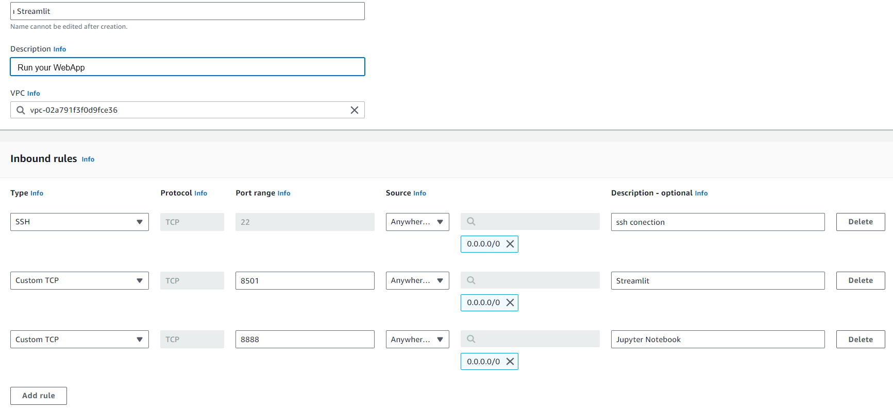

For production for sure you can remove the SSH and the Jupyter Notebook ports.

## Launch EC2 Instance

We go to EC2 and we create an instance **Worker** and we choose **Ubuntu 22.04** with server **g4dn.xlarge**

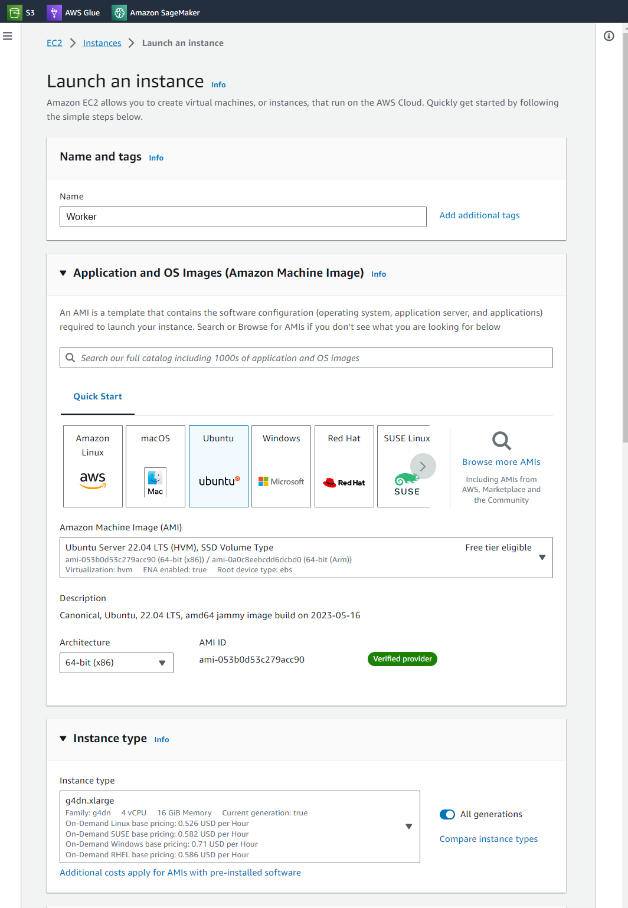


we create a private key, **you download this key**  because we will  use later  and for security group select existing security group ,  **Streamlit**,

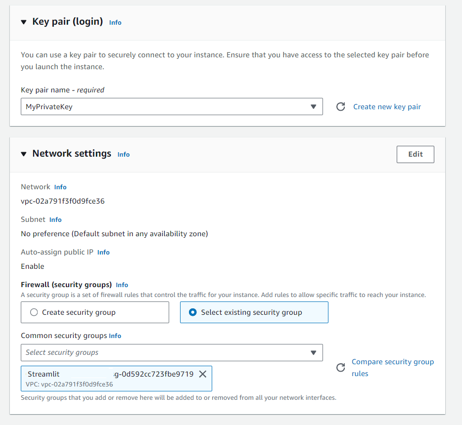

Then we require to add additional storage space to our Virtual Instance, we choose 100gb

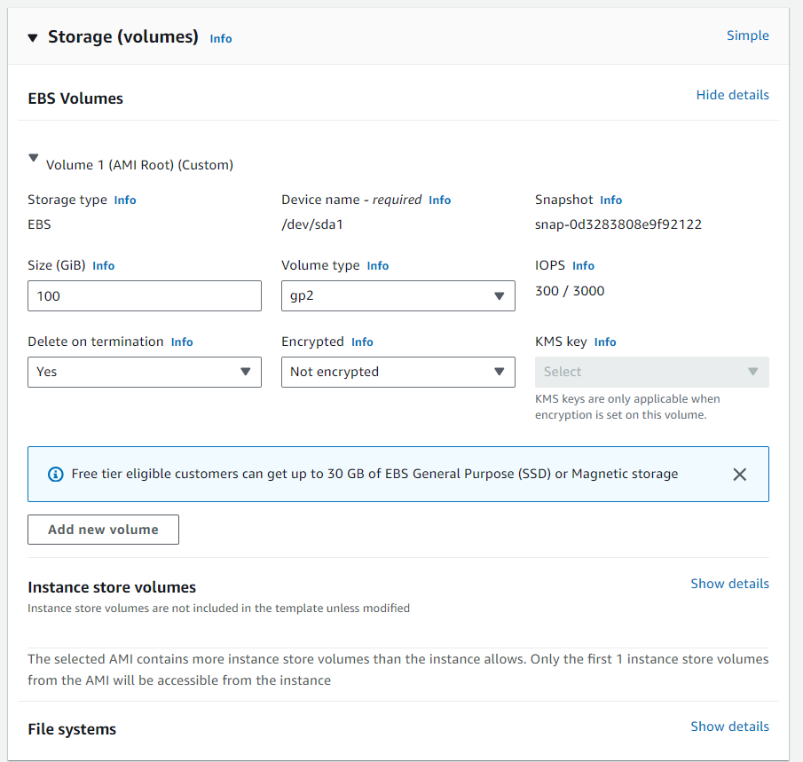


If we want to save money , in **Advanced details** we must put **spot.** 

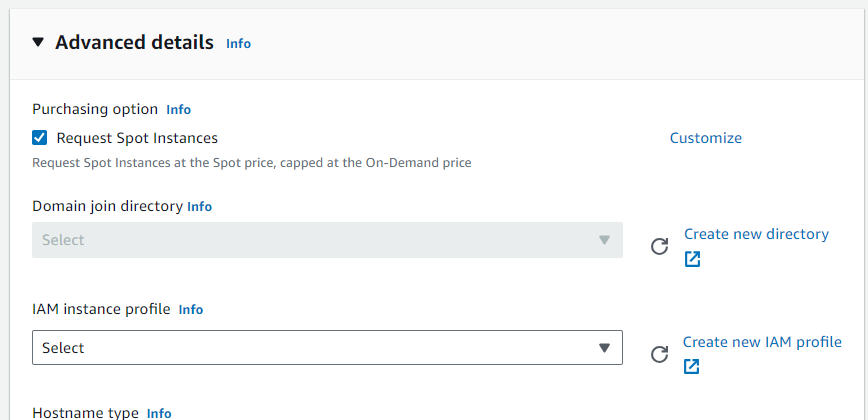

and we keep all the reamaining settings as default and click launch

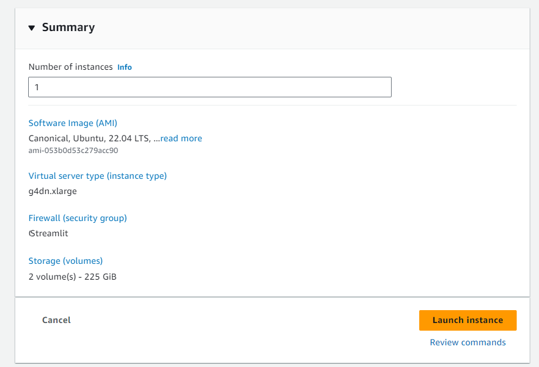

Be **aware** that now time is money. So **do not forget to delete your instance** after you finish this demo.

Now the Instance is initializing , we wait few minutes and then we click on **Connect** 

​	

then we select the **SSH Client**

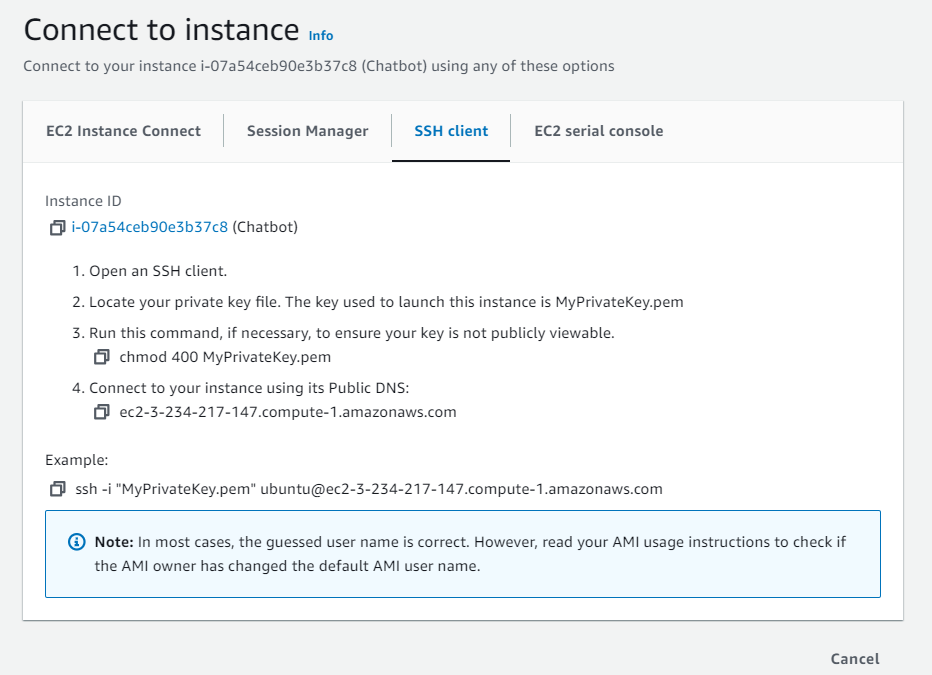


Then we have to open our terminal, then go where you downloaded your private key

1. Run this command, if necessary, to ensure your key is not publicly viewable.

2. ```
   chmod 400 MyPrivateKey.pem
   ```

3. Connect to your instance using its Public DNS for example:

```
 ssh -i "MyPrivateKey.pem" ubuntu@ec2-3-234-217-147.compute-1.amazonaws.com
```

and you will got something like

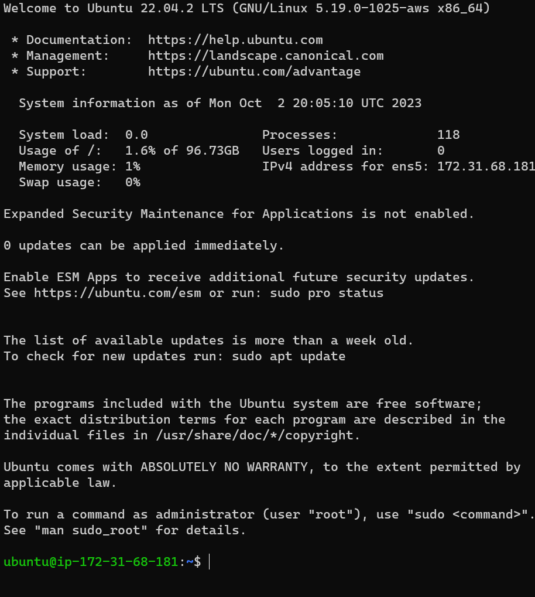

# Python Installation

Add the `deadsnakes` PPA repository to the system next. The simplest method for installing Python 3.10 is as follows:

```bash
sudo add-apt-repository ppa:deadsnakes/ppa
```

Use this command to install Python 3.10 

```bash
sudo apt install python3.10 -y
```

we click in OK	

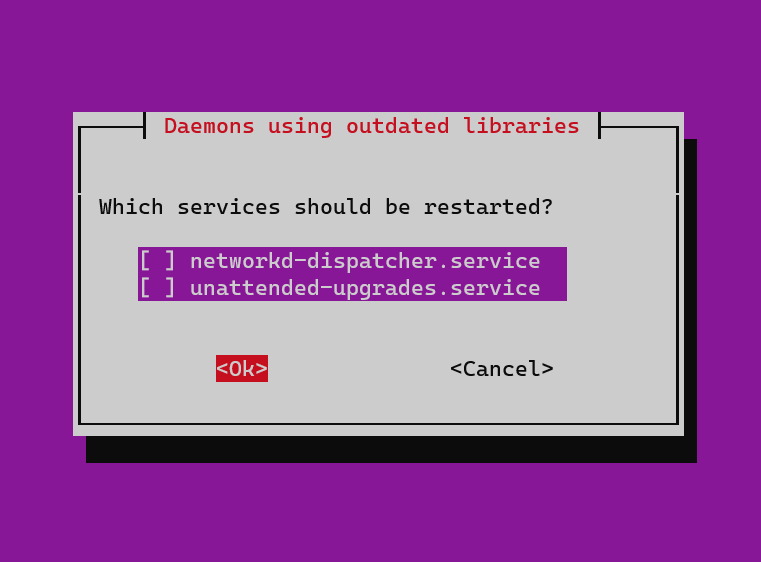

​	we check the Python Version

```bash
python3 --version
```


then we install our friend pip

```
sudo apt install python3-pip -y
```

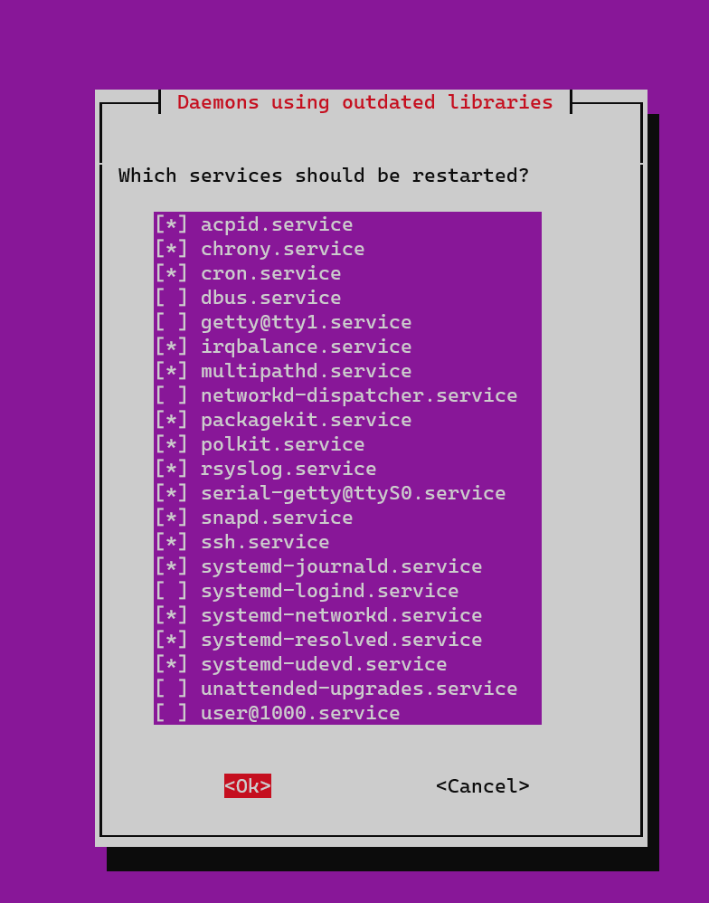

# Install CUDA & cuDNN 

### Update & upgrade

```
sudo apt update && sudo apt upgrade -y
```

Just in case you want to remove previous NVIDIA installation you can do `sudo apt autoremove nvidia* --purge`, but we skip.

```
sudo apt install ubuntu-drivers-common -y
```


## Check Ubuntu devices

```
ubuntu-drivers devices
```

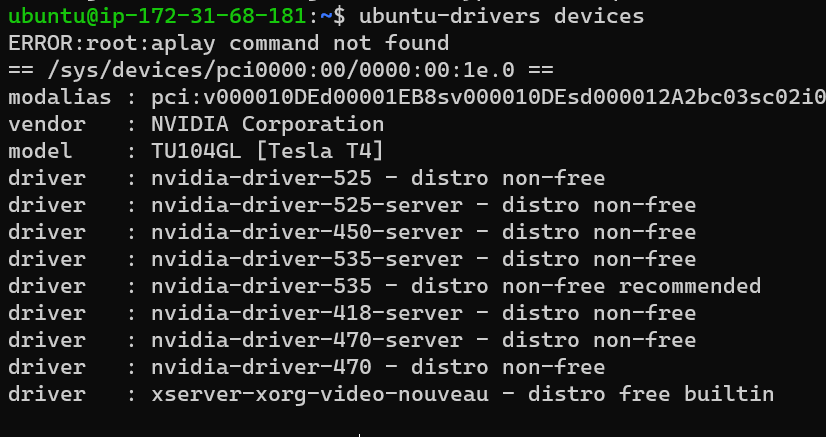

You will install the NVIDIA driver whose version is tagged with **recommended**

## Install Ubuntu drivers

```
sudo ubuntu-drivers autoinstall
```

### Install NVIDIA drivers

My **recommended** version is 525, adapt to yours

```
sudo apt install nvidia-driver-525 -y
```


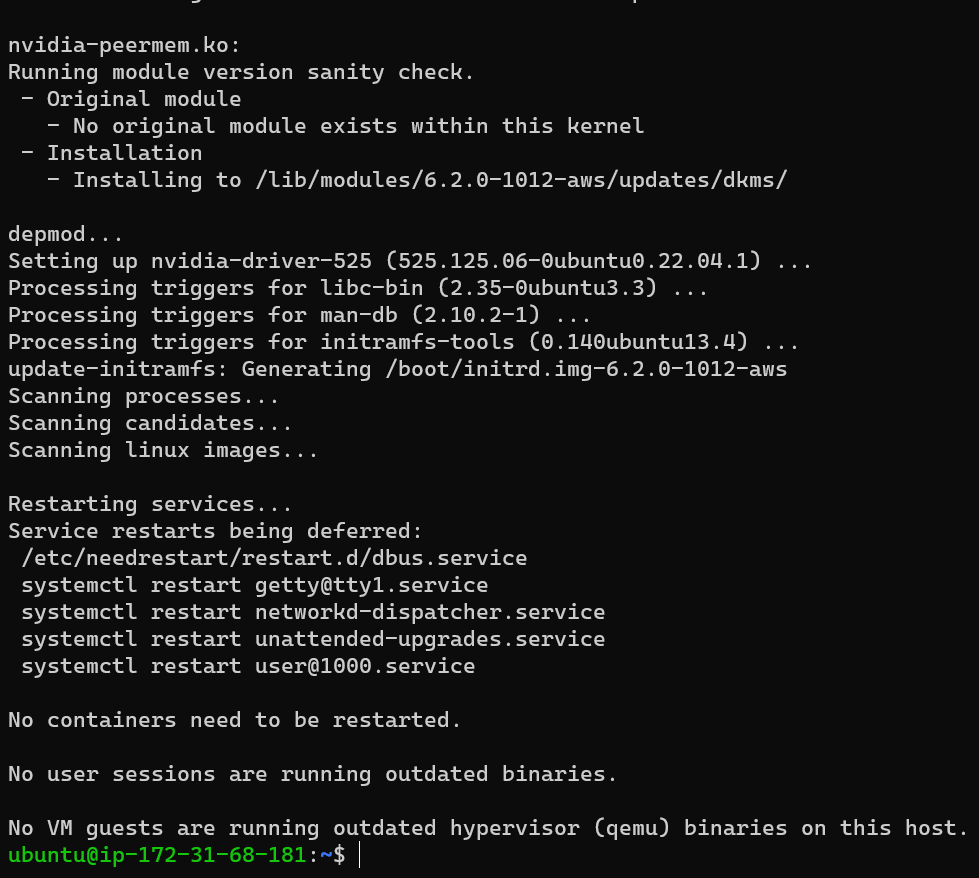

### Reboot & Check

IF you were not on the cloud you can simply type `reboot` but here we have to reboot our instanced manually

```
exit
```


after that we reconnect via ssh  verify that the following command works

```
nvidia-smi
```

and wualla


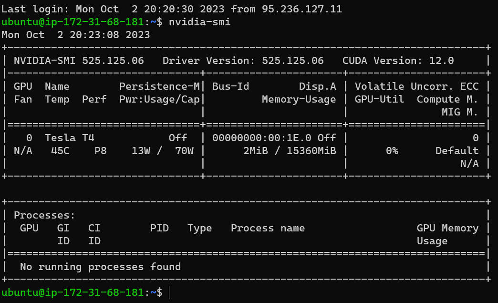

 that is 

## Install CUDA drivers

### Install CUDA toolkit

```
sudo apt install nvidia-cuda-toolkit -y
```

### Check CUDA install

```
nvcc --version
```


## Install cuDNN

### Download cuDNN .deb file

You can download cuDNN file [here](https://developer.nvidia.com/rdp/cudnn-download). You will need an Nvidia account. Select the cuDNN version for the appropriate CUDA version, which is the version that appears when you run:

```
nvcc --version
```

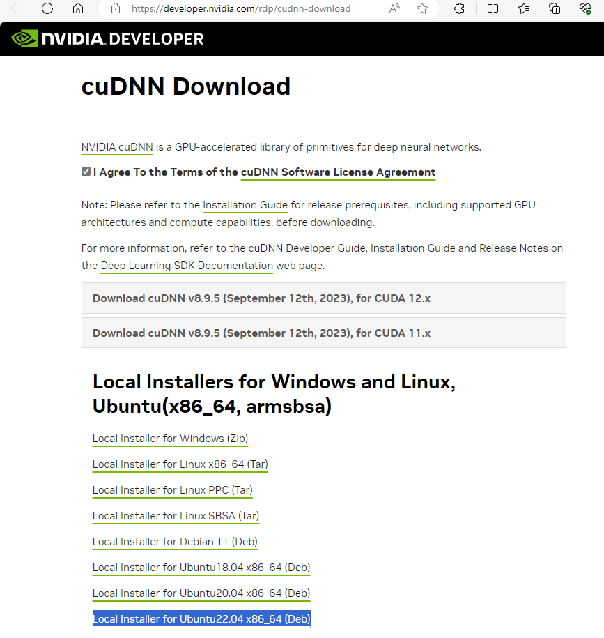


## Transferring Files Using SCP 

Secure Copy Protocol (SCP) is a means of securely transferring computer files between a local and a remote host or between two remote hosts. It’s based on the Secure Shell (SSH) protocol.

To copy a file from your local system to your EC2 instance, use the following command:

```bash
scp -i "MyPrivateKey.pem" C:\Users\Downloads\cudnn-local-repo-ubuntu2204-8.9.5.29_1.0-1_amd64.deb  ubuntu@ec2-3-234-217-147.compute-1.amazonaws.com:/home/ubuntu

```

and you can check if was uploaded


### Install cuDNN

```
sudo apt install ./cudnn-local-repo-ubuntu2204-8.9.5.29_1.0-1_amd64.deb

```

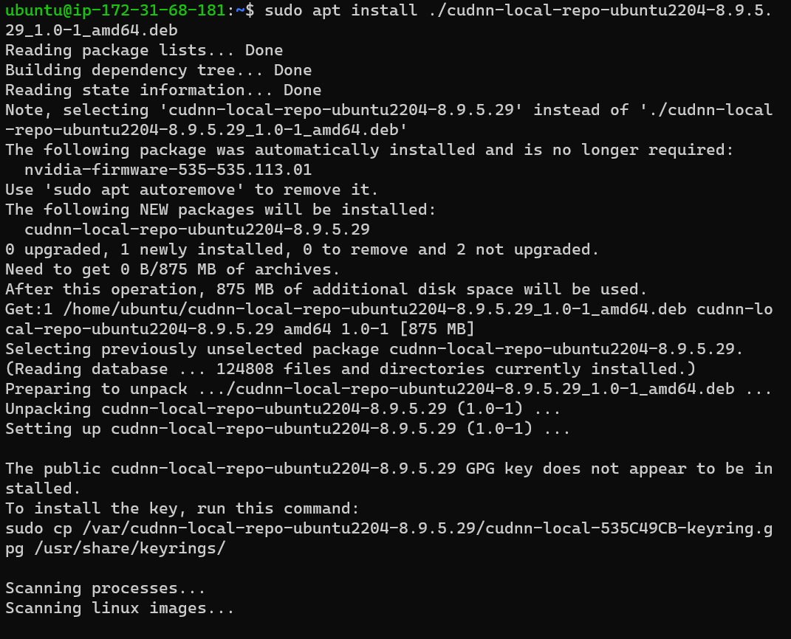

```
sudo cp /var/cudnn-local-repo-ubuntu2204-8.9.5.29/cudnn-local-535C49CB-keyring.gpg /usr/share/keyrings/
```

My cuDNN version is 8, adapt the following to your version:

```
sudo apt update
sudo apt install libcudnn8
sudo apt install libcudnn8-dev
sudo apt install libcudnn8-samples
```

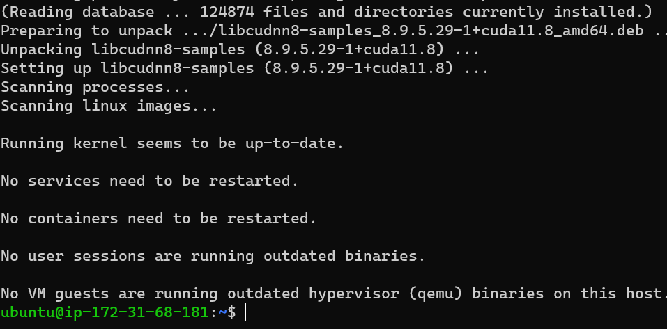


## Test CUDA on Pytorch

### Create a virtualenv and activate it

```
sudo apt-get install python3-pip
sudo pip3 install virtualenv 
virtualenv -p py3.10 venv
source venv/bin/activate
```


### Install pytorch

```
pip3 install torch torchvision torchaudio
```

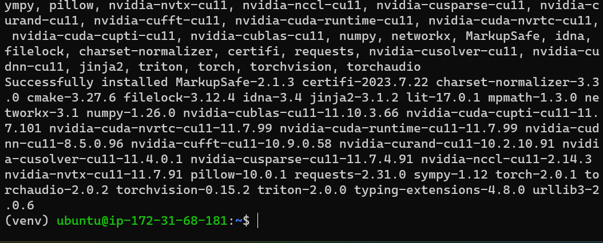

### Open Python and execute a test

```
import torch
print(torch.cuda.is_available()) # should be True
```


```
t = torch.rand(10, 10).cuda()
print(t.device) # should be CUDA
```


# Create an AMI from an Amazon EC2 Instance

In ordering to save our EC2 Instance Setup that we have done before  got to **Amazon EC2 Instances** view, you can create Amazon Machine Images (AMIs) from either running or stopped instances. 

To create an AMI from an instance we Right-click the instance you want to use as the basis for your AMI, and choose **Create Image** from the context menu.


Then we **Create Image** context menu. In the **Create Image** dialog box, type a unique name and description, and then choose **Create Image**. By default, Amazon EC2 shuts down the instance, takes snapshots of any attached volumes, creates and registers the AMI, and then reboots the instance. Choose **No reboot**if you don't want your instance to be shut down.

**Warning** : If you choose **No reboot**, we can't guarantee the file system integrity of the created image.

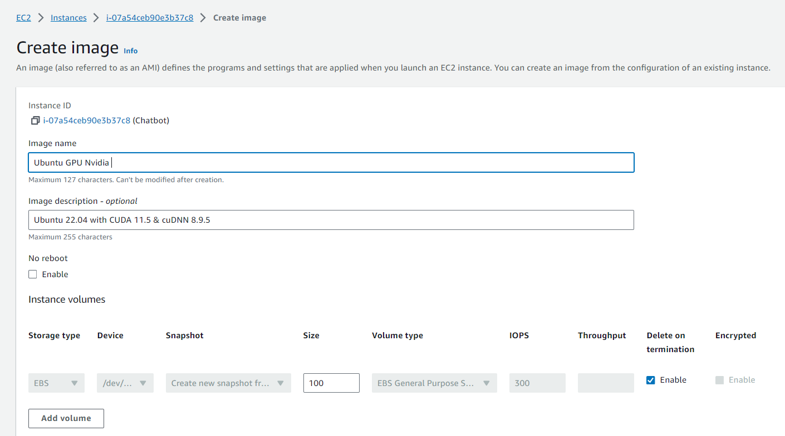

Then **Create Image** dialog box. It may take a few minutes for the AMI to be created. After it is created, it will appear in the **AMIs** view in AWS Explorer. To display this view, double-click the **Amazon EC2 | AMIs** node in AWS Explorer. To see your AMIs, from the **Viewing** drop-down list, choose **Owned By Me**. You may need to choose **Refresh** to see your AMI. When the AMI first appears, it may be in a pending state, but after a few moments, it transitions to an available state.

Now you can **Terminate your Instance** and next time you can load your new GPU instance 


Remember that the GPU instances are expensive. Please terminate the instances after you finish this demo.

**Congratulations!** You have created an **EC2 instance** with **GPU** and installed **CUDA** and **AMI**.
