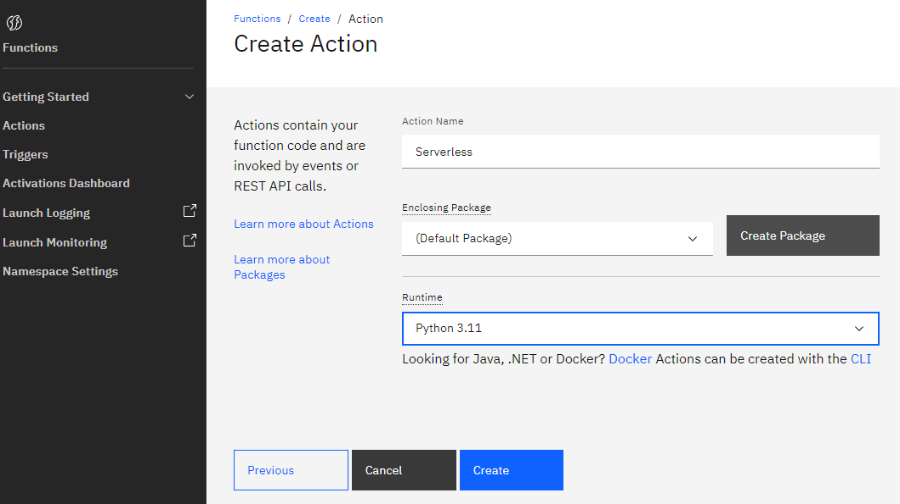
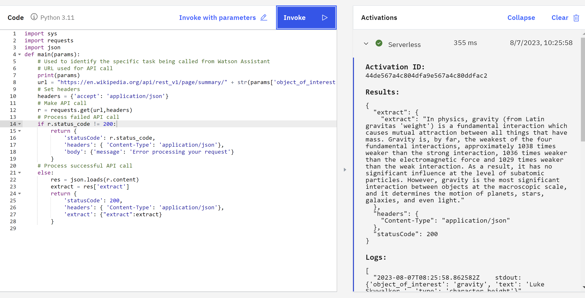
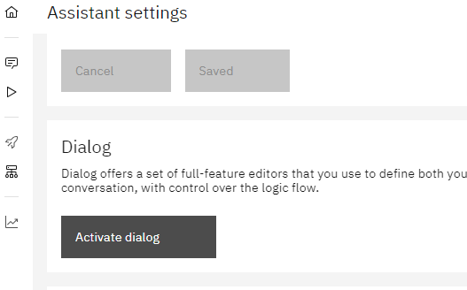

Hello everyone, today we are going to integrate Watson Assistant by using IBM Cloud functions
This is very interesting way to give power to you Chatbot with a fully serveless system in IBM Cloud. We are interested to  connect a Chatbot with Serverless Function.


## Step 1 - Login to your IBM Cloud.

First you need to login to your IBM Cloud here 
[https://cloud.ibm.com](https://cloud.ibm.com)

## Step 2 - Create an Cloud Function

Type functions in the search bar type `function`


Then you select Start Creating 
then you create Namespace, then  you select Actions 

and click **Create**

then you have created your serverless
For this example, instead use node.js we use Python


we copy the following code and replace the current one

```
import sys
import requests
import json
def main(params):
    # Used to identify the specific task being called from Watson Assistant
    # URL used for API call
    print(params)
    url = "https://en.wikipedia.org/api/rest_v1/page/summary/" + str(params['object_of_interest'])+ "?redirect=true"
    # Set headers
    headers = {'accept': 'application/json'}
    # Make API call
    r = requests.get(url,headers)
    # Process failed API call
    if r.status_code != 200:
        return {
            'statusCode': r.status_code,
            'headers': { 'Content-Type': 'application/json'},
            'body': {'message': 'Error processing your request'}
        }
    # Process successful API call 
    else:
        res = json.loads(r.content)
        extract = res['extract']
        return {
            'statusCode': 200,
            'headers': { 'Content-Type': 'application/json'},
            'extract': {"extract":extract}
        }

```

to test we can click on Invoke with parameters

```
{
    "object_of_interest":"gravity"
  }
```

and then we click `Invoke`

we got the following



## Step 4 - Enable Endpoint

Before create API we go to Endpoints and  we click on `Enable as Web Action` and click `save`

and then we copy the HTTP method


now it works our cloud function.

## Step 5 - Call Cloud Function from Watson Assistant

In the menu of Watson Assistant we select the tab `Assistant Settings`
we scroll down and we click `Activate dialog`

At the Home menu we click `Dialog`


#Step 5 - Create Entity
We create am entitiy
`@object_of_interest`

#Step 6 - Create Intent
Then we create an intent,
,
for example we type
for the Intent name
`#tell_me_about`
and in the user example we add different queries that countains the **nouns** that you will look on, or will be used as arguments.
eg. `what is the definition of gravity`
then you e  click on `Annotate entities` and click with the mouse gravity
and click the `@object_of_interest`
you will got something like


# Step 6 - Weebhook setup

We paste our edpoint copied here,
and we add the extension **.json** at the end of the URL.
Here we do not need add, extra Header, or autorization.

## Step 7- Create Dialog

We go the menu Dialog and we `Create dialog`


We click on `Add node` and in the
section If assistant recognizes, we add the condition
`#tell_me_about` and `@object_of_interest`

Then in the part of **Parameters**
we add the following parameters

then we click on **Customize**

and we enable `Call out to webhook/actions` and select `Call a webhook` click apply
in the part of Assistat responds you will have 

**If assistant recognizes**:

```
$webhook_result_1
```

the you click the gear button of 
**Respond with** and you add the following in the Text responds

```
I am defining @object_of_interest:<? $webhook_result_1.extract.extract ?>
```

and click save

then you will get something like


with 

Now finally we can try it and  you can ask questions


**Congratulations!** You have created a  Chatbot with Serverless  Cloud Function.