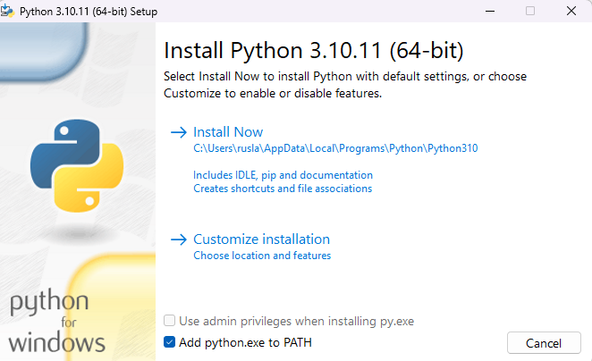
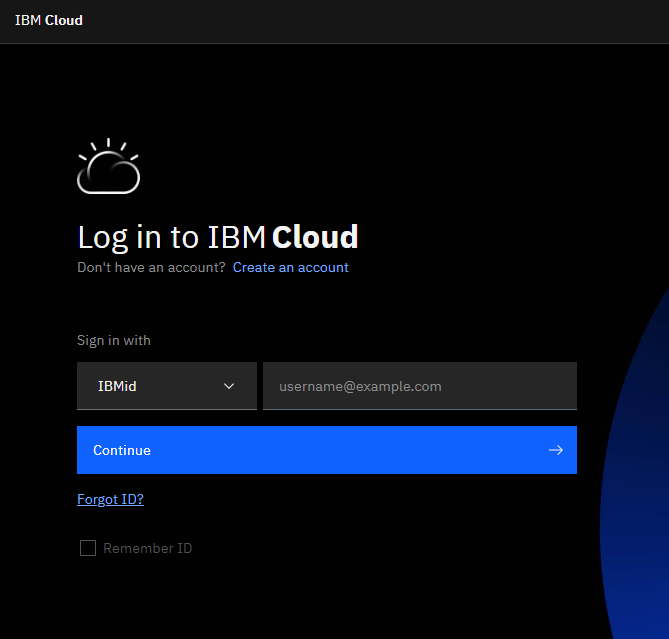
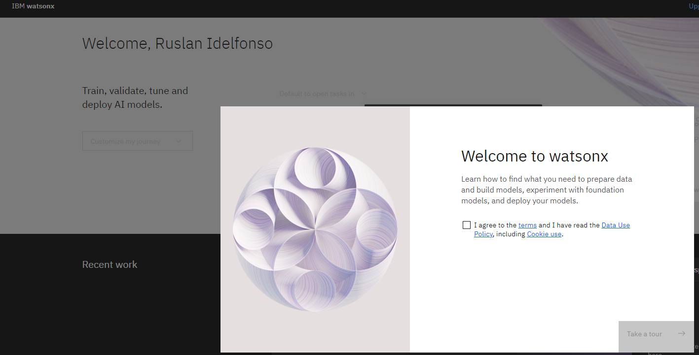
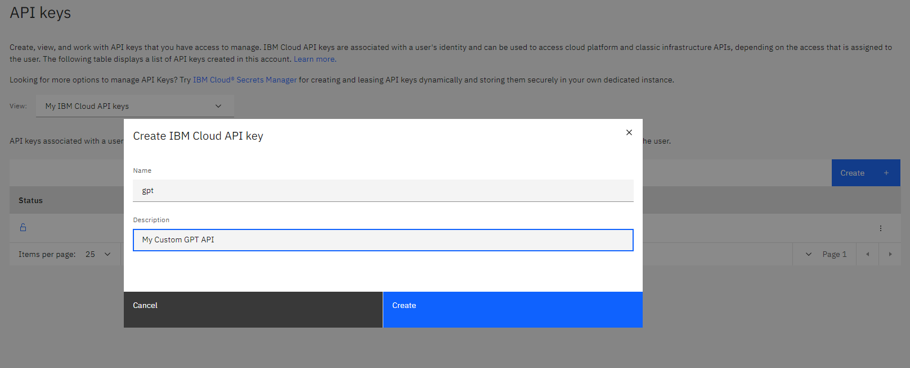
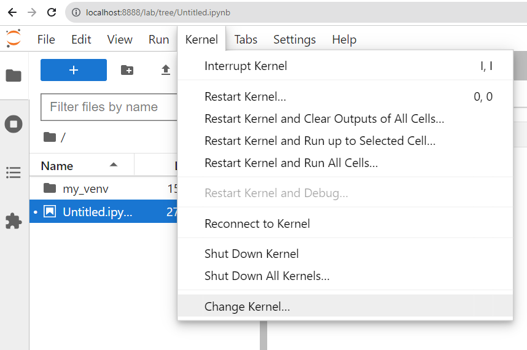
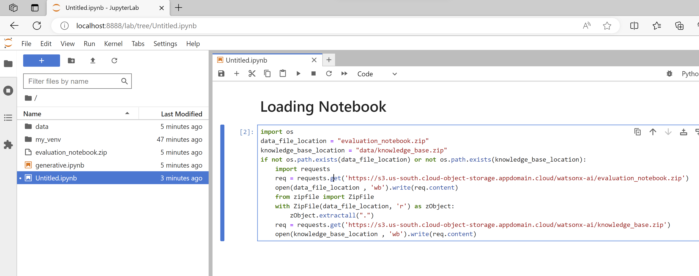

Hello everyone, today we are going to ask questions to **WatsonX** by using a custom set of data by using the **Retrieval Augmented Generation (RAG)**

We are interested to explain  how to use **Foundational Models** with new data **without retrain** all the data.

The **Retrieval Augmented Generation**  is one of the most common use cases by using foundation models.  Essentially **question answering**.

So the problem is the following: You have a set of documents and you wat answer documents based on data that is contained in this document.

Let us a concrete example, yo have a **Documentation** of an specific product of your **Business** and you want  answer queries from your employees, and you want to provide an answer only using the data that is present in **Documentation.**

If your employee makes a question that is not contained in the **Documentation** the answer will obtained from the **Foundation model** but generated by the Documentation. The **foundation model** itself would not have been trained using the data for is there in **Documentation**.


## Introduction  


**How do you make it generate a response when it has not been trained on it?** 

That is what **Retrieval Augmented Generation** does. Its a three step process:

1. **Index knowledge base** - Generate Embedding for each document and store it in Vector Database. In  this step our documents are sent to an Embedding model which generates an embedding out of it , an embedding is kind of array of numbers, this embedding is stored in a Vector Database.

2. **Retrieve relevant data from the knowledge base**- Find the documents most similar to user question using Vector Database. Answer to user question is very likely to be present in the top-k documents.

   We send  the user questions to the embedding model to generate an embedding for it, and this embedding user question is sent to the vecrtor database and  is used to find the top-k documents  which is more similar to the user question, ie closest to embedding user question in the Vector Database, and then is answer which documents are relevant. We generate an answer using foundation model and give it back to the user.

3. **Generate a response** - The last step is where foundation models play a role. Take top-3 documents returned by Vector database and ask Foundation Model to come up with answer to the user question using only the text of the three documents. Here the user question is used to construct a prompt that are questions to be asked to the foundation model and then you get the answer.

Let us create our notebook environment and create make some questions from a sample documents.

## Step 1: Install and Run Jupyter Lab locally

First we need to install python in our computer , in this demo I  will use Python **3.10.11**

[https://www.python.org/ftp/python/3.10.11/python-3.10.11-amd64.exe](https://www.python.org/ftp/python/3.10.11/python-3.10.11-amd64.exe)

During the installation I should suggest add **python.exe to PATH** and **install Now**




With Python already installed, you should have pip already installed. Be sure to use a pip that corresponds with Python 3 by using pip3 or checking your pip executable with "pip --version".

## Step 2: Create a Python virtual environment

A Python virtual environment allows one to use different versions of Python as well as isolate dependencies between projects. If you've never had several repos on your machine at once, you may never have felt this need but it's a good, Pythonic choice nonetheless. Future you will thank us both!

 Let us create a folder called gpt  and there we will  store our  virtual environment. 

```
mkdir gpt
cd gpt
```


Supposed that you have a different version of Python installed in your system. To check use the following command to check:

```
py --list
```


And you want to create a new virtual environment for python 3.10 on a 'test_env' directory. Run the following command:

```py
 py -3.10 -m venv my_venv
```

You'll notice a new directory in your current working directory with the same name as your virtual environment.

Activate the virtual environment.

Windows: 

```
my_venv\Scripts\activate.bat
```


All other OSs: source 

```
./my_venv/bin/activate
```

When the virtual environment is activated, your command prompt should change in some way, indicating the name of the virtual environment. This is how you'll know it's active. You can further verify this by executing "which pip" or "which python" to see that both binaries are located inside you virtual environment directory.

A virtual environment is only activate in your current terminal session. There is no need to deactivate it before closing your terminal.

However, if you need to deactivate it you can do so by executing "deactivate", a script that only exists when a virtual environment is activated.

Note: Be sure to deactivate a virtual environment before deleting its directory.

### Step 3: Create a Jupyter Kernel from Inside your Virtual Environment

 We are goigng to install **Jupyter Lab.**

Let us open our command prompt and type

```
python.exe -m pip install --upgrade pip
```

```
pip install jupyterlab
```

For more information visit the official [Jupyter Lab](https://jupyterlab.readthedocs.io/en/stable/getting_started/installation.html#pip) site.

A Jupyter "kernel" is simply a reference to a particular Python interpreter instance. You can create a kernel from any Python interpreter on your machine, including those inside of virtual environments and then choose it as your kernel for any notebook. In this way, you can customize the environments of different notebooks benefiting from the same isolation virtual environments offer during normal development.

Once we are in our environment we proceed to install ipykernel

```
pip install ipykernel
```


then

```
python -m ipykernel install --user --name gpt --display-name "Python3 (GPT)"
```


With your virtual environment created and the ability to run a Jupyter Notebook in that environment.


## Install and import the dependecies


You can copy the following code block and paste it on your terminal where you are in your enviroment.

```
pip install datasets 
pip install scikit-learn 
pip install chromadb==0.3.27 
pip install sentence_transformers
pip install pandas 
pip install rouge_score 
pip install nltk 
pip install "ibm-watson-machine-learning>=1.0.312" 
pip install ipywidgets widgetsnbextension pandas-profiling

```


If we are in Linux we can add the followig condition after each line `| tail -n 1` to surpress logs. 

Before run the notebook, we require load our IBM cloud services.


# Step 5 - Login to IBM cloud



after you have logged, create a WatsonX instance

[https://www.ibm.com/watsonx](https://www.ibm.com/watsonx)



Then open a simple Prompt Lab


Then click  **View Code** and then  click  on  **Create personal API key**


then we create our custom GPT API, I call it gpt and I give an small description




I copy the API key for future use


## Loading Evaluation Notebook.

In this part we are going to download the notebook where we are going to build our models.

 We can open our jupyter lab by typing

```
jupyter lab
```

and we create a new Notebook **Python3 (GPT)**


or in the notebook open the "Kernel" menu and select "Change Kernel..."




If the kernel tab is all greyed out, just start a python 3 notebook from the launcher.  The kernel list should then have selectable items.


and you will have somehing like



```
import os
data_file_location = "evaluation_notebook.zip"
knowledge_base_location = "data/knowledge_base.zip"
if not os.path.exists(data_file_location) or not os.path.exists(knowledge_base_location):
    import requests
    req = requests.get('https://s3.us-south.cloud-object-storage.appdomain.cloud/watsonx-ai/evaluation_notebook.zip')
    open(data_file_location , 'wb').write(req.content)
    from zipfile import ZipFile
    with ZipFile(data_file_location, 'r') as zObject:
        zObject.extractall(".")
    req = requests.get('https://s3.us-south.cloud-object-storage.appdomain.cloud/watsonx-ai/knowledge_base.zip')
    open(knowledge_base_location , 'wb').write(req.content)
```

Then you can proceed with the following notebook generative.ipynb.

# Use Watsonx to respond to natural language questions using RAG approach

This notebook contains the steps and code to demonstrate support of Retrieval Augmented Generation in watsonx.ai. It introduces commands for data retrieval, knowledge base building & querying, and model testing.

Some familiarity with Python is helpful. This notebook uses Python 3.10.

#### About Retrieval Augmented Generation

Retrieval Augmented Generation (RAG) is a versatile pattern that can unlock a number of use cases requiring factual recall of information, such as querying a knowledge base in natural language.

In its simplest form, RAG requires 3 steps:

- Index knowledge base passages (once)
- Retrieve relevant passage(s) from the knowledge base (for every user query)
- Generate a response by feeding retrieved passage into a large language model (for every user query)


##  Set up the environment

### Install and import dependecies


```python
#!pip install chromadb==0.3.27
#!pip install sentence_transformers 
#!pip install pandas 
#!pip install rouge_score 
#!pip install nltk
#!pip install "ibm-watson-machine-learning>=1.0.312" 
```

**Note:** Please restart the notebook kernel to pick up proper version of packages installed above.


```python
import os, getpass
import pandas as pd
from typing import Optional, Dict, Any, Iterable, List

try:
    from sentence_transformers import SentenceTransformer
except ImportError:
    raise ImportError("Could not import sentence_transformers: Please install sentence-transformers package.")
    
try:
    import chromadb
    from chromadb.api.types import EmbeddingFunction
except ImportError:
    raise ImportError("Could not import chromdb: Please install chromadb package.")
```

### Watsonx API connection

This cell defines the credentials required to work with watsonx API for Foundation
Model inferencing.

**Action:** Provide the IBM Cloud user API key. For details, see
[documentation](https://cloud.ibm.com/docs/account?topic=account-userapikey&interface=ui).


```python
credentials = {
    "url": "https://us-south.ml.cloud.ibm.com",
    "apikey": getpass.getpass("Please enter your WML api key (hit enter): ")
}
```

    Please enter your WML api key (hit enter):  ········


### Defining the project id

The API requires project id that provides the context for the call. We will obtain the id from the project in which this notebook runs. Otherwise, please provide the project id.

**Hint**: You can find the `project_id` as follows. Open the prompt lab in watsonx.ai. At the very top of the UI, there will be `Projects / <project name> /`. Click on the `<project name>` link. Then get the `project_id` from Project's Manage tab (Project -> Manage -> General -> Details).

```python
try:
    project_id = os.environ["PROJECT_ID"]
except KeyError:
    project_id = input("Please enter your project_id (hit enter): ")
```

    Please enter your project_id (hit enter):  2b896c87-ddf2-4c26-be43-3be4e1716d80


<a id="data"></a>

## Train/test data loading

Load train and test datasets. At first, training dataset (`train_data`) should be used to work with the models to prepare and tune prompt. Then, test dataset (`test_data`) should be used to calculate the metrics score for selected model, defined prompts and parameters.


```python
data_file_location = "evaluation_notebook.zip"
knowledge_base_location = "data/knowledge_base.zip"
if not os.path.exists(data_file_location) or not os.path.exists(knowledge_base_location):
    import requests
    req = requests.get('https://s3.us-south.cloud-object-storage.appdomain.cloud/watsonx-ai/evaluation_notebook.zip')
    open(data_file_location , 'wb').write(req.content)
    from zipfile import ZipFile
    with ZipFile(data_file_location, 'r') as zObject:
        zObject.extractall(".")
    req = requests.get('https://s3.us-south.cloud-object-storage.appdomain.cloud/watsonx-ai/knowledge_base.zip')
    open(knowledge_base_location , 'wb').write(req.content)
```


```python
filename_test = 'data/RAG/nq910_400_instances/test.tsv'
filename_train = 'data/RAG/nq910_400_instances/train.tsv'

test_data = pd.read_csv(filename_test, delimiter='\t')
train_data = pd.read_csv(filename_train, delimiter='\t')
```


```python
train_data.head()
```

<table border="1" class="dataframe">
  <thead>
    <tr style="text-align: right;">
      <th></th>
      <th>qid</th>
      <th>question</th>
      <th>relevant</th>
      <th>answers</th>
    </tr>
  </thead>
  <tbody>
    <tr>
      <th>0</th>
      <td>8519</td>
      <td>when was the cathedral of santa maria del fior...</td>
      <td>136</td>
      <td>begun in 1296::completed by 1436</td>
    </tr>
    <tr>
      <th>1</th>
      <td>852</td>
      <td>who plays cassidy on law and order svu</td>
      <td>177</td>
      <td>Dean Winters</td>
    </tr>
    <tr>
      <th>2</th>
      <td>7600</td>
      <td>who was the old woman in phantom of the opera</td>
      <td>642</td>
      <td>Madame Giry</td>
    </tr>
    <tr>
      <th>3</th>
      <td>4258</td>
      <td>when is the finals of americas got talent 2017</td>
      <td>781</td>
      <td>September 20 , 2017</td>
    </tr>
    <tr>
      <th>4</th>
      <td>8272</td>
      <td>who played the frog in gnomeo and juliet</td>
      <td>1018</td>
      <td>Ashley Jensen</td>
    </tr>
  </tbody>
</table>


```python
test_data.head()
```

<table border="1" class="dataframe">
  <thead>
    <tr style="text-align: right;">
      <th></th>
      <th>qid</th>
      <th>question</th>
      <th>relevant</th>
      <th>answers</th>
    </tr>
  </thead>
  <tbody>
    <tr>
      <th>0</th>
      <td>5555</td>
      <td>who did chris carter play for last year</td>
      <td>267</td>
      <td>Milwaukee Brewers</td>
    </tr>
    <tr>
      <th>1</th>
      <td>6654</td>
      <td>what is the latest version of safari on mac</td>
      <td>664</td>
      <td>Safari 11</td>
    </tr>
    <tr>
      <th>2</th>
      <td>3396</td>
      <td>when did bucharest become the capital of romania</td>
      <td>944</td>
      <td>1862</td>
    </tr>
    <tr>
      <th>3</th>
      <td>8198</td>
      <td>who did jeffrey dean morgan play on supernatural</td>
      <td>1398</td>
      <td>John Eric Winchester</td>
    </tr>
    <tr>
      <th>4</th>
      <td>4526</td>
      <td>who is the shortest man that ever lived</td>
      <td>1522</td>
      <td>Chandra Bahadur Dangi</td>
    </tr>
  </tbody>
</table>


## Build up knowledge base

The current state-of-the-art in RAG is to create dense vector representations of the knowledge base in order to calculate the semantic similarity to a given user query.

We can generate dense vector representations using embedding models. In this notebook, we use [SentenceTransformers](https://www.google.com/search?client=safari&rls=en&q=sentencetransformers&ie=UTF-8&oe=UTF-8) [all-MiniLM-L6-v2](https://huggingface.co/sentence-transformers/all-MiniLM-L6-v2) to embed both the knowledge base passages and user queries. `all-MiniLM-L6-v2` is a performant open-source model that is small enough to run locally.

A vector database is optimized for dense vector indexing and retrieval. This notebook uses [Chroma](https://docs.trychroma.com), a user-friendly open-source vector database, licensed under Apache 2.0, which offers good speed and performance with all-MiniLM-L6-v2 embedding model.

The dataset we are using is already split into self-contained passages that can be ingested by Chroma. 

The size of each passage is limited by the embedding model's context window (which is 256 tokens for `all-MiniLM-L6-v2`).

### Load knowledge base documents

Load set of documents used further to build knowledge base. 


```python
data_root = "data"
knowledge_base_dir = f"{data_root}/knowledge_base"
```


```python
if not os.path.exists(knowledge_base_dir):
    from zipfile import ZipFile
    with ZipFile(knowledge_base_dir + ".zip", 'r') as zObject:
        zObject.extractall(data_root)
```


```python
documents = pd.read_csv(f"{knowledge_base_dir}/psgs.tsv", sep='\t', header=0)
documents['indextext'] = documents['title'].astype(str) + "\n" + documents['text']
```


```python
documents.shape
```


    (29042, 4)


## Create an embedding function

Note that you can feed a custom embedding function to be used by chromadb. The performance of chromadb may differ depending on the embedding model used.


```python
class MiniLML6V2EmbeddingFunction(EmbeddingFunction):
    MODEL = SentenceTransformer('all-MiniLM-L6-v2')
    def __call__(self, texts):
        return MiniLML6V2EmbeddingFunction.MODEL.encode(texts).tolist()
emb_func = MiniLML6V2EmbeddingFunction()
```

## Set up Chroma upsert

Upserting a document means update the document even if it exists in the database. Otherwise re-inserting a document throws an error. This is useful for experimentation purpose.


```python
class ChromaWithUpsert:
    def __init__(
            self,
            name: Optional[str] = "watsonx_rag_collection",
            persist_directory:Optional[str]=None,
            embedding_function: Optional[EmbeddingFunction]=None,
            collection_metadata: Optional[Dict] = None,
    ):
        self._client_settings = chromadb.config.Settings()
        if persist_directory is not None:
            self._client_settings = chromadb.config.Settings(
                chroma_db_impl="duckdb+parquet",
                persist_directory=persist_directory,
            )
        self._client = chromadb.Client(self._client_settings)
        self._embedding_function = embedding_function
        self._persist_directory = persist_directory
        self._name = name
        self._collection = self._client.get_or_create_collection(
            name=self._name,
            embedding_function=self._embedding_function
            if self._embedding_function is not None
            else None,
            metadata=collection_metadata,
        )

    def upsert_texts(
        self,
        texts: Iterable[str],
        metadata: Optional[List[dict]] = None,
        ids: Optional[List[str]] = None,
        **kwargs: Any,
    ) -> List[str]:
        """Run more texts through the embeddings and add to the vectorstore.
        Args:
            :param texts (Iterable[str]): Texts to add to the vectorstore.
            :param metadatas (Optional[List[dict]], optional): Optional list of metadatas.
            :param ids (Optional[List[str]], optional): Optional list of IDs.
            :param metadata: Optional[List[dict]] - optional metadata (such as title, etc.)
        Returns:
            List[str]: List of IDs of the added texts.
        """
        # TODO: Handle the case where the user doesn't provide ids on the Collection
        if ids is None:
            import uuid
            ids = [str(uuid.uuid1()) for _ in texts]
        embeddings = None
        self._collection.upsert(
            metadatas=metadata, documents=texts, ids=ids
        )
        return ids

    def is_empty(self):
        return self._collection.count()==0

    def persist(self):
        self._client.persist()

    def query(self, query_texts:str, n_results:int=5):
        """
        Returns the closests vector to the question vector
        :param query_texts: the question
        :param n_results: number of results to generate
        :return: the closest result to the given question
        """
        return self._collection.query(query_texts=query_texts, n_results=n_results)
```

## Embed and index documents with Chroma

**Note: Could take several minutes if you don't have pre-built indices**


```python
%%time
chroma = ChromaWithUpsert(
    name=f"nq910_minilm6v2",
    embedding_function=emb_func,  # you can have something here using /embed endpoint
    persist_directory=knowledge_base_dir,
)
if chroma.is_empty():
    _ = chroma.upsert_texts(
        texts=documents.indextext.tolist(),
        # we handle tokenization, embedding, and indexing automatically. You can skip that and add your own embeddings as well
        metadata=[{'title': title, 'id': id}
                  for (title,id) in
                  zip(documents.title, documents.id)],  # filter on these!
        ids=[str(i) for i in documents.id],  # unique for each doc
    )
    chroma.persist()
```

    CPU times: total: 406 ms
    Wall time: 632 ms


<a id="models"></a>

## Foundation Models on Watsonx

You need to specify `model_id` that will be used for inferencing.

**Action**: Use `FLAN_UL2` model.


```python
from ibm_watson_machine_learning.foundation_models.utils.enums import ModelTypes
```


```python
model_id = ModelTypes.FLAN_UL2
```

<a id="predict"></a>

## Generate a retrieval-augmented response to a question

### Select questions

Get questions from the previously loaded test dataset.


```python
question_texts = [q.strip("?") + "?" for q in test_data['question'].tolist()]
print("\n".join(question_texts))
```

    who did chris carter play for last year?
    what is the latest version of safari on mac?
    when did bucharest become the capital of romania?
    who did jeffrey dean morgan play on supernatural?
    who is the shortest man that ever lived?
    how many seconds do you have to throw a grenade?
    who is known as a father of indian cricket?
    what is the name of the period in japanese history that began in 1868?
    .
    .
    .


### Retrieve relevant context

Fetch paragraphs similar to the question.


```python
relevant_contexts = []

for question_text in question_texts:
    relevant_chunks = chroma.query(
        query_texts=[question_text],
        n_results=5,
    )
    relevant_contexts.append(relevant_chunks)
```

Get the set of chunks for one of the questions.


```python
sample_chunks = relevant_contexts[0]
for i, chunk in enumerate(sample_chunks['documents'][0]):
    print("=========")
    print("Paragraph index : ", sample_chunks['ids'][0][i])
    print("Paragraph : ", chunk)
    print("Distance : ", sample_chunks['distances'][0][i])
```

    =========
    Paragraph index :  268
    Paragraph :  Chris Carter (right-handed hitter)
    2.2 Oakland Athletics 2.3 Houston Astros 2.4 Milwaukee Brewers 2.5 New York Yankees 2.6 Return to the Oakland Athletics 3 Personal life 4 References 5 External links Early life and career ( edit ) Carter was born in Redwood City , California . At approximately age 7 or 8 , his family moved to Las Vegas . He attended Sierra Vista High School . In 2005 , Sierra Vista 's baseball team won the Nevada Interscholastic Activities Association Class 4A state championship . Professional career ( edit ) Draft and minors ( edit ) Carter was drafted by the Chicago White Sox in the 15th round of the 2005 Major League Baseball Draft . Carter began his professional career with the Bristol White Sox of the Rookie - level Appalachian League in 2005 . He hit 10 home runs and had 37 runs batted in ( RBIs ) . He played for two teams in the 2006 season . The teams included the Great Falls White Sox of the Rookie - level Pioneer League and the Kannapolis Intimidators of the Class A South Atlantic League . He had a combined total of 16 home runs and 63 RBIs . He played for Kannapolis in the 2007 season where he hit 25 home runs and had 93 RBIs . During the 2007 offseason , the White Sox traded Carter to the Arizona Diamondbacks for Carlos Quentin . Carter with the Athletics in 2012 Oakland Athletics ( edit ) Two weeks after
    Distance :  0.676628828048706
    =========
    .
    .


## Feed the context and the questions to `watsonx.ai` model.

Define instructions for the model.

**Note:** Please start with finding better prompts using small subset of training records (under `train_data` variable). Make sure to not run an inference of all of `train_data`, as it'll take a long time to get the results. To get a sample from `train_data`, you can use e.g.`train_data.head(n=10)` to get first 10 records, or `train_data.sample(n=10)` to get random 10 records. Only once you have identified the best performing prompt, update this notebook to use the prompt and compute the metrics on the test data.

**Action:** Please edit the below cell and add your own prompt here. In the below prompt, we have the instruction (first sentence) and one example included in the prompt. If you want to change the prompt or add your own examples or more examples, please change the below prompt accordingly.


```python
def make_prompt(context, question_text):
    return (f"Please answer the following.\n"
          + f"{context}:\n\n"
          + f"{question_text}")

prompt_texts = []

for relevant_context, question_text in zip(relevant_contexts, question_texts):
    context = "\n\n\n".join(relevant_context["documents"][0])
    prompt_text = make_prompt(context, question_text)
    prompt_texts.append(prompt_text)
```

Inspect prompt for sample question.


```python
print(prompt_texts[0])
```

    Please answer the following.
    Chris Carter (right-handed hitter)
    2.2 Oakland Athletics 2.3 Houston Astros 2.4 Milwaukee Brewers 2.5 New York Yankees 2.6 Return to the Oakland Athletics 3 Personal life 4 References 5 External links Early life and career ( edit ) Carter was born in Redwood City , California . At approximately age 7 or 8 , his family moved to Las Vegas . He attended Sierra Vista High School . In 2005 , Sierra Vista 's baseball team won the Nevada Interscholastic Activities Association Class 4A state championship . Professional career ( edit ) Draft and minors ( edit ) Carter was drafted by the Chicago White Sox in the 15th round of the 2005 Major League Baseball Draft . Carter began his professional career with the Bristol White Sox of the Rookie - level Appalachian League in 2005 . He hit 10 home runs and had 37 runs batted in ( RBIs ) . He played for two teams in the 2006 season . The teams included the Great Falls White Sox of the Rookie - level Pioneer League and the Kannapolis Intimidators of the Class A South Atlantic League . He had a combined total of 16 home runs and 63 RBIs . He played for Kannapolis in the 2007 season where he hit 25 home runs and had 93 RBIs . During the 2007 offseason , the White Sox traded Carter to the Arizona Diamondbacks for Carlos Quentin . Carter with the Athletics in 2012 Oakland Athletics ( edit ) Two weeks after


​    

    Chris Carter (right-handed hitter)
    , the New York Yankees signed Carter to a one - year contract , worth $3.5 million . Carter batted . 204 with eight home runs and 70 strikeouts before the Yankees designated him for assignment on June 24 . He was called back up by the Yankees on June 29 when his replacement at first base , Tyler Austin , landed on the disabled list . On July 4 , he was again designated for assignment , this time to make room for Ji - man Choi on the roster . He was released on July 10 . Return to the Oakland Athletics ( edit ) Carter signed a minor league contract with the Oakland Athletics on July 21 , 2017 , and was assigned to the Nashville Sounds of the PCL . Personal life ( edit ) Carter 's father , Vernon , played basketball for Rancho High School in North Las Vegas . Carter is a car enthusiast . He owns a Shelby Super Snake . References ( edit ) ^ Jump up to : `` Get to Know : Brewers first baseman Chris Carter '' . Retrieved February 17 , 2017 . ^ Jump up to : `` Powerful Carter always had a single focus '' . Retrieved February 17 , 2017 . Jump up ^ Merkin , Scott ( December 3 , 2007 ) . `` White Sox trade for outfielder Quentin '' . Chicago White Sox . Retrieved July 16 , 2008 . Jump


## Defining the model parameters

We need to provide a set of model parameters that will influence the result:


```python
from ibm_watson_machine_learning.metanames import GenTextParamsMetaNames as GenParams
from ibm_watson_machine_learning.foundation_models.utils.enums import DecodingMethods

parameters = {
    GenParams.DECODING_METHOD: DecodingMethods.GREEDY,
    GenParams.MIN_NEW_TOKENS: 1,
    GenParams.MAX_NEW_TOKENS: 50
}
```

Initialize the `Model` class.


```python
#this cell should never fail, and will produce no output
import requests

def getBearer(apikey):
    form = {'apikey': apikey, 'grant_type': "urn:ibm:params:oauth:grant-type:apikey"}
    print("About to create bearer")
#    print(form)
    response = requests.post("https://iam.cloud.ibm.com/oidc/token", data = form)
    if response.status_code != 200:
        print("Bad response code retrieving token")
        raise Exception("Failed to get token, invalid status")
    json = response.json()
    if not json:
        print("Invalid/no JSON retrieving token")
        raise Exception("Failed to get token, invalid response")
    print("Bearer retrieved")
    return json.get("access_token")
```


```python
credentials["token"] = getBearer(credentials["apikey"])
```

    About to create bearer
    Bearer retrieved

```python
from ibm_watson_machine_learning.foundation_models import Model
model = Model(
    model_id=model_id,
    params=parameters,
    credentials=credentials,
    project_id=project_id)
```

## Generate a retrieval-augmented response

**Note:** Execution of this cell could take several minutes.


```python
results = []
for prompt_text in prompt_texts[:1]:
    results.append(model.generate_text(prompt=prompt_text))
```


```python
for idx, result in enumerate(results):
    print("Question = ", test_data.iloc[idx]['question'])
    print("Answer = ", result)
    print("Expected Answer(s) (may not be appear with exact wording in the dataset) = ", test_data.iloc[idx]['answers'])
    print("\n")
```

    Question =  who did chris carter play for last year
    Answer =  Milwaukee Brewers
    Expected Answer(s) (may not be appear with exact wording in the dataset) =  Milwaukee Brewers


  

## Calculate rougeL metric

In this sample notebook `rouge_score` module was used for rougeL calculation.

#### Rouge Metric

**Note:** The Rouge (Recall-Oriented Understudy for Gisting Evaluation) metric is a set of evaluation measures used in natural language processing (NLP) and specifically in text summarization and machine translation tasks. The Rouge metrics are designed to assess the quality of generated summaries or translations by comparing them to one or more reference texts.

The main idea behind Rouge is to measure the overlap between the generated summary (or translation) and the reference text(s) in terms of n-grams or longest common subsequences. By calculating recall, precision, and F1 scores based on these overlapping units, Rouge provides a quantitative assessment of the summary's content overlap with the reference(s).

Rouge-1 focuses on individual word overlap, Rouge-2 considers pairs of consecutive words, and Rouge-L takes into account the ordering of words and phrases. These metrics provide different perspectives on the similarity between two texts and can be used to evaluate different aspects of summarization or text generation models.


```python
from rouge_score import rouge_scorer
from collections import defaultdict
import numpy as np

def get_rouge_score(predictions, references):
    scorer = rouge_scorer.RougeScorer(['rouge1', 'rouge2', 'rougeL', 'rougeLsum'])
    aggregate_score = defaultdict(list)

    for result, ref in zip(predictions, references):
        for key, val in scorer.score(result, ref).items():
            aggregate_score[key].append(val.fmeasure)

    scores = {}
    for key in aggregate_score:
        scores[key] = np.mean(aggregate_score[key])
    
    return scores
```


```python
print(get_rouge_score(results, test_data.answers))
```

    {'rouge1': 1.0, 'rouge2': 1.0, 'rougeL': 1.0, 'rougeLsum': 1.0}

## Troubleshooting's

The notebooks where developed under Python 3.10 if we are python 3.11 we cab use `pip install chromadb==0.4.4 `for python 3.11 but you have to perform some extra modifications in your notebook for this project.

### Remove kernels installed

If you have issues to the installation of the kernel you can remove the kernel and try again.


To list the kernels currently installed execute 

```
jupyter kernelspec list
```

To remove a kernel execute 

```
jupyter kernelspec remove gpt
```


### Missing packages

In case the missing package error occurs, it can be installed by adding code cell in the notebook with command:

```cmd
!pip install missing_package_name
```

**Note:** the kernel restart may be required.


**Congratulations!** You have executed a demo of how to use RAG with WatsonX

