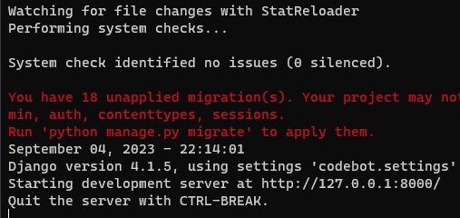
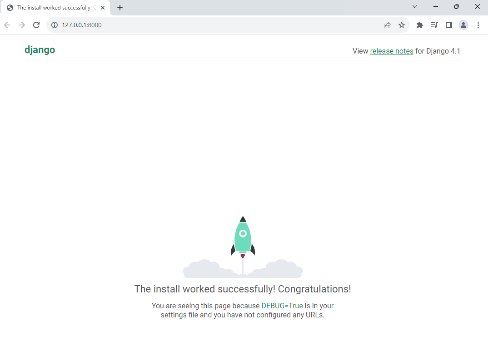
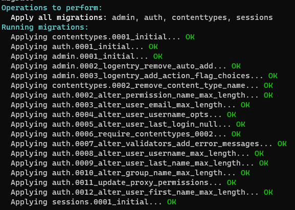
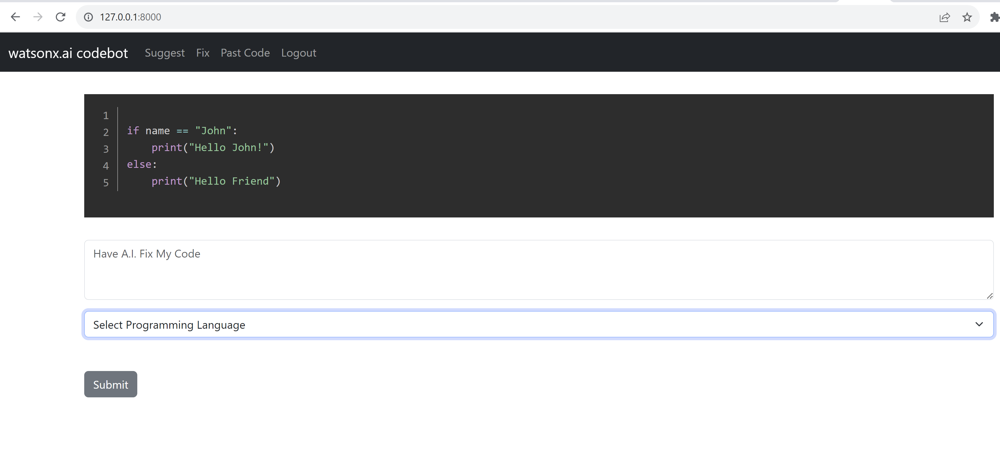
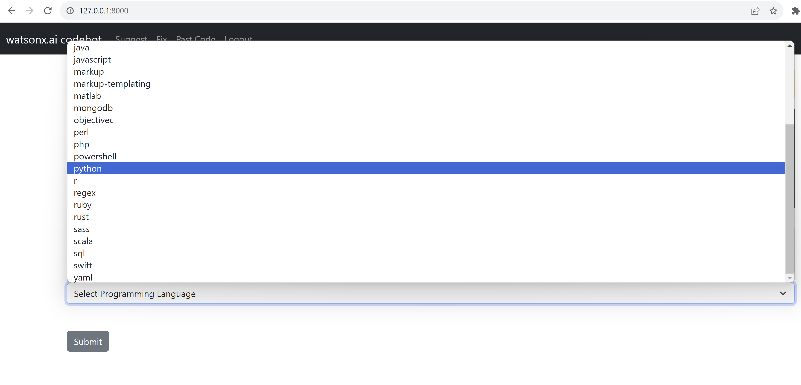
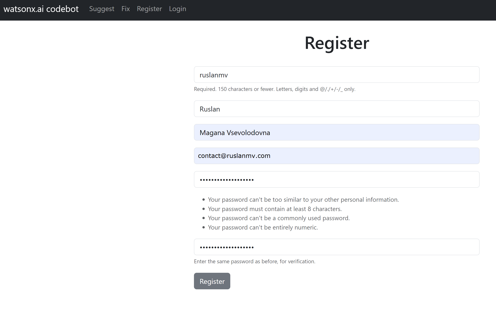

Hello everyone, today we are going to to create a **CodeBot** with **Watsonx.ai.**
We are going to build a simple **Django Application** where we can generate programming code from a prompt.


We are interested to **generate ** and  **fix**  codes in for different programming languages.

## Step 1: Install Python

First we need to install python in our computer ,  in this demo I will use **Python 3.10.11**

[https://www.python.org/ftp/python/3.10.11/python-3.10.11-amd64.exe](https://www.python.org/ftp/python/3.10.11/python-3.10.11-amd64.exe)

During the installation I should suggest add python.exe to PATH and install Now

With Python already installed, you should have pip already installed. Be sure to use a pip that corresponds with Python 3 by using pip3 or checking your pip executable with `pip –version`.

## Step 2: Create a Python virtual environment

A Python virtual environment allows one to use different versions of Python as well as isolate dependencies between projects. If you’ve never had several repos on your machine at once, you may never have felt this need but it’s a good, Pythonic choice nonetheless. Future you will thank us both!


Run the following command:

```
python  -m venv my_venv
```


You’ll notice a new directory in your current working directory with the same name as your virtual environment.

Activate the virtual environment.

In Windows you type

```
my_venv\Scripts\activate.bat
```

All other OSs: source

```
./my_venv/bin/activate
```


```
pip install django==4.1.5 openai
pip install "ibm-watson-machine-learning>=1.0.312" 

pip3 install pyclean
```


When the virtual environment is activated, your command prompt should change in some way, indicating the name of the virtual environment. This is how you’ll know it’s active. You can further verify this by executing “which pip” or “which python” to see that both binaries are located inside you virtual environment directory.

A virtual environment is only activate in your current terminal session. There is no need to deactivate it before closing your terminal.
However, if you need to deactivate it you can do so by executing “deactivate”, a script that only exists when a virtual environment is activated.


## Step 3  Django Installation


First we type

```
django-admin startproject codebot
```

then we enter to our directory

```
cd codebot
```


```
python manage.py startapp website
```

this command created the website folder


we can test 

```
python manage.py runserver
```

you will got the following output



and you can 

 [http://127.0.0.1:8000/]( http://127.0.0.1:8000/)

if everything's were done ok you will get



Now, one quick thing we're going to do before we move on is head back to the terminal.

Press control button and the C key at the same time on your keyboard.

So when Django creates a project, there's all kinds of database stuff rumbling around in the background you need to sort of take care of right away.

And we could do that just by going Python manage pi migrate that will migrate all that stuff.


```
python manage.py migrate
```



So now we type


```
python manage.py runserver
```

and now we see there are no warning


## Step 4 Creation of the Watsonx CodeBot 

First we are going to download the templates of the website and install it in our Django
You can download the template here

[https://github.com/ruslanmv/How-to-Generate-a-Code-with-WatsonX-with-Django/blob/master/codebot.zip](https://github.com/ruslanmv/How-to-Generate-a-Code-with-WatsonX-with-Django/blob/master/codebot.zip ) 

and you can extract and replace your codebot directory.


First  we clean our data.

```
pyclean .
```

then we migrate the changes 

```
python manage.py migrate
```

##  Step 5- Load our Credentials

In order to use the Foundation Models we require load the credentials of **IBM Cloud**.

To get his, first you need to go to your **WatsonX** account.

[https://www.ibm.com/watsonx](https://www.ibm.com/watsonx)


Then you can open the **Experiment** with the foundation models with **Prompt Lab**.

Let us choose an simple example like Let us choose an simple example like **Marketing Generation** 


then under the view code we click create personal API key


Wee need to provide the IBM Cloud user API key. For details, see [documentation](https://cloud.ibm.com/docs/account?topic=account-userapikey&interface=ui). Then we create our API key


Then we go to WatsonX and we need the project_id .

You can find the project_id as follows. Open the prompt lab in watsonx.ai. At the very top of the UI, there will be Projects. Click on the link. Then get the project_id from Project's Manage tab (Project -> Manage -> General -> Details).


## Step 6- Setup credentials

we copy our   **project_id**  and  **api key** paste it into the file `website\credentials\api.json` 


and populate with your **IBM_CLOUD_API** and   **PROJECT_ID** in the file `api.json`

```json
{
	"IBM_CLOUD_API": " ",
	"PROJECT_ID": " "
}
```

##  Step 6- Run the Codebot

Let us go to the first folder called `codebot`

```
python manage.py runserver
```

then you can enter to the localhost

 [http://127.0.0.1:8000/](http://127.0.0.1:8000/)




This program has the feture to generate and fix codes for different languages




##  Step 7- Register your account

First you need register your account, by clicking `Register` in the menu bar. You can save your prompts for future use.  And do not expend extra tokens for repeated queries.




then you login


You can paste a wrong python code

```
prinf("Hello John!)
```

and select `python`
and click `Submit``


but also you ask to generate code by suggest you can type:

`Write a Python function, which generates sequence of prime numbers. The function 'primes' will take the argument 'n', an int. It will return a list which contains all primes less than 'n'.`


and submit


and you will get


and finally you can see your latest promts by clicking in Past Code.


Well now you can edit this template to add new models and new features of watsonx.


## Step 8-Model Tunning

IF you want to edit your models and you want to improve the oputputs you can go to

`website\views.py`


You can modify the **model** and the **parameters**


```python
# Foundation Models on Watsonx
    model_id = ModelTypes.STARCODER
    parameters = {
        GenParams.DECODING_METHOD: DecodingMethods.GREEDY,
        GenParams.MIN_NEW_TOKENS: 1,
        GenParams.MAX_NEW_TOKENS: 1000
    }
```


Supported foundation models are:

- **FLAN_T5_XXL** = "google/flan-t5-xxl"
- **FLAN_UL2** = "google/flan-ul2"
- **MT0_XXL** = "bigscience/mt0-xxl"
- **GPT_NEOX** = 'eleutherai/gpt-neox-20b'
- **MPT_7B_INSTRUCT2** = 'ibm/mpt-7b-instruct2'
- **STARCODER** = 'bigcode/starcoder'

Supported decoding methods for text generation

- **SAMPLE** = "sample"
- **GREEDY** = "greedy"

Supported parameters  for  `GenParams.` are

- **DECODING_METHOD** 
- **LENGTH_PENALTY** 
- **TEMPERATURE** 
- **TOP_P** 
- **TOP_K** 
- **RANDOM_SEED** 
- **REPETITION_PENALTY** 
- **MIN_NEW_TOKENS** 
- **MAX_NEW_TOKENS** 
- **STOP_SEQUENCES** 
- **TIME_LIMIT** 
- **TRUNCATE_INPUT_TOKENS** 
- **RETURN_OPTIONS** 

For example, you can add `GenParams.REPETITION_PENALTY =1` to avid repetitions.

In this demo example of codebot, we have used the `FLAN_UL2` for fix the codes and `STARCODER` for code generation. The length  of the answer can be tunned by changing `MAX_NEW_TOKENS` parameter from `50` up to `1000`. For example if you want  small anwers you can put 50 tokens.


As a rough rule of thumb, **1 token is approximately 4 characters or 0.75 words for English text**. One limitation to keep in mind is that for a Foundation Models the prompt and the generated output combined must be no more than the model's maximum context length. For example 100 tokens are ~=75 words. You can play around with different combinations to get the best fit to your needs.

### Troubleshooting's

Sometimes if we make modifications in the code we need to restart the django server to see the new updates.

Just in case you want to delete all your django database you can type. You will lost your accounts and saved prompts.

```
python manage.py flush
```

**Congratulations!** You have created a **Codebot** with **WatsonX.ai**.


