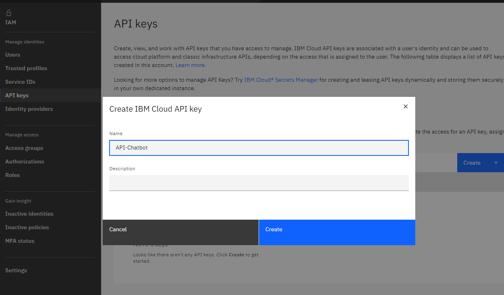
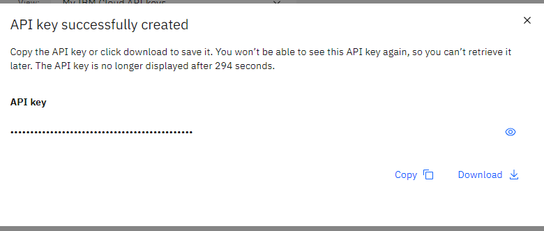
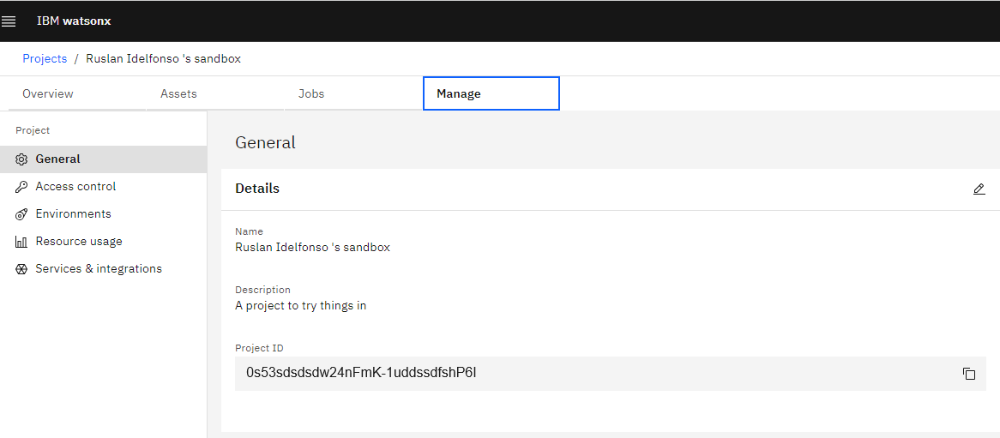
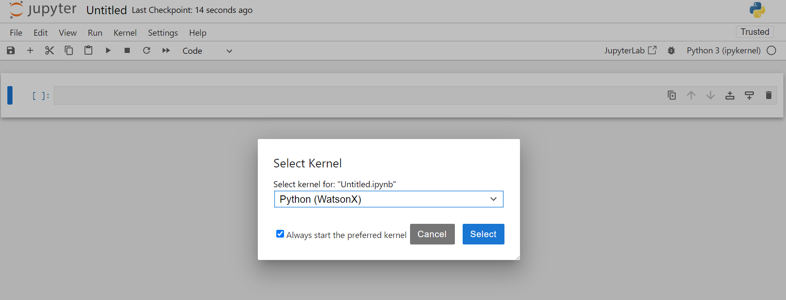

Hello everyone, today we are going to run WatsonX.ai from LangChain. We are going to read a text document and ask questions.

We are going to use the Foundational Models from WatsonX.ai and we will show how to create a vectorstore from a document and use LangChain with WatsonX.


## Step 1 . Environment Setup

First we are going to install our enviroment with python 3.10.11 [here](https://www.python.org/downloads/) , after you installed in your working directory  you can create your enviroment

```
python -m venv .venv
```

You’ll notice a new directory in your current working directory with the same name as your virtual environment, then activate the virtual environment.

```
.venv\Scripts\activate.bat
```

usually is convinent having the latest pip

```
python -m pip install --upgrade pip
```

then we install our notebook, because also you can use Jupyter Notebook

```
pip install ipykernel notebook
```

## Step 2 .  Enviroment  variables

First we login to our IBM Cloud Account [here](https://cloud.ibm.com/login) and then

[https://cloud.ibm.com/iam/apikeys](https://cloud.ibm.com/iam/apikeys)



click in create and we copy   API key 



we create a `.env` file in the project directory with the `API_KEY` value

 for example

```
echo API_KEY=9NKl890s53sdsdsdw24nFmK-1uddssdfshP6IbvSj > .env
```

Then we need to add the `PROJECT_ID`, by clicking your Project [here](https://dataplatform.cloud.ibm.com/wx/home?context=wx) and then Manage and copy the 



```
echo PROJECT_ID=0s53sdsdsdw24nFmK-1uddssdfshP6I >>.env
```


## Step 3 .  Setup libraries

Once we have our running environment we install our kernel

```
python -m ipykernel install --user --name WatsonX --display-name "Python (WatsonX)"
```

```
pip install langchain ibm-watson-machine-learning
```

and we install some additional packages,

First, make sure you have  TensorFlow and TensorFlow Hub installed:

```
pip install python-dotenv chromadb openai tiktoken  tensorflow tensorflow-hub tensorflow_text
```

then we can run our notebook as follow:

```
jupyter notebook
```

and we create a new notebook


then we select our  WatsonX enviroment



# WatsonX with LangChain

 We will review how to connect WatsonX with Langchain. We will read a text document and we will ask questions to this document.

First we load our initial libraries.


```python
import os
from dotenv import load_dotenv
from typing import Any, List, Mapping, Optional, Union, Dict
from pydantic import BaseModel, Extra
from langchain import PromptTemplate
from langchain.chains import LLMChain, SimpleSequentialChain
from langchain.llms.base import LLM
from langchain.llms.utils import enforce_stop_tokens
from ibm_watson_machine_learning.foundation_models import Model
from ibm_watson_machine_learning.metanames import GenTextParamsMetaNames as GenParams
```


```python
load_dotenv()
project_id = os.getenv("PROJECT_ID", None)
credentials = {
    "url": "https://us-south.ml.cloud.ibm.com",
    "apikey": os.getenv("API_KEY", None)
}
```

## Foundation Models on watsonx.ai


All avaliable models are presented under ModelTypes class. For more information refer to documentation.


```python
from ibm_watson_machine_learning.foundation_models.utils.enums import ModelTypes
print([model.name for model in ModelTypes])
```

    ['FLAN_T5_XXL', 'FLAN_UL2', 'MT0_XXL', 'GPT_NEOX', 'MPT_7B_INSTRUCT2', 'STARCODER', 'LLAMA_2_70B_CHAT', 'GRANITE_13B_INSTRUCT', 'GRANITE_13B_CHAT']

We define our model

```python
model_id = ModelTypes.LLAMA_2_70B_CHAT
```

### Defining the model parameters

You might need to adjust model parameters for different models or tasks, to do so please refer to documentation.

```python
from ibm_watson_machine_learning.metanames import GenTextParamsMetaNames as GenParams
```


```python
parameters = {
    GenParams.DECODING_METHOD: "greedy",
    GenParams.MAX_NEW_TOKENS: 200
}
```


```python
#this cell should never fail, and will produce no output
import requests

def getBearer(apikey):
    form = {'apikey': apikey, 'grant_type': "urn:ibm:params:oauth:grant-type:apikey"}
    print("About to create bearer")
#    print(form)
    response = requests.post("https://iam.cloud.ibm.com/oidc/token", data = form)
    if response.status_code != 200:
        print("Bad response code retrieving token")
        raise Exception("Failed to get token, invalid status")
    json = response.json()
    if not json:
        print("Invalid/no JSON retrieving token")
        raise Exception("Failed to get token, invalid response")
    print("Bearer retrieved")
    return json.get("access_token")

credentials["token"] = getBearer(credentials["apikey"])
```

we got the following result

    About to create bearer
    Bearer retrieved

we define our llama model in watsonx.ai

```python
from ibm_watson_machine_learning.foundation_models import Model
# Initialize the Watsonx foundation model
llama_model = Model(
    model_id=model_id, 
    params=parameters, 
    credentials=credentials,
    project_id=project_id)
```

## Model's details

If you wat to get details about the loaded model you can type


```python
llama_model.get_details()['short_description']
```


    'Llama-2-70b-chat is an auto-regressive language model that uses an optimized transformer architecture.'

of simply know the limits


```python
llama_model.get_details()['model_limits']
```

with this output


    {'max_sequence_length': 4096}


## Generation AI by   using Llama-2-70b-chat model.

It is generated text , according to provided instruction.


```python
instruction = "Using the directions below, answer in a maximum of  2 sentences. "
question = "What is the capital of Italy"
prompt=" ".join([instruction, question])
```


```python
#dir(model)
```

### Generate_text method


```python
llama_model.generate_text(question)
```


    '?\nThe capital of Italy is Rome (Italian: Roma). Rome is the largest city in Italy and is located in the central-western part of the country. It is known for its rich history, architecture, art, and culture, and is home to many famous landmarks such as the Colosseum, the Pantheon, and the Vatican City.'


### Generate method


```python
result=llama_model.generate(prompt)['results'][0]['generated_text']
```


```python
result
```


    '?\nThe capital of Italy is Rome. Rome is a city located in the central-western part of the country, and it has been the capital of Italy since 1865.'


The strucure of this method has the following structure:


```python
result={'model_id': 'meta-llama/llama-2-70b-chat',
 'created_at': '2023-10-24T18:58:01.390Z',
 'results': [{'generated_text': '?\nThe capital of Italy is Rome (Italian: Roma). Rome is the largest city in Italy and is located in the central-western part of the country. It is known for its rich history, architecture, art, and culture, and is home to many famous landmarks such as the Colosseum, the Pantheon, and the Vatican City.',
   'generated_token_count': 79,
   'input_token_count': 7,
   'stop_reason': 'eos_token'}],
 'system': {'warnings': [{'message': 'This model is a Non-IBM Product governed by a third-party license that may impose use restrictions and other obligations. By using this model you agree to its terms as identified in the following URL. URL: https://dataplatform.cloud.ibm.com/docs/content/wsj/analyze-data/fm-models.html?context=wx',
    'id': 'DisclaimerWarning'}]}}
```

# Integration with LangChain


```python
from langchain import PromptTemplate
from langchain.chains import LLMChain
from ibm_watson_machine_learning.foundation_models import Model
from ibm_watson_machine_learning.foundation_models.utils.enums import ModelTypes
```

First we load our Foundation  Model as for example Flan UL2


```python
parameters = {
    GenParams.DECODING_METHOD: "greedy",
    GenParams.MAX_NEW_TOKENS: 200
}
```


```python
from ibm_watson_machine_learning.foundation_models import Model
# Initialize the Watsonx foundation model
flan_ul2_model = Model(
    model_id=ModelTypes.FLAN_UL2, 
    credentials=credentials,
    project_id=project_id,
    params=parameters
    
    )
```


```python
prompt_template = "What color is the {flower}?"
```


```python
llm_chain = LLMChain(llm=flan_ul2_model.to_langchain(), 
                     prompt=PromptTemplate.from_template(prompt_template))
```


```python
llm_chain('sunflower')
```


    {'flower': 'sunflower', 'text': 'yellow'}

# Remembering chat history


The ConversationalRetrievalQA chain builds on RetrievalQAChain to provide a chat history component.

It first combines the chat history (either explicitly passed in or retrieved from the provided memory) and the question into a standalone question, then looks up relevant documents from the retriever, and finally passes those documents and the question to a question-answering chain to return a response.

To create one, you will need a retriever. In the below example, we will create one from a vector store, which can be created from embeddings.

We are going to read a text document from arxiv


```python
from langchain.embeddings.openai import OpenAIEmbeddings
from langchain.text_splitter import CharacterTextSplitter
from langchain.chains import ConversationalRetrievalChain
#If you want use Chroma or OpenAI uncomment the following lines
#from langchain.vectorstores import Chroma 
#from langchain.llms import OpenAI 
```


```python
from langchain.document_loaders import TextLoader
loader = TextLoader("example.txt")
document = loader.load()
```

When we load the documents with TexLoader the datatype of this object is `langchain.schema.document.Document` wich is a list of parts of the text.


```python
type(document[0])
```


    langchain.schema.document.Document

Additionally if we want only the contents in string format we just called it by using the method `.page_content` 

### Splitting the document


```python
text_splitter = CharacterTextSplitter(separator="\n",
                                      chunk_size=1000, 
                                      chunk_overlap=200)
# Split text into chunks
documents = text_splitter.split_documents(document)
```

    Created a chunk of size 1143, which is longer than the specified 1000

The `.page_content` is an string

```python
type(documents[0].page_content)
```


    str

for example


```python
documents[0].page_content
```

you got the following result


    'Provided proper attribution is provided, Google hereby grants permission to reproduce the tables and figures in this paper solely for use in journalistic or scholarly works.\nAttention Is All You Need\nAshish Vaswani Google Brain avaswani@google.com\n \nNoam Shazeer Google Brain noam@google.com\n \nNiki Parmar Google Research nikip@google.com\nJakob Uszkoreit Google Research usz@google.com\n Llion Jones Google Research llion@google.com\n \nAidan N. Gomez † University of Toronto aidan@cs.toronto.edu\nukasz Kaiser\nGoogle Brain\nlukaszkaiser@google.com\nIllia Polosukhin ‡\nillia.polosukhin@gmail.com\nAbstract'

We have created 45 pieces of text, in the next part we are going to create the embeddings of this text.

```
len(documents)
45
```

## Embeddings

There are different ways to embedding our text,  in this demo we want to use
Tensorflow embenddings.


```python
from langchain.vectorstores import FAISS
from langchain.embeddings import OpenAIEmbeddings
from langchain.embeddings import TensorflowHubEmbeddings
```


```python
url = "https://tfhub.dev/google/universal-sentence-encoder-multilingual/3"
```


```python
embeddings  = TensorflowHubEmbeddings(model_url=url)
```


```python
text_chunks=[content.page_content for content in documents]
```


```python
vectorstore = FAISS.from_texts(texts=text_chunks, embedding=embeddings)

```

We can now create a memory object, which is necessary to track the inputs/outputs and hold a conversation.


```python
from langchain.memory import ConversationBufferMemory
memory = ConversationBufferMemory(memory_key="chat_history",
                                  return_messages=True)
```

We now initialize the ConversationalRetrievalChain


```python
#help(ConversationalRetrievalChain.from_llm)
```


```python
#llm=flan_ul2_model.to_langchain()
llm=llama_model.to_langchain()
```


```python
qa = ConversationalRetrievalChain.from_llm(llm=llm, 
                                           retriever=vectorstore.as_retriever(), 
                                           memory=memory)
```


```python
query = "What is the topic about"
result = qa({"question": query})
```


```python
result["answer"]
```

you got the result


    ' The topic is about the Transformer model in deep learning, specifically discussing its use of self-attention and multi-head attention mechanisms.'

and the memory


```python
memory
```

you got the result


    ConversationBufferMemory(chat_memory=ChatMessageHistory(messages=[HumanMessage(content='What is the topic about'), AIMessage(content=' The topic is about the Transformer model in deep learning, specifically discussing its use of self-attention and multi-head attention mechanisms.')]), return_messages=True, memory_key='chat_history')


## Pass in chat history

In the above example, we used a Memory object to track chat history. We can also just pass it in explicitly. In order to do this, we need to initialize a chain without any memory object


```python
#help(ConversationalRetrievalChain.from_llm)
```


```python
qa = ConversationalRetrievalChain.from_llm(llm=llama_model.to_langchain(),
                                           retriever=vectorstore.as_retriever())
```

Here's an example of asking a question with no chat history with Watsonx

```python
chat_history = []
query = "What is the topic  about"
result = qa({"question": query, "chat_history": chat_history})
```


```python
result["answer"]
```


    ' The topic is about the Transformer model in natural language processing, specifically discussing the use of self-attention and multi-head attention in the model.'

Here's an example of asking a question with some chat history


```python
chat_history = [(query, result["answer"])]
query = "What is Transformer"
result = qa({"question": query, "chat_history": chat_history})
```


```python
result['answer']
```

we have the output


    '\nThe Transformer model is a sequence transduction model that relies entirely on self-attention mechanisms, dispensing with recurrence and convolutions. It is based on attention mechanisms and is used for various tasks such as machine translation, English constituency parsing, and text summarization. The Transformer model is the first transduction model that uses self-attention to compute representations of its input and output without using sequence-aligned RNNs or convolutions. It has been shown to be superior in quality, more parallelizable, and requiring significantly less time to train than other sequence transduction models.'

and the chat history


```python
chat_history
```

you got the result


    [('What is the topic  about',
      ' The topic is about the Transformer model in natural language processing, specifically discussing the use of self-attention and multi-head attention in the model.')]

**Congratulations!** You have finished this tutorial of WatsonX with LangChain.

For more tutorials like this visit [https://ruslanmv.com/](https://ruslanmv.com/)