Hello everyone, today We are going to build a WatsonX Assistant with Milvus as Vector Database. 

[](../assets/images/posts/2024-03-10-WatsonX-Assistant-with-Milvus-as-Vector-Database/imagenx.png)

In this blog, we will explore the development of a WatsonX Assistant that can engage human interactions and deliver responses from Watsonx.ai within a Vector Database. This innovative solution harnesses the power of the latest artificial intelligence models, for retrieving questions. Specifically, we will delve into the integration of a Milvus Vector Database within a healthcare use case, creating a virtual assistant doctor for an enhanced patient experience.

 You can see demo video here:

<iframe width="560" height="315" src="https://www.youtube.com/embed/SqNLAZcW63s?si=ge793--yyx8lDQM0" title="YouTube video player" frameborder="0" allow="accelerometer; autoplay; clipboard-write; encrypted-media; gyroscope; picture-in-picture; web-share" allowfullscreen></iframe>

## Introduction

Milvus is a database designed to store, index, and manage massive embedding vectors generated by deep neural networks and other machine learning models. It is capable of indexing vectors on a trillion scale and is built to handle embedding vectors converted from unstructured data, which has become increasingly common with the growth of the internet. 

By calculating similarity distances between vectors, WatsonX.ai's Foundation Model analyzes the questions using the Augmented Knowledge Base created by Milvus. This process allows for the examination of correlations between original data sources. In our specific case, we have numerous questions and answers, and our goal is to identify the best answer for each given question.

##  Creation of the Virtual Server

First we need to install our Vector Database. The sytem where we want to deploy our database is Ubuntu 22.04.

1. Log in to your IBM Cloud account [here](https://cloud.ibm.com/).
2. From the IBM Cloud dashboard, click on the "Catalog" tab.
3. In the search bar, type `Virtual Servers` and select the "Virtual Servers" option from the results.
4. On the Virtual Servers page, you will find various options for virtual servers. 
   Got to Image and Profile and click Change image and find for ubuntu and we choose 
   `22.04 LTS Jammy Jellyfish Minimal Install` and click save
   
5. Click on the chosen virtual server option to start configuring it.
6. On the configuration page, you will be prompted to provide various details like the location, CPU, memory, storage, and operating system. We choose the simplest `bx2-2x8`
   
7. We create a ssh key with the name pem_ibmcloud and we download.
8. Complete the remaining configuration options as default, storage options and network settings with exception of adding a port open to connect it.
9. Once you have configured the instance, review the settings and click on the "Create" button to create the instance.
10. IBM Cloud will initiate the provisioning process, and your Ubuntu instance will be created.
    Copy the public ip of you virtual instance.

##  Connection to the server

Open an SSH client.

Locate your private key file. The key used to launch this instance is private-key.pem
Run this command, if necessary, to ensure your key is not publicly viewable.

```
chmod 400 "private-key.pem"
```

Connect to your instance using its Public ip:

Example:

```
ssh -p 2223 -i private-key.pem itzuser@158.175.181.145
```

## Install Milvus

Install Milvus with dpkg on Ubuntu

```
wget https://github.com/milvus-io/milvus/releases/download/v2.3.7/milvus_2.3.7-1_amd64.deb
sudo apt-get update
sudo dpkg -i milvus_2.3.7-1_amd64.deb
sudo apt-get -f install
```

## Check the status of Milvus

First you restart, 

```
sudo systemctl restart milvus
```

there is not expected out, and then

```
sudo systemctl status milvus

```


### Testing Server

First we assure that python3 is installed
Add the deadsnakes PPA (might have Python 3.10)

```
sudo add-apt-repository -y ppa:deadsnakes/ppa
```

### Update package list again

```
sudo apt-get update
```

 Install Python 3.10

```
sudo apt-get install -y python3.10
sudo apt-get install -y python-pip
sudo apt-get install python-is-python3
```

### Verify installation

python --version
We install some packages to test 

```
pip install numpy pymilvus 
```

Download hello_milvus.py directly or with the following command.

```
wget https://raw.githubusercontent.com/milvus-io/pymilvus/master/examples/hello_milvus.py
```

and then we proceed with the following actions

  1. connect to Milvus
  2. create collection
  3. insert data
  4. create index
  5. search, query, and hybrid search on entities
  6. delete entities by PK
  7. drop collection

you can visulaze the code [here](https://raw.githubusercontent.com/milvus-io/pymilvus/master/examples/hello_milvus.py)

```
python hello_milvus.py
```

the output is:

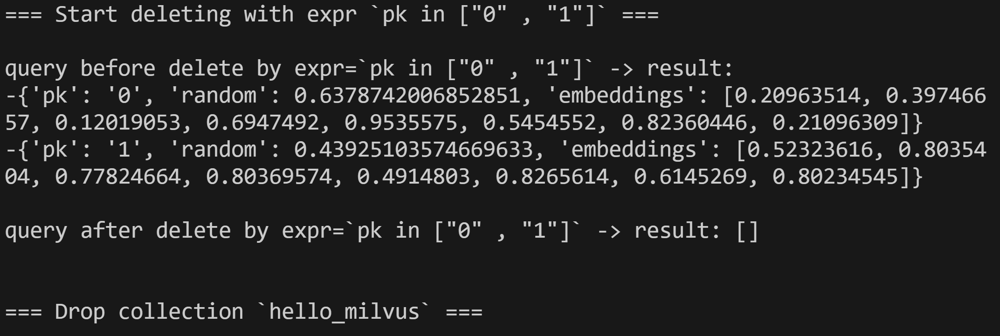

### Port checking

Finaly, we are interested to execute this application by usin the port `19530`.

To check if port `19530` is open on your server, you can use a port scanning tool like `nmap` or `telnet`. Here are the steps to check the port status:
Use the `telnet` command to check the port status. Run the following command in the terminal  in the Server:

```
telnet <server_ip_address> 19530
```

Replace `<server_ip_address>` with the actual IP address of your server. If the port is open, you will see a connection established. If the port is closed or not reachable, the connection will fail.

If you are unable to perform these checks  you  should open the inboud port of the server, you can add the source the server where you will use to make the query.

## Building a Chatbot using Langchain and Milvus: A Step-by-Step Guide

Once our Vector Database is running, we can continue to create our Assitant. First we will explore the process of building a chatbot using the Langchain and Milvus libraries. The chatbot will utilize a language model for question encoding and a vector database for answer retrieval. We will walk through the code step by step, explaining the purpose of each section and how it contributes to the functionality of the chatbot.

### Step 1: Dataset Retrieving
To start, we need a dataset to train our chatbot. We import the `load_dataset` function from the `datasets` library and retrieve the training data. We then create a pandas DataFrame from the data and perform necessary preprocessing steps such as cleaning the 'question' and 'answer' columns, removing unnecessary characters, and limiting the length of the questions. This ensures that the input to our chatbot is in the desired format.

### Step 2: WatsonX Connection
Next, we establish a connection to the WatsonX service, which is an IBM Watson-powered language model. We retrieve the necessary credentials, such as the API key and project ID, either from the environment variables or by prompting the user to input them. These credentials, along with other parameters, are used to set up an instance of the WatsonxLLM class. This class represents the language model and allows us to interact with it.

### Step 3: Milvus Connection
In order to retrieve answers efficiently, we connect to the Milvus server, which is an open-source vector database. We retrieve the host information, either from the environment variables or using a default value. We then load a pre-existing collection named 'qa_medical' from the Milvus server and check the loading progress. Additionally, we set the maximum input length for the model and define a combined pipeline that includes steps for question encoding and answer retrieval using the Milvus client.

### Step 4: Langchain Definitions
Now, we define the necessary components from the Langchain library. We create a custom retriever class called `CustomRetrieverLang` by extending the `BaseRetriever` class. This class performs the encoding and retrieval process for a specific question. We also create a combined pipe using the `CombinedPipe` class from the `towhee` library. This pipe includes the steps for question encoding using the language

### Flask Web Server Setup

To provide an interface for the chatbot, we set up a Flask web server. We define an endpoint, `/chat`, which receives POST requests containing a `message` parameter. The `chat()` function handles the chat logic by invoking the RAG (Retrieval-Augmented Generation) chain. This chain consists of the custom retriever, prompt template, and WatsonX model. The function maintains a chat history and returns a JSON response containing the message, response, and updated chat history.

Let us create the `app.py` application with the following code:

```python
from datasets import load_dataset
from IPython.display import clear_output
import pandas as pd
import re
from dotenv import load_dotenv
import os
from ibm_watson_machine_learning.foundation_models.utils.enums import ModelTypes
from ibm_watson_machine_learning.metanames import GenTextParamsMetaNames as GenParams
from ibm_watson_machine_learning.foundation_models.utils.enums import DecodingMethods
from langchain.llms import WatsonxLLM
from langchain.embeddings import SentenceTransformerEmbeddings
from langchain.embeddings.base import Embeddings
from langchain.vectorstores.milvus import Milvus
from langchain.embeddings import HuggingFaceEmbeddings  # Not used in this example
from dotenv import load_dotenv
import os
from pymilvus import Collection, utility
from pymilvus import connections, FieldSchema, CollectionSchema, DataType, Collection, utility
from towhee import pipe, ops
import numpy as np
#import langchain.chains as lc
from langchain_core.retrievers import BaseRetriever
from langchain_core.callbacks import CallbackManagerForRetrieverRun
from langchain_core.documents import Document
from pymilvus import Collection, utility
from towhee import pipe, ops
import numpy as np
from towhee.datacollection import DataCollection
from typing import List
from langchain.chains import RetrievalQA
from langchain.prompts import PromptTemplate
from langchain.schema.runnable import RunnablePassthrough
from langchain_core.retrievers import BaseRetriever
from langchain_core.callbacks import CallbackManagerForRetrieverRun

print_full_prompt=False

## Step 1 Dataset Retrieving

dataset = load_dataset("ruslanmv/ai-medical-chatbot")
clear_output()
train_data = dataset["train"]
#For this demo let us choose the first 1000 dialogues

df = pd.DataFrame(train_data[:1000])
#df = df[["Patient", "Doctor"]].rename(columns={"Patient": "question", "Doctor": "answer"})
df = df[["Description", "Doctor"]].rename(columns={"Description": "question", "Doctor": "answer"})
# Add the 'ID' column as the first column
df.insert(0, 'id', df.index)
# Reset the index and drop the previous index column
df = df.reset_index(drop=True)

# Clean the 'question' and 'answer' columns
df['question'] = df['question'].apply(lambda x: re.sub(r'\s+', ' ', x.strip()))
df['answer'] = df['answer'].apply(lambda x: re.sub(r'\s+', ' ', x.strip()))
df['question'] = df['question'].str.replace('^Q.', '', regex=True)
# Assuming your DataFrame is named df
max_length = 500  # Due to our enbeeding model does not allow long strings
df['question'] = df['question'].str.slice(0, max_length)
#To use the dataset to get answers, let's first define the dictionary:
#- `id_answer`: a dictionary of id and corresponding answer
id_answer = df.set_index('id')['answer'].to_dict()

## Step 2 WatsonX connection

load_dotenv()
try:
    API_KEY = os.environ.get("API_KEY")
    project_id =os.environ.get("PROJECT_ID")
except KeyError:
    API_KEY: input("Please enter your WML api key (hit enter): ")
    project_id  = input("Please  project_id (hit enter): ")

credentials = {
    "url": "https://us-south.ml.cloud.ibm.com",
    "apikey": API_KEY  
}    

model_id = ModelTypes.GRANITE_13B_CHAT_V2


parameters = {
    GenParams.DECODING_METHOD: DecodingMethods.GREEDY,
    GenParams.MIN_NEW_TOKENS: 1,
    GenParams.MAX_NEW_TOKENS: 500,
    GenParams.STOP_SEQUENCES: ["<|endoftext|>"]
}


watsonx_granite = WatsonxLLM(
    model_id=model_id.value,
    url=credentials.get("url"),
    apikey=credentials.get("apikey"),
    project_id=project_id,
    params=parameters
)


## Step 3 Milvus connection

COLLECTION_NAME='qa_medical'
load_dotenv()
host_milvus = os.environ.get("REMOTE_SERVER", '127.0.0.1')
connections.connect(host=host_milvus, port='19530')


collection = Collection(COLLECTION_NAME)      
collection.load(replica_number=1)
utility.load_state(COLLECTION_NAME)
utility.loading_progress(COLLECTION_NAME)


max_input_length = 500  # Maximum length allowed by the model


# Create the combined pipe for question encoding and answer retrieval
combined_pipe = (
    pipe.input('question')
        .map('question', 'vec', lambda x: x[:max_input_length])  # Truncate the question if longer than 512 tokens
        .map('vec', 'vec', ops.text_embedding.dpr(model_name='facebook/dpr-ctx_encoder-single-nq-base'))
        .map('vec', 'vec', lambda x: x / np.linalg.norm(x, axis=0))
        .map('vec', 'res', ops.ann_search.milvus_client(host=host_milvus, port='19530', collection_name=COLLECTION_NAME, limit=1))
        .map('res', 'answer', lambda x: [id_answer[int(i[0])] for i in x])
        .output('question', 'answer')
)
   
# Step 4 Langchain Definitions

class CustomRetrieverLang(BaseRetriever): 
    def get_relevant_documents(
        self, query: str, *, run_manager: CallbackManagerForRetrieverRun
    ) -> List[Document]:
        # Perform the encoding and retrieval for a specific question
        ans = combined_pipe(query)
        ans = DataCollection(ans)
        answer=ans[0]['answer']
        answer_string = ' '.join(answer)
        return [Document(page_content=answer_string)]   
# Ensure correct VectorStoreRetriever usage
retriever = CustomRetrieverLang()

# Define the prompt template
template = """Use the following pieces of context to answer the question at the end. 
If you don't know the answer, just say that you don't know, don't try to make up an answer. 
Use three sentences maximum and keep the answer as concise as possible. 
Always say "thanks for asking!" at the end of the answer. 
{context}
Question: {question}
Helpful Answer:"""
rag_prompt = PromptTemplate.from_template(template)
rag_chain = (
    {"context": retriever, "question": RunnablePassthrough()}
    | rag_prompt
    | watsonx_granite
)

prompt = "I have started to get lots of acne on my face, particularly on my forehead what can I do"

if print_full_prompt:
    # Get the retrieved context
    context = retriever.get_relevant_documents(prompt)
    print("Retrieved context:")
    for doc in context:
        print(doc)
    # Construct the full prompt
    full_prompt = rag_prompt.format(context=context, question=prompt)
    print("Full prompt:", full_prompt)

print(rag_chain.invoke(prompt)) 
collection.load()
import towhee
def chat_function(message, history):
    history = history or []
    response = rag_chain.invoke(message)
    history.append((message, response))
    return history, history

import json
import requests
from flask import Flask, request, jsonify

app = Flask(__name__)

@app.route('/chat', methods=['POST'])
def chat():
    params = request.get_json()
    message = params.get('message')
    history = params.get('history', [])

    if not message:
        return jsonify({"message": "Missing 'message' parameter"}), 400

    history, chat_history = chat_function(message, history)

    response_data = {
        "message": message,
        "response": chat_history[-1][1],
        "history": chat_history
    }
    return jsonify(response_data), 200

if __name__ == '__main__':
    app.run(host='0.0.0.0', port=8080, debug=True)
```

## WatsonX.ai container client question-answering application with Milvus and LangChain with Flask and OpenApi.


To run this application locally just we ran the following command:

 ```
python app.py
 ```


## OpenAPI  Extension

OpenAPI (formerly known as Swagger) is an open standard for describing and documenting REST APIs. An OpenAPI document defines the resources and operations that are supported by an API, including request parameters and response data, along with details such as server URLs and authentication methods.

An OpenAPI document describes a REST API in terms of paths and operations. A path identifies a particular resource that can be accessed by using the API (for example, a hotel reservation or a customer record). An operation defines a particular action that can be performed on that resource (such as creating, retrieving, updating, or deleting it).

The OpenAPI document specifies all of the details for each operation, including the HTTP method that is used, request parameters, the data included in the request body, and the structure of the response body.

## API definition

To create a custom extension, you need access to an OpenAPI document that describes the REST API you want to integrate with. Many third-party services publish OpenAPI documents that describe their APIs, which you can download and import. For an API that your company maintains, you can use standard tools to create an OpenAPI document that describes it.

The SwaggerHub website offers an OpenAPI 3.0 Tutorial, and tools to help you develop and validate your OpenAPI document. You can use the online Swagger editor to convert your OpenAPI document to the correct format and OpenAPI version.

The OpenAPI document must satisfy the following requirements and restrictions:

- The document must conform to the OpenAPI 3.0 specification. If you have an OpenAPI (or Swagger) document that uses an     earlier version of the specification, you can use the online Swagger editor to convert it to OpenAPI 3.0.
[https://editor.swagger.io/](https://editor.swagger.io/)

- The document must be in JSON format (YAML is not supported). If you have a YAML document, you can use the online Swagger editor to convert it to JSON.

- The size of the document must not be more than 4 MB if you have a Plus or higher plan of watsonx Assistant. However, if you have an Enteprise plan with data isolation, the size of the document must not be more than 8 MB.

- The content-type must be application/json.
- Each operation must have a clear and concise summary. The summary text is used in the UI to describe the operations that are available from an action, so it should be short and meaningful to someone who is building an assistant.
- Relative URLs are currently not supported.
- Only Basic, Bearer, OAuth 2.0, and API key authentication are supported.
    For OAuth 2.0 authentication, Authorization Code, Client Credentials, Password, and custom grant types that starts with x- are supported. Note that x- is used by the IBM IAM authentication mechanism and by watsonx.
- Schemas that are defined by using anyOf, oneOf, and allOf are currently not supported.

- In addition, any call to the external API must complete within 30 seconds.

Create a file called `openapi.json` with this json text

```json
{
  "openapi": "3.0.0",
  "info": {
    "title": "Chat API",
    "version": "1.0.0"
  },
  "servers": [
    {
      "url": "https://watsonx-medical-api.1doe5vsg6flg.us-south.codeengine.appdomain.cloud/"
    }
  ],
  "paths": {
    "/chat": {
      "post": {
        "summary": "Send a message to the chat and receive a response",
        "requestBody": {
          "required": true,
          "content": {
            "application/json": {
              "schema": {
                "type": "object",
                "properties": {
                  "message": {
                    "type": "string",
                    "description": "The message to send to the chat"
                  },
                  "history": {
                    "type": "array",
                    "items": {
                      "type": "object",
                      "properties": {
                        "message": {
                          "type": "string"
                        },
                        "response": {
                          "type": "string"
                        }
                      }
                    },
                    "description": "The chat history (optional)"
                  }
                }
              }
            }
          }
        },
        "responses": {
          "200": {
            "description": "Successful response with the chat message, response, and updated history",
            "content": {
              "application/json": {
                "schema": {
                  "type": "object",
                  "properties": {
                    "message": {
                      "type": "string",
                      "description": "The message sent to the chat"
                    },
                    "response": {
                      "type": "string",
                      "description": "The chat response"
                    },
                    "history": {
                      "type": "array",
                      "items": {
                        "type": "object",
                        "properties": {
                          "message": {
                            "type": "string"
                          },
                          "response": {
                            "type": "string"
                          }
                        }
                      },
                      "description": "The updated chat history"
                    }
                  }
                }
              }
            }
          },
          "400": {
            "description": "Missing required parameter",
            "content": {
              "application/json": {
                "schema": {
                  "type": "object",
                  "properties": {
                    "message": {
                      "type": "string",
                      "description": "Error message explaining the missing parameter"
                    }
                  }
                }
              }
            }
          },
          "500": {
            "description": "Internal server error",
            "content": {
              "application/json": {
                "schema": {
                  "type": "object",
                  "properties": {
                    "message": {
                      "type": "string",
                      "description": "Error message describing the internal issue"
                    }
                  }
                }
              }
            }
          }
        }
      }
    }
  },
  "components": {
    "securitySchemes": {
      "ApiKey": {
        "type": "apiKey",
        "name": "APIKey",
        "in": "header"
      }
    }
  }
}
```

## API Connection

We can test our running application with the following python code

```python
import json
import requests

# Load the openapi.json file
with open('openapi.json', 'r') as file:
    openapi_data = json.load(file)

# Get the base URL of the API from the openapi.json file
base_url = openapi_data['servers'][0]['url']

# Define a function to test a specific API endpoint
def test_endpoint(endpoint, method, parameters=None, data=None):
    url = f"{base_url}{endpoint}"
    response = requests.request(method, url, params=parameters, json=data)
    if response.status_code == 200:
        print(f"API endpoint '{endpoint}' is working well.")
    else:
        print(f"API endpoint '{endpoint}' returned status code {response.status_code}.")

# Define a function to run a specific API endpoint
def run_endpoint(endpoint, method, parameters=None, data=None):
    url = f"{base_url}{endpoint}"
    response = requests.request(method, url, params=parameters, json=data)
    
    if response.status_code == 200:
        print(f"API endpoint '{endpoint}' is working well.")
    else:
        print(f"API endpoint '{endpoint}' returned status code {response.status_code}.")
    
    return response

# Define a function to test the API endpoint and print the results
def test_and_print_results(endpoint, method, data=None):
    response = run_endpoint(endpoint, method, data=data)
    
    if response.status_code == 200:
        response_data = response.json()
        print("Response data:")
        print(json.dumps(response_data, indent=2))
    else:
        print("Error occurred. No data to display.")

# Test the POST request on the /chat endpoint
example_endpoint = '/chat'
example_method = 'POST'
prompt = "I have started to get lots of acne on my face, particularly on my forehead what can I do"

example_data = {'message': prompt}

test_endpoint(example_endpoint, example_method, data=example_data)
test_and_print_results(example_endpoint, example_method, data=example_data)

```

 you will get

```json
API endpoint '/chat' is working well.
API endpoint '/chat' is working well.
Response data:
{
  "history": [
    [
      "I have started to get lots of acne on my face, particularly on my forehead what can I do",
      "\nFor mild grade acne, you can use a topical clindamycin or retinoid derivative face wash. For higher grade acne, you will need oral medications such as aluke doxycycline, azithromycin, or isotretinoin. It is essential to consult a dermatologist to confirm the grade of your acne and recommend appropriate treatment.\n\nPlease note that acne has a multifactorial etiology, and only acne soap may not be sufficient for severe cases. Oral and topical medications are often required to manage acne effectively.\n\nThanks for asking!"
    ]
  ],
  "message": "I have started to get lots of acne on my face, particularly on my forehead what can I do",
  "response": "\nFor mild grade acne, you can use a topical clindamycin or retinoid derivative face wash. For higher grade acne, you will need oral medications such as aluke doxycycline, azithromycin, or isotretinoin. It is essential to consult a dermatologist to confirm the grade of your acne and recommend appropriate treatment.\n\nPlease note that acne has a multifactorial etiology, and only acne soap may not be sufficient for severe cases. Oral and topical medications are often required to manage acne effectively.\n\nThanks for asking!"
}
```

in the terminal also you get


## Container

To build the docker file

```dockerfile
FROM python:3.10

WORKDIR /code

COPY ./requirements.txt /code/requirements.txt

RUN pip install --no-cache-dir --upgrade -r /code/requirements.txt

# Set up a new user named "user" with user ID 1000
RUN useradd -m -u 1000 user

# Switch to the "user" user
USER user

# Set home to the user's home directory
ENV HOME=/home/user \
    PATH=/home/user/.local/bin:$PATH

# Set the working directory to the user's home directory
WORKDIR $HOME/app

# Copy the current directory contents into the container at $HOME/app setting the owner to the user
COPY --chown=user . $HOME/app

EXPOSE 8080

CMD ["python", "app.py"]
```

 and run the application using the provided Dockerfile, follow these steps:

1. Ensure that you have Docker installed on your system.

2. Place the Dockerfile in the same directory as your gradio application code and the .env file.

3. Open a terminal or command prompt and navigate to the directory containing the Dockerfile.

4. Run the following command to build the Docker image, replacing "watsonx-medical-api" with your desired image name:

   ```bash
   docker build --no-cache -t watsonx-medical-api .
   ```

   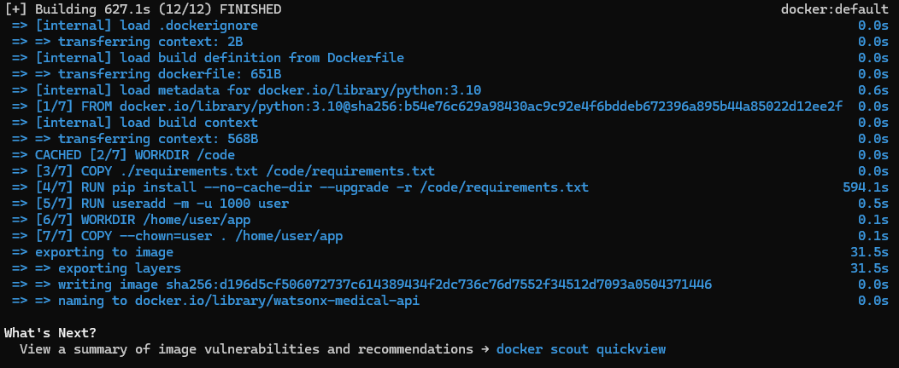
   This command will build the Docker image using the Dockerfile and the context of the current directory.

5. After successfully building the image, you can run the gradio application in a Docker container using the following command:

   ```bash
   docker run -it --env-file .env -p 8080:8080 watsonx-medical-api
   ```

   During the previos execution You got 
   

   This command runs the Docker container, passing the environment variables from the .env file using the `--env-file` flag. It also maps the container's port 8080 to the host's port 8080, allowing you to access the gradio application through `http://localhost:8080`.

You can see the image created at Docker Desktop and also your container


Moreover you can test the container local by running in the root directory the following command

```
python ./container-api/api-test.py
```

Please note that the provided instructions assume that your gradio application code is correctly configured to read the environment variables from the .env file.

```
REMOTE_SERVER=<milvus server>
API_KEY=<watsonx api key>
PROJECT_ID=<WatsonX project id>
```

If everythong went done well, just try with this prompt

```
I have started to get lots of acne on my face, particularly on my forehead what can I do
```

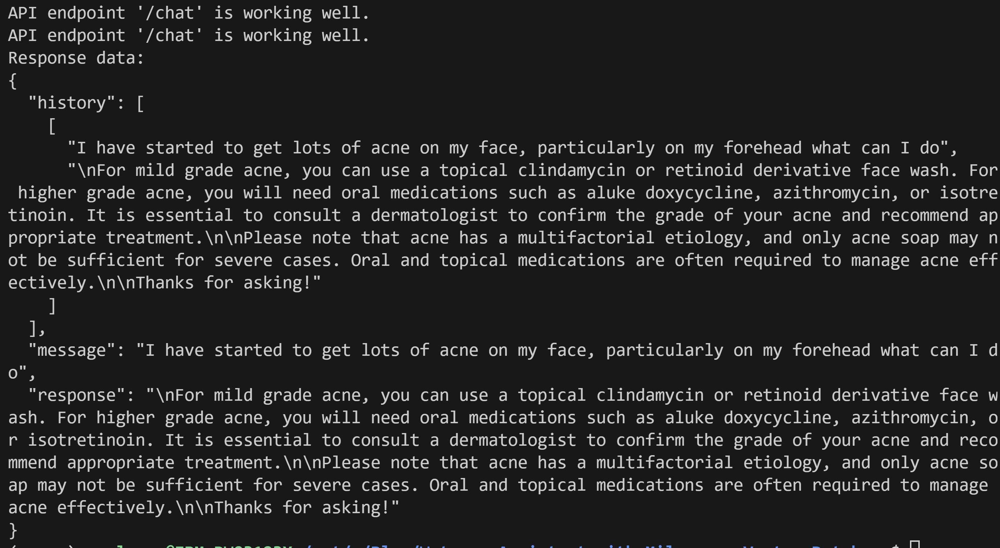


## Pushing your Docker image 

To push your Docker image to a repository, follow these steps:

1. Sign up for an account on Docker Hub ([https://hub.docker.com/](https://hub.docker.com/)) if you haven't already.

2. Log in to Docker Hub on your local machine using the terminal or command prompt. Run the following command and enter your Docker Hub credentials when prompted:

```
docker login
```

3. Tag your local image with the repository name and a desired tag.  For example:

```
docker tag watsonx-medical-api ruslanmv/watsonx-medical-api:latest
```

Replace `ruslanmv` with your Docker Hub username. You can also choose a different tag instead of `latest` if you prefer.

4. Push the tagged image to Docker Hub using the `docker push` command. For example:

```
docker push ruslanmv/watsonx-medical-api:latest
```


5. After the push is completed, you can verify that the image is available in your Docker Hub repository by visiting https://hub.docker.com/ and checking your repositories.

Now, others can pull the image from the repository using the following command:

```
docker pull ruslanmv/watsonx-medical-api:latest
```

You could build and execute your Medical Chatbot with Flask within WatsonX and Milvus

# Code Engine Application

In ordering to run our API for WatsonX.ai we need to create a serverless application.

We can use Code Engine as example to run our application.

## By using the Console

First we go to Secrets and configmaps


We create a `docker-hub-secrets` where we indicate our credentials to acces to our docker server. 

Additionally we need to define the `Secret (generic)`
we we define our secrets keys used for the  enviroment in the docker container
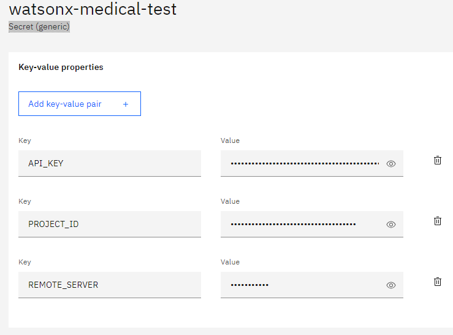

Finally we can create an application
we choose the `Container image`  we give a name like for example `watsonx-medical`  

and we click configure image, and we full fill with our previos `docker-hubs-secrets created` before


For rersource and scaling we use
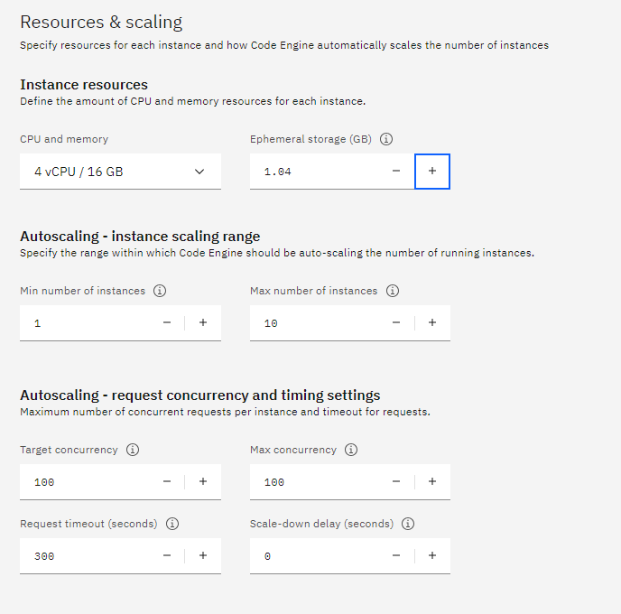

It is important that our application should have 16 gb of ram and also min number of instances 1, becasue it load the model of encoding, if becomes zero should start download from zero.

Then we add the enviroment variables just created
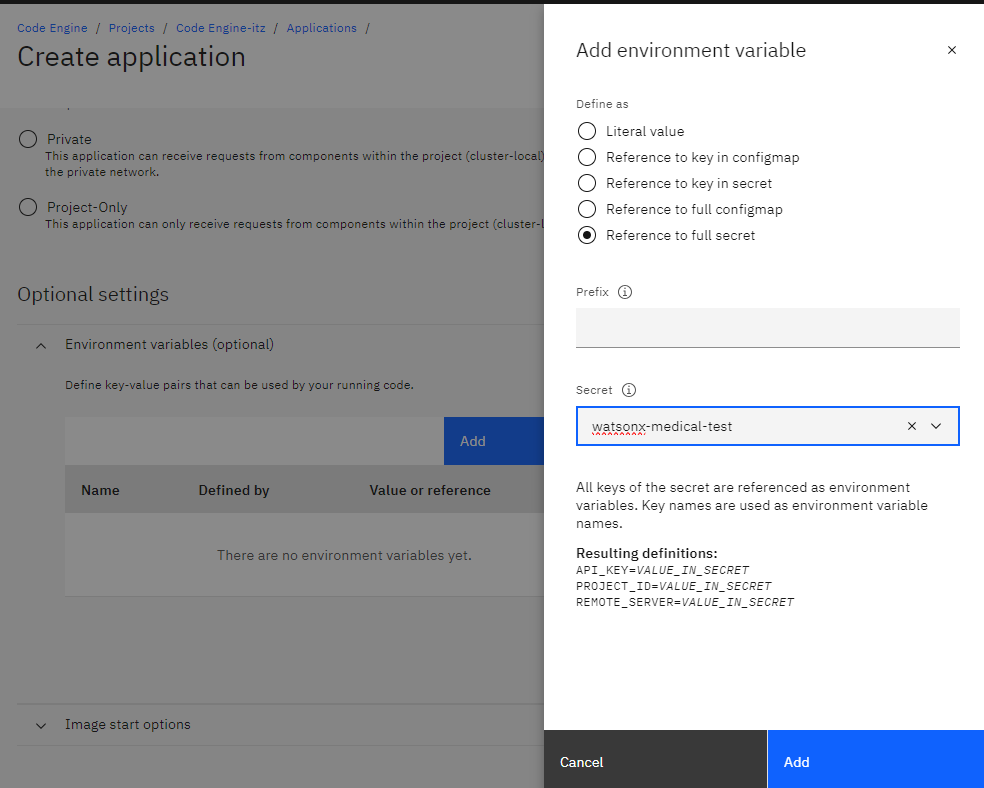

then we add the listeing port `7860`
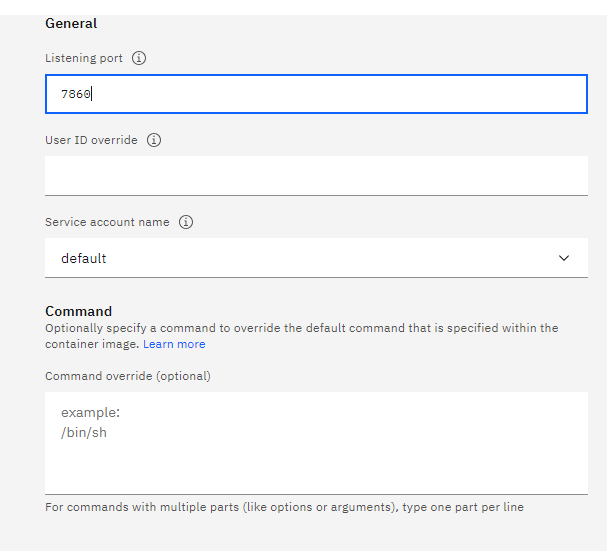

Note if we are using the container-api version we should use  port `8080`.
And finally click in create

Then we can see the app is deployed and running
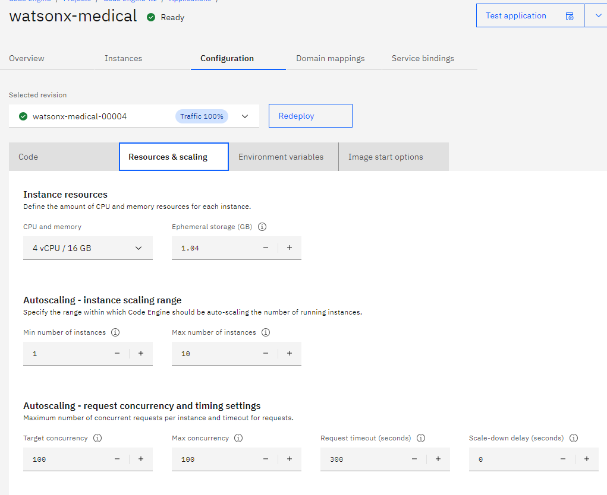

Once the application is created and deployes we can check our Image that was to run


## By using IBM CLI

Step 1 - Connect bucket to Code Engine Application
Login to Code Engine First we need to login to our account that has the Code Engine enabeled.

```
ibmcloud login -sso
```

Install the IBM Cloud Code Engine plugin:

```
ibmcloud plugin install code-engine
```

Choose the resource group targeted. 
For example you can retrieve it by clicking Manage > Account > Resource groups


Run `ibmcloud target -g RESOURCE_GROUP_NAME`, for example

```
ibmcloud target -g cc-6670df0nwl8-ug0jk8nz

```

First, list the available regions using the following command:

```
ibmcloud regions
```

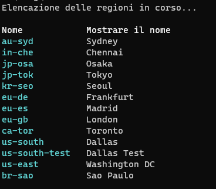

This command will display a list of available regions and their respective endpoints.

Next, set the desired region using the `ibmcloud target` command with the `--region` flag. Replace `<region>` with the desired region from the list of available regions:

```
ibmcloud target --region <region>
```

For example, to set the region to `us-south`, run:

```
ibmcloud target --r us-south
```

Confirm that the region has been changed by running the following command:

```
ibmcloud target
```

This command will display the current target region, organization, and space.

### Create a Code Engine project

```
ibmcloud ce project create --name watsonx-medical-project
```

Set the current project context

```
ibmcloud ce project select -n watsonx-medical-project
```

or also you can choose it by id

```
ibmcloud ce project select --id 349bb3bc-482a-4b6e-a226-e5ee6f29ef9c
```


We have to create the Registry Container

## For IBM Cloud Container

If you want to to load your container from the IBM Cloud you can type the following command


```
ibmcloud ce secret create --format registry --name watsonx-medical-registry --server icr.io --username iamapikey --password YOUR_API_KEY
```


## For Docker Container

If you want to load your Docker Container from Docker site, we setup the Docker credentials in the Code Engine

```
ibmcloud ce secret create --format registry --name my-docker-registry --server https://index.docker.io/v1/ --username YOUR_USERNAME --password YOUR_PASSWORD
```

### Secrets and configmaps

It is possible to use the ‘Secret’ object in Code Engine to store sensitive information for connection in a secure way.

```
ibmcloud code-engine secret create --name bucket-secret --from-env-file secrets.env
```

In the project’s dashboard navigate to ‘Secret and Configmap’ and create a Secret you will have something like

You can see the secret This will be store in a key:value format. 

After that it is possible to create the application and, in the environment variable section, connect the application to the secret. The application can now access the data with the standard API for environment variables.

Create the Code Engine application using the image from IBM Cloud Container Registry. To create an application in IBM Cloud Code Engine with the previously created secrets

### Create application from IBM Cloud Container

To create an application in IBM Cloud Code Engine using an image from IBM Cloud Container Registry and the previously created secrets, you can modify the command as follows:

```
ibmcloud code-engine application create --name watsonx-medical --image icr.io/watsonx-medical-namespace/watsonx-medical:latest --port 7860 --env-from-secret bucket-secret --registry-secret watsonx-medical-registry
```

In this command:


watsonx-medical is the name you want to give to your application.
`icr.io/watsonx-medical-namespace/watsonx-medical:latest` is the image reference for your application. The watsonx-medical-namespace is the namespace with the image tag latest .
8501 is the port on which your application will listen.

`--env-from-secret bucket-secret` specifies the secret you previously created (bucket-secret) to be used as environment variables for your application.

`--registry-secret watsonx-medical-registry` specifies the name of the registry secret watsonx-medical-registry that contains the credentials for accessing the container registry.
By providing the --registry-secret flag, you are ensuring that the necessary credentials are available to access the container registry where the image is stored.

Create Application from Docker
If you want to create the application form the Docker Container

```
ibmcloud code-engine application create --name watsonx-medical --image docker.io/ruslanmv/watsonx-medical:latest --port 8501 --env-from-secret bucket-secret --registry-secret my-docker-registry
```

After you typed the previous command you have created your app.

For example my case is the url of the app is

```
https://watsonx-medical-api.1doe5vsg6flg.us-south.codeengine.appdomain.cloud/

```


## Container-Api version

If you are using this version so simply you can test it by oppening the [openapi.json](./openapi.json) and add the appropiate url


then  test it  by typing

```
python ./code-engine/api-test.py
```

will get the following response 

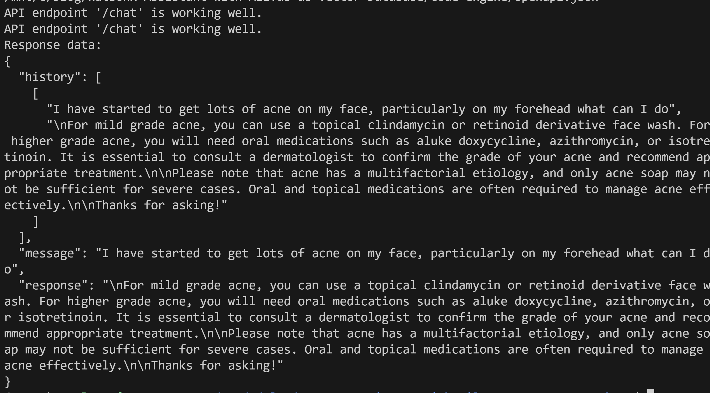

Additionally you can monitor your application in Code Engine


## Creating a Watson Assistant with a Custom Extension (MedicX)

This tutorial guides you through creating a Watson assistant that utilizes a custom extension (MedicX) to interact with an external API. We'll achieve this without dialog skills or webhooks, focusing on modern actions and extension calls.

### Prerequisites:

* An IBM Cloud account with access to Watson Assistant service
* Basic understanding of Watson Assistant and creating actions

### Steps:

1. **Create a New Watson Assistant:**

   * Log in to your IBM Cloud account and access the Watson Assistant service.
   * Click on "Create assistant" and provide a name and description for your assistant.
     

   * Click "Create" to initiate the assistant creation.
     

2. **Build the Custom Extension:**

   * Navigate to the "Integrations" tab within your newly created assistant.
   * Click on "Build custom extension."
     
   * In the "Basic information" section, provide a name and description for your custom extension (e.g., MedicX Extension).
     
   * Click "Next" to proceed to the "Import OpenAPI" step.
   * In this step, you'll import the OpenAPI document (openapi.json) that describes the MedicX API. You can typically find this file on the MedicX developer portal or documentation. Click "Browse" and select the `code-engine/openapi.json` file (replace with the actual location of your file)
     
   * Click "Next" to review the imported operations. This allows you to verify that the extension can interact with the MedicX API endpoints as defined in the OpenAPI document.
   * If everything looks good, click "Finish" to create the custom extension.
     

3. **Add the Custom Extension to Your Assistant:**

   * On the "Extensions" dashboard, locate your newly created MedicX extension.
     
   * Click the extension tile and then click "Add" to integrate it with your assistant.
     
   * Follow the on-screen prompts to complete the integration process.
        

4. **Create an Action:**

   * Navigate to the "Actions" tab within your assistant.
   * Click on "Create action" and provide a name and description for your action (e.g., Process Medical Query).

   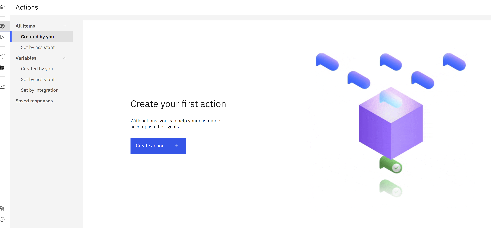

   * This action will handle user queries and interact with the MedicX API through the custom extension.
     

   5. **Define Action Variables:**
   * In the action editor, create a new assistant variable to store the user's input message. 

   We create the first step, we can say


    Please enter in your question


and then we define a custemer response like Free text


6. **Call the MedicX API:**

We create an extra step, the step we name `Call custom extension`

* Within continue to next step, you'll use the `Use extension` node to invoke the desired MedicX API endpoint.
* In the "Extension" dropdown, choose your custom extension (MedicX Extension).


* Select the specific operation you want to call from the MedicX API (e.g., send a message and receive a response).

* Update the optional parameters as needed.  
* **Message:** This parameter should be set to the user's input retrieved
* **History:** (Optional) This parameter might be used by the MedicX API to maintain conversation context. You can leave it blank or populate it based on your specific use case.

For input message you will choose Action Step Variables and then you choose the first step 1.`Please enter in your question`


This ensures the MedicX API receives the user's query.    

   * Click "Apply" to save the extension call configuration,and we will obtain in Step 2 this

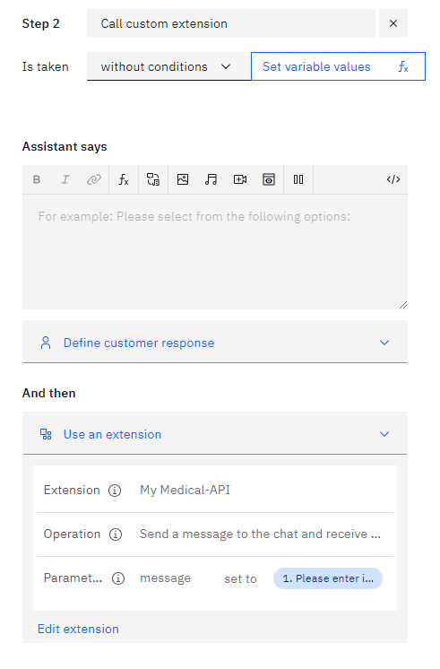


7. **Process the Response:**

   * After calling the MedicX API,  we create a new step, with conditions, we choose My Medical Api (step2) then Ran successfully 


   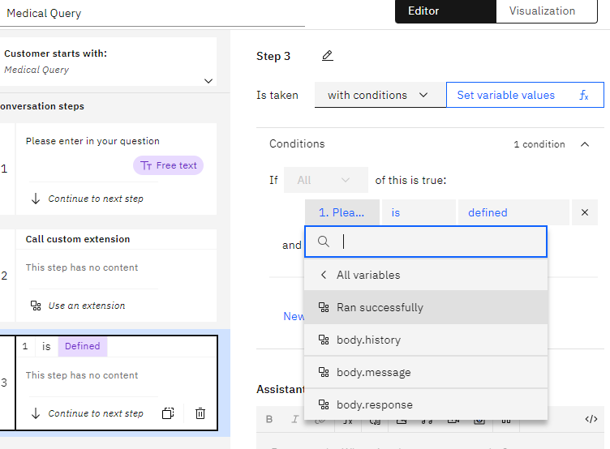

   in order to express code we set variable values, and we create a `New session variable`
   

   we name result and will be free text and then apply.

   ```
   ${result} =${body.message}+"\\nOutput: \\n"+${body.response}
      
   ```

   

   If you want clean answer try this

   ```
   ${result_clean} =${body.response}
   
   ```

   

   then in the assitant says you add a function result

   

   This might involve parsing the response data, extracting relevant information, and crafting a response for the user.

8. **Ending**
   If you want to end you can create a new step

    ```
   Do you you need anything else?
    ```

    
    Create new step for yes
    
    and another for no
    


9. **Test and Train:**

   * Once you've defined the action flow, including the MedicX extension call and response processing, save your action.
     Click on Preview and then type

   ```
   Medical Query
   ```

   then you ask for example

   ```
   I have drunk too much alcohol I have headache what should do
   ```

   you got

   


   * Test your assistant  Watson Assistant to simulate user interactions and observe how your assistant interacts with the MedicX API.
     You can try the following question and check it out  in preview, clickin on Medical query and then type the question

```
  I have drunk too much alcohol I have headache what should do
```


then yes

```
How to maintain good indoor air quality?
```


**Congratulations!** you've successfully created a Watson assistant that leverages a custom extension to interact with an external API (MedicX). This empowers your assistant to access valuable data and functionalities from external sources, enhancing its capabilities and user experience.

